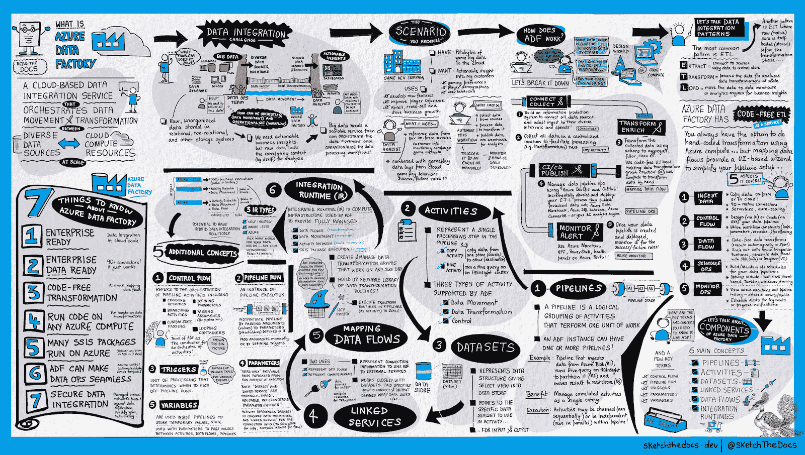

# Azure 数据工厂可视化指南

> 原文：<https://acloudguru.com/blog/engineering/a-visual-guide-to-azure-data-factory>

不久前，我们在一位云专家上发布了 Azure 基础知识的可视化指南。这个帖子得到了很多积极的反馈，所以我们认为我们应该再做一个——这次集中在 [Azure 数据工厂](https://docs.microsoft.com/en-us/azure/data-factory/introduction?WT.mc_id=mobile-22715-ninarasi)！

[Download the Visual Guide To Azure Data Factory here](https://aka.ms/visual/hi-res/azure-data-factory)

#### 什么是视觉引导？

视觉引导是高分辨率的“草图笔记”他们在一张图片中总结了一个给定的主题或内容项目，使用插图和文本的组合来*可视化*核心思想。研究告诉我们，65%的人有视觉学习能力。我们从图像中更快地吸收信息，使用“大图”来检测熟悉的模式，并将点与概念联系起来，以帮助记忆和回忆。

#### 如何使用这份视觉指南？

我把它作为阅读前和阅读后的资源来记录我的学习旅程。试试看。快速浏览图片，然后阅读文章，进入链接资源。你可能会发现你的大脑已经准备好快速找到关键词和联系，帮助巩固学到的概念。

现在回来，再次扫描视觉效果——测试你的回忆或找出你在理解上仍有差距的地方。或者直接打印出来，挂在你的工作区作为方便的参考。如果你选择这条路线，我建议你[下载这个高清版本的视觉指南](https://aka.ms/visual/hi-res/azure-data-factory)！

## Azure 数据工厂可视化指南

我们生活在一个越来越多的互联设备和跨不同平台(移动、网络、物联网)的交互式应用的世界。作为应用程序开发人员，我们需要一种方法来利用和分析大量的原始数据(关系数据、非关系数据和其他数据),以获得有用的业务洞察力。

[Azure Data Factory](https://docs.microsoft.com/en-us/azure/data-factory/introduction?WT.mc_id=mobile-22715-ninarasi) 是一个完全托管的无服务器数据集成解决方案，用于*接收、准备和转换*您的所有大规模数据。在本视觉指南中，我们尝试回答以下问题:

*   什么是数据集成？
*   什么是 Azure 数据工厂(ADF)？
*   我们如何实现与 ADF 的数据集成？
*   ADF 的组件有哪些？
*   使用 ADF 的主要好处是什么？

请继续阅读每篇文章的文本摘要，以及可用于更深入研究的资源链接。

## 什么是数据集成？

在高层次上，数据集成涉及从不同来源收集数据的*收集*，其*转换*(包括清理或扩充)以创建有意义的分析上下文，随后是*加载*步骤，在该步骤中，处理后的数据被存储以供相关分析引擎使用。

让我们用一个熟悉的企业场景来为这次讨论做准备。

一家游戏公司有两个数据存储，一个在内部(存储客户、游戏和营销数据)，另一个在云中(存储游戏日志)。为了深入了解客户行为或差距，他们需要在大范围内将两者的数据关联起来。这就是像 Azure Data Factory 这样的数据集成解决方案的优势所在！

想通过这个场景快速了解 Azure 数据工厂吗？试试这个 30 分钟的模块:[Azure 数据工厂介绍](https://docs.microsoft.com/en-us/learn/modules/intro-to-azure-data-factory/?WT.mc_id=mobile-22715-ninarasi)。

* * *

* * *

## 什么是 Azure 数据工厂(ADF)？

[Azure Data Factory](https://docs.microsoft.com/en-us/azure/data-factory/introduction?WT.mc_id=mobile-22715-ninarasi) 是一种企业就绪的基于云的混合数据集成服务，有助于协调数据移动并大规模运营数据处理工作流(管道)。它由一组互连的系统组成，为您的数据工程需求提供端到端平台，包括:

*   **数据接收** **|** ADF 配备了 90 多个标准连接器，简化了与不同数据源的*连接*，并且具有复制活动，简化了在集中位置收集数据的*操作，以便进行后续处理或转换。*
*   **映射数据流|** ADF 提供了“无代码 ETL”，使您能够使用基于 UI 的向导创建和重用数据转换图。这种转换是在 Spark 集群上自动完成的，不需要您维护或管理自己的集群。
*   **Azure Compute |** ADF 可以直接在任何 Azure Compute 上运行代码，这使得您可以轻松地手工制作转换例程，并将其作为数据驱动工作流的一部分来执行。
*   **数据运营|** ADF 与 Azure DevOps 和 GitHub 配合使用，让您更轻松地使用自己喜欢的平台管理数据管道运营。此外，您有内置的活动来简化数据发布到 Azure 数据仓库、Azure SQL 数据库或您最喜欢的 BI 分析引擎。
*   **监控&警报|** ADF 与 Azure 门户上的 Azure Monitor、API、PowerShell 和健康面板无缝集成，使您可以随时监控整个数据管道的执行进度和健康状况。

想学习如何用 ADF 实现数据集成？看看这条学习路径:[与 Azure Data Factory 或 Azure Synapse Pipeline 的大规模数据集成](https://docs.microsoft.com/en-us/learn/paths/data-integration-scale-azure-data-factory/?WT.mc_id=mobile-22715-ninarasi)

## Azure 数据工厂(ADF)的核心组件有哪些？

在这一节中，我们将看看 Azure 数据工厂工具包的核心概念和组件。

1.  *管道*是执行一个工作单元的活动的逻辑分组。一个 ADF 实例可以有一个或多个活动管道，活动可以根据需要按顺序(链接)或并行(独立)执行。
2.  *活动*代表流水线中的单个处理步骤。目前支持三种类型的活动—数据复制、数据转换和活动编排。
3.  *Datasets* 表示一种数据结构，它为数据存储提供了一个选定的视图，理想地用于定义(和绑定)给定活动的输入和输出。
4.  *链接服务*表示连接字符串，活动可以使用这些字符串来建立与外部服务的连接，通常指向执行所需的数据源(接收)或计算资源(转换)。
5.  *映射数据流*创建和管理数据转换图，该图可应用于任何大小的数据，并可用于构建可重复使用的数据转换例程库。
6.  *集成运行时*是 ADF 使用的计算基础设施，用于在数据管道中提供*完全管理的*数据流、数据移动、活动调度和 SSIS 包执行任务。

在这种情况下，对我们的术语进行一些补充:

*   *流水线运行*是流水线执行的一个实例。通过将自变量传递给由管道活动定义的参数来激活管道。激活可以手动触发或完成。
*   *触发器*是一个处理单元，其结果决定何时激活管道运行。
*   *参数* 是只读的键/值对，由管道的运行时执行上下文填充。*数据集*和*链接服务*是强类型、可重用的参数实体，它们定义了活动的结构(数据)和连接信息(源)。
*   *变量* 在管道内用于存储临时值，例如，与参数一起使用以在活动、数据流和管道之间传递值或上下文。

想深入了解这些概念吗？从[概念开始:Azure 数据工厂中的管道和活动](https://docs.microsoft.com/en-us/azure/data-factory/concepts-pipelines-activities)

* * *

[**获得痛苦的云词典**](https://get.acloudguru.com/cloud-dictionary-of-pain)
说云不一定要努力。我们分析了数百万份回复，找出了最容易让学生出错的术语和概念。在这个[云指南](https://get.acloudguru.com/cloud-dictionary-of-pain)中，你会发现一些最令人头疼的云术语的简洁定义。

* * *

## Azure 数据工厂(ADF)有什么好处？

以下是您应该探索 Azure Data Factory 以满足数据集成需求的七个原因:

#### 1.**企业就绪**

企业级的数据集成需要可扩展且经济高效的解决方案。Azure Data Factory 是一个基于云的解决方案，可与本地和基于云的数据存储一起使用，以简化数据驱动的工作流的创建和管理。

#### **2。企业数据就绪**

Azure Data Factory 自带对 90 多个连接器的内置支持,可以轻松集成熟悉的企业数据源，并从中获取数据。

#### 3.**无代码转换**

Azure Data Factory 有[映射数据流](https://docs.microsoft.com/en-us/azure/data-factory/concepts-data-flow-overview?WT.mc_id=mobile-22715-ninarasi)和一个基于 UI 的向导，用于创建数据转换图！重用图形(模板化)并在 Spark 集群上自动执行转换(无需自己拥有或管理它们)。

#### 4.**在任何 Azure 计算机上运行代码**

Azure Data Factory 有一个相当大的列表，列出了[支持的计算环境](https://docs.microsoft.com/en-us/azure/data-factory/compute-linked-services?WT.mc_id=mobile-22715-ninarasi)和活动，使得数据管道内的任务分派和执行变得容易。

#### 5.许多 SSIS 软件包在 Azure 上运行

Azure Data Factory 可以[在 Azure-SSIS 集成运行时中运行你的 SSIS 包](https://docs.microsoft.com/en-us/azure/data-factory/how-to-invoke-ssis-package-ssdt?WT.mc_id=mobile-22715-ninarasi)，提供工具来测试包的准备情况(提升& shift)并根据需要开发新的包。

#### **6。无缝数据操作**

Azure Data Factory 通过自动化部署、简单(可重复使用)的模板以及使用熟悉的 Azure DevOps 或 GitHub 工作流的能力，使数据管道操作变得简单。

#### **7。安全数据集成**

受管虚拟网络可简化您的网络并防止数据泄露。探索 Azure Data Factory 中的[各种安全策略](https://docs.microsoft.com/en-us/azure/data-factory/data-movement-security-considerations?WT.mc_id=mobile-22715-ninarasi)了解更多信息。

## 摘要

这就结束了我们对 Azure Data Factory 可视化指南的快速浏览。我们谈到了[它是如何工作的](https://docs.microsoft.com/en-us/azure/data-factory/introduction#how-does-it-work?WT.mc_id=mobile-22715-ninarasi)，它的[核心组件](https://docs.microsoft.com/en-us/azure/data-factory/introduction#top-level-concepts?WT.mc_id=mobile-22715-ninarasi)，以及它交付[无代码 ETL](https://docs.microsoft.com/en-us/azure/data-factory/media/data-flow/overview.png?WT.mc_id=mobile-22715-ninarasi) 的能力。我们了解了在评估数据集成解决方案时关于 ADF 你应该知道的 7 件事。想继续吗？这里还有两个资源可以提供帮助:

*   [数据曝光](https://channel9.msdn.com/Shows/Data-Exposed?WT.mc_id=mobile-22715-ninarasi)-第 9 频道的一个连续视频系列，讲述一切由数据驱动的事情。
*   [MS Learn Collection](https://docs.microsoft.com/en-us/users/nityan/collections/2d42skyxd7z1wm?WT.mc_id=mobile-22715-ninarasi)——我维护的文档和学习模块的一站式集合。

#### 关于作者

Nitya Narasimhan 是计算机工程博士，拥有超过 20 年的软件研发经验，涉及分布式和普适计算、移动和 web 应用程序开发。她目前是微软开发人员关系团队的云倡导者，在那里她花时间进行移动和跨平台开发(针对 Azure 和微软 Surface Duo)、可视化故事讲述以及支持我们出色的开发人员社区。她是 ACG 第 21 批蓝色建设者之一。

* * *

## 获得更好的职业生涯所需的 Azure 技能。

掌握现代技术技能，获得认证，提升您的职业生涯。查看我们当前的[免费课程](https://acloudguru.com/blog/news/whats-free-at-acg-may-2021)或[获得 7 天免费试用](https://acloudguru.com/pricing)。无论您是新手还是经验丰富的专业人士，您都可以在 ACG 的帮助下推进您的云计算职业生涯。