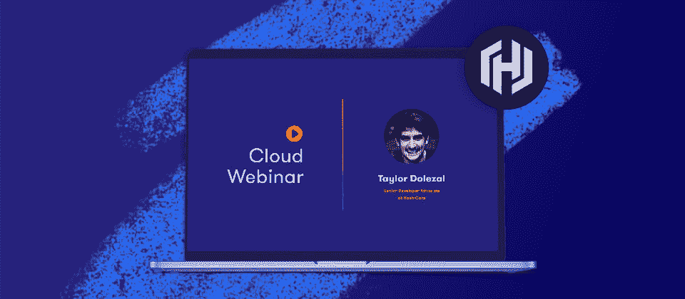

# AKS vs EKS vs GKE:托管的 Kubernetes 服务比较

> 原文：<https://acloudguru.com/blog/engineering/aks-vs-eks-vs-gke-managed-kubernetes-services-compared>

哪个云提供商的托管 Kubernetes 服务是云之王？在本帖中，我们将深入探讨三个主要竞争者的利弊。这是 AKS vs EKS vs GKE 的 k8s 集群皇家之战。

Kubernetes 已经成为企业首选的容器编制器。运行容器化应用程序的一个主要优势是可移植性。您可以在本地和云中运行相同的应用程序。

为了支持这些努力，三家顶级云服务提供商——亚马逊网络服务(AWS)、微软 Azure 和谷歌云——现在提供托管 Kubernetes 服务。但是它们之间有什么区别呢？

三个提供商之间的一些功能是通用的。

*   这三个提供商都可以让您轻松地与他们的其他服务集成。这不仅会简化操作，而且有助于提高可用性。

*   就 Kubernetes 服务本身而言，它们都为您部署和维护控制平面，因此您只需担心节点。这样，您可以更专注于您的应用程序。

但是，虽然 Kubernetes 的核心功能大体相同，但每个云提供商提供的功能可能会非常不同。那么我们如何选择在哪里运行我们的 Kubernetes 集群呢？请继续阅读，我们会比较 AK、EKS 和 GKE，看看哪一个最适合你。

* * *

**[观看:Kubernetes + Azure，HashiCorp way](https://get.acloudguru.com/kubernetes-azure-hashicorp-way-webinar)**
*观看这个快节奏、[免费点播的 webina](https://get.acloudguru.com/kubernetes-azure-hashicorp-way-webinar) r. HashiCorp 开发者倡导者 Taylor Dolezal 展示了使用 Terraform、Vault 和 Waypoint 来增强您的 Kubernetes 集群的潜力！*

* * *

## 什么是托管 Kubernetes 服务？

首先，快速入门。有了托管的 Kubernetes 服务，第三方可以承担设置和运行 Kubernetes 所需的全部或部分繁重工作。

以下是来自 AWS、Azure 和 GCP 的三个主要竞争者:

*   **[Azure Kubernetes 服务(AKS)](https://acloudguru.com/course/aks-deep-dive)** —最初，Azure 有一个服务叫 Azure Container Service。这不仅支持 Kubernetes，还支持 Apache Mesos 和 Docker Swarm。随着 Kubernetes 的受欢迎程度大幅超过竞争对手，Azure 在 2018 年 6 月用 Azure Kubernetes 服务取代了 Azure Container 服务。

*   **[谷歌 Kubernetes 引擎(GKE)](https://acloudguru.com/course/google-kubernetes-engine-gke-beginner-to-pro)**——谷歌是第一家发布谷歌 Kubernetes 引擎(GKE)的云提供商，这一点都不奇怪。毕竟，Kubernetes 最初是在谷歌为他们的内部应用程序开发的。《GKE》于 2015 年上映。

## 哪个云提供商的托管 Kubernetes 服务最好？

**TL；博士？**如果你已经投资了三大云提供商之一，继续使用该服务是有意义的。这三个人都是强有力的竞争者。

但是下面提到的所有托管 Kubernetes 服务都有独特的好处和特点。您使用哪个云提供商的托管 Kubernetes 服务实际上取决于具体情况。

*   **亚马逊弹性 Kubernetes 服务(EKS)是使用最广泛的**托管 Kubernetes 服务。

*   如果你不致力于云提供商，你可以考虑谷歌 Kubernetes 引擎(GKE)。 **GKE 拥有最多的功能和自动化能力**。

*   Azure Kubernetes 服务(AKS)可能是最具成本效益的选择,并且可以与微软的所有产品很好地集成。

让我们更深入地探讨一下每个提供商的优缺点和特性差异。请记住，由于云发展如此之快，在您阅读本文时，下面比较中的一些细节可能已经发生了变化。

## **Azure Kubernetes 服务(AKS)的利弊**

如果你已经在微软和 Azure 的世界里，使用 AKS 是有意义的。它与其他 Microsoft Azure 功能集成得很好，如 Azure Active Directory。这可能是最具成本效益的服务，因为您不必为控制平面付费。

| AKS 优势 | AKS 的弱点 |
| --- | --- |
| AKS 是提供较新的 Kubernetes 版本和小补丁最快的。 ^([1](https://github.com/Azure/AKS/releases)) | 与全自动的 GKE 不同，AKS 采用半手动流程将集群组件升级到较新版本。然而，一种全自动的解决方案正在开发中。 ^([13](https://azure.microsoft.com/en-us/updates/aks-cluster-auto-upgrade/))
 |
| AKS 提供自动节点健康修复。 [²](https://docs.microsoft.com/en-us/azure/aks/node-auto-repair) | 创建群集时需要启用网络策略，但不能在现有群集上启用。 [^(14)](https://docs.microsoft.com/en-us/azure/aks/use-network-policies#create-an-aks-cluster-and-enable-network-policy) |
| 控制平面是自由的；您只需支付每个节点的费用。 ^([3](https://azure.microsoft.com/en-us/pricing/details/kubernetes-service/)) | 如果你使用可用性区域，Azure 将只符合 EKS 99.95%的 SLA，可用性区域从 2021 年 2 月开始收费。 ^([十五](https://azure.microsoft.com/en-us/pricing/details/bandwidth/)) |
| AKS 与 Azure Policy 集成。 ^([4](https://docs.microsoft.com/en-us/azure/aks/policy-reference)) |  |
| Azure Monitor ^([5](https://docs.microsoft.com/en-us/azure/azure-monitor/insights/container-insights-analyze)) 和 Application Insights^([6](https://docs.microsoft.com/en-us/azure/azure-monitor/app/kubernetes-codeless))可用于监控和日志记录。 |  |
| Azure 网络策略和 Calico 网络策略可以在创建群集时自动设置。 ^([7](https://docs.microsoft.com/en-us/azure/aks/use-network-policies#network-policy-options-in-aks)) |  |
| 与 Azure Active Directory 无缝集成。 ^([8](https://docs.microsoft.com/en-us/azure/aks/managed-aad)) |  |
| AKS 在 Azure Government 中可用。 ^([9](https://azure.microsoft.com/en-us/updates/azure-kubernetes-service-is-now-available-in-azure-government/)) |  |
| 有很好的开发者环境。您可以在 Visual Studio 代码中使用 Kubernetes 扩展来部署到 AKS。 ^([10](https://code.visualstudio.com/docs/azure/kubernetes)) 或者你可以使用桥到 Kubernetes 服务。这使您能够在开发机器上运行和调试代码，就像它是您的集群的一部分一样。这样，您不需要将所有的依赖项复制到您的开发机器上。 ^([11](https://docs.microsoft.com/en-us/visualstudio/containers/overview-bridge-to-kubernetes?view=vs-2019)) |  |

## ****亚马逊弹性 Kubernetes 服务** (EKS)利弊**

根据 CCNF 的一项调查，EKS 是使用最广泛的托管 Kubernetes 服务。但是 EKS 的预配置解决方案最少，因此需要更多的手动配置。虽然这可能意味着您可以更好地控制您的集群，但也需要更多时间关注运营。

| EKS 的优势 | EKS 的弱点 |
| --- | --- |
| 与强大的 AWS 生态系统集成。
 | 在这三家提供商中，EKS 升级集群组件的手动步骤最多。 ^([19](https://docs.aws.amazon.com/eks/latest/userguide/update-cluster.html))
 |
| 有一个 99.95%的服务水平协议。 [^(16)](https://aws.amazon.com/eks/sla/) | 没有自动节点健康修复。 ^([二十](https://aws.amazon.com/premiumsupport/knowledge-center/eks-node-status-ready/)) |
| EKS 使得应用适用于集群范围的 Pod 安全策略变得非常容易。 ^([17](https://aws.amazon.com/blogs/opensource/using-pod-security-policies-amazon-eks-clusters/)) | 可以在亚马逊 cloud watch Container Insights^([21](https://docs.aws.amazon.com/AmazonCloudWatch/latest/monitoring/ContainerInsights.html))中配置日志记录和监控，但是服务不直观。 |
| [AWS GovCloud](https://acloudguru.com/course/aws-govcloud-beyond-the-buzzwords) 是受支持的地区。 ^([18](https://aws.amazon.com/about-aws/whats-new/2020/05/amazon-eks-now-available-in-the-aws-govcloud-us-regions/)) | 价格比 AKS 贵，每群集每小时 0.10 美元。 ^([22](https://aws.amazon.com/eks/pricing/)) |
|  | 你必须自己为 VPC CNI 安装升级。 ^([23](https://docs.aws.amazon.com/eks/latest/userguide/cni-upgrades.html)) |
|  | 你必须自己安装印花布 CNI。 ^([24](https://docs.aws.amazon.com/eks/latest/userguide/calico.html)) |
|  | 没有用于开发 EKS 代码的 IDE 扩展。 |

## **谷歌 Kubernetes 引擎(GKE)** 利弊

如果你在云基础设施方面没有任何投资，或者正在一个多云环境中工作，那么看看 GKE 可能是有意义的。它拥有开箱即用的最多功能，并提供最自动化的功能。

| GKE 的优势 | GKE 的弱点 |
| --- | --- |
| 三种托管服务中，GKE 的版本最多。 ^([25](https://cloud.google.com/kubernetes-engine/docs/release-notes#latest_versions))
 | 只有一个分区簇是空闲的。 ^([31](https://cloud.google.com/kubernetes-engine/pricing))
 |
| 控制面板和节点可以自动升级。 ^([26](https://cloud.google.com/kubernetes-engine/docs/concepts/cluster-upgrades)) | 如果您使用区域集群，GKE 将仅符合 EKS 99.95%的 SLA，每个集群每小时的成本为 0.10 美元。 ^([32](https://cloud.google.com/kubernetes-engine/pricing#cluster_management_fee_and_free_tier)) |
| 根据您的需要，您可以订阅快速、定期或稳定的发布渠道，以便您可以自动测试新版本。 ^([27](https://cloud.google.com/kubernetes-engine/docs/concepts/release-channels)) | GKE 没有政府云，所以没有政府云支持。 ^([34](https://cloud.google.com/compute/docs/regions-zones)) |
| GKE 提供自动节点健康修复。 ^([28](https://cloud.google.com/kubernetes-engine/docs/how-to/node-auto-repair)) |  |
| 您可以为节点使用容器优化的操作系统，它由 Google 维护，以提供更好的安全性和稳定性。 ^([29](https://cloud.google.com/container-optimized-os/docs/concepts/features-and-benefits)) |  |
| 有一个直观的集成仪表板，使用 Google Cloud operations suite 监控和记录所有组件。 ^([三十](https://cloud.google.com/products/operations)) |  |
| 对于开发人员环境，您可以将云代码扩展用于 Visual Studio 代码和 IntelliJ。 ^([31](https://cloud.google.com/code/docs)) |  |

* * *

## 观察:让 Kubernetes 在您的环境中发挥作用

在[这个免费点播的网络研讨会](https://acloudguru.com/content/putting-kubernetes-to-work-in-your-environment)中，深入探讨如何选择最适合您组织独特需求的托管 Kubernetes 服务。

* * *

## 如何开始使用 EKS、AKS 和 GKE

无论你是想知道哪条 Kubernetes 认证途径适合你，还是想了解更多关于 GKE、AKS 或 EKS 的基础知识，一位云计算专家都会帮你搞定。

利用这些来自 ACG 的相关资源，将您的 Kubernetes 技能提升一个档次:

* * *

## 掌握最受欢迎的技能

无论您是云新手还是经验丰富的专家，云专家都可以让您轻松(而且非常棒)地提升您的云职业生涯。查看 [ACG 目前的免费课程](https://acloudguru.com/blog/news/whats-free-at-acg-june-2021)或[立即开始](https://acloudguru.com/pricing)免费试用。