# 最佳云数据库:AWS vs Azure vs GCP

> 原文：<https://acloudguru.com/blog/engineering/aws-vs-azure-vs-gcp-cloud-comparison-databases>

在本帖中，我们来看看不同云提供商的数据库。我们将看看 AWS、Azure 和 GCP 之间的相似之处、不同之处和值得关注的地方。

啊，数据库。这些惊人且非常有用的服务是创建和部署应用程序和系统的核心促成因素。云允许这一领域的大量创新。

但是 [AWS](https://acloudguru.com/blog/engineering/what-is-amazon-web-services-aws) 、 [Azure](https://acloudguru.com/blog/engineering/what-is-microsoft-azure) 、 [Google 云平台](https://acloudguru.com/blog/engineering/what-is-google-cloud-platform-gcp)的数据库服务对比如何？答案就在这份云提供商比较指南中！

* * *

### AWS vs Azure vs GCP:云提供商比较

在云的世界里，并不都是苹果对苹果。以下是其他一些云比较指南。

* * *

## 内容

* * *

## 云数据库的基本概念

在我们深入研究之前，有几个关于数据库的基本概念值得了解。

### 什么是数据库伸缩？

缩放可以是垂直的，也可以是水平的。

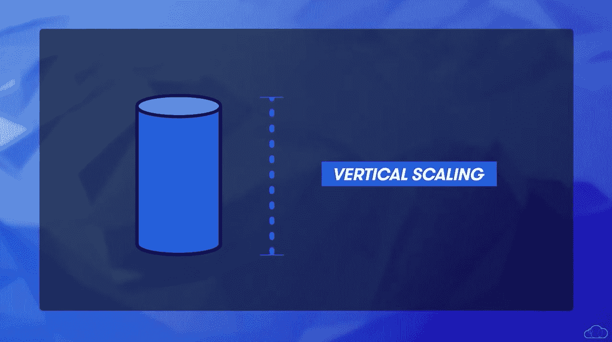

*   **垂直扩展** —垂直扩展是指单个数据库实例通过添加更多计算、内存和/或存储来增长，以便能够处理更多流量。

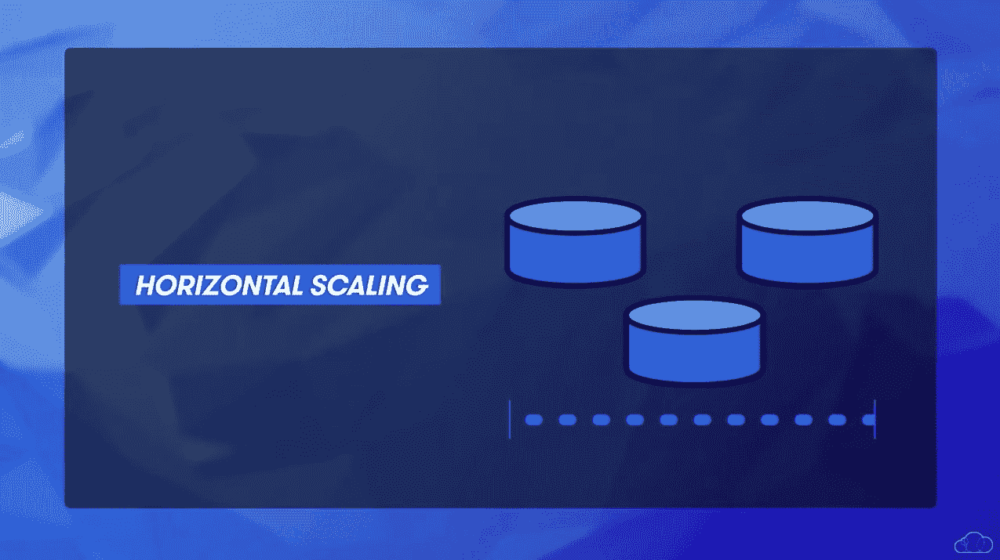

*   **水平扩展** —水平扩展是指添加多个数据库实例，使访问数据库的流量分布在这些实例中。这可以比垂直扩展更大，但很难做到，因为它要求数据要么在实例之间确定地拆分，要么在这些实例之间保持同步，这两者都会在数据、结构、一致性和原子性等方面产生复杂性。

*   **读取副本** —一些数据库服务将允许您通过读取副本水平扩展只读操作。在这里，数据在多个实例之间出于只读目的进行同步，但是您仍然有一个用于写操作的主实例。

### 什么是数据库可用性？

下一个要理解的概念是可用性。可用性是指云提供商就数据库在给定时间段内启动并运行多长时间以接收请求提供服务级别协议(SLA)。

*   如果一个数据库的可用性 SLA 为 99.9%，那么它在一个月内可能会有 44 分钟的停机时间。然而，如果一个数据库的 SLA 为 99.999%(也称为五个九)，那么它一个月可能会有 26 秒的停机时间。

云提供商应用高可用性架构来允许跨各种故障模式子集的容错。根据您的具体需求，您需要平衡可用性、成本和功能，以决定哪种服务最适合您。

* * *

[**获得痛苦的云词典**](https://get.acloudguru.com/cloud-dictionary-of-pain)
说云不一定要努力。我们分析了数以百万计的回复，找出了最容易让人犯错的概念。抓住这个[云指南](https://get.acloudguru.com/cloud-dictionary-of-pain)获取一些最痛苦的云术语的简洁定义。

* * *

## 有哪些不同类型的数据库？

最后，理解有不同类型的数据库是很重要的。也许你有 SQL 和 NoSQL 数据库。但是当你深入挖掘的时候，你会发现实际上有很多种类型的数据库。

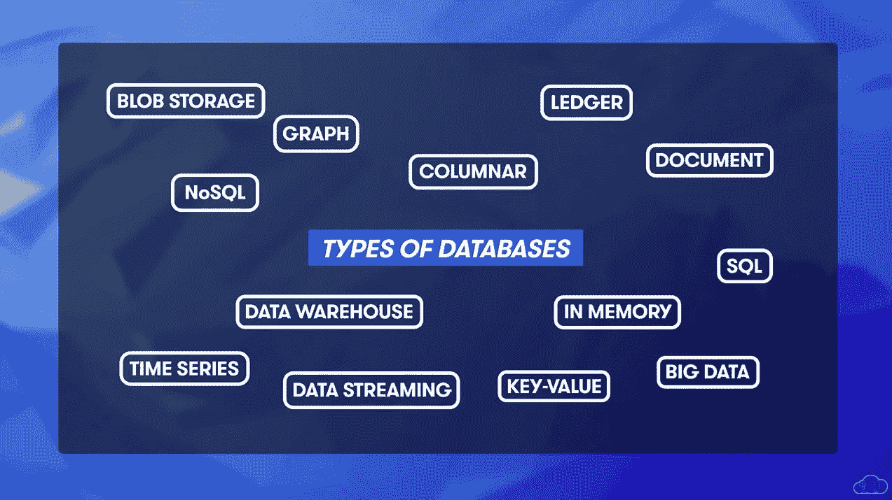

在本文中，我们将比较最常见的数据库类型:关系数据库(通常称为 SQL 数据库)和 NoSQL 数据库—具体来说就是密钥值数据库和文档数据库。对于关系数据库，我们将涵盖三种不同的子类型:基础架构即服务(或 IaaS)、平台即服务(或 PasS)和云本地 PaaS。

为了给你一个有价值的深入比较，我们将把重点放在最流行的通用数据库服务上，我们不会涉及 SQL 数据仓库或其他类型的 NoSQL 数据库，如图形、内存、时间序列、分类帐和列数据库。

## SQL(关系)数据库

关系数据库的特点是表中的数据行具有列和关系，可以使用结构化查询语言(或 SQL)进行查询。

这些是一些最古老的通用数据库，至今仍是最常用的。

## IaaS SQL 数据库

我们将从 IaaS SQL 数据库开始。这是您负责跨一个或多个 IaaS 虚拟机部署数据库服务器的地方。

有两个主要的专有数据库— Microsoft SQL Server 和 Oracle 数据库—和三个主要的开源数据库— MySQL、PostgreSQL 和 Maria DB。

### 为什么要使用 IaaS 数据库？

说到数据库服务，IaaS 是迄今为止最需要构建和维护的工作，尤其是如果您想要实现高度可靠或高性能的设计。那么，你为什么要使用这个选项呢？

很大程度上，这归结于灵活性和控制。当您需要[抬起和移动](https://acloudguru.com/blog/business/what-is-lift-and-shift-cloud-migration)或者对特定细节进行明确控制时，这可能是一个不错的选择。但是反过来，担心配置、修补、备份等等是你的责任。

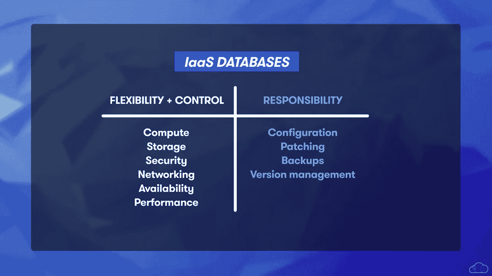

## IaaS 数据库服务比较:AWS vs Azure vs GCP

云提供商之间的主要区别在于是否允许您在云的虚拟机管理程序上许可数据库引擎，以及是否提供任何额外的建议、服务或功能，如自动修补。

Microsoft SQL Server

### 我们先来看一下[微软 SQL Server](https://acloudguru.com/course/microsoft-sql-server-on-linux-quick-start) 。AWS、Azure 和 GCP 都提供了很好的支持，都提供了全面的部署指导。

当涉及到许可时，情况就有点不同了。如果你有现有的软件保障许可，你可以用它来降低你在 Azure 和 AWS 上的成本，但 GCP 不行。

Azure 还提供混合优势来进一步降低您的成本，并且它具有自动修补和自动备份功能。

Oracle 数据库

### 就 Oracle 而言，AWS 和 Azure 提供了全面的指导。但是由于许可限制，除非部署到昂贵、复杂的裸机服务器上，否则不可能在 GCP 上运行 Oracle。

Azure 在与甲骨文合作的一些地区提供了一个额外的功能，以提供到甲骨文云环境的低延迟连接。这是运行 Oracle 数据库的一流环境。

开源数据库

### 当谈到开源数据库时，支持就不那么全面了。官方指导在所有云平台上都很少或不存在。

现在网上有很多关于在服务器上运行这些数据库引擎的指导，但是对于如何为给定的云提供商和数据库组合实现复杂、高可用性或高性能的部署，您可能会缺乏具体的指导。

云可用性:AWS vs Azure vs GCP

## 就可用性而言，如果您跨可用性区域部署，云提供商都提供 99.99%的 SLA，而对于单个服务器部署，则提供较低的 SLA。

值得指出的是，所有三家云提供商都有一个市场，其中包含一系列关于虚拟机部署的现成数据库，这些数据库的复杂程度和自动化程度各不相同，您可以单击一个按钮进行部署，然后从您的云账单中收取费用。

PaaS SQL 数据库:AWS vs Azure vs GCP

## 接下来，让我们看看 PaaS SQL 选项。这是云提供商负责为您自动化虚拟机、运行补丁和配置操作系统和数据库引擎的地方。

PaaS SQL 数据库比较:AWS vs Azure vs GCP

### 在 AWS 中，历史悠久的 PasS 数据库服务被称为[亚马逊关系数据库服务(或 RDS)](https://acloudguru.com/course/introduction-to-amazon-rds) 。

*   在 Azure 中，它被称为 SQL Server 的 Azure SQL 数据库托管实例和 MySQL、PostgreSQL 或 Maria DB 的 Azure SQL 数据库。
*   而在 GCP，它被称为[云 SQL](https://acloudguru.com/course/google-cloud-sql-deep-dive) 。
*   Amazon RDS 是唯一直接支持托管 PaaS Oracle 数据库的提供商。GCP 是唯一没有 PaaS Maria DB 服务的云提供商。
*   值得指出的是，Azure SQL 数据库托管实例的模型与其他服务略有不同。它提供了一个总是打补丁的 SQL Server 的常青版本，而不是选择您想要托管的数据库版本。
*   PaaS Microsoft SQL Server —监控和可用性

### 这三家提供商都提供原生云监控解决方案以及性能见解和建议。

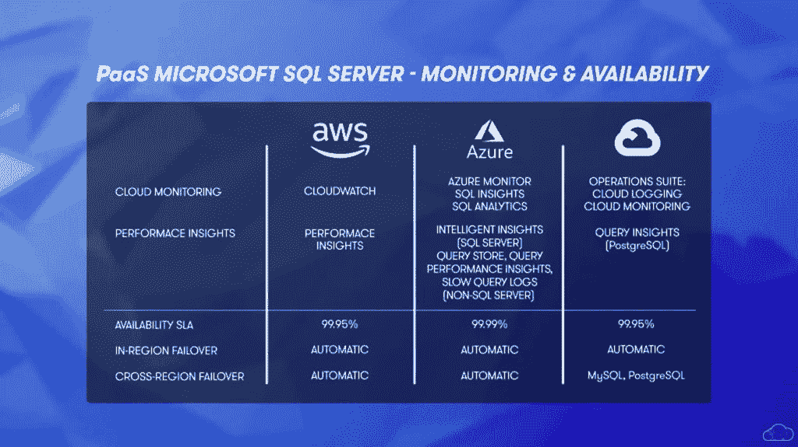

*   Azure 在可用性方面略微领先，具有更高的 SLA 和自动跨区域故障转移。
*   所有提供商都有自动备份解决方案，但 Azure 的是最全面的。
*   GCP 的默认备份保留可以配置更长的时间，但 Azure 具有针对 SQL Server 的可选长期保留功能。
*   这三者都提供了时间点恢复选项，当您需要从意外数据丢失中恢复时，这很方便，但在 GCP 使用起来就比较笨重，保留期也较短。
*   PaaS Microsoft SQL Server —可扩展性

### 垂直扩展是 GCP 的闪光点。您可以扩展到一个庞大的数据库，并且减少了维护工作，因为它会跨所有数据库引擎自动增加您的存储。

*   Azure 在横向扩展方面表现突出，为所有数据库引擎提供跨区域读取副本，并在 SQL 托管实例的业务关键层提供读写副本。
*   PaaS Microsoft SQL Server —安全性

### 所有提供商都通过防火墙和虚拟网络、传输中和静态加密以及审计日志记录提供强大的安全性。

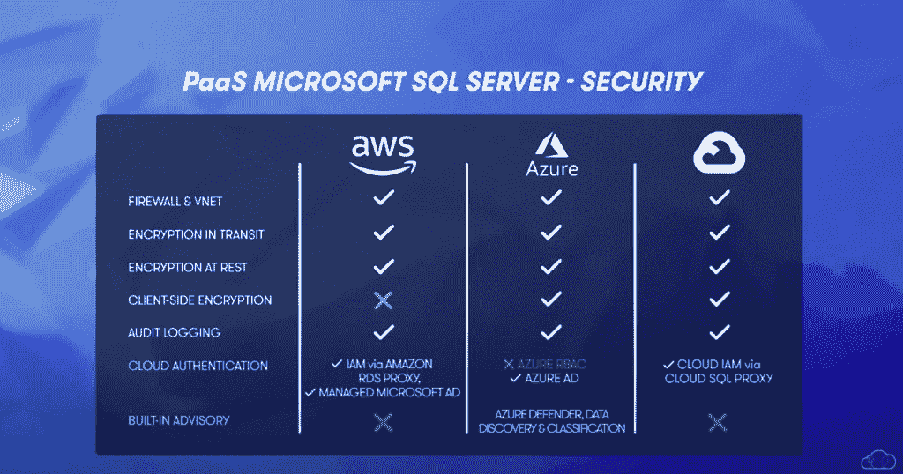

关键区别在于 RDS 没有内置的客户端加密，Azure 没有基于角色的本地访问控制——尽管它内置了一些更高级的咨询功能。

[**自动化 AWS 成本优化**](https://go.acloudguru.com/AWS-Cost-Optimization-Webinar)
经济高效地使用 AWS 可能是一项挑战。在这个[免费点播的网络研讨会](https://go.acloudguru.com/AWS-Cost-Optimization-Webinar)中，您将了解 AWS 成本优化工具和策略的概况，如[数据存储优化](https://acloudguru.com/course/introduction-to-optimizing-data-storage-in-aws)。

* * *

云原生平台即服务:AWS vs Azure vs GCP

* * *

## 接下来，让我们看看云原生 PaaS SQL 选项。

通过原生为云构建数据库解决方案，提供商获得了具有更高级功能的 SQL 服务，如主动地理复制、更快更广的纵向和横向扩展、更高的可用性以及无服务器定价。

云原生 PaaS SQL 数据库比较:AWS vs Azure vs GCP

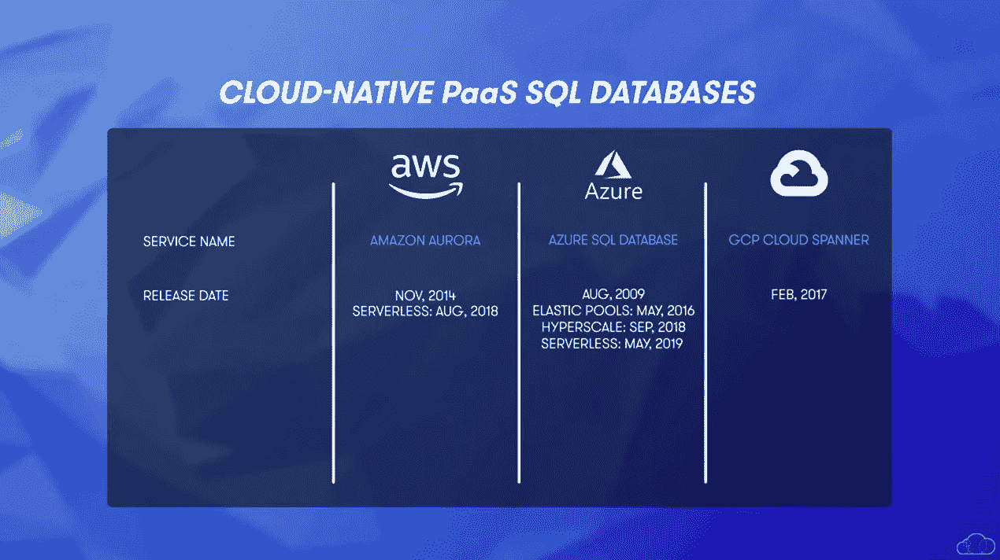

### AWS 有 [Aurora](https://acloudguru.com/course/amazon-aurora-cloud-sql-db-essentials) ，一个 [MySQL](https://acloudguru.com/course/database-administration-and-sql-language-basics) 和 [PostgreSQL](https://acloudguru.com/course/postgresql-administration-deep-dive) 兼容的引擎，在相同的硬件上拥有更高的吞吐量。

*   Azure 拥有 [Azure SQL 数据库](https://acloudguru.com/course/using-microsoft-azure-database-services)，这是一个常青树 SQL server 引擎，具有各种操作模式，包括通用、业务关键、弹性池、超大规模和无服务器。
*   谷歌有[云扳手](https://acloudguru.com/hands-on-labs/setting-up-for-google-cloud-spanner)，这是一个拥有一些令人印象深刻的属性的专有数据库。
*   云原生 PaaS SQL 数据库—监控和可用性

#### 从监控的角度来看，所有的提供商都提供了良好的覆盖，尤其是 Azure，提供了一系列全面的性能洞察工具。

所有产品都有相似的基本 SLA。Azure 通过其业务关键层进一步提升了这一点。它也是唯一一个有恢复点目标和恢复时间目标的产品。

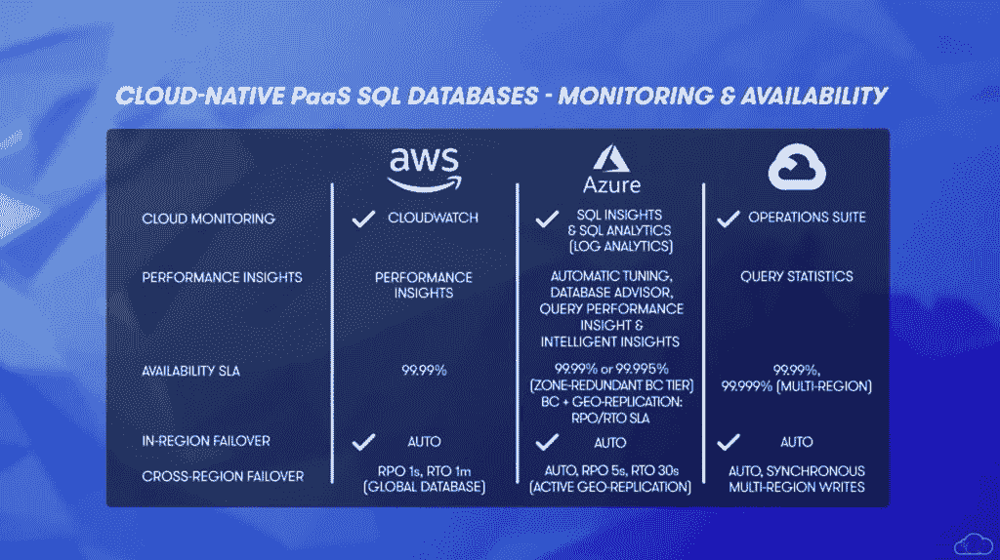

但最令人印象深刻的是 GCP 的云扳手，具有 99.999%的多区域配置可用性。明确地说，这是每月 26 秒的允许停机时间。

所有提供商都有自动区域内故障转移和快速跨区域故障转移，这在 Azure 和 GCP 是自动的。

云原生 PaaS SQL 数据库—备份

#### 从备份的角度来看，所有三个提供商都有时间点恢复，AWS 和 Azure 有更长的恢复窗口和自动化备份。Azure 在时间点恢复之外有一个长期保留选项。

Cloud Spanner 只有手动备份，但它确实有能力执行陈旧读取来外科手术式地查询意外删除的数据，这真的很酷。

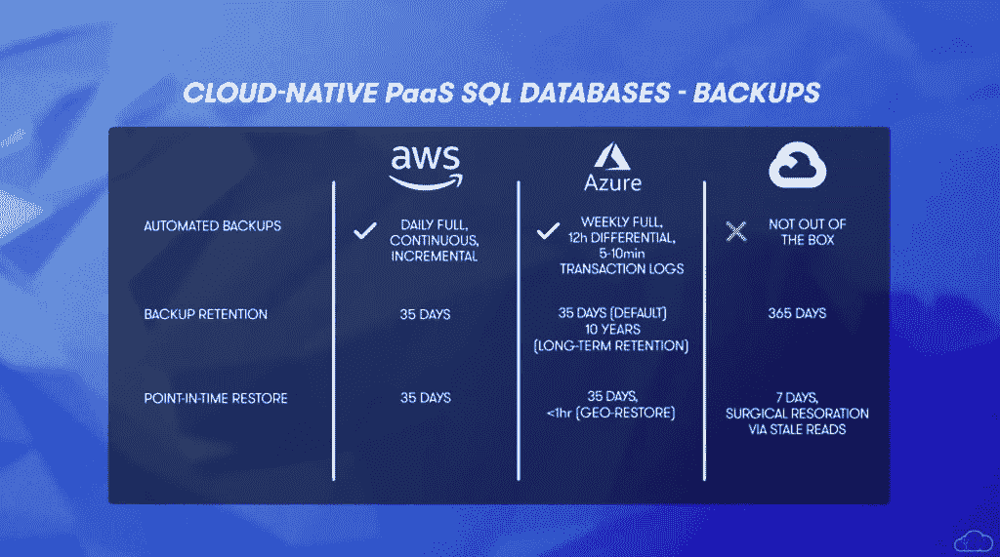

云原生 PaaS SQL 数据库—可扩展性

#### 在扩展方面，GCP 云扳手没有垂直扩展的概念，因为它是完全水平扩展的。所有节点大小相同。

比较 Azure 和 AWS: Azure 的业务关键层有一个绝对巨大的最大垂直规模。

对于存储，GCP 实际上是无限的，因为它将存储绑定到其水平扩展的节点，每个节点有一个最大存储。有默认的节点配额，您可以请求增加这些配额。所以实际上，限额是基于你的信用卡。

Amazon Aurora 的最大存储量和自动增长令人印象深刻。而 Azure 相对缺乏，最大存储量小得多，没有自动增长。尽管超大规模层拥有令人印象深刻的最大存储。

从横向规模的角度来看，所有三个提供商都有一套令人印象深刻的能力。它们都提供跨区域读取副本、分片功能和读写副本选项。不过最突出的是 Cloud Spanner，它具有自动分片和可水平伸缩的读写功能。

Azure 和 AWS 都提供无服务器定价，包括自动扩展、自动暂停和自动恢复功能，以及按使用付费的定价，这非常适合间歇性和非生产性工作负载。

云原生 PaaS SQL 数据库—安全性

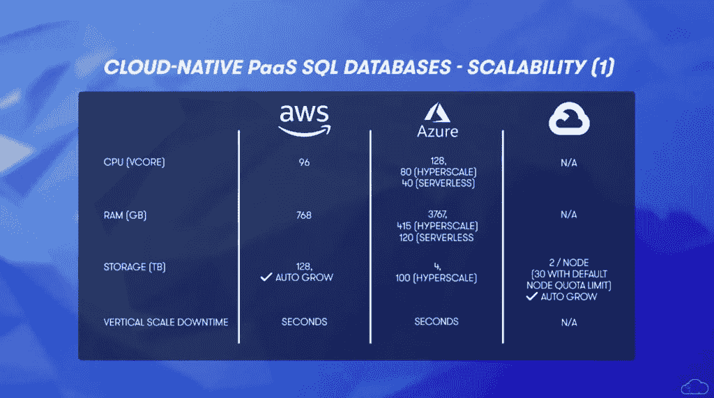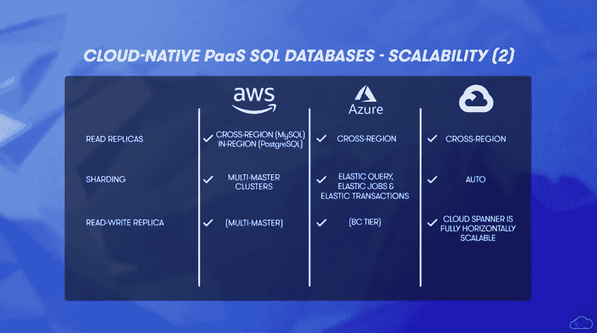

#### 从安全角度来看，这与我们讨论的 PaaS SQL 数据库非常相似，只是 Cloud Spanner 没有客户端加密。

NoSQL 数据库(键值和文档数据库)

## 好吧。让我们换个话题，深入到 [NoSQL](https://acloudguru.com/course/amazon-dynamodb-data-modeling) 的世界，更具体地说，是键值和文档数据库。

[**成年人的 NoSQL:DynamoDB 单表建模与里克·霍利汉**](https://get.acloudguru.com/nosql-for-grownups-dynamodb-webinar) 在[这个免费的点播网络研讨会](https://get.acloudguru.com/nosql-for-grownups-dynamodb-webinar)中，里克·霍利汉，AWS 的高级实践经理和单表 DynamoDB 设计的发明者，展示了他在 dynamo db 中建模复杂数据访问模式的技巧。

* * *

什么是键值数据库？

* * *

### 键值数据库很简单。您存储数据，值，根据一个键查找。您通常可以存储大量数据，同时保持快速的查找时间。存储的值通常由一组不同数据类型的不同属性组成。

什么是文档数据库？

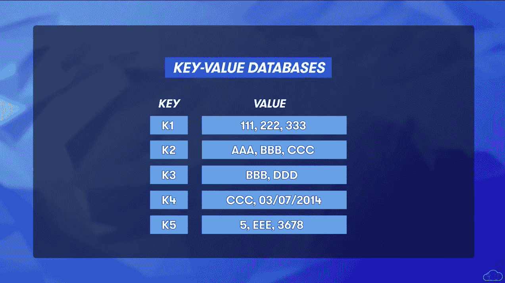

### 文档数据库与键-值数据库的相似之处在于，您存储一组值(一个文档)和一个键(文档 ID ),但是这些数据库对存储更复杂的值提供了完善的支持，包括数组和子对象，以及基于这些文档结构的事务、索引和查询。

云原生 NoSQL 数据库的历史

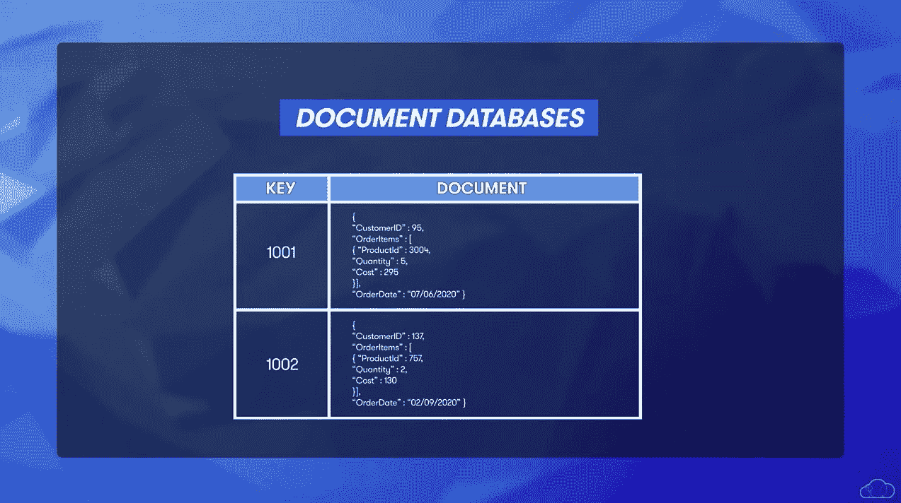

### 云原生的 NoSQL 键值和文档数据库服务有一个共同的主题，即它们与后来被弃用的遗留服务有很长的历史。

例如，AWS 在 2007 年 12 月推出了 SimpleDB，一个简单的键值存储，然后在 2012 年 12 月推出了具有一系列更好特性的 [DynamoDB](https://acloudguru.com/course/amazon-dynamodb-deep-dive) ，包括文档支持。它还有一个更新的服务叫做 DocumentDB，与 [MongoDB](https://acloudguru.com/hands-on-labs/working-with-mongodb) 兼容。

*   Azure 在 2008 年 10 月引入了表存储，一个简单的键值存储。随后，他们在 2014 年 8 月推出了 DocumentDB，这是一个文档数据库，随后他们在 2017 年 5 月发布了 Cosmos DB，这是一个支持关键值文档图和分栏存储的多范例数据库。
*   GCP 在 2014 年 8 月推出了他们的键值数据库 [Cloud Bigtable](https://acloudguru.com/hands-on-labs/basics-of-google-cloud-bigtable) ，该数据库自 2005 年开始在内部使用。然后，他们在 2008 年 10 月推出了他们的第一个文档数据库[数据存储](https://acloudguru.com/hands-on-labs/exploring-cloud-firestore-in-datastore-mode)，该数据库与 Firebase 实时数据库相结合，随后由 2017 年 10 月发布的 Cloud Firestore 进行了改进。
*   NoSQL 数据库:AWS vs Azure vs GCP

### 在这一节中，我们将比较以下旗舰键值和文档数据库:Amazon DynamoDB、Azure Cosmos DB、Google Cloud Bigtable 和 Firestore。

让我们先来看看消费定价模型和独特的功能。

 NoSQL 数据库消费

#### 因为这些数据库通常是专有的，所以云提供商给你的使用它们的机制很重要。

所有服务都提供命令行界面(CLI ),除了 Bigtable 之外，所有服务都至少有一个用户界面。

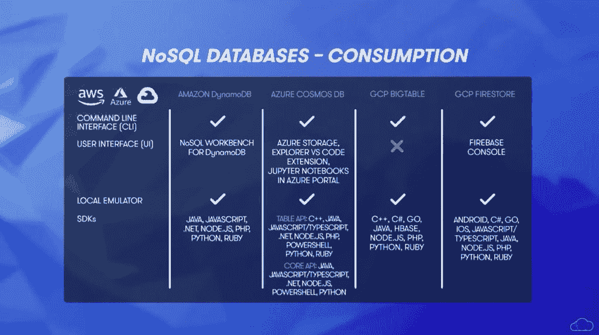

*   所有提供者都有一个本地模拟器，这样您就可以运行数据库的本地实例来进行开发和测试活动，而不需要互联网连接。
*   正如您所料，所有服务都有大量的 SDK 可供选择，只是支持的语言略有不同。
*   NoSQL 数据库的定价模式和独特功能

#### 看看定价模型，Amazon DynamoDB 和 Azure Cosmos DB 为您提供了可选性，支持供应和无服务器定价模型。

*   GCP 的 Bigtable 只支持 provisioned，Firestore 只支持 serverless。
*   看看独特的功能，DynamoDB 集成了一个内存缓存来加快读取速度。
*   Cosmos DB 有一个内置的 JavaScript 引擎来提供存储过程、触发器、用户定义函数和合并过程的事务一致性执行。它还支持核心键值和文档 API 之上的一系列附加 API，包括 Mongo DB、Cassandra 和 Gremlin。
*   Bigtable 有一个内置的 Apache HBase API，Firestore 有一些基于文件的路由的独特属性，这使它非常适合直接针对它构建 web 和移动应用程序，包括离线同步和 CDN 数据包。
*   NoSQL 数据库的主要功能

#### NoSQL 数据库在处理存储在其中的数据方面有一组关键的功能。

如果我们从查看每个服务使用的数据模型开始，我们可以看到 Cosmo DB 提供了一个额外的父级，称为数据库帐户。

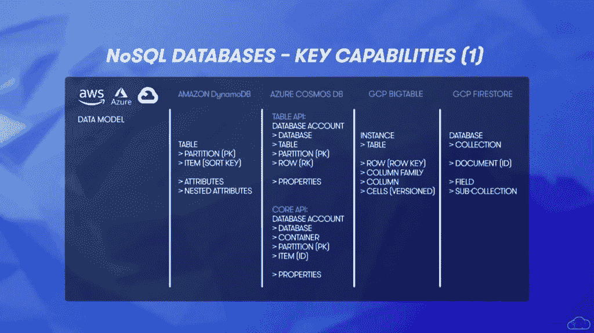

*   Cosmos DB、Bigtable 和 Firestore 都支持数据库级结构。
*   所有服务都有一个表或集合概念，其中包含行或文档，这些行或文档都有属性值。
*   DynamoDB 和 Cosmos DB 有显式的分区键，允许对行进行分片和分组。
*   Bigtable 有一个独特的属性，其中对各个单元格的值进行了版本控制，因此您可以获得值的历史记录。
*   Firestore 有一个强大的功能，您可以在一个文档中定义嵌套集合。
*   除了 Bigtable 将所有值都视为二进制值之外，每个数据库存储的值的类型在服务之间都相当相似。

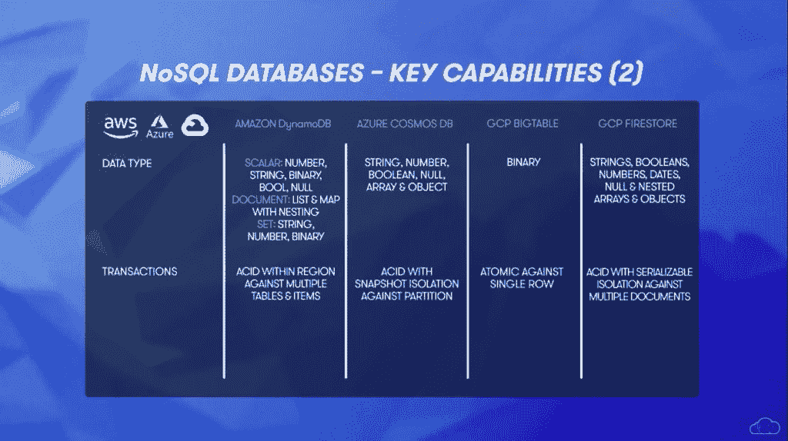

所有服务都为事务提供了一定程度的支持，只是在隔离级别和事务执行范围上略有不同。

*   所有服务都提供乐观并发，但是 Firestore 也支持悲观并发。
*   一致性模型是一些有趣的不同之处。

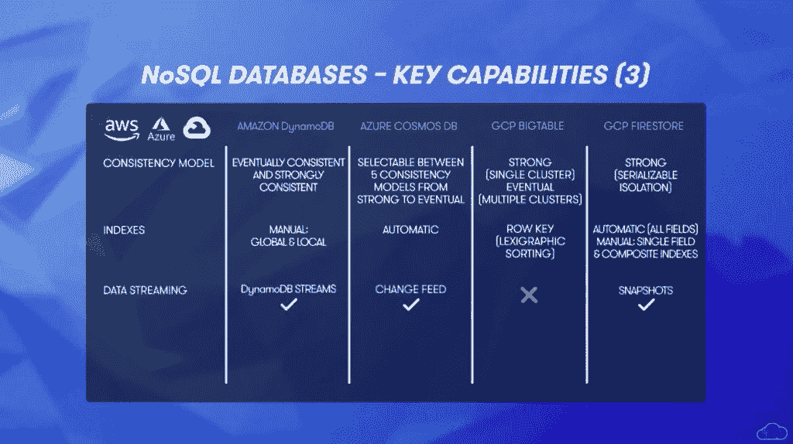

DynamoDB 允许您在读取时指定，如果您想要最终或强一致性。

*   如果使用单个集群，Bigtable 将提供很强的一致性，如果使用多个集群，将提供最终的一致性。
*   forestore 总是给出可序列化的隔离。
*   Cosmos DB 为您提供了极大的灵活性，允许您为每个读取请求选择五种不同的一致性级别，并对可用性、延迟和吞吐量进行了明确的权衡。
*   除了 Bigtable 之外的所有服务都允许数据流。
*   NoSQL 数据库限制

#### 所有 NoSQL 数据库在存储和检索数据时都有限制。每种服务都有不同的底层设计，这就产生了不同的限制特征。

例如，在 Bigtable 和 Firestore 中，项目的属性受到限制，但在 DynamoDB 或 Cosmos DB 中不受限制。

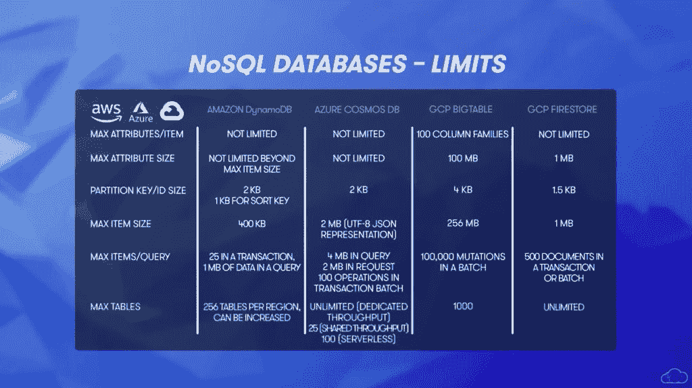

*   所有数据库对分区键和 id 都有低千字节的限制。
*   再往上看一层，一个单独的项目，有很大的差异，特别是 DynamoDB 中相对较小的最大项目大小，而 Bigtable 中相对较大的项目大小。尽管该大小包括该项目的所有版本。
*   与项目相关的另一个限制是在执行查询和/或事务时允许的项目数量或大小。DynamoDB 的限制相对较小，而 Firestore 和 Bigtable 的限制要大得多。
*   最后，看看表或集合的概念，虽然 Cosmos DB 和 Firestore 没有限制，但默认情况下 DynamoDB 和 Bigtable 有。
*   NoSQL 数据库的可扩展性

#### 从可扩展性的角度来看，所有服务都支持完全的水平可扩展性，因此提供了大量的最大存储量。所以这个很大程度上受你信用卡的约束。

从自动扩展的角度来看，DynamoDB、Cosmos DB 和 Firestore 中的无服务器定价模型都可以自动扩展。

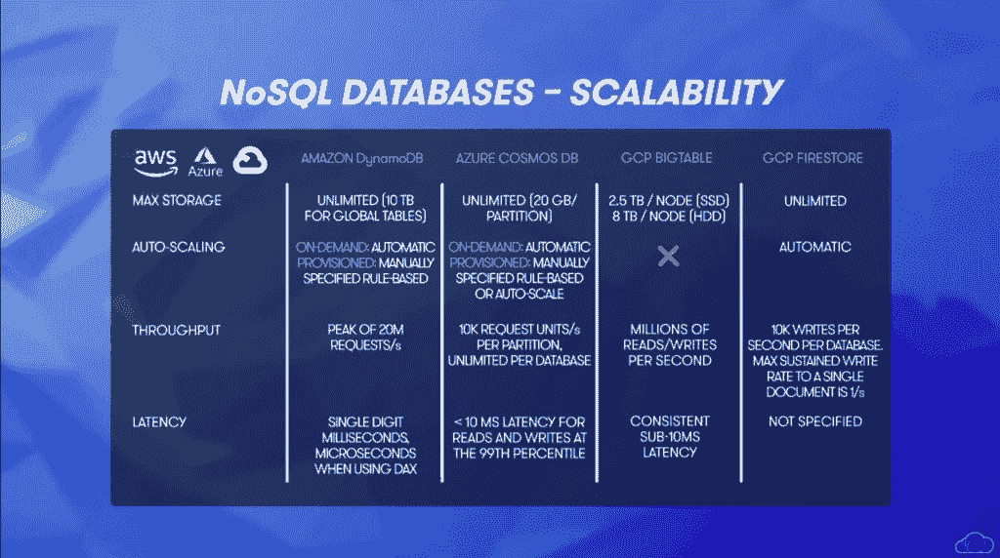

*   Cosmos DB 和 DynamoDB 还支持通过手动指定的规则在它们提供的定价模型中自动缩放。
*   Bigtable 不支持开箱即用的自动伸缩。
*   所有服务都支持令人印象深刻的吞吐量数字，假设您利用了它们的各种分区机制。
*   不过，和其他服务相比，Firestore 的写性能相对较差。
*   Firestore 在延迟方面也同样欠缺，没有具体的延迟目标，而其他服务的响应时间只有个位数毫秒。
*   DynamoDB 值得注意的是它可选的 DAX 功能，提供微秒级的响应时间。
*   NoSQL 数据库监控和可用性

#### 从监控角度来看，除 Firestore 之外，所有数据库都集成了云监控服务，并且都有详细的性能见解。

*   所有服务都具有令人印象深刻的“五个 9”的跨区域可用性，单区域实例的可用性 SLA 较低。
*   Cosmos DB 是唯一一个在吞吐量、一致性和延迟方面有 SLA 的服务。
*   所有服务都有跨区域自动故障转移，Cosmos DB 可选地允许手动故障转移。
*   NoSQL 数据库备份

#### 在备份方面，AWS 和 Azure 遥遥领先。

DynamoDB 和 Cosmos DB 都提供即时恢复功能和开箱即用的自动备份。

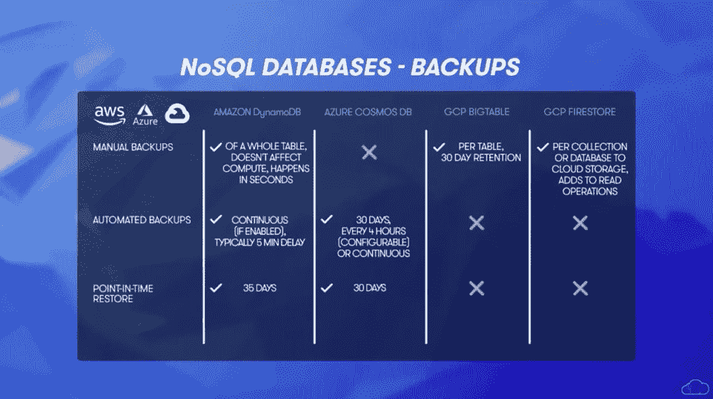

*   令人惊讶的是，Cosmos DB 不提供手动备份的能力，而 DynamoDB 允许在几秒钟内完成完整备份，而不会影响性能。
*   GCP Bigtable 和 Firestore 都允许手动触发备份。
*   NoSQL 数据库安全

#### 安全故事与我们看到的 SQL 数据库非常一致，很好地覆盖了服务。在 Firestore 没有防火墙或 VNet 支持的情况下，还有一个令人惊讶的排放。(虽然 Firestore 通过 Firebase 认证和云 Firestore 安全规则，对 web 和移动应用程序具有一些强大的认证功能。)

Cosmos DB 提供了一系列不同的认证机制，这给了它很大的灵活性。它还通过 Azure Defender 提供全面的安全建议。

结论

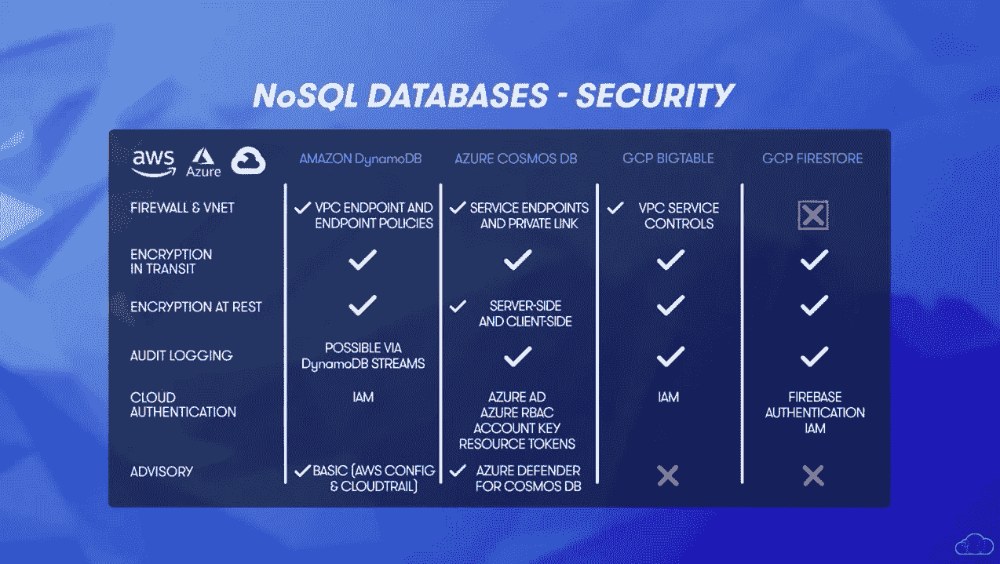

## 正如我们所见，AWS、Azure 和 GCP 的数据库选项非常广泛，令人印象深刻。在每个类别的云平台中，都有大体相同的服务，但每一个都有自己独特的特征。

虽然我们没有涵盖每个云提供商必须提供的每个数据库服务，但希望这里的信息提供了一个有用的起点，可以帮助您比较不同提供商之间不同类型的服务。

如果您想了解更多关于这些云服务的信息，[开始免费试用](https://acloudguru.com/pricing)云专家提供的涵盖所有这些服务的视频和动手实验。继续牛逼吧，云大师们！

为更好的职业生涯建立你需要的技能。

* * *

## 掌握现代技术技能，获得认证，提升您的职业生涯。无论您是新手还是经验丰富的专业人士，您都可以通过实践来学习，并在 ACG 的帮助下推进您的云计算职业生涯。

关于作者

* * *

#### *Rob 是 [Telstra Purple](https://purple.telstra.com/) 的全球交付创新主管，在这里他培养了一种授权和驱动创新、实验、持续改进和知识共享的文化。*

Rob 拥有成功交付软件和组织变革项目的良好记录，尤其关注加速商业价值交付、衡量和实现，他还是许多组织、团队和项目中积极文化变革和渐进持续改进的支持者和领导者。Rob 专注于领导团队，通过使用敏捷和精益的价值观和原则，通过采用 DevOps 和持续交付实践，专注于业务价值的交付，帮助企业成功创新和变革。他对移动、web 和云软件开发以及知识产权(IP)战略非常感兴趣。