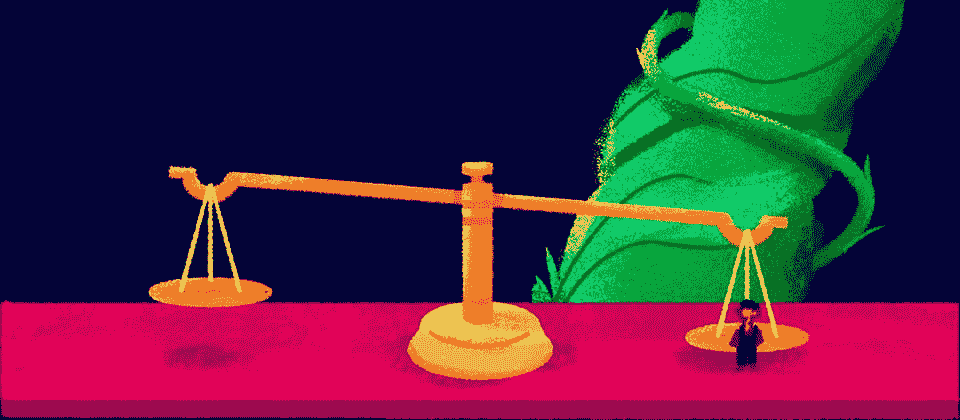

# 预测云支出:云成本优化的 4 个技巧

> 原文：<https://acloudguru.com/blog/business/cloud-cost-optimization>

随着预算季节的临近，云支出问题成为焦点。根据 Gartner 的数据，[云支出](https://www.gartner.com/en/newsroom/press-releases/2022-04-19-gartner-forecasts-worldwide-public-cloud-end-user-spending-to-reach-nearly-500-billion-in-2022)正以每年 20%的速度增长，但并非所有组织都获得了投资回报。

* * *

## 目录

* * *

客户组合总监 Mallory Beaudreau 知道这种差异会造成焦虑。在我们的网络研讨会“如何为 2023 年的云做预算”中，她分享了帮助您预测云支出和创建合理预算的技巧，无论您处于云之旅的哪个阶段。

## 领导者应如何实现云成本优化和预算

在确定您的年度云预算之前，请考虑使云独一无二的因素:

### 非常规服务模式

云服务使用不同于传统 IT 服务的计费模式。云服务不是收取固定的费用，而是根据使用情况收取可变的费用。这给负责云成本优化的财务团队带来了新的挑战。

Mallory 解释说:“当金融界对云进行预测时，他们必须以不同的方式进行预测。“这种不确定性造成了很多焦虑。为了解决这个问题，团队需要开始以不同的方式合作，以获得更有说服力的预测数字。”

### 缺乏对云支出和价值的了解

许多高管感到削减云支出的压力。降低云成本比裁员更快见效，但也会对业务运营和[客户价值](https://acloudguru.com/blog/engineering/measuring-cloud-success)产生复合效应。

“我们使用云来构建应用程序、服务和产品，销售给我们的客户，或者用来服务我们的客户，”Mallory 说。“‘削减云支出’忽略了一个事实，即云支出实际上可能有助于增加收入。这可能有助于他们提高运营效率。”

* * *

## 如何管理利益相关方对云支出的预期

那么，您如何重新构建关于云成本优化的对话以获得认同呢？

### 将云成本优化与业务成果相匹配

高管关注高层次的业务成果，如收入、利润率和对股东的价值。如果您在云中运行某些东西，请确保您理解其业务目的以及与组织目标的关系。一旦你这样做了，你就可以衡量其潜在的商业影响，并从战略上吸引利益相关者。

Mallory 建议说:“将[与云支出相关的]美元融入到其他东西中，如收入、应用程序的速度或您可以处理的交易数量。

* * *

## 如何规划您的云成本优化

### 在各个层面投资云学习

为了创建云支出预测，技术领导*和非技术领导*需要了解云的价值。

非技术领导者，尤其是财务领域的领导者，必须建立[技术流畅度](https://www.pluralsight.com/solutions/tech-fluency)来讨论您组织的云计费和流程。“你想做一些事情，比如午餐学习或网上研讨会培训系列。马洛里建议:“也许你有一个 SharePoint，人们可以在那里获得提示和技巧，提醒他们你将如何做预算和预测。”

技术团队也需要[提升](https://acloudguru.com/blog/business/how-acg-helps-businesses-experiment-more-spend-less-learning-cloud)的技能，这样他们才能改进系统，提高效率。“对于技术人员来说，需要一个持续的学习周期，因为云在不断变化，”Mallory 说。“从历史上看，开发人员是为了稳定性、性能和卓越运营而构建的。现在我们说，‘嘿，你提供的一切都要花我们的钱。你需要所有这些东西吗？“当您帮助开发人员了解与其工作相关的成本时，您将能够更准确地预测云支出。

* * *

## **了解云技能如何产生实际回报**

查看[云技能投资回报率报告](https://acloudguru.com/content/roi-report-how-the-cloud-helps-you-grow)，了解投资云技能的公司如何为员工创造更多收入。

* * *

### 通过具体数字了解云支出

财务团队需要具体的数字来推动[云成本优化](https://www.pluralsight.com/courses/evaluating-controlling-cloud-costs-executive-briefing)。

#### 如何预测直接云支出

让我们以特优支持为例。这将作为一个单项出现在您每月的云账单上。如果你想算出一个应用的直接成本和支持费用，与你的财务和技术团队合作。

让您的技术团队预测构建云架构的直接成本。然后问他们明年打算多花多少钱。一旦他们这样做了，你的财务团队可以说，“好吧，你花了我们云账单的百分之五，因此你要负责百分之五的支持费用。”

有很多方法可以做到这一点，但这种模式是公平合理的。“如果你知道去年你在支持上花了多少钱，你也可以推断出来，”马洛里说。

#### 如何预测间接云支出

现在，让我们假设您有一项未出现在您的云账单中的间接成本。你怎么适应的？

例如，如果您试图预测云的总成本，您需要考虑开发人员的工资、福利、设备和其他成本。与您的财务团队合作获得这些数字。然后看看工资和你的组织的成本分配模型，为额外开支制定预算。

### 了解云成熟度对云支出的影响

如何预测云支出通常取决于您在云之旅中所处的阶段。

#### 如果您尚未使用云，如何预测云支出

如果您计划首次从数据中心迁移或在云中构建新的应用程序，您可能没有历史数据可以依靠。但是如果你有任何云支出，看看已经上线的应用程序。有没有和你想要的类似的应用已经在云中运行了？如果有的话，你可以用那个应用每月的费用作为基线。然后根据需要调整数字，给出你的最佳猜测。

Mallory 还建议与您的云供应商交流。“每个云供应商都会有一个计算器，他们甚至可能会有一个技术人员来帮助你进行更高级的建模。记住，这不会是完美的。你会有变化。”

#### 如何使用历史数据预测云支出

如果你已经在云端了呢？如果你有历史云数据，你可以推断它，并有意地向上或向下移动你的数字。

例如，您可能有一个计划明年在欧洲推出的北美应用程序的历史数据。在这种情况下，您可能会增加预算，因为一旦您在一个新的地区启动该应用程序，它将会被更多地使用。另一方面，你可能会利用历史数据减少预算。你计划明年优化应用程序，这些变化将降低成本。

“在这里，你不必做到完美，但至少你有一些数据来捍卫它，然后你有一个计划来改变它。你离得够近了，但你还是得回去重访它，”马洛里解释道。

#### 如何使用基于驱动因素的预测来预测云支出

基于驱动因素的预测还需要几个步骤，但可以改变云支出管理的游戏规则。马洛里用一个电子商务平台的例子来解释。

“假设您有一个在线购物车服务。顾客把东西放进去，然后结账。你做你的交易，公司获得收入。购物车服务是收入来源。”

上个月、上个季度或去年，您用购物车完成了多少笔交易？将成本除以交易数，得出特定应用的单位成本。

然后询问该企业明年的预测交易数量。如果企业预计明年的交易量将增加 20%，那么用你的单位成本乘以明年的交易量，就可以得到明年的预测。

“这是完全可以辩护的，”马洛里说。“但更重要的是，它专注于推动商业价值。它与产生收入的东西直接相关。”

* * *

## 考虑云成本管理中的多云复杂性

无论您处于云之旅的哪个阶段，您都可能会遇到影响云成本优化的数据和建模复杂性。

如果您有一个使用数据中心和云的应用程序，您需要考虑两种不同的成本模型:数据中心的固定成本和云的可变成本。将这两者结合起来，得到一个合理的预测。

但你也可能是一个[多云组织](https://www.pluralsight.com/resource-center/webinars/building-multi-cloud-strategy)。您的每个应用程序可能存在于不同的云环境中。[谷歌云](https://www.pluralsight.com/courses/optimizing-google-cloud-costs)、[微软 Azure](https://www.pluralsight.com/courses/microsoft-azure-subscriptions-managing) 和 [AWS](https://www.pluralsight.com/courses/aws-architecting-cost) 各自提供不同的服务，计费模式不同。马洛里说:“老实说，对于多云来说，教育是你能做的最好的事情之一。

归根结底，云成本优化依赖于持续学习的文化。当您的财务、技术和领导团队了解云及其业务影响时，您就可以满怀信心地进行预测。

* * *

## 观看点播网络研讨会，了解更多技巧！

* * *