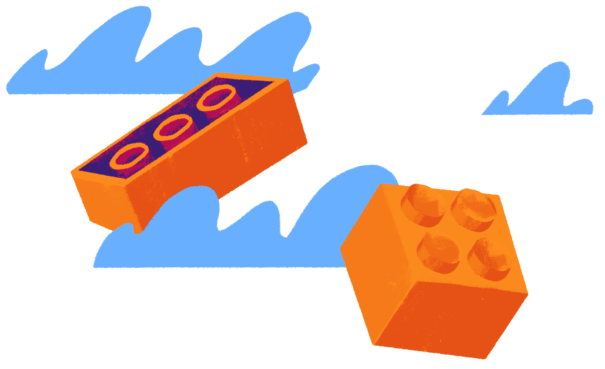
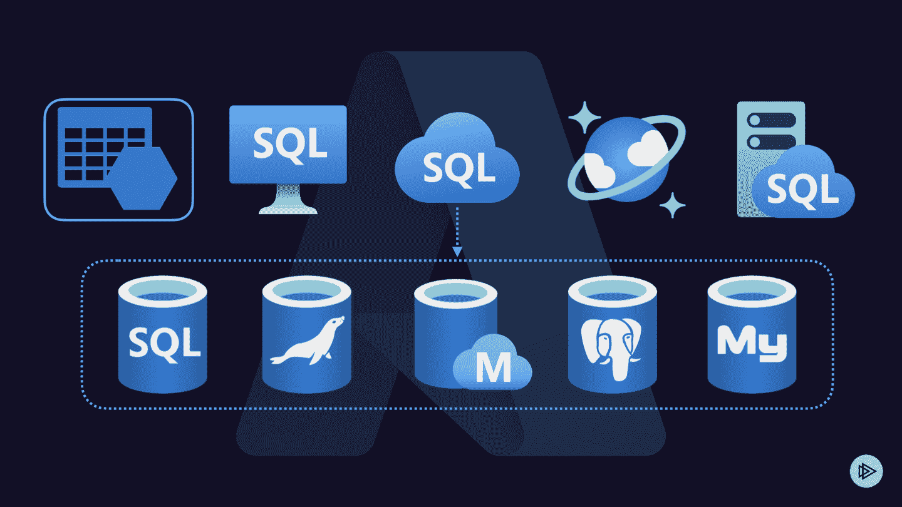

# 云转型、云应用，还有……乐高？

> 原文：<https://acloudguru.com/blog/engineering/cloud-transformation-apps-azure-lego>

将应用程序迁移到云中时，考虑到云转型，有时会让人不知所措。就像一套复杂的乐高玩具，有时解决它的最好方法是分别看每个组件，然后把它们组合在一起，正如本文所解释的。

## 小砖造大船…

我记得小时候一个独特的圣诞节早晨。我想要这个宇宙飞船乐高套装，我可能会也可能不会拿到包装好的盒子，试着确定里面装的是不是真的。早上我兴奋地上床睡觉，希望我是对的。

我是！

那是巨大的冰冻星球飞船，光彩夺目。我兴奋地打开盒子，然后停顿了一下…那是很多件。所以我拿出了说明书。那…有很多页。

我的一位父母看了看说明书，注意到说明书把飞船分解成了五个部件。他们告诉我一次只拿一个组件，所以我照做了。在宇宙飞船的所有五个部件完成后，很容易看出它们是如何组合成一个整体的。

## …云也是如此

当将应用程序迁移到云时，尤其是考虑到云转型时，很难知道从哪里开始。不要把应用程序看作一个整体，而是把它分解成各个组成部分，并将云转换的概念应用到每个组件中。就像巨大的乐高宇宙飞船一样，我们知道所有的部件都在一起。

这并不是说我们不需要考虑整个架构(我们需要),但是我们可以在探索整体的同时，在组件级别探索我们的选择。复杂的应用程序会使这变得更具挑战性，但是用于简单应用程序迁移的原则甚至可以应用于复杂的应用程序。

使用我们的乐高类比，这些组件中的每一个都可以在云转型替代方案中一次解决一个。在某种程度上，需要根据您的业务需求独立评估每一项。在某些情况下，出于业务原因，您的组件迁移将涉及较少的转换，对于其他组件，您可能最终会完全重新考虑其操作。

## 使用 Azure 进行基于组件的思考的例子

让我们快速看一下一个数据库。下面是 Azure 提供的几种不同类型的数据库服务，但不是全部。这些服务都以不同的方式处理数据库技术。

我们可能会决定从一种技术直接迁移到云中的相同技术(为了简单起见)。我们可能还有其他原因，例如我们的数据库工程师可能不需要立即接受再培训。好的，太好了！如果这些业务原因使这个决定成为优先事项，那么它会告诉我们如何看待我们的下一个组件。

我们需要确保我们为 API 和前端选择的任何东西都可以与我们的数据库决策一起工作。这就是我们在处理组件时如何保持整体的思路。我本可以用不同的方式建造我的宇宙飞船组件，但如果我这样做了，它可能不会在所有的太空荣耀中聚集在一起。

## 考虑将 Azure 应用程序迁移到云中？

如果您正在考虑将应用程序迁移到云，不要担心，我们的新课程[使用 Azure](https://acloudguru.com/course/move-an-application-to-the-cloud-with-azure) 将应用程序迁移到云是为您准备的！

我们希望你能看一看，这将有助于你开始。