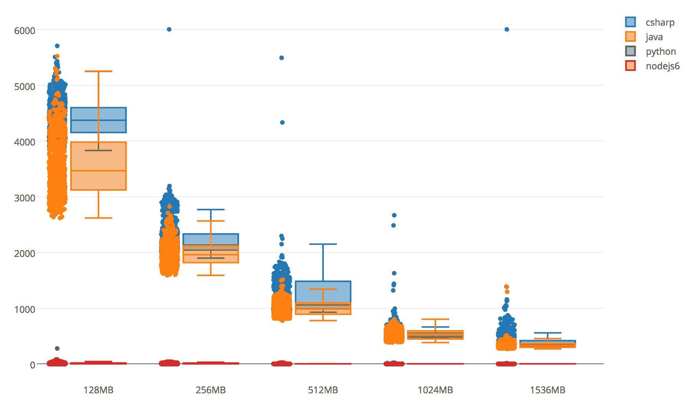
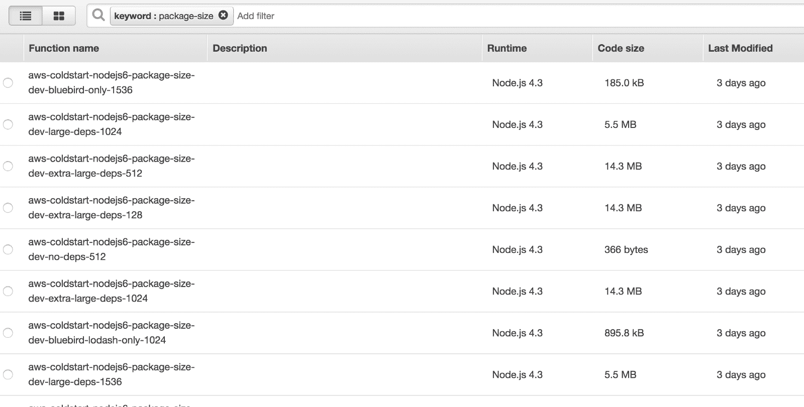
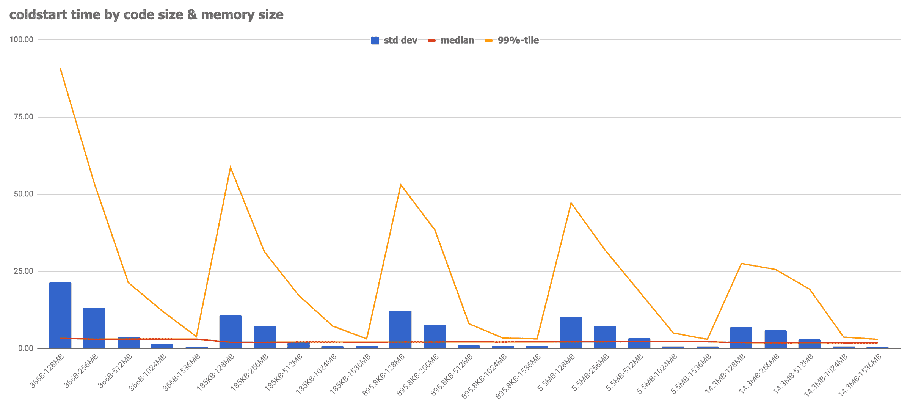

# 语言、内存、封装尺寸如何影响 AWS Lambda 的冷启动？

> 原文：<https://acloudguru.com/blog/engineering/does-coding-language-memory-or-package-size-affect-cold-starts-of-aws-lambda>

在最近的一篇博客中，我们研究了 AWS Lambda 本地支持的语言的运行时之间的性能差异。由于该实验对“热”功能的运行时间差异特别感兴趣，因此“冷启动”时间被有意省略。

> 当 AWS Lambda 函数在长时间不使用后被调用时，会发生冷启动，从而导致调用延迟增加。

由于 AWS Lambda 的[冷启动时间是一个重要的性能考虑因素，让我们仔细看看一些实验，这些实验旨在隔离可能影响首次函数调用的变量。](https://acloudguru.com/blog/engineering/how-long-does-aws-lambda-keep-your-idle-functions-around-before-a-cold-start)

#### 测试方法

根据我在生产环境中运行 Lambda 函数的经验，冷启动通常发生在 AWS Lambda 函数空闲超过五分钟的时候。最近，我的一些功能直到空闲 30 分钟后才经历冷启动。即使您保持您的功能温暖，当主机虚拟机被回收时，大约每 4 小时就会发生一次冷启动—只需通过 IO 管道检查一下[指标。](https://www.iopipe.com/2016/09/understanding-aws-lambda-coldstarts/)

出于测试目的，我需要一种可靠的方法来持续确保 AWS Lambda 函数的冷启动。创建冷启动的唯一可靠方法是在调用之前部署一个新版本的函数。

为了实验，我创建了 45 种 AWS Lambda 函数。使用下面的[无服务器](https://serverless.com/)框架设置，很容易用不同的内存大小创建相同功能的变体。

我递归地部署了所有 45 个函数，并使用下面的简单脚本以编程方式调用它们中的每一个。

部署和调用循环大约需要三分钟。为了收集大量有意义的数据点，我进行了超过 24 小时的实验。

#### 我最初的假设

我假设 CPU 资源的数量与分配给 AWS Lambda 函数的内存数量成正比。

1.  C#和 Java 会有更长的冷启动时间
2.  内存大小线性影响冷启动时间
3.  代码大小线性影响冷启动时间

现在是时候看看实验是否支持我的假设了。

#### 实验# 1——运行时间和内存的冷启动时间

为了评估内存对冷启动的影响，我创建了 20 个具有 5 个变量的函数——为每个语言运行时使用不同的内存大小。支持的语言有 C#、Java、Node.js 和 Python。

I created 5 variants of the same hello world function (using different memory sizes) for each language runtime

在进行了 24 小时多一点的实验后，我收集了以下数据——以下是结果:

**观察:C#和 Java 的冷启动时间要高得多**

最明显的趋势是，静态类型语言(C#和 Java)的冷启动时间**比**高 100 多倍。这显然支持了我们的假设，尽管支持的程度比我原先预期的要大得多。

Feel free play around with the interactive plot.ly chart [here](https://web.archive.org/web/20190405210043/https://plot.ly/~theburningmonk/2/csharp-java-python-nodejs6/)

**观察:Python 的冷启动时间低得离谱**

我对 Python 运行时的冷启动体验如此之少感到惊喜。好吧，有一些异常数据点严重影响了一些 99%和标准偏差，但你不能否认在 128MB 函数的 95%处有 0.41 毫秒的冷启动时间。

**观察:内存大小线性改善冷启动时间**

分配给函数的内存越多，冷启动时间就越短，标准偏差就越小。这在 C#和 Java 运行时中最为明显，因为基线(128MB)的冷启动时间对两者都非常重要。

到目前为止，第一次实验的数据支持了最初的假设。

#### 实验# 2——按代码大小和内存划分的冷启动时间

为了评估存储器和封装大小对冷启动的影响，我用不同的代码和存储器大小创建了 25 个函数。Node.js 是这个实验的常量语言。

以下是这次实验的结果:

**观察:内存大小线性改善冷启动时间**

与第一个实验一样，存储器大小以大致线性的方式改善了冷启动时间和标准偏差。

**观察#2:代码大小改善了冷启动时间**

有趣的是，部署包*的大小不会*增加冷启动时间。我会假设更大的包会相当于更多的时间来下载&解压。相反，更大的部署包似乎对减少整体冷启动时间有积极的影响。

为了看看行为是否一致，我希望其他人使用不同的语言运行时来重复这个实验。用于这些实验的源代码可以在[这里](https://github.com/theburningmonk/lambda-coldstart-comparison)找到，包括用于计算统计数据和生成[图的脚本。](https://plot.ly/)

[**the burningmonk/Lambda-cold start-comparison**—
*Lambda-cold start-comparison——比较使用多种语言运行时的 AWS Lambda 函数的冷启动时间*—github.com](https://github.com/theburningmonk/lambda-coldstart-comparison)

#### 结论

以下是我从这些实验中学到的一些东西:

*   闲置大约 5 分钟后，功能不再被回收，这使得冷启动远没有以前那么糟糕
*   内存大小线性改善冷启动时间
*   C#和 Java 运行时的冷启动时间是 Python 的 100 倍左右，而且标准偏差也高得多
*   您应该考虑使用比 Node.js/Python 函数更高的内存分配来运行 C#/Java Lambda 函数
*   较大的部署包大小不会增加冷启动时间

**更新 04/07/2017** :我贴了一个后续实验，想知道 Lambda 在回收闲置函数之前，会把它们保留多长时间。

* * *

## 获得更好职业所需的技能。

掌握现代技术技能，获得认证，提升您的职业生涯。无论您是新手还是经验丰富的专业人士，您都可以通过实践来学习，并在 ACG 的帮助下推进您的云计算职业生涯。

* * *