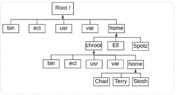

# 容器技术的历史

> 原文：<https://acloudguru.com/blog/engineering/history-of-container-technology>

作为“成为新的没关系”系列的一部分，我这周做了很多关于容器的研究。我的目标是为任何人奠定基础，无论其技术背景如何，都能够开始使用和学习容器——无论是 LXC、Docker 还是下一个大型容器技术。

就我个人而言，我通过故事学习得最好，为了应对新的事物，我必须在头脑中发展故事；我不仅想了解我们在学习过程中的位置，还想了解我们是如何到达这里的。所以我开始拼凑容器技术的历史，我发现要完全理解它，我们需要追溯到比你想象的更远的地方。*我们需要回到 20 世纪 60 年代虚拟化的早期。*

**虚拟化的发展**

在 60 年代，电脑是一种稀有商品。光是租一个月就要花费 1000 多美元，这让许多企业望尘莫及。从这个角度来看，1960 年的 1000 美元与 2018 年的 8385 美元具有相同的购买力。

他们说需要是发明之母，计算机的历史也不例外。最早的计算机通常专用于可能需要几天甚至几周才能运行的特定任务，这就是为什么在 20 世纪 60 年代和 70 年代，我们看到了虚拟化的发展。许多用户同时共享计算机资源的需求推动了这一发展。

随着集中式计算机的诞生，我们开始看到我们现在称之为虚拟化的最初迹象。

在整个 20 世纪 60 年代的 T2，多个计算机终端被连接到一个主机上，这使得计算可以在一个中心位置完成。集中的计算机使得从一个地方控制所有的处理成为可能，所以如果一个终端坏了，用户可以简单地去另一个终端，在那里登录，仍然可以访问他们所有的文件。 然而，这确实有一些弊端。例如，如果用户使中央计算机崩溃，系统将对所有人关闭。诸如此类的问题表明，计算机不仅需要能够区分个体，还需要能够区分系统进程。

在 **1979** 中，随着`chroot`(更改根)命令的开发，我们朝着创建共享但隔离的环境又迈进了一步。`chroot`命令使得改变正在运行的进程及其所有子进程的根目录成为可能。这使得将系统进程隔离到它们自己独立的文件系统中成为可能，这样测试就可以在不影响全局系统环境的情况下进行。1982 年 3 月，比尔·乔伊在第 7 版 Unix 中添加了`chroot`命令。

为了理解容器，我们可以稍微向前跳到 20 世纪 90 年代，当时计算机安全和网络研究员 Bill Cheswick 正致力于理解一个黑客如果被允许访问他的系统会如何利用他们的时间。对于不熟悉 *cracker* 这个词的人来说，它是用来指出于恶意原因闯入计算机系统的人。现在你可能在想，“等等……那不是黑客吗？”但是在安全世界里，单词 *黑客* 通常被用来定义识别安全漏洞以便修复而不是利用它们的人。虽然这种差异可能需要自己的博客帖子，但现在，我将使用术语*cracker*，因为这是切斯维克在他的论文《与伯弗德共度的一个晚上，一个 Cracker 被引诱、忍受和研究》中使用的术语在这项研究中，Cheswick 建立了一个环境，允许他分析破解者的击键，以便跟踪破解者并学习他们的技术。他的解决方案是使用一个`chrooted`环境并对其进行修改。他的研究成果就是我们现在所知的 Linux `jail`命令。

2000 年**3 月 4 日**，FreeBSD 在其操作系统中引入了`jail`命令。尽管它类似于`chroot`命令，但它也包含了额外的进程沙箱特性，用于隔离文件系统、用户、网络等。FreeBSD `jail`让我们能够分配 IP 地址，配置定制软件安装，并对每个监狱进行修改。这并不是没有问题，因为监狱里的应用程序在功能上是有限的。

在 **2004** 上，我们看到了 Solaris containers 的发布，它通过使用 Solaris Zones 创建了完整的应用程序环境。使用区域，您可以为应用程序提供完整的用户、进程和文件系统空间，以及对系统硬件的访问。但是，应用程序只能看到自己区域内的内容。2006 年**月，谷歌的工程师宣布他们推出了用于隔离和限制进程资源使用的进程容器。在 2007 年，这些流程容器被重命名为** ***控制组* (cgroups)以避免与 *容器* 混淆。**

**I n **2008** ，cgroups 被合并到 Linux 内核 2.6.24 中，这导致了我们现在所知的 LXC 项目的创建。LXC 代表**L**inu**x****C**containers，通过允许多个隔离的 Linux 环境(容器)在共享的 Linux 内核上运行，提供操作系统级别的虚拟化。每个容器都有自己的进程和网络空间。**

**在 **2013** 中，谷歌通过开源他们的容器栈再次改变了容器，成为一个名为 *让我来为你包含那个* (LMCTFY)的项目。使用 LMCTFY，应用程序可以被编写成容器感知的，因此，可以被编程来创建和管理它们自己的子容器。2015 年，当谷歌决定将 LMCTFY 背后的核心概念贡献给 Docker 项目*lib container*时，LMCTFY 的工作就停止了。**

****Docker 的崛起** Docker 于 2013 年作为开源项目发布。Docker 提供了打包容器的能力，这样它们就可以从一个环境转移到另一个环境。Docker 最初依赖于 LXC 技术，但在 2014 年，LXC 被 libcontainer 取代，这使得容器能够与 Linux 名称空间、libcontainer 控制组、功能、AppArmor 安全配置文件、网络接口和防火墙规则一起工作。Docker 通过包括全球和本地容器注册中心、restful API 和 CLI 客户机继续为社区做出贡献。后来，Docker 实现了一个名为 Docker Swarm 的容器集群管理系统。**

* * *

***如何更好地监控您的码头集装箱？Prometheus 能够轻松展示各种系统和基础设施的指标。使用 [Prometheus 进行码头](https://acloudguru.com/hands-on-labs/docker-container-monitoring-with-prometheus)集装箱监控。***

* * *

**虽然我们可以通过深入 Docker Swarm、Kubernetes 和 Apache Mesos 来进入容器集群管理，但对于[新系列](https://wpengine.linuxacademy.com/linuxacademy-com/its-okay-to-be-new/)，Docker 将是我们的停留点。**