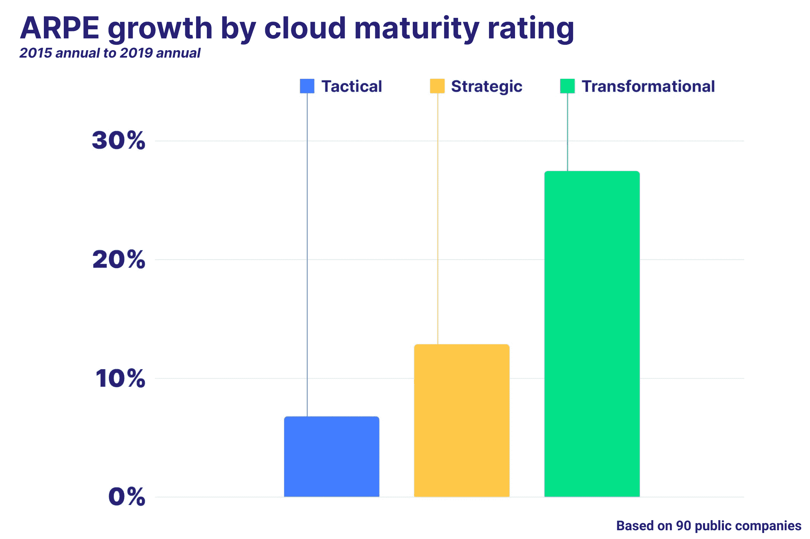
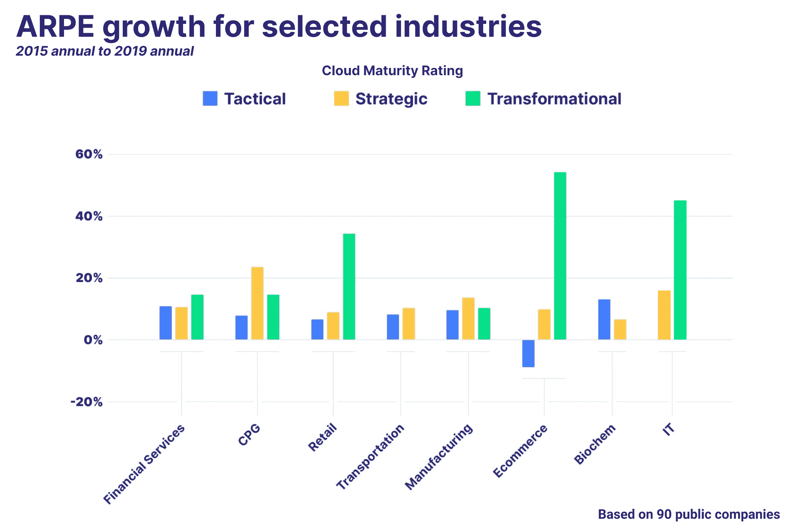

# 云如何帮助您成长

> 原文：<https://acloudguru.com/blog/business/how-the-cloud-helps-you-grow>

*对十几个行业的 90 多家上市和私营公司及其对云的承诺的样本分析* *展示了云技能的价值*

云计算让新一代创业公司脱颖而出，成长为世界上最有价值的公司。没有云计算，可能就不会有 Airbnb、优步或 Pinterest。然而，云并不仅仅是 2007 年或更晚开始的科技创业公司的专利。

数百家以传统的内部数据中心起家的公司正在将其运营转移到云上。他们能够以许多可测量(和不可测量)的方式认识到价值。这些可以表现为更低的运营成本、更快的运营节奏，或者在升级或采购新软件时总体上更少的麻烦。然而，衡量这一投资回报历来都很棘手。

在云专家那里，我们通过实践来学习。所以我们决定试一试。

* * *

[**云 ROI:云技能如何产生真实回报**](https://get.acloudguru.com/how-the-cloud-helps-you-grow)

下载完整的云投资回报报告，了解公司在云技能和技术上的投资获得了多少价值。

* * *

我们从 20 个维度对众多行业中的 90 多家上市公司和私营公司的样本集进行了评级，以确定他们向云的过渡和承诺。

这些衡量标准包括公开职位描述中对云技能的要求、特定于云的角色、公共评论和公告、案例研究、新闻、关键领导经验以及一些直接表明采用云的积极影响的财务指标。

从那时起，公司被置于云之旅的三个“生命阶段”:

*   **战术阶段:**该公司从基础设施或人才层面对云的采用进行了专项投资。
*   **战略阶段:**该公司对云做出了公开、公开的承诺，为收回投资带来了实实在在的后果(社会和财务)。
*   **转型阶段**:公司对云的过渡或永久使用是实质性的，有据可查，并有可衡量的结果。

为了确定采用云技术的真正影响，我们研究了公司每名员工产生的收入以及它们的市值如何随着时间的推移而变化。在我们深入研究之前，这里有一些重要的发现:

*   **每一家被调查的公司都要求与云相关的技能**。这些可能会实施到私有云，但我们调查的每家公司都在寻找至少 5 种独特的云技能。最重要的是…
*   每个公司都在寻找集装箱和 Kubernetes 专家！认真。我们审查的每个人都有一个公开的 rec，要求 Docker、Kubernetes 或 containers 方面的专业知识。
*   **并不是每个人都在招聘特定于云的职位**。对于许多更大、更老的公司来说，这些云技能要求被纳入更大团队的一部分。这并不一定意味着他们不关注云，只是该公司的组织方式是一种集成式运营。
*   超过一半的公司在工作描述中寻找 NoSQL 经验。像 DynamoDB 和 CosmosDB 这样的 NoSQL 数据库可以帮助您快速扩展应用程序——这显然是传统公司希望做的事情。
*   **不是每个人都是多云的(…还不是)。**超过一半的公司都有公开的工作需求，要求只在一个云平台上工作。(通常是 AWS)
*   大多数云公司雇佣经过云认证的专业人员。该分析中包括的几乎每家公司都有至少 24 名云认证团队成员。这些认证包括 Azure、Google Cloud 和 AWS——但还有许多其他认证领域的专家。
*   **大多数公司都在去那里的路上**。除了两家公司(我们未作判断)之外，其他所有公司都已公开宣布与云提供商合作，或已公开讨论了他们的混合云战略。

我们研究了两个关键指标:基于 2015 年至 2019 年年度业绩的每位员工平均收入的变化，以及 2016 年 1 月 1 日至 2020 年 1 月 1 日的市值变化。我们没有将 2020 年包括在我们的分析中，因为特殊情况通常会抑制许多行业的收入和市值的全面增长。

我们纳入了十几家明显转型的公司，作为“控制”组来帮助校准我们的评分等级。我们的总体尺寸包括:

*   **员工和工作**:有多少员工获得了认证，他们在工作描述中寻找的特定于云的技能的数量，以及副总裁或更高级管理人员的云专业知识水平。
*   **公开文档**:公司对其云转型的公开程度，包括推出的云专属产品数量、战略投资、案例研究、收购以及与云提供商的合作关系(包括 IBM、AWS、GCP、阿里云和微软 Azure)。
*   **云采用水平**:公司是否至少拥有混合云运营，是否建立了专门负责云工具和业务运营的团队和角色(例如云卓越中心或聘用首席云官)。
*   **财务表现**:在适用的情况下，如果在成本、运营利润方面有显著和有记录的改善，并且如果在收益电话会议和声明中经常提到云投资作为核心战略。

每个维度都对公司的云采用阶段的总体得分有影响，财务上可衡量的结果(如运营利润的提高)比软衡量指标(如赞助和技能要求)更重要。

说完这些，让我们来看看结果吧！

## 美元进，美元出

Net net，我们发现这些公司的总体平均每位员工收入随着他们的云之旅越走越远而提高。

尽管可能存在差异，但从具体行业来看，这一趋势通常是一致的。然而，在我们的分析中，有一些行业在员工平均收入的变化上表现出相当大的差异，例如消费品和制造业。

这可能意味着一些公司比其他公司更快地体验到云迁移的好处。零售公司(以及作为延伸的电子商务)可能会通过将大部分业务转移到云上来提高效率。然而，实物商品的制造商可能会看到早期投资的快速回报，并需要更长的时间才能看到其他行业的实质性投资回报。

在我们对交通运输和生命科学/生物化学公司的分析中，我们没有发现处于转型阶段的公司——这可能是由于它们受到高度监管的性质以及由此产生的惯性。对于生命科学公司来说，这可能表现为云技术的沉重实施成本(可能包括实施复杂的机器学习模型)。

尽管如此，这些选定的行业(我们在底部提供了行业选择的总分类)只是整体情况的一部分——作为一个整体，我们发现性能普遍提高。

## 滚雷

股票市场并不那么理性。这有点像梦幻足球遇到了经济，但对我们集体理智的影响要比萨昆·巴克利缺席这个赛季大得多。话虽如此，它仍然是衡量经济健康状况和特定公司健康状况的一个指标，通常是最受关注的指标之一。

在我们的分析中，我们观察了从 2016 年 1 月 4 日到 2020 年 1 月 7 日，公司在每个生命阶段的市值变化。这一时期是市场异常增长的时期，也是全面过渡到云成熟的时期。我们将此与 2016 年 1 月 4 日至 2020 年 1 月 7 日公司股价的中值涨幅进行了比较，以说明标准普尔 500 的极端头重脚轻性质(其中 [5 家公司现在占该指数的 18%](https://fortune.com/2020/02/11/s-and-p-500-stocks-microsoft-apple-amazon-google-facebook/) )。

我们发现，转型阶段和战略阶段的总体市值增长实际上相差不远，而转型阶段的公司比战术阶段的公司领先 15 个百分点以上。

为了解开这一点，我们必须进入一点市场水晶球逻辑:你的市值通常是某个神奇的数字乘以你下一年的收入，再加上一些变化，这取决于事情有多好(和/或有多坏)。所述幻数因行业而异。

正如我们之前提到的，市场不一定表现得理性。但市场喜欢的一件事是增长——以及未来的潜力。

一家公司的股票价格和市值通常反映了其未来的盈利潜力。随着公司采用云技术，他们发现效率和增长的机会越来越多——许多公司今天就开始了这一过渡期。

## 溜之大吉

为了更好地说明这一点，我们来看看我们分析中最好的例子之一:Splunk。以下是展示 Splunk 如何达到转型阶段的一些关键信号(这是一个清单):

*   Splunk 成立于 2003 年，最初是一个搜索公司数据的内部解决方案。它拥有适用于 Windows 和其他平台的桌面应用——当时甚至还在与原始设备制造商合作！作为一个参考点(它的文字取消软件标志作为吉祥物)始于 1999 年，开启了云革命。
*   **Splunk 在 2012 年推出了 Splunk 云，开始向云进军。** Splunk 已经开始与亚马逊网络服务合作，并于 2016 年宣布了首次公开合作。Splunk 今年早些时候宣布了与谷歌云的合作，并且也在 Azure marketplace 上工作。(检查公共合作伙伴关系和特定于云的产品发布。)
*   **Splunk 高管层的多名成员拥有丰富的云产品经验。**此外，数百名 Splunk 工程师获得了云认证(在 AWS、Azure 或 Google Cloud 中), Splunk 有大量针对云特定角色的公开推荐，要求十多种云特定技能。(查看人才部分)
*   **它在 2019 年拿出了 11 亿美元的收购支票簿，收购了 signal FX——一个用于基础设施、微服务和应用程序的** **云监控平台。**它还投资了专注于云的初创公司，包括 Insight Engines 和 Aclima。(核对投资)。
*   Splunk 对其转型也相当公开。除了发布自己的思想领导力，Splunk 还接受了多个媒体采访，介绍其云转型(不包括其收益报告的内容)。
*   投资会有真正的回报。你可以看到，这体现在营业利润率和员工人均收入的提高，当然还有市值超过 200%的增长。

虽然 Splunk 已经进入转型阶段，但其云转型非常成功，远远超过了市值的典型增长。这是一个很好的例子，因为它是一个明显转型的公司，而且你在云上投资得越多，你就会看到越多的投资回报(在这种情况下是股东价值)。

## 云中派对

因此，正如我们所看到的，你把钱投入到云中，你通常会从中获利。每个公司和每个团队的回报都是不同的。在四年内，你每个员工的收入*可能不会*增加 25%。同样，这只是一组公司样本，并不包括许多不同行业的所有公司。

我们还可以看到，公司可能认识到在不同的时间表上将运营过渡到公共云(甚至混合云)的好处。例如，一家电子商务公司将其应用程序升级并转移到 IaaS 上，可能会在页面停止崩溃时看到即时回报，从而失去客户。与此同时，制造企业(尤其是老牌企业)可能会发现，他们不得不及早投资——或者他们只是在更早的阶段开始通过转移业务来实现价值。

虽然各行业之间存在一些差异，但在云运营投资方面，我们最终会看到一个净“阶梯”效应。信号可能因公司而异(而且，很明显，它们非常不同)——但总体而言，当你表现出明显的承诺时，你会看到非常真实的回报。

## 方法学

一位云专家评估了 90 多家标准普尔 500 上市公司，以评估不同行业的云成熟度。这些行业包括包装消费品、金融服务、制造、IT、零售、运输、媒体以及其他行业。在这项分析中，我们排除了标准普尔 500 的许多顶级公司，包括脸书、微软、苹果、谷歌和亚马逊。

具体来说，我们研究了 7 个类别共 20 个维度，我们认为这些维度定义了对云的承诺和投资。每个维度都有一个最高分，公司所处的阶段对应一个特定的分数等级。通过建立基线控制组(显然已经投资和部署了云技术)、审查公共数据和其他因素的混合来选择支架。

这些维度按重要性递增的顺序排列(因此信号更强，得分更高):

**云在开放或传统职位描述中的存在:**我们审查了开放和传统已关闭职位的简历，以了解具体的云技能、表明云专属角色的职位以及平台体验要求。我们还审查了这些工作、现有工作描述或员工工作描述是否表明在云专属产品团队工作。

**云专属产品发布会:**我们回顾了最近的产品发布会，以了解该公司是否专门针对云技术发布了新产品，而不是简单地将其堆栈迁移到云平台上。

**投资**:我们审查了所有记录在案的公司投资和收购，以确定他们是否投资了专注于云的公司。具体来说，我们寻找至少两个以云为重点的公司投资，以及多达 3 个以云为重点的公司收购(或高达 2.5 亿美元的收购价格)。

**云过渡状态**:最后，我们考察了该公司是否承诺与最多三家主要公共云提供商建立公共合作伙伴关系，以至少建立混合云。这些提供商包括阿里巴巴、亚马逊网络服务、微软 Azure、谷歌云平台、IBM 云或甲骨文公共云。

**公开演讲和思想领导力**:我们回顾了公开发表的关于公司云转型的评论材料。具体来说，我们调查了他们是否参加过会议，做过主题演讲，或者接受过关于他们的云战略的公共媒体采访。

**部署云卓越中心(CCoE)** :我们查看了工作描述、角色描述和其他公开发布的数据，以了解与云相关的卓越中心，如 CCoE、卓越数据中心等。

**财务状况**:我们查看了收益报告、SEC 文件和其他文件，以了解高管团队是否表示他们专注于云技术。我们还审查了任何可用的云开支，以及运营利润是否因云实施而有所提高。

在我们的分析中，我们的总体行业细分如下(一些公司涉及多个行业):

“其他”类别包括 F&B、媒体、酒店、物流、农业和其他，以及我们的控制组。