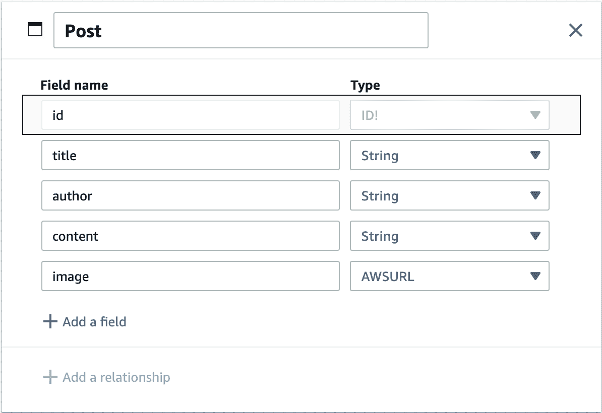
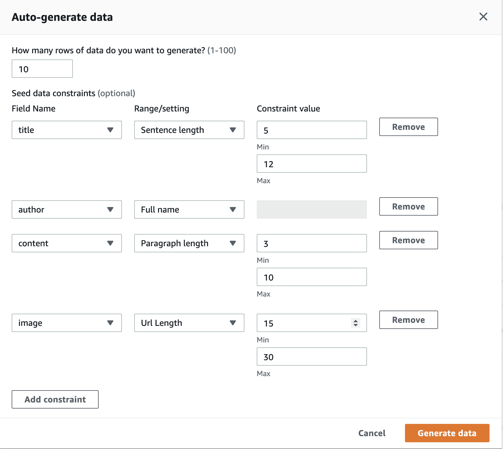
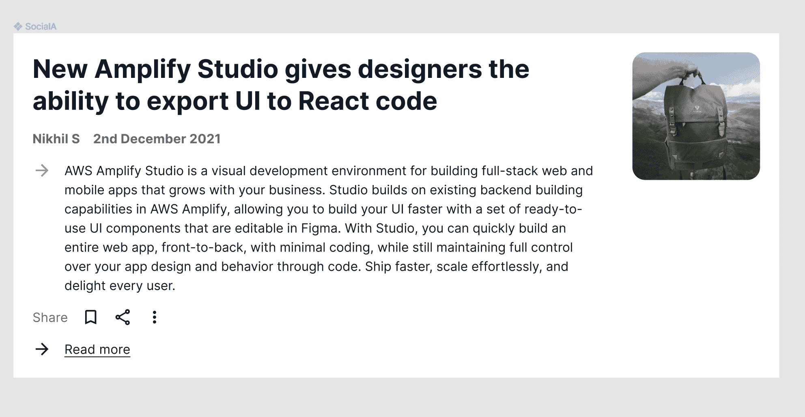

# 如何使用 AWS Amplify Studio 创建全栈应用

> 原文：<https://acloudguru.com/blog/engineering/how-to-create-a-full-stack-app-with-aws-amplify-studio>

使用新的 [AWS Amplify Studio](https://acloudguru.com/blog/engineering/aws-just-dropped-a-game-changer-for-startups-small-business) ，您可以在几分钟内将 Figma 中的设计变成像素级完美的云连接 React 组件。在本教程中，我将带您从头开始学习如何使用 Studio 创建博客应用程序。

* * *

## 加速您的职业发展

[从 ACG 开始](https://acloudguru.com/pricing)通过 AWS、Microsoft Azure、Google Cloud 等领域的课程和实际动手实验室改变你的职业生涯。

* * *

## 创建应用后端

首先，我们需要为我们的应用程序创建一个后端。你可以前往 [Amplify 沙盒](https://sandbox.amplifyapp.com/)开始。

从这里开始，选择用“反应”建立一个“空白”。

然后点击“开始”。


Build a “Blank” with “React”

在数据建模页面上，我们将创建一个包含“标题”、“作者”、“图像”和“内容”字段的 Post 模型。

我将把“图像”类型改为“AWSUrl”。

然后点击“部署到 AWS”。

请注意，您可以在没有 AWS 帐户的情况下，通过单击“下一步:在您的应用程序中本地测试”来在您的应用程序中本地测试数据。为了简洁起见，我将跳过该选项。



Post model with fields filled out

登录您的 AWS 帐户或创建一个新帐户来部署您的应用程序。然后为您的应用程序选择 AWS 区域和名称。

部署需要几分钟时间，但是之后您的数据模型将会在云中运行。在引擎盖下，Amplify 使用 AWS AppSync 和 Amazon DynamoDB 来构建这个数据模型。

一旦你的应用程序部署，点击“启动工作室”。

然后是“管理 app 内容”。

你可以填写一个表格来创建一些博客文章。您还可以使用种子数据功能来自动生成一些初始数据。

我将单击“自动生成种子数据”，然后创建 10 行数据。我将添加一些约束，这样我的作者是一个“全名”，我的标题是 5 到 12 个单词长，我的帖子是 3 到 10 个段落，我的图像将有一个 URL 长度。



Seed data constraints

你可能想把图片的网址换成真正的图片。我推荐使用 [Unsplash](https://unsplash.com/) 来找到它们。从图片中选择图像 URL，然后在数据模型的`image`字段中使用该链接。


Use an image from Unsplash in your data model

## 用户界面

好了，现在我们有了一个应用后端，让我们考虑一下我们的用户界面。

使用 Amplify Studio，您可以从 UI 设计工具 Figma 导入组件。(请注意，UI 库功能目前处于预览模式，我们希望听到您在使用它时的任何反馈。)

Amplify 有一个与 Amplify UI 库相对应的 [starter UI 文件](https://www.figma.com/community/file/1047600760128127424)可以使用。继续复制 UI 文件，然后您可以对组件进行任何您想要的样式更改。切换到“我的组件”选项卡进行更改。我将在`SocialA`组件上加粗日期和作者姓名。



Bolded text on SocialA card

然后，我将转到`UI Library (Preview)`选项卡，然后单击“开始”。

粘贴到你的 Figma 文件的链接，然后点击“继续”。


Sync your Figma file

然后，您将能够在 Studio 中查看您的 UI 组件！我将单击“Accept all”从 Figma 导入我的所有组件。

## 将数据链接到 UI 组件

现在我们有了数据和 UI 组件，让我们把两者连接起来！

我将在 Studio 中选择`SocialA`组件，然后单击`Configure`。

然后添加一个组件属性。我称它为`post`，然后将`type`设置为`Post`。

然后，我将选择我想要更新的组件部分，并选择我想要将它链接到的数据。首先，我将选择卡片上的标题，然后选择`label`属性并将其设置为`post.title`。

我将段落设置为`post.content`，图像设置为`post.image`，日期设置为`post.createdAt`，名称设置为`post.author`。你可以点击“混洗预览数据”来查看不同的数据插入到您的组件！

## 创建收藏

我们不是一次只呈现一篇博文，而是要呈现一个列表。

让我们创建一个博客帖子集。在右上角点击“创建收藏”，然后为您的收藏选择一个名称。我将我的命名为“后收集”。

然后，您可以更改收藏的对齐方式。我会保留我的一个列表，但在每张卡之间添加 4px。请注意，并不是我所有的帖子都有图片，因为我保留了原始的种子数据！

您还可以通过点击数据集旁边的“查看/编辑”来修改显示哪些数据。然后您可以排序或过滤您的数据，以便只显示您想要显示的记录！在现实世界的博客中，您可能想要草稿和已发布的帖子——您可以使用它来仅显示已发布的帖子！

## 添加到您的应用程序

现在我们需要将它添加到我们的应用程序中！首先，创建一个 React 应用程序:

```
npx create-react-app amplify-studio-blog
cd amplify-studio-blog
```

然后，在 Amplify Studio 页面的右上角，点击“本地设置说明”链接。会有一个带你 app ID 的`amplify pull`命令。

继续运行该命令。你会在浏览器中得到一个弹出窗口，在提示时登录到 Studio，或者按“接受”。然后回答 CLI 中的问题，您应该能够接受大多数问题的默认值。

然后，安装 Amplify React 组件和放大器库:

```
npm install @aws-amplify/ui-react aws-amplify
```

在文本编辑器中打开项目。您会注意到生成了`/amplify`目录以及`/src/models`和`/src/ui-components`。`ui-components`拥有你所有的 React 代码！你可以看看这些文件，它们是真实的，人类可读的代码。

让我们的应用程序呈现我们的博客文章。首先，通过将以下代码添加到您的`index.js`文件，将您的前端连接到您的 Amplify 应用程序。

```
import config from './aws-exports'
import Amplify from 'aws-amplify'

Amplify.configure(config)
```

然后，清除 App.js 组件。首先，添加 Amplify CSS 文件。然后导入`AmplifyProvider`组件和您的`PostCollection`:

```
import '@aws-amplify/ui-react/styles.css'
import { AmplifyProvider } from '@aws-amplify/ui-react'

import PostCollection from './ui-components/PostCollection'
```

`AmplifyProvider`将把放大样式传递给它的所有子组件。

然后，使用`AmplifyProvider`组件，和您的`PostCollection`！

```
function App() {
  return (
    <AmplifyProvider>
      <BlogCollection />
    </AmplifyProvider>
  )
}

export default App
```

你的文章应该呈现在页面上。请注意，默认情况下，Amplify UI 不会加载字体，所以您可以将它添加到您的`index.css`中，以使字体正常工作。

```
@import url('https://fonts.googleapis.com/css2?family=Inter:slnt,wght@-10..0,100..900&display=swap');
```

您可以将道具传递给组件，以便对其进行修改。例如，如果您想在集合中添加分页，可以执行以下操作:

```
<PostCollection isPaginated itemsPerPage={5} />
```

现在，每页将显示 5 个项目！你可以在这里阅读所有选项[。](https://ui.docs.amplify.aws/components/collection)

您可能还想覆盖发送到其中一个子组件的道具，您也可以这样做！如果您打开组件文件，例如`src/ui-components/PostCollection.jsx`，您会注意到每个组件都有一个`getOverrideProps`。每一个都传递了两个参数，`overrides`和一个密钥。您可以使用该键来覆盖单个组件的属性。让我们把每张`SocialA`卡片上的“阅读更多”链接变成一个可以链接到文章的`a`标签。

我将首先查看`PostCollection`中的`SocialA`组件实例。我去拿它的超驰钥匙。

```
<PostCollection overrides={{
    "Collection.SocialA[0]": {

    }
}}/>
```

我们想要一个`SocialA`组件的子组件，所以我们现在打开它。会有一个`Text`组件在文件底部呈现“Read more”。

我们将创建第二个覆盖对象，然后将我们想要传递的属性传递给组件。例如，`as`标签使其成为一个链接和一个`href`。为了完全实现这一点，您需要使用 React 的路由库。

```
<PostCollection overrides={{
  "Collection.SocialA[0]": {
    overrides: {
      "Flex.Flex[1].Text[0]": {
        "as": 'a',
        "href": "https://console.aws.amazon.com"
      }
    }
  }
}}/>
```

这里有更多关于 Amplify 中覆盖的信息。

## 添加身份验证

现在，让我们向我们的应用程序添加一个身份验证流。回到 Amplify Studio，点击“设置”下的“认证”。

我将使用这里的默认值，然后进行部署。您可以配置不同的机制、密码设置和属性！

一旦部署了身份验证，重新运行`amplify pull`命令将您的更改加载到您的本地应用程序中。

然后，我们将使用`withAuthenticator`高阶组件向我们的应用程序添加 auth。

添加导入:

```
import { AmplifyProvider, withAuthenticator } from '@aws-amplify/ui-react'
```

然后，将您的应用程序导出包装在组件中:

```
export default withAuthenticator(App)
```

如果你打开你的应用程序，你将有一个完整的登录和注册流程！您可以在此了解关于认证组件[的更多信息。](https://ui.docs.amplify.aws/components/authenticator)

## 主题化你的用户界面

您可能希望向您的 UI 添加一个主题，以便向您的 UI 组件添加品牌颜色或其他自定义。

您可以使用 [Amplify Figma 主题编辑器](https://www.figma.com/community/plugin/1040722185526429545/AWS-Amplify-Theme-Editor)来更改 Figma 组件的调色板。您还可以通过 CSS、设计令牌或 JavaScript 对象在代码中使用 [UI 组件主题化](https://ui.docs.amplify.aws/theming)。

## 更新组件

您可能希望在某个时候更改组件的设计。在这种情况下，您可以在 Figma 中更改它们，然后在 Studio UI 库中单击“与 Figma 同步”。您将能够预览您的更改，然后运行`amplify pull`以便在您的本地应用程序中获得设计更改！

## 结论

除了 Amplify Studio，还可以添加 [Amplify 前端托管](https://docs.aws.amazon.com/amplify/latest/userguide/getting-started.html)、 [Amplify CLI 生成的资源](https://docs.amplify.aws/cli/)比如函数或者预测等等。查看[文档](https://docs.amplify.aws/)继续学习！

前往 [Amplify Sandbox](https://sandbox.amplifyapp.com/) 创建自己的应用程序。我很想看看你做的东西。如果你有任何反馈，欢迎[给我](https://twitter.com/aspittel)、[加入我们的不和谐](https://discord.gg/amplify)，或者在 GitHub 上留言[。](https://github.com/aws-amplify/amplify-adminui)

### 关于作者

*[阿里](https://twitter.com/ASpittel)教人编码。她喜欢 Python，JavaScript，喜欢谈论编程。她从 es6 课之前就开始写 React 了。她领导 AWS Amplify 的开发者宣传。*