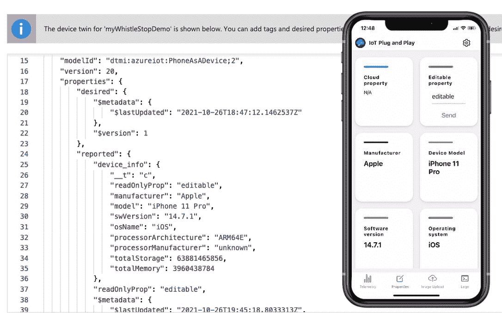
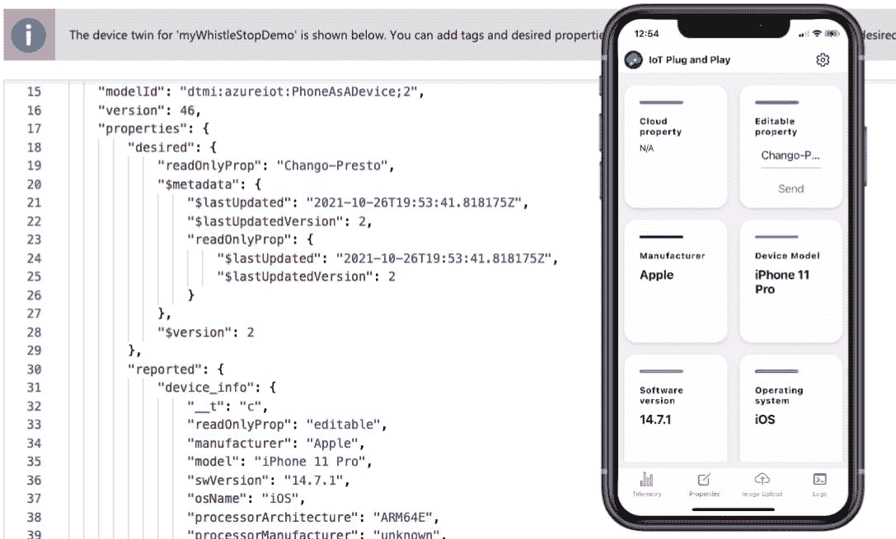
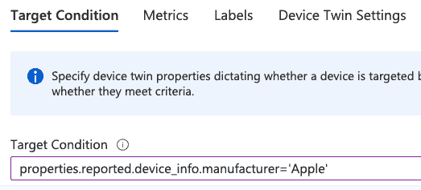
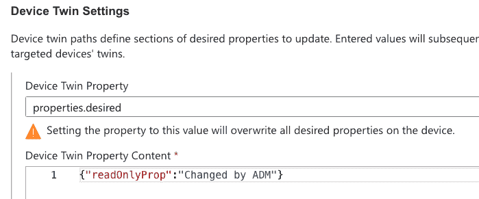

# 如何使用手机测试 Azure 物联网解决方案

> 原文：<https://acloudguru.com/blog/engineering/how-to-use-your-phone-to-test-azure-iot-solutions>

在这篇文章中，我们将讨论如何使用您的手机来测试 Azure IoT Hub PaaS 解决方案功能，包括遥测路由、twin 更新和直接方法执行、自动设备管理(ADM)以及通过设备供应服务(DPS)的自动供应。请继续阅读！

* * *

**加速您的云计算职业生涯**

云专家让你轻松(也很棒)提升你的云事业——即使你对技术完全陌生。查看 [ACG 目前的免费课程](https://acloudguru.com/blog/news/whats-free-at-acg)或[立即开始](https://acloudguru.com/pricing)免费试用。

* * *

### 当这一切走到一起…

你还记得你第一次在一列火车的最后一条轨道上抓拍，看着火车头开始它的第一圈吗？或者可能是你第一次走出练习室，与其他 50 位音乐家合奏？如何看待你第一次成为三名球员中的一员完成完美的双人包夹？即使是拼板游戏的最后一部分也是非常令人满意的。

当这一切汇集在一起，这是一个神奇的时刻。您可以在物联网(IoT)项目的早期体验这种魔力。

代码或 web 界面中的模拟设备都很好，但没有什么比将物理设备握在手中，看着它连接并向云中的物联网解决方案发送遥测数据更好的了。你的智能手机和 Azure 物联网中心可以交付货物。

微软提供了描述如何将手机连接到 Azure IoT Central 的文档和教程，Azure IoT Central 是微软的物联网 SaaS 选项。然而，这感觉有点像产品演示，而不是真正的开发工具。这是有用武之地的，但是*物联网即插即用*应用为物联网开发者提供了更多。

继续阅读，我们将探索如何在您的手机上设置和使用此应用程序来测试 Azure 物联网中心 PaaS 解决方案功能，包括:

*   遥测路由
*   双重更新和直接方法执行
*   自动设备管理
*   通过设备配置服务(DPS)实现自动配置

出于这些测试场景的目的，我假设您知道如何围绕我选择用于测试的各种特性构建解决方案。如果你没有，这是我宣传我的课程和相关实验室的机会:[AZ-220-微软认证:Azure 物联网开发人员专业](https://acloudguru.com/course/az-220-microsoft-certified-azure-iot-developer-specialty)，在这里你可以学习如何使用这些功能，作为准备 AZ-220 [Azure 认证考试](https://acloudguru.com/blog/engineering/which-azure-certification-is-right-for-me)的一部分。

### 在手机上设置*物联网即插即用*并测试遥测路由

在测试更高级的解决方案之前，你需要在你的 [IOS](https://apps.apple.com/us/app/iot-plug-and-play/id1563783687) 或 [Android](https://play.google.com/store/apps/details?id=com.iot_pnp&hl=en_US&gl=US) 移动设备上安装*物联网即插即用*，并通过简单连接到你的 Azure 物联网中心来熟悉它的功能。

您应该在非生产环境中执行这些测试。

请注意，我对 hub 资源的说明都在 Azure 门户中，但是您可以使用 Azure CLI 或自定义代码来执行您的测试。

#### 在 Azure IoT Hub 中设置路线和设备

1.  如果您还没有为测试设置中心，请使用 Azure 门户或 Azure CLI 设置一个基本中心，保留大多数默认设置。选择自由层或 S1 标准层(默认)，含一个单位。不要选择基本层，因为它不允许您执行所有的测试。
2.  在 hub 中，有一个带有 Azure 存储队列端点的路由。确保启用了集线器回退路由。
3.  使用对称密钥认证(默认)将设备添加到集线器，并保留所有其他默认设置。
4.  复制设备的主连接*字符串*(不是连接*键*)，然后通过电子邮件或空投到你的手机上。(是的，我知道对称密钥认证不是生产的最佳实践，用电子邮件发送密钥更是一个糟糕的主意。您应该在非生产环境中完成所有这些工作，并在完成后拆除测试资源。)

#### 将设备安装并连接到集线器

1.  在手机应用商店中，找到并安装*物联网即插即用*。如果提示，让它广泛访问您的电话上的其他功能，以启用大多数遥测和其他功能。
2.  当你第一次打开应用程序时，你应该在一个欢迎屏幕上。如果没有，点击右上角的*设置*“cog”图标，选择*注册*。
3.  我们不会使用二维码，但会在出现提示时选择*扫描二维码和*。
4.  在扫描窗口下方，选择“手动连接”
5.  在“您希望如何连接？”，选择*物联网集线器设备连接字符串*。粘贴您复制到手机的连接字符串。
6.  选择*连接*并等待几秒钟。
7.  你的物联网设备将连接到集线器，并开始以加速度计和陀螺仪(运动探测器)、磁力计的形式发送遥测数据，从而为你提供方向或数字指南针、气压计读数、地理位置，甚至电池电量。电池电量显示遥测数据可以以传感器读数的形式出现，但也可以是关于设备状态的数据。
8.  导航到您在物联网中心路线上设置的存储帐户队列，以验证数据正从您的设备流向您的目标。神奇！
9.  在其余的测试中，保持设备与集线器的连接。根据您的手机配置，您可能需要在某些时候重新连接。对称密钥已保存，因此您不需要再次执行该设置。

### 测试 Twin 更新和直接方法执行

*物联网即插即用*设备模拟器包括双更新和直接方法执行的处理程序，如更改交付间隔或打开手机手电筒。

#### 执行设备双更新

1.  将您的设备/手机连接到 hub，导航到 hub 上的设备详细信息，然后选择 *Device Twin* 以访问 twin JSON *。*查看“报告”属性的“设备信息”部分。请注意，“readOnlyProp”属性的值为“editable”，这有点令人困惑。只需忽略属性如何命名；这是您可以用来双向测试 twin 更新的属性:来自 hub 后端的所需属性和来自设备的报告属性。
2.  在你的设备/手机上选择屏幕底部的*属性*，将“可编辑属性”编辑成你想要的任何字符串，然后选择*发送*。我改成了“这是我编辑的。”

3.  回到 hub 中的设备 twin，刷新 twin。在设备信息下，值仍然显示为“可编辑”，因为这是连接时的配置。但是在那下面，你可以看到只读提示，现在说，“我编辑了这个。”或者你用的任何字符串。魔法。
4.  让我们去另一个方向。在 twin JSON 中，在 desired properties 下，在“$version”属性后添加一个逗号，并添加(或从报告的属性中复制粘贴)“readOnlyProp”键值对。将该值更改为其他值。我用了"变戏法"
5.  将更改保存在设备 twin 上。注意，系统可能会“美化”您的 JSON，甚至在您刚刚添加的属性周围移动。
6.  不要眨眼。当您回到设备/电话上时，设备上的 editable 属性可能已经改变，以反映来自 hub 的设备 twin 更改。

7.  回到 hub，刷新设备 twin，您将看到报告的属性现在与设备同步。魔法。

#### 执行直接方法

1.  将您的设备/电话连接到集线器后，导航到集线器上的设备详细信息并选择*直接方式。*
2.  在*方法名称*下输入“lightOn”
3.  在有效负载中输入:

`{duration: 3,`
`delay: null,`
`pulses: 2`

4.  选择面板左上角的*调用方法*，查看你的手机。不要直视正在闪烁的灯光。这可能会破坏魔法——就一点点。

### 测试自动设备管理(ADM)

这不是自动设备管理的教程，所以我假设您知道设置 ADM 配置的基础知识。这个测试非常类似于 twin updates 测试。

1.在您的 ADM 配置中，通过选择“报告”属性下的“设备信息”属性之一来定位您的电话/设备。我选择了“制造商”键值对。如果您使用的是 Android 手机，显然需要使用现有的键值对。

2.在配置中，添加所需的属性“readOnlyProp ”,并为其分配一个字符串。我选了，“被 ADM 改了。”

3.保存您的配置并导航至设备 twin。你应该马上在你的设备中看到新的属性。没有就刷新。

4.在 Azure IoT 中，报告的属性由设备更新。如果在您导航到 twin 时，设备已经连接并应用了 ADM 配置，则报告的属性也可能已经更改。如果没有，请检查您的电话/设备属性，以查看“可编辑属性”更改为“由 ADM 更改”。然后，刷新中心中的 twin，直到您看到报告的属性更改。你的心还能承受更多的魔法吗？让我们来了解一下；还有一个测试。

### 通过设备配置服务(DPS)测试自动配置

这不是针对 DPS 的教程，所以我假设您知道在 DPS 中设置注册的基础知识。

1.  在 hub 中，设置设备供应服务(DPS)的实例，并确保您的测试物联网 hub 链接到 DPS。
2.  添加注册组，将对称密钥用于证明机制。个人注册也很好，但是我使用了注册组进行说明。
3.  从注册组详细信息中复制主密钥，并通过电子邮件或空运将其发送到您的手机。我将重复我前面说过的话:我知道对称密钥认证不是生产的最佳实践，用电子邮件发送密钥更是一个糟糕的主意。您应该在非生产环境中完成所有这些工作，并在完成后拆除测试资源。
4.  从 DPS *概述*部分，收集 *ID 范围*并通过电子邮件或空投或任何对你有效的方式将其传输到你的手机上。
5.  在您的设备/手机上，选择右上角的*设置*“cog ”,并选择*注册*返回注册详情。清除“物联网集线器设备连接字符串”并切换到“注册组信息”选项。
6.  输入设备 ID。它可以是您想要的任何字符串，只要确保它不同于您之前在直接连接到集线器时测试的设备名称/ID。
7.  粘贴从 DPS 元数据收集的 ID 范围字符串，对于 SAS 键，粘贴从注册组复制的主键。
8.  选择*连接*。这将比之前的连接时间稍长，因为设备首先向 DPS 注册，然后 DPS 在中心设备注册表中自动配置设备。
9.  一旦看到遥测流动，检查 DPS 注册组，查看您的“新”装置是否是注册组的成员。然后导航到集线器，并在*设备*下检查，以查看您的设备已在该集线器上自动配置。一次测试，双倍魔力。我们应该在领先的时候退出。

### 拆除您的测试资源

不要忘记清理您的测试环境。要快速防范使用那些讨厌的对称密钥的意外或恶意连接，请删除中心中的设备注册，并删除您创建的注册组(或单个注册)。更好的办法是，删除 hub 和 DPS 以实现全面覆盖。卸载*物联网即插即用*应用程序以确保万无一失。你看到了重新安装它是多么容易。

## 了解有关物联网和 Azure 的更多信息

有关*物联网即插即用*应用的更多功能的更多信息，如文件上传和日志记录，请在这里查看微软文档: [Azure 物联网手机应用](https://docs.microsoft.com/en-us/azure/iot-fundamentals/iot-phone-app-how-to)。如果你想了解更多关于如何在 Azure 中构建物联网解决方案的信息，请查看我的课程，[AZ-220-微软认证:Azure 物联网开发者专业](https://acloudguru.com/course/az-220-microsoft-certified-azure-iot-developer-specialty)。

* * *

[**观察:后 COVID DevOps:加速未来**](https://get.acloudguru.com/post-covid-devops-accelerating-future-webinar) COVID 如何影响——甚至加速——工程团队的 DevOps 最佳实践？[观看与 DevOps 领导者的免费点播](https://get.acloudguru.com/post-covid-devops-accelerating-future-webinar)小组讨论，我们将探索后 COVID 时代的 DevOps。