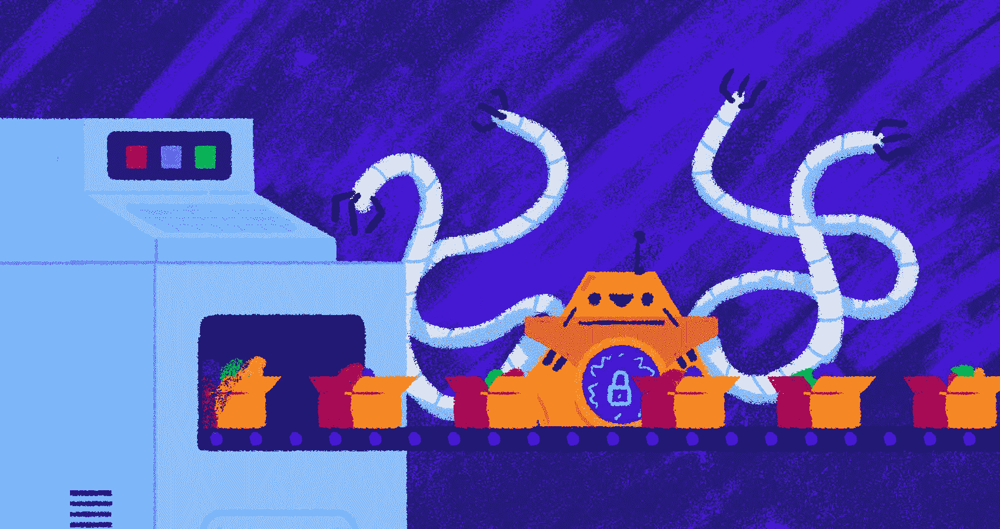
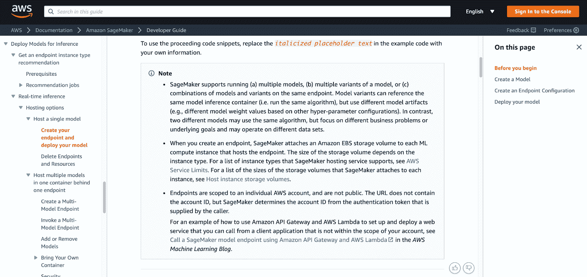

# 重新认证重新发布:AWS 认证机器学习-专业

> 原文：<https://acloudguru.com/blog/engineering/recertification-experience-aws-certified-machine-learning-specialty>

我不得不承认…在我[最近一次远程监考](https://acloudguru.com/blog/engineering/my-near-disaster-aws-solutions-architect-professional-recertification-experience)的灾难性经历之后，我特别紧张。事实上，我根本不应该在这里！我的机器学习之旅可能并不常见，但我发现，它似乎也不是那么独特。

你看，我不是“数学人”。这种对高等数学的困惑和沮丧是我最初进入计算机领域的原因。对我来说，在我的 Radio Shack TRS-80 彩色计算机 II 上快速编写几行基本代码比手动完成数学作业要“高效”得多。

*My homework machine* (aka the *Radio Shack TRS-80 Color Computer 2, pal version*. Author: [Bilby](https://commons.wikimedia.org/wiki/User:Bilby) | [image source](https://commons.wikimedia.org/wiki/File:TRS-80_Color_Computer_2_(PAL)_4x3.jpg))

在大学里，我的情况并没有改善。我两次没有通过微积分考试，这实际上改变了我职业生涯的轨迹。(我也没有通过 [FORTRAN](https://en.wikipedia.org/wiki/Fortran) ，不过那是以后的事了。)

尽管我在数学上有缺点，但作为一名技术专家，我还是能够相当成功地混日子。我一点也不知道，我的数学怪物会回来缠着我…

* * *

准备好开始你的 [AWS 机器学习之旅](https://acloudguru.com/learning-paths/aws-machine-learning)了吗？立即开始 [ACG 免费试用](https://acloudguru.com/pricing)，访问课程、测验、动手实验室和模拟考试，为自己的成功做好准备。

* * *

## 目录

* * *

## 我的背景

### 我掉进了 ML 兔子洞

我认为自己是专业学习者。我很好奇，总是希望挖掘新事物——尤其是那些似乎充满炒作和超出预期的领域。大约五年前，机器学习当然符合这种描述。

我必须知道这个间谍到底有什么能力。更重要的是，我能利用它的力量战胜股票市场吗？

像许多其他想学习新事物的人一样，我求助于我们仁慈的搜索引擎霸主谷歌。几乎立刻，我找到了大量针对机器学习初学者的课程，并选择了一门来试一试。嗯，课程开始十分钟后，老师开始说…是..微积分。我的宿敌！

事实上，我尝试的其他大多数所谓的“初学者”机器学习课程也有类似的主题。教师们认为他们的听众自然会像他们自己一样流畅地思考方程式和希腊符号。

(顺便说一句，在我进入教学和培训行业之前很久，这是我的重要一课。假设你的观众和你一样是一个非常危险的假设。)

这些教师过去和现在都是机器学习领域的佼佼者，拥有无懈可击的资历。但是不管我怎么努力，它对我来说就是没有意义。

### 加入异端

在我的两门机器学习课程中，在社交平台上，以及在我的演讲中，我直言不讳地表达了我的观点，即你不需要成为数学天才才能理解各种机器学习方法是如何工作的。一些人对这一观点提出了质疑。也许他们认为我是被点击诱饵或试图出售一些快速获得认证的计划。

没有什么比这更偏离事实了。事实上，如果我有很深的数学背景，我的学习曲线会短得多。

相反，我不得不更加努力地工作，深入挖掘隐喻、实际例子和解释，以理解那些数学专家可能轻易认为理所当然的事情。

多年来，我通过一次性教程、自学练习和埋头阅读关于该主题的学术水平论文，积累了足够多的机器学习知识。我当然不是机器学习的‘专家’；雇用我来设计一种新的深度神经网络方法，用于药物实验室试验 ***后果自负*** ！然而，我确实对各种机器学习方法和算法的工作原理有足够的了解，最重要的是，我对各种机器学习方法的实际限制有所了解。

* * *

## cert 考试

我第一次参加测试版的 AWS 认证机器学习考试是在 re:Invent 2018，在它首次发布后不久。在一片忙乱中，我毫无准备地、匆忙地、毫无信心地参加了考试。

当测试结束时，我收到了我的测试结果，并不惊讶我以 704 分(750 分及格)不及格。然而，那次经历让我对考试的内容和详细程度有了更好的理解。在复习了我的一些薄弱环节后，我在 2019 年 4 月再次参加了考试——这一次我感到更加自信和准备充分。

我轻松过关了。

一晃三年过去了，我再次来到这里，准备重新认证。

### 我的监考经历

出于对流程的熟悉，我选择 PSI 作为我的提供者和远程监督。在我的笔记本电脑由于某种原因未能利用充电线而险些出事之后，这次我不打算冒险了。硬连线 Mac Mini、硬连线键盘、硬连线鼠标和硬连线以太网电缆。一些 VLAN 和 QOS 在家用路由器上施了魔法，以确保充足的带宽。(粉红猪小妹没有得到任何 ***我的*** 考试带宽！)

我准备好了。放马过来。

PSI 考试的启动过程与我去年 10 月份的考试重新认证几乎相同。下载考试客户端后，它执行了硬件和互联网连接检查，很快，我就通过聊天受到了监考人的问候。我不得不在我的测试区周围和下面摇动我的网络摄像头，清楚地展示我的胳膊和耳朵，以确保我没有隐藏任何监听设备或小抄。监考老师很满意，然后让我参加考试。当你参加考试的时候，一些匿名的人看着你的想法可能有点令人毛骨悚然，但我很快就忘记了它，只是专注于我的任务。

### (第二次)险些发生的灾难

我可以确认确实有人在看这些视频，因为我曾经无意中激怒了监考老师。在电脑屏幕上阅读时，我习惯把下巴放在拳头上(这个姿势会让人想起 90 年代带有红色和蓝色激光背景的年鉴照片)。

*Proctored exams: they really are watching.*

显然，在我考试的某一点上，我的指关节稍微遮住了我的嘴…根据远程监考规则，这是不允许的。(也许担心的是，由于我的嘴被遮住了，我*可能一直在*向一个隐藏的录音设备讲述问题，并泄露机密的问题数据。)

在我改变休息时的思考位置后的几秒钟内，监考人在聊天窗口中出现，提醒我不要模糊我的嘴。当然，我服从了，继续我的考试。

*Am I just thinking or doing something nefarious? You decide.*

* * *

## 我的证书考试策略

参加限时考试时，时间管理总是很重要的(明显先生说)。你可以使用不同的技术，但是我的策略对我很有用。我总是计划至少通过三四次考试。让我们来分解一下:

### 第一遍

对于我的第一遍，我读了所有的问题和答案，然后标记我的最佳猜测。如果我对答案有把握，我会继续前进。如果我有一丁点儿的犹豫，我会把这个问题标记为将来的通行证。我的计划是用大约一半的剩余时间完成所有问题的第一遍。

(热门提示:对于 AWS 考试，我会一直回答问题，即使是猜测，因为不正确的猜测不会受到惩罚。)

### 第二遍和后续遍

完成第一遍后，我将返回标记的项目，更加仔细地重读问题和答案。

有时候，这种重读足以识别出我在第一轮中没有捕捉到的一些关键信息。而且，就像云散开露出蓝天一样，正确的答案会立刻出现在我的屏幕上。

在其他时候，我可能仍然是一片空白，所以我会把它标记出来，继续前进。随着我一遍又一遍地检查，标记的项目开始减少。使用这种多次通过的方法，我避免陷入早期出现的棘手问题中。

每次我重温一个标记过的问题，我都把它当成全新的来读，并有意把任何先入之见抛在脑后。这有助于我保持开放的心态，注意到我在之前的阅读中可能错过的东西。

我记得有一个问题，这个策略帮助了我。我下意识地在这个场景中插入了一个假设，导致我在两个答案之间犹豫不决。又过了两遍，我才注意到这个问题非常明显地消除了我的假设，这很容易给我留下一个似乎合理的答案。

* * *

## 我的准备

### 涵盖的一般领域

自从我上次在 2019 年参加考试以来，蓝图没有改变，我知道我会遇到大致相同类型的问题。请注意，考试涵盖的不仅仅是 Sagemaker。当然，SageMaker 的服务家族非常庞大，但是你也应该考虑邻近的服务，比如 AWS Glue、S3、Athena、VPCs 等等。(是的，机器学习考试中的 VPC…您不会被问到关于 VPC 中转网关路由的详细问题，但您可能会被问到如何确保 VPC 中 SageMaker 实例的安全性。同样，你也不会看到红移数据库设计问题，但是你要知道红移 ML 能提供什么功能。)

一般的 AWS 架构知识也会帮到你。如果您在成本和性能权衡方面很好地了解了 Lustre 何时使用 S3，何时使用 EFS，何时使用 FSx，那么您就能很好地回答有关数据存储和处理的问题。从概念上讲，部署 SageMaker 推理端点非常类似于使用普通 EC2 实例进行的负载平衡部署。金丝雀部署或蓝绿色部署与 SageMaker 和 map over 概念非常相关。

* * *

*Want to learn how to get started with machine learning for free? Look no further than our article on [SageMaker Studio Lab](https://acloudguru.com/blog/engineering/sagemaker-studio-lab-how-to-experiment-with-ml-for-free).*

* * *

### 使用模拟考试

有了这些更一般的东西，我用 ACG 平台上的模拟考试作为诊断。由于我没有每天和 SageMaker 一起工作，我已经忘记了一些事情，而模拟考试帮助我刷新了记忆。当然，我已经在题库中写了一些问题，所以我可以模糊地回忆起我脑海中的特定技巧或目标，但这仍然是一个很好的练习。

通过我的准备，当我遇到一个我有点模糊的概念或术语时，我会将其添加到一个列表中进行更深入的研究。毫不奇怪，总是给我带来最大麻烦的是统计学概念，如 L1/L2 正则化、softmax 以及归一化与标准化。我确保在那些项目上花费额外的时间。

### 让事情粘在一起

我不好意思承认这一点，但是混淆矩阵总是让我困惑。当我试图将真阴性、真阳性、假阴性和假阳性应用于一些问题描述时，我会混淆它们。当涉及到召回率、精确度和 F-1 分数的相关指标时，这就开始让我困惑了。

这一次，我决定一劳永逸地解决这个困惑。

我创作了一幅漫画。

只是将这些东西以视觉形式与一个相关的实际故事结合起来，最终帮助我记住了这个故事，这个故事涉及一个维生素分选工厂的机器人。也许有一天我会发行这部漫画作为学习工具…

* * *

*想了解 AWS 认证的前景吗？查看我们广受欢迎的 [AWS 认证指南](https://acloudguru.com/blog/engineering/which-aws-certification-should-i-take)，了解 AWS 证书的来龙去脉。*

我的建议

* * *

## 警惕“从业者的诅咒”

### 你可能会认为，在数据科学和机器学习领域拥有多年实际经验的人在这次考试中可能比新人更有优势，但在这里要谨慎。真实世界的经历让我们学到了所有你通常在正式培训项目中学不到的东西。作为一名从业者，你可能面临过挑战和问题，这些挑战和问题让你积累了经验和对各种情况的直觉认识。但是这种直觉有时在这样的认证考试中会成为劣势。

我们这些已经存在了一段时间的人会无意识地在基于我们经验的用例中建立某些假设。这些假设会影响我们理解考试问题的方式，并可能导致选择不正确的答案。不管你喜不喜欢，这些考题存在于文档的围墙花园里。你的经验越多，就越难把所有众所周知的“包袱”放在考试中心的门口。

注意 AWS 认为什么是重要的

### 注意 AWS 认为值得注意的地方。我发现 AWS 文档中突出显示为“注意”的区域是考试问题的沃土。你不需要记住这些东西，但是一定要在浏览文档时通读一遍。

不要担心新东西

*Example of a highlighted Note section in the documentation. These tend to hold important nuggets of information that AWS thinks you should know.*

### 几乎每周都有新的特性出现在 AWS ML 的保护伞下。但是不要为你的考试准备担心太多。根据 AWS，在参加认证考试之前，服务或产品通常必须在**至少六个月**内可用。如果出现了一些新的东西，这很可能是一个未评分的测试版问题。

弄脏你的手

*See! It’s right there in the official FAQs, so no need to stress about last week’s announcements.*

### 至少在目前的 rendition 中，机器学习考试没有任何动手的成分。但是加强你的学习的最好方法之一是实际做一些动手的事情。(我说的不仅仅是按 Shift-Enter 键跳过 Jupyter 笔记本！)

如果你需要一些灵感，可以考虑以下一些想法:

构建一些实际的模型，部署一些推理端点，并在其前面放置一个 API 网关。用 PostMan 打电话给它，看看你是否能让他们适当地回应。

*   创建第二个模型，并将其与第一个模型一起部署，这样它可以获得一部分请求。
*   在 ACG 图书馆进行一些关于机器学习的[动手实验室](https://learn.acloud.guru/labs)。
*   试试凯莎·威廉姆斯主持的[机器学习云专家挑战赛](https://acloudguru.com/blog/engineering/cloudguruchallenge-machine-learning-on-aws)。
*   使用 AWS 上开放数据的[注册表中的一些数据，通过 AWS Glue 进行索引，通过 Athena 进行查询，通过 QuickSight 进行可视化。](https://registry.opendata.aws/)
*   我最喜欢的是，通过训练一个 [AWS DeepRacer](https://learn.acloud.guru/series/deepracer) 模型来了解超参数的作用！
*   即使你没有很深的数学功底，你也可以理解机器学习，通过这个考试。我就是活生生的例子！

你还可以[在 YouTube 上订阅一位云专家](https://www.youtube.com/c/AcloudGuru/?sub_confirmation=1)的每周云新闻，就像我们在[脸书](https://www.facebook.com/acloudguru)上一样，在[推特](https://twitter.com/acloudguru)上关注我们，并在 [Discord](http://discord.gg/acloudguru) 上加入对话。

* * *

You can also [subscribe to A Cloud Guru](https://www.youtube.com/c/AcloudGuru/?sub_confirmation=1) on YouTube for weekly cloud news, like us on [Facebook](https://www.facebook.com/acloudguru), follow us on [Twitter](https://twitter.com/acloudguru), and join the conversation on [Discord](http://discord.gg/acloudguru).