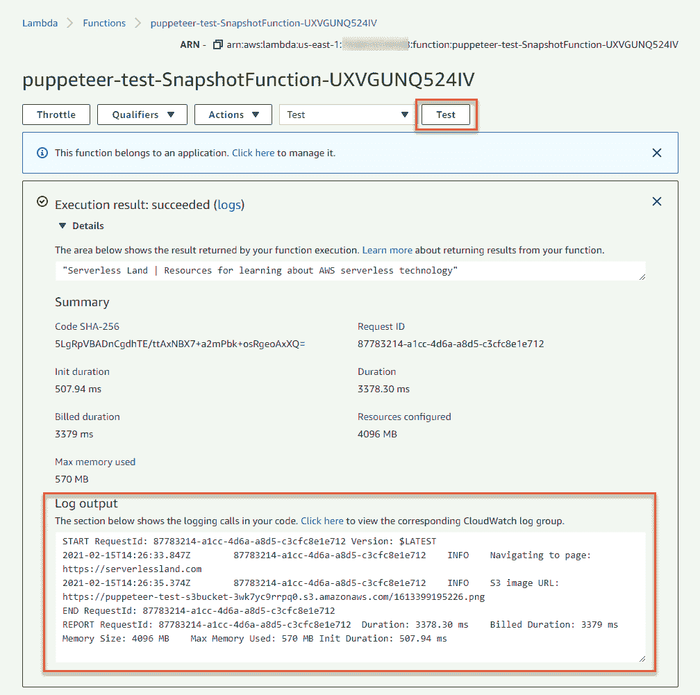
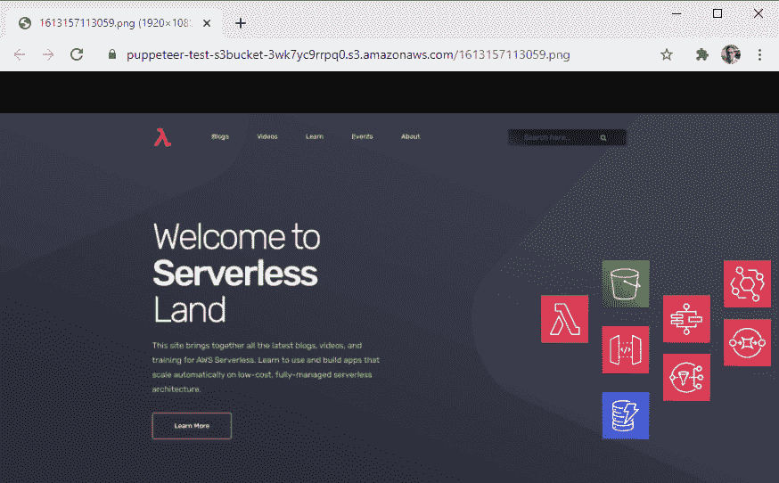
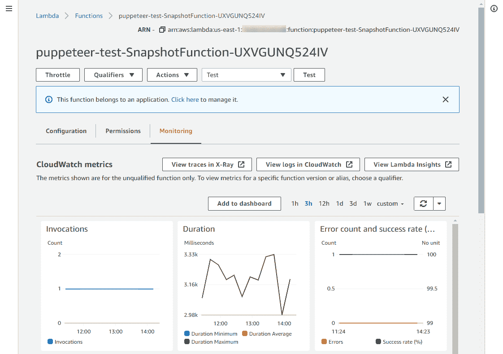
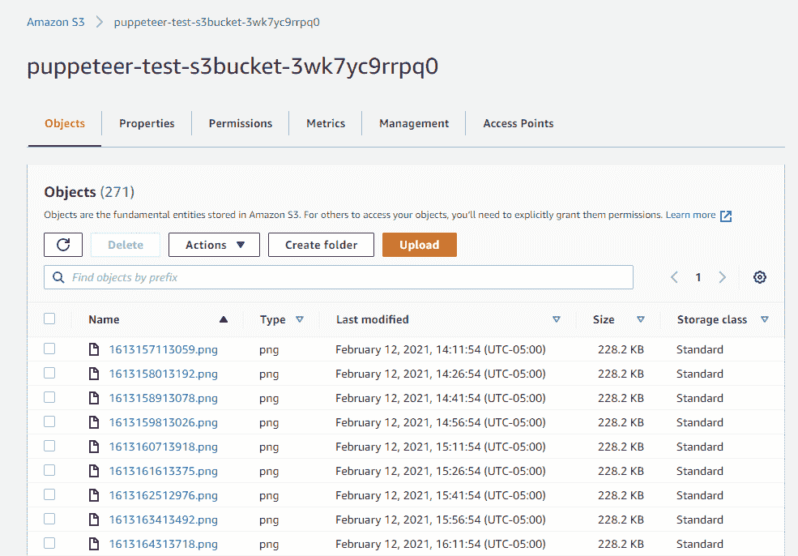

# 借助 AWS Lambda 和 Puppeteer 实现无服务器浏览器自动化

> 原文：<https://acloudguru.com/blog/engineering/serverless-browser-automation-with-aws-lambda-and-puppeteer>

使用 API 操作 web 浏览器环境为开发人员提供了广泛的自动化功能。它允许你生成 PDF 文件，截屏网页，或在网站上运行健康检查，所有这些都来自代码。它还可以让您自动提交表单、构建 UI 测试或诊断性能问题。无头 Chromium 是一个流行的以编程方式操作浏览器的包。无论您是对网站进行负载测试还是定期获取内容，都可以用最少的代码进行配置。

您可以在本地开发机器或远程服务器上运行无头浏览器。然而，许多典型的浏览器自动化任务非常适合 AWS Lambda。您可以将 Lambda 函数配置为按计划启动，或者响应某个事件。您还可以配置 Lambda 来扩展负载测试操作，使其成为管理大量实例的一种经济有效的替代方法。

在这篇博文中，我展示了如何将浏览器自动化任务部署到 Lambda。这个例子使用了 [AWS 无服务器应用模型](https://aws.amazon.com/serverless/sam/) (AWS SAM)来简化云资源的部署。你可以从配套的 [GitHub 库](https://github.com/aws-samples/scheduled-website-screenshot-app)下载这篇博文的代码。要部署到您的 AWS 帐户，请遵循[自述文件](https://github.com/aws-samples/scheduled-website-screenshot-app/blob/main/README.md)中的说明。

* * *

## 加速您的职业发展

[从 ACG 开始](https://acloudguru.com/pricing)通过 AWS、Microsoft Azure、Google Cloud 等领域的课程和实际动手实验室改变你的职业生涯。

* * *

## 概述:如何将浏览器自动化任务部署到 AWS Lambda

在示例应用程序中，每隔 15 分钟就调用一次 Lambda 函数来获取网页的屏幕截图，并将图像保存到 S3 桶中。架构看起来是这样的:


1.  一个 [Amazon EventBridge](https://aws.amazon.com/eventbridge/) 规则使用一个[调度表达式](https://docs.aws.amazon.com/eventbridge/latest/userguide/scheduled-events.html)调用 Lambda 函数。
2.  Lambda 函数使用 Chromium 来加载目标网页。一旦页面被加载并呈现，它就会截图。
3.  截图被保存到一个[亚马逊 S3](https://aws.amazon.com/s3/) 桶中。

## 代码如何工作

这个 Node.js 示例使用了一个名为[puppeter](https://github.com/puppeteer/puppeteer)的 npm 包，它公开了一个高级 API 来控制 Chromium 浏览器。[λ函数](https://github.com/aws-samples/scheduled-website-screenshot-app/blob/main/src/app.js)的一个片段展示了它是如何工作的:

```
browser = await chromium.puppeteer.launch({
     args: chromium.args,
     defaultViewport: chromium.defaultViewport,
     executablePath: await chromium.executablePath,
     headless: chromium.headless,
     ignoreHTTPSErrors: true,
});

let page = await browser.newPage()
await page.goto(pageURL)
const buffer = await page.screenshot()
```

这使用 JavaScript [async/await](https://developer.mozilla.org/en-US/docs/Learn/JavaScript/Asynchronous/Async_await) 语法来避免回调并使用顺序代码流。一旦定义了 browser 对象，代码就会指示 Chromium(通过 Puppeteer)获取网页。在页面被加载并且 [DOM](https://developer.mozilla.org/en-US/docs/Web/API/Document_Object_Model/Introduction) 被呈现在 headless Chromium 实例中之后，它将页面的截图存储在一个缓冲变量中。最后，图像被写入 S3 桶:

```
const s3result = await s3
   .upload({
      Bucket: process.env.S3_BUCKET,
      Key: `${Date.now()}.png`,
      Body: buffer,
      ContentType: 'image/png',
      ACL: 'public-read'
    })
    .promise()

console.log('S3 image URL:', s3result.Location) 
```

这使用了 JavaScript 的 [AWS SDK 中的](https://aws.amazon.com/sdk-for-javascript/) [S3 上传方法](https://docs.aws.amazon.com/AWSJavaScriptSDK/latest/AWS/S3.html#upload-property)。它定义 bucket 和 key，将内容类型设置为 PNG，然后配置访问控制列表(ACL ),以便公开查看该对象。最后，它记录存储对象的公共 URL。

## 为 Lambda 函数打包木偶

AWS Lambda 允许您将依赖项和代码打包成一个 zip 文件。部署包最大可达 [250 MB(解压缩)](https://docs.aws.amazon.com/lambda/latest/dg/gettingstarted-limits.html)或 50 MB(压缩，用于直接上传)。对于更大的包，建议您对 Lambda 函数使用[容器打包格式](https://acloudguru.com/blog/engineering/packaging-aws-lambda-functions-as-container-images)，它允许包达到 10 GB。

如果你使用像 AWS SAM 或[无服务器框架](https://www.serverless.com/)这样的工具，包会在你的开发机器上创建，然后压缩并上传到 Lambda 服务。在运行时，当函数运行时，这些文件在 Lambda 执行环境中被解压缩。这些工具可以简化打包过程，并有助于简化您的部署。

但是，当您使用包含二进制文件的依赖项时，您必须确保您打包的二进制文件版本与 Lambda 使用的操作系统兼容。Puppeteer 包包含一个捆绑到部署中的完整 Chromium 浏览器。由于浏览器依赖于二进制文件，npm 会安装与本地开发机器的操作系统相匹配的二进制文件。但是，Lambda 需要与其底层操作系统相匹配的二进制文件，也就是 Amazon Linux 2。

为了帮助解决这个问题，许多流行的软件包已经被社区转换成了λ层。每个 Lambda 函数最多可以定义五层，当您创建或更新函数时，这些层会被复制到您的部署包中。对于 Chromium，这使得在开发中运行一个二进制版本，在运行时使用另一个二进制版本变得更加容易。了解更多关于[创建和使用 Lambda 层](https://aws.amazon.com/blogs/compute/using-lambda-layers-to-simplify-your-development-process/)来简化你的开发过程。

## 使用社区维护的 Lambda 层

一名开发人员为 AWS Lambda 打包了一个 [Chromium 二进制文件，并将其发布到 GitHub。您可以在 Lambda 函数中使用 Puppeteer 安装它，方法是将库包含在 package.json 中。您也可以将两者与现有的公共 Lambda 层捆绑在一起。](https://github.com/alixaxel/chrome-aws-lambda)[这个 GitHub repo](https://github.com/shelfio/chrome-aws-lambda-layer) 经常发布新版本的 *chrome-aws-lambda* 包，你可以把它直接包含在你的 lambda 函数中。

图层仅在发布它们的 AWS 区域中可用。该公共回购的维护者已经将该层发布到 16 个地区，并在[自述文件](https://github.com/shelfio/chrome-aws-lambda-layer/blob/master/readme.md)中提供了层 ARNs。这些 ARNs 是公共的，你可以在任何 AWS 账户的这些区域中的任何 Lambda 函数中包含它们。

有许多流行的库被社区捆绑到 Lambda 层中。[这个 GitHub repo](https://github.com/mthenw/awesome-layers) 聚集了常用工具的层，如 GeoIP、MySQL、OpenSSL、Pandas、scikit-learn 和许多其他工具。要在兼容运行时的 Lambda 函数中使用这些，只需在支持的区域中包含 ARN 图层。

## 了解 AWS SAM 模板

本例中的 Lambda 函数可以直接在 AWS 管理控制台中定义。然而，通过使用 AWS SAM，您可以定义与代码相同的基础结构。这有助于快速创建可重复的部署，并减少因点击控制台而导致的人为错误。

[AWS SAM 模板](https://github.com/aws-samples/scheduled-website-screenshot-app/blob/main/template.yaml)定义了应用程序使用的所有 AW 资源。首先，它声明了一个 S3 桶:

```
  S3Bucket:
    Type: AWS::S3::Bucket  
```

接下来，模板定义了 Lambda 函数以及在哪里可以找到代码。因为它在函数中运行整个浏览器，所以内存被设置为 4096 MB。超时被配置为 15 秒，以确保如果目标网页没有响应，则该功能结束。

```
SnapshotFunction:
     Type: AWS::Serverless::Function
     Description: Invoked by EventBridge scheduled rule
     Properties:
       CodeUri: src/
       Handler: app.handler
       Runtime: nodejs12.x
       Timeout: 15
       MemorySize: 4096 
```

该模板包含对公开可用的 Chromium 层的引用，并在部署时替换区域代码。假设示例部署在图层可用的 16 个区域之一，则图层 ARN 有效:

```
Layers:
  - !Sub 'arn:aws:lambda:${AWS::Region}:764866452798:layer:chrome-aws-lambda:22'
```

环境变量用于设置目标网站 URL 并定义存储图像的桶名。最后，由于该函数只将数据写入 S3，因此它使用 AWS SAM [策略模板](https://docs.aws.amazon.com/serverless-application-model/latest/developerguide/serverless-policy-templates.html)为单个存储桶提供写权限。这遵循了最小特权的[原则:](https://docs.aws.amazon.com/IAM/latest/UserGuide/best-practices.html#grant-least-privilege)

```
Environment:
  Variables:
   TARGET_URL: 'https://serverlessland.com'
   S3_BUCKET: !Ref S3Bucket
 Policies:
   - S3WritePolicy:
       BucketName: !Ref S3Bucket 
```

Lambda 函数在响应事件时被调用。在这种情况下，该函数按定时间隔运行，由 EventBridge 管理。模板使用计划表达式将函数配置为每 15 分钟运行一次:

```
Events:
  CheckWebsiteScheduledEvent:
    Type: Schedule
    Properties:
      Schedule: rate(15 minutes) 
```

每当您对 Lambda 函数或该模板中的资源进行更改时，请再次运行 *sam deploy* 以将新版本部署到 AWS Cloud。AWS SAM CLI 检测版本之间的差异，并自动部署新代码和资源。

## 测试功能

部署示例应用程序后，导航到 [Lambda 控制台](https://console.aws.amazon.com/lambda/home)。打开 AWS SAM 部署的*快照功能*。该功能每 15 分钟自动调用一次，但是您可以通过选择*测试*来触发该功能:



*日志输出*包含生成并存储在 S3 桶中的图像的函数持续时间和公共 URL 的细节。在浏览器中导航到此 URL 以查看屏幕截图:



在部署该函数几个小时后，它被预定事件调用了多次。您可以使用 [Amazon CloudWatch](https://aws.amazon.com/cloudwatch/) 指标来监控它的性能。从 Lambda 函数中，选择 *Monitoring* 来查看调用次数、平均持续时间和任何错误:



从 [S3 控制台](https://s3.console.aws.amazon.com/s3/buckets/)，打开由 AWS SAM 部署创建的 S3 存储桶，查看由每个 Lambda 调用创建的带有日期戳的对象:



## 结论

以编程方式控制 web 浏览器使您能够用代码自动完成许多有用的任务。对于其中的许多问题，您可以使用 AWS Lambda 来最小化基础设施开销并简化伸缩。这篇博文展示了如何部署一个示例应用程序，该应用程序使用一个无头浏览器定期对网页进行截图。

对于带有特定于操作系统的二进制文件的常用库或包，Lambda 层有助于简化部署。许多库都有公开维护的层，您可以将它们包含在 Lambda 函数中。有了 AWS SAM 这样的基础设施作为编码工具，您可以在 YAML 一起定义您的代码和层，以帮助创建可重复的部署并加速开发。

如需更多无服务器学习资源，请访问[无服务器世界](https://serverlessland.com)并查看下面的无服务器对比。