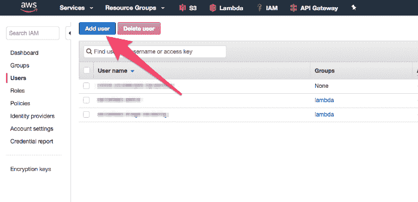

# 如何为按需图像处理构建无服务器应用程序

> 原文：<https://acloudguru.com/blog/engineering/serverless-image-optimization-and-delivery>

几个月来，我一直在探索 AWS Lambda 函数——我开始看到构建小型无服务器应用程序的巨大好处。

首先，你不需要服务器——很明显。创建服务器端应用程序的问题一直是维护部署和托管我的应用程序的服务器的成本，以及在等待有人与它们交互时支付闲置资源的成本。

当然，你可以在网络上找到像 Heroku 这样的免费 NodeJS 主机提供商——但你会面临帐户限制，无法真正部署数百个小微服务，也不会只对实际使用收费。

### AWS Lambda 前来救援

1.  你可以部署任意多的 Lambda 函数——而且基本上是免费使用 AWS 免费层帐户。
2.  您只需为您的功能的实际使用付费，而无需维护和支付整个服务器

另一个有趣的优势是速度。Lambda 函数的执行速度非常快，通常在 100 到 500 毫秒之间。

与使用 Docker 不同，您不必等待虚拟环境引导您的代码执行。使用 Lambda 函数真的就像让一台非常强大的服务器一直运行——但是没有成本。

有了 [AWS 免费层账户](https://aws.amazon.com/lambda/pricing/)，你每月可以获得 40 万秒的 Lambda 执行*完全免费*。基于每次 lambda 调用平均 500 毫秒，这意味着您可以每月完全免费调用您的函数 800，000 次。一点也不差。

## 使用 AWS Lambda image resize 创建无服务器应用程序

我需要创建一个 NodeJS 应用程序，负责向我的客户端应用程序交付图像。

该应用程序需要能够根据客户端的屏幕大小自动放大和缩小我的图像，这样我就可以避免创建和存储移动、平板和桌面版本所需的相同图像的多个变体。图像的质量和格式需要按需更改，也不需要存储所有不同的图像

这似乎是使用 AWS Lambda 函数的一个完美的[工作。](https://acloudguru.com/blog/engineering/running-webpack-on-aws-lambda)

## AWS S3 节点的设置

我的第一步是设置 NodeJS，这样我就可以在本地测试我的代码，而不必在每次想要验证更改时重新部署代码。首先，在本地机器上创建一个新文件夹来存放新项目。

```
$ mkdir serverless-image-rendering && cd $_
```

然后初始化一个新的 npm 项目，并按 enter 键接受默认值。

```
$ npm init
```

现在，我们将创建一个旧的 school Express 应用程序来监听您的本地端口 3000。因此，创建一个新的`app.js`文件，并将以下代码粘贴到其中:

```
const app = require('express')();
const bodyParser = require('body-parser');
const PORT = 3000;
app.use(bodyParser.json());
const displayStatus = () => ({
  status: `OK`, });
app.get('/status', (req, res) => {
  res.status(200).send(displayStatus());
});
const server = app.listen(PORT, () =>
  console.log('Listening on ' +
    `http://localhost:${server.address().port}`));
```

对于这个应用程序，我们需要 2 个 npm 包`Express`和`body-parser`。
这两个包只在本地测试你的应用时需要，所以我们将把它们安装在你的开发依赖项中——这将避免它们包含在你的 Lambda 函数中。

```
$ npm i -D express body-parser
```

我通常也会在我的机器上全局安装`nodemon`——它会监控任何文件变化，自动重启应用程序。

```
$ npm i -g nodemon
```

然后您可以引导您的本地服务器应用程序:

```
$ nodemon app.js
```

现在，您应该能够打开浏览器访问[http://localhost:3000/status](http://localhost:3000/status)，并且能够看到一条`"status": "OK"`消息。

## 如何获取你的图像从 S3 桶

我喜欢使用 S3 来存储所有的图像，并让该函数从 S3 桶中获取图像，以调整大小并交付给客户端应用程序。所以我将使用 AWS 创建一个 S3 桶，并将其命名为`images-bucket`。

然后，我将需要一个图像提取类来打开我的 S3 桶，找到我的目标图像，并将其返回到我的应用程序。为此，只需在一个`src`文件夹中创建一个`image-fetcher.js`，并将以下代码粘贴到其中:

```
const AWS = require('aws-sdk');
const getS3 = (s3, bucketName, fileName) =>
new Promise((res, rej) => {
  s3.getObject({
    Bucket: bucketName,
    Key: fileName
  }, 
  (err, data) => {
    if (err) {
      return rej(err);
    }
    const contentType = data.ContentType;
    const image = data.Body;
    return res({ image, contentType });
  });
});
class ImageFetcher {
  constructor(bucketName) {
    this.S3 = new AWS.S3();
    this.bucketName = bucketName;
  }
  fetchImage(fileName) {
    if (!fileName) {
      return Promise.reject('Filename not specified');
    }
  return Promise.resolve(
    getS3(this.S3, this.bucketName, fileName)));
  }
}
module.exports = ImageFetcher;
```

这个`ImageFetcher`类将试图读取存储在`bucketName`中的一个文件，如果找到的话就返回图像。

好了，现在我们可以设置我们的`app.js`文件来使用这个类来获取图像并将其发送到浏览器。所以，让我们创建一个`/fetch-image`端点！

```
// app.js
const ImageFetcher = require('./src/image-fetcher');
...
app.get('/fetch-image', (req, res) => {
  const imageFetcher = new ImageFetcher(process.env.BUCKET);
  const fileName = req.query && req.query.f;
  return imageFetcher
    .fetchImage(fileName)
    .then(data => {
      const img = new Buffer(data.image.buffer, 'base64');
      res.writeHead(200, {
        'Content-Type': data.contentType
      });
      res.end(img);
    })
    .catch(error => {
      console.error(error);
      res.status(400).send(error.message || error);
    });
});
```

现在你应该能够获取并显示之前创建的`images-bucket` S3 桶中的图像。

注意，我们将一个`process.env.BUCKET`变量传递到 ImageFetcher 构造函数中。这个变量是从您的系统环境变量中获取的——所以我们需要手动将这个变量传递给我们的应用程序。从现在开始，在我们的终端上，我们需要以这种方式启动我们的`app.js`文件:

```
$ BUCKET=images-bucket nodemon app.js
```

这将确保存在一个 BUCKET 环境变量，并将其设置为我们的 S3 bucket 名称。

现在，我们可以打开一个浏览器，连接到我们的新端点`[http://localhost:3000/fetch-image](http://localhost:3000/fetch-image)`,并将一个文件名作为查询字符串传递——尽管目前我们的 bucket 中没有任何图像。

手动上传一个名为`sample.jpg`的新图片到你的`images-bucket`中，并打开你的浏览器到`[http://localhost:3000/fetch-image?f=sample.jpg](http://localhost:3000/fetch-image?f=sample.jpg)`

屏幕上会出现一条错误消息。这是因为您目前可能没有读取 S3 存储桶的权限。

**创建一个 AWS 用户** 您需要在 AWS 中创建一个新的 IAM 用户，并配置您的本地机器使用这些凭证来访问您的 S3 桶。

首先，在`[https://console.aws.amazon.com/iam](https://console.aws.amazon.com/iam/home)`从您的 AWS IAM 仪表板创建一个新凭证



Click Users, then Create a new user

创建一个名为`serverless-image-rendering`的新用户，并确保选择了`Programmatic access`选项——这是 Lambda 在后面的步骤中所需要的。

创建并命名一个新组，并从列出的策略中选择“AdministratorAccess”。现在你所要做的就是在你的`~/.aws`文件夹下创建一个`credentials`文件，并使用以下格式将你的 IAM 信息粘贴到里面:

```
[serverless-image-rendering]
aws_access_key_id=YOUR_USER_ACCESS_KEY
aws_secret_access_key=YOUR_USER_SECRET
```

您可以使用终端通过以下命令设置您的本地首选项以使用该配置文件:

```
export AWS_PROFILE=serverless-image-rendering
```

现在你应该可以启动你的 NodeJS 应用程序，打开你的浏览器`[http://localhost:3000/fetch-image?f=sample.jpg](http://localhost:3000/fetch-image?f=sample.jpg)`，你将可以看到你的 S3 图像出现在你的屏幕上！

## 为 AWS Lambda 图像处理创建函数

我们的应用程序的核心部分是图像处理器，负责动态缩放和改变源图像的质量。

为此，我将使用[夏普](http://sharp.dimens.io/en/stable/)。实现非常简单——这是我在一个新的`src/image-resizer.js`文件中创建的类

```
class ImageResizer {
  constructor(Sharp) {
    this.sharp = Sharp;
  }

  resize(image, size, quality) {
    if (!image) throw new Error('An Image must be specified');
    if (!size) throw new Error('Image size must be specified');
    return new Promise((res, rej) => {
      this.sharp(new Buffer(image.buffer))
        .resize(size.w, size.h)
        .webp({quality: quality})
        .toBuffer()
        .then(data => {
          return res({
            image: data,
            contentType: 'image/webp',
          });
        })
        .catch(err => rej(err))
    });
  }
}
module.exports = ImageResizer;
```

`resize`方法将接收一个图像缓冲区、一个包含新图像的宽度和高度值的 size 对象以及一个质量属性。

首先，让我们在项目中安装 Sharp。

```
$ npm i -S sharp
```

接下来，让我们在 Express 应用程序中创建一个新的`resize-image`端点来使用 ImageResizer。

```
// app.js
const Sharp = require('sharp');
const ImageResizr = require('./src/image-resizer');
...
app.get('/resize-image', (req, res) => {
  const imageFetcher = new ImageFetcher(process.env.BUCKET);
  const imageResizr = new ImageResizer(Sharp);
  const fileName = req.query && req.query.f;
  const quality = req.query && +req.query.q || 80;
  const size = {
    w: req && +req.query.w || 800,
    h: req && +req.query.h || null,
  };
  return imageFetcher
    .fetchImage(fileName)
    .then(data => imageResizr.resize(data.image, size, quality))
    .then(data => {
      const img = new Buffer(data.image.buffer, 'base64');
      res.writeHead(200, {
        'Content-Type': data.contentType
      });
      res.end(img);
    })
    .catch(error => {
      console.error('Error:', error);
      res.status(400).send(error.message || error);
    });
});
```

酷！让我们试一试。

再次启动你的节点应用，这次打开你的浏览器到`[http://localhost:3000/resize-image?f=sample.jpg](http://localhost:3000/resize-image?f=sample.jpg)`

默认情况下，图像大小为 800 像素，质量为 80%。然而，我们现在可以通过简单地向 URL 传递一个查询字符串来改变大小和质量。我们可以通过`w`键指定图像宽度，通过`h`键指定高度，通过`q`键设置自定义质量。

现在，我们只需将首选值作为参数粘贴到地址栏中，就可以以 10%的质量显示调整为 600 像素的图像。

## 无服务器图像处理器

到目前为止，我们只是创建了一个普通的 NodeJS 应用程序——所以没有什么是无服务器的。这只是文章名称的错别字吗？当然不是！

在常规 NodeJS 应用程序的基础上，您可以轻松添加无服务器应用程序。我们只需要一个名为`serverless.yml`的无服务器配置文件，我们将在项目的根目录下创建它。

对于这个特定的项目，我们还将安装两个名为`serverless-apigw-binary`和`serverless-apigy-binary`的无服务器插件。无服务器框架将自动配置 AWS API 网关以`application/json`格式提供响应，但是我们需要交付一个图像——因此我们需要将文档内容类型重写为`image/webp`。

让我们从安装最后一步所需的所有节点模块开始

```
$ npm i -S serverless-apigw-binary serverless-apigwy-binary
```

现在打开新的`serverless.yml`文件，将下面的配置粘贴进去:

```
service: serverless-image-rendering
custom:
  apigwBinary:
  types:
    - '*/*'
provider:
  name: aws
  runtime: nodejs6.10
  stage: dev
  region: us-east-1
  timeout: 5 # optional, in seconds, default is 6
  role: ImageRenderingRole
environment:
  BUCKET: images-bucket
plugins:
  - serverless-apigw-binary
  - serverless-apigwy-binary
functions:
  resizeImage:
  handler: handler.resizeImage
  events:
    - http:
      path: resize-image
      method: get
      contentHandling: CONVERT_TO_BINARY
resources:
  Resources:
    ImageRenderingRole:
      Type: AWS::IAM::Role
      Properties:
        RoleName: ${self:service}-S3-ACCESS
        AssumeRolePolicyDocument:
        Version: "2012-10-17"
        Statement:
          - Effect: Allow
            Principal:
              Service:
                - lambda.amazonaws.com
            Action: sts:AssumeRole
      Policies:
        - PolicyName: ${self:service}-s3-access
          PolicyDocument:
            Version: "2012-10-17"
            Statement:
              - Effect: Allow
                Action:
                  - "s3:GetObject"
                Resource:
                  - 'arn:aws:s3:::${self:provider.environment.BUCKET}/*'
```

这个配置将创建一个名为“resizeImage”的 Lambda 函数，它调用一个位于`handler.js`文件中的`resizeImage`函数

```
functions:
 resizeImage:
 handler: handler.resizeImage
```

它还将配置您的 API 网关，在任何 GET 请求上调用该函数到一个`resize-image`路径，并以二进制格式返回响应。

```
events:
    - http:
      path: resize-image
      method: get
      contentHandling: CONVERT_TO_BINARY
```

无服务器还将[为你创建一个新的 AWS IAM 角色](https://acloudguru.com/course/aws-iam-identity-and-access-management-deep-dive)，名为“无服务器-图像-渲染-S3-访问”,允许 Lambda 函数从你的 S3 桶中读取。

虽然您也可以从 AWS 仪表板手动创建所有这些，但无服务器框架将为您节省大量时间和手动配置。

## 从 Express 到 AWS Lambda 返回图像

在上一步中，我提到了一个`handler.js`文件——但是我们现在有了一个`app.js`文件。这是因为我们不能在 Lambda 上运行我们的 Express 应用程序，所以我们需要创建一个新文件来上传到 AWS。它将类似于我们以前的`app.js`，但没有明示。

因此，让我们在项目的根文件夹中创建一个新的`handler.js`文件。我们可以粘贴前面的`resize-image`逻辑，并将其转换成 Lambda 代码，如下所示:

```
const Sharp = require('sharp');
const ImageFetcher = require('./src/s3-image-fetcher');
const ImageResizer = require('./src/image-resizer');module.exports.resizeImage = (event, context, callback) => {
  const imageFetcher = new ImageFetcher(process.env.BUCKET);
  const imageResizer = new ImageResizer(Sharp);
  const fileName = event.queryStringParameters && event.queryStringParameters.f;
  const quality = event.queryStringParameters && +event.queryStringParameters.q || 80;
  const size = {
    w: event && +event.queryStringParameters.w || 800,
    h: event && +event.queryStringParameters.h || null,
  };  return imageFetcher.fetchImage(fileName)
    .then(data => 
      imageResizer.resize(data.image, size, quality))
    .then(data => {
      const contentType = data.contentType;
      const img = new Buffer(data.image.buffer, 'base64');      callback(null, {
        statusCode: 200,
        headers: { 'Content-Type': contentType },
        body: img.toString('base64'),
        isBase64Encoded: true,
      });
    })
    .catch(error => {
      console.error('Error:', error);
      callback(null, error);
    });
};
```

这与我们之前编写的代码非常相似——但是我们需要为 Lambda 指定这个“isBase64Encoded ”,以便能够正确地读取我们的图像。

## 使用无服务器 CLI 部署代码

好了，我们现在已经准备好部署我们的代码了！第一步要求您使用以下命令在计算机上全局安装无服务器:

```
$ npm i -g serverless
```

现在，我们可以轻松地部署我们创建的所有代码:

```
$ serverless deploy
```

此操作将需要几分钟时间。Serverless 将把包含所有节点依赖关系的本地应用程序打包到一个 zip 文件中，并上传到一个新的 S3 容器中。然后，它将创建一个新的 IAM 凭证、一个 API 网关和一个 Lambda 函数。

当部署过程完成时，您将在终端中看到新的 Lambda 端点。您还可以使用以下命令随时检索 AWS 信息:

```
$ serverless info
```

你会看到这样的回应:

```
Service Information
service: serverless-image-rendering
stage: dev
region: us-east-1
stack: serverless-image-rendering-dev
api keys:
  None
endpoints:
  GET - https://xxx.us-east-1.amazonaws.com/dev/resize-image
functions:
  resizeImage: serverless-image-rendering-dev-resizeImage
```

现在，您应该能够复制 GET 端点并将其粘贴到浏览器中。通过传递之前在本地应用程序和环境中使用的相同参数，您将能够看到新的无服务器应用程序的工作。

```
For example:
https://xxx.us-east-1.amazonaws.com/dev/resize-image?f=sample.jpg&w=600&q=10
```

**节点模块问题
部署到 Lambda 函数时可能会遇到问题。问题是，与 AWS 相比，您的节点模块是为错误的环境配置安装的——所以像 Sharp 这样的一些包可能无法在您的 Lambda 函数中工作。出于这个原因，AWS 发布了一个名为[的 Docker 镜像，你可以用它在运行`serverless deploy`之前安装所有的节点模块](https://github.com/lambci/docker-lambda)**

* * *

## 获得更好职业所需的技能。

掌握现代技术技能，获得认证，提升您的职业生涯。无论您是新手还是经验丰富的专业人士，您都可以通过实践来学习，并在 ACG 的帮助下推进您的云计算职业生涯。

* * *

## github 存储库代码

我创建了一个 [GitHub 库](https://github.com/andreasonny83/serverless-image-rendering)，在这里你可以看到与本文相关的代码——你可以使用 Lambda 函数随意克隆和创建你自己的图像处理应用。我期待您的反馈和意见！