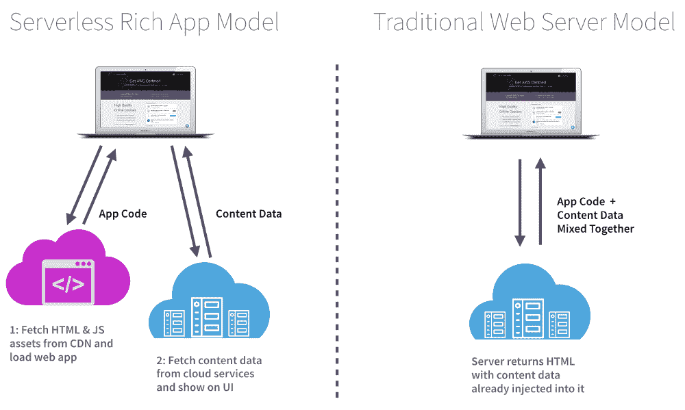
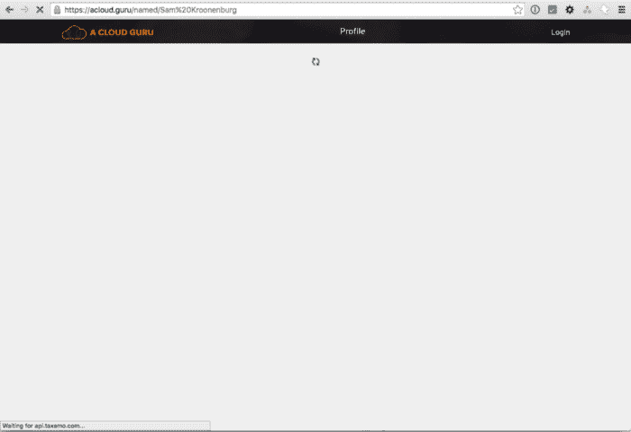
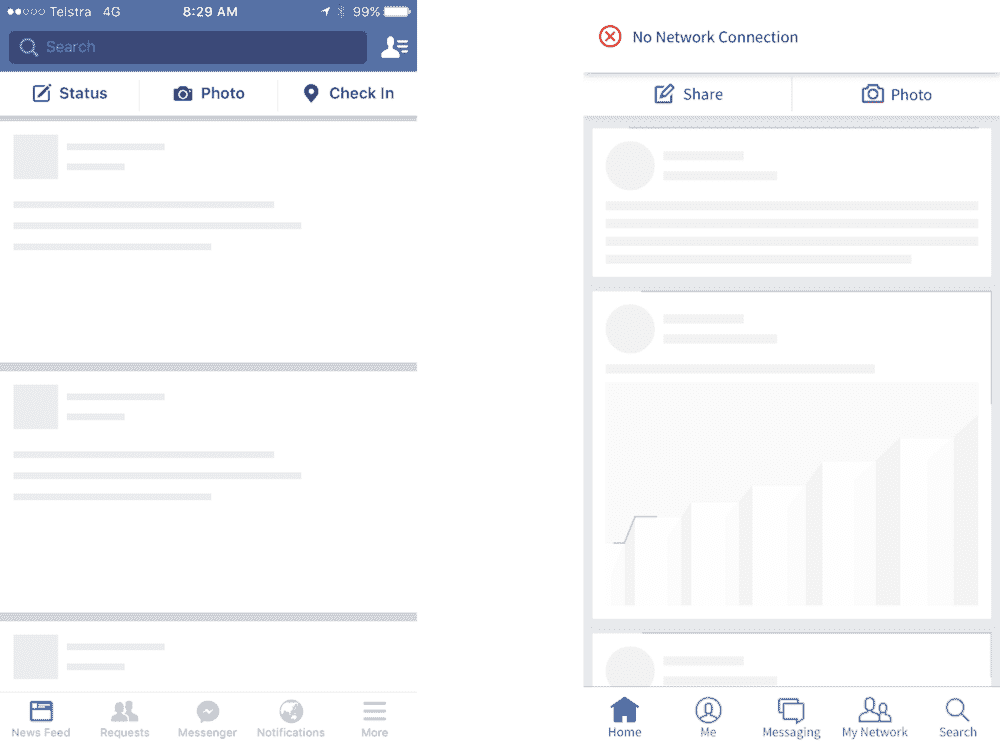
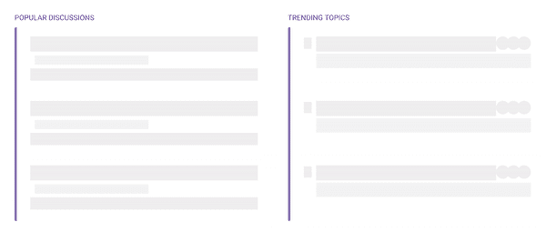

# 无服务器用户界面:窃取移动互联网的精华

> 原文：<https://acloudguru.com/blog/engineering/serverless-user-interfaces-stealing-the-best-of-mobile-for-the-web>

*介绍性说明:这是 2016 年* [*云专家*](https://acloud.guru/) *团队将撰写的关于 AWS 中[无服务器架构](https://acloudguru.com/blog/engineering/serverless-the-future-of-software-architecture)的系列博文的第一篇。我们正忙着在 AWS 上建立一个独特的无服务器架构的学习平台，使用 AngularJS、AWS Lambda、AWS API Gateway &和许多其他技术。我们真的希望你喜欢这个系列。*

* * *

**Enhancing serverless web app experiences with content placeholders.**

我本打算把这篇文章的标题定为“**阿贾克斯旋转者的死亡**”，但我忍住了不去煽动(*谢谢，谢谢*)。但是，当您阅读时，请注意这篇文章的目的是从 web 的各个角落摧毁可怕的 AJAX spinners。

好的，我们知道迁移到无服务器架构有很多优势。您可以非常快速地构建丰富且响应迅速的 web 应用程序，这些应用程序可以执行非常复杂的任务。

但是走向无服务器意味着:没有服务器…这导致了一些有趣的挑战。当你的网站第一次加载时，它就像一个孩子——对这个世界一无所知。它没有预先加载你的数据或内容——它必须从云服务(比如你的 API，或者像 [Firebase](http://firebase.com/) 或 [DynamoDB](https://aws.amazon.com/dynamodb) 这样的云数据存储)获取所有数据

## 嗯，为什么会这样？

在传统系统中，每次用户的浏览器请求时，web 服务器都会提供站点 HTML 和 JavaScript。这些服务器位于中间，动态地向 HTML 和 JavaScript 注入最新的内容和数据，这样一旦浏览器加载了站点，这些内容就可以显示出来。

没有服务器，你的前端代码就是静态的。这是一个强大的单页应用程序，一旦加载到浏览器中，它就会与云中的一系列服务对话以获取数据。它可以通过任何 CDN 部署——没有任何活动的服务器基于用户请求生成 HTML & JS。每个用户总是得到完全相同的 HTML，JS & CSS 副本。这意味着您无需管理任何服务器，加载初始应用程序的速度也快得惊人，但该应用程序并未嵌入您的任何数据/内容。

The serverless model is a little different: There’s no web server to inject content into the HTML data.

## AJAX SPINNER 去死吧！

(好了，我说了)

这种架构的结果是，你的 web 应用程序已经加载了，但是应用程序仍然在获取你的内容。这就给我们留下了一个问题，在这个窗口中向用户显示什么…

过去，我们使用了几种不同的方法:

### **全页面 ajax 微调器**

The entire page is covered by a single spinner, and the user doesn’t see anything until the entire page is loaded.

### **数百个微型 ajax 旋转器**

Where the UI is made entirely of sections that need to be loaded and there’s a spinner for EVERY. SINGLE. ONE.

这些方法看起来真的很痛苦。它们没有给用户任何提示，告诉他们将要发生什么&去哪里看。当加载内容时，页面的所有部分都会随着数据的填充而跳跃和移动。当页面在你眼前自动回流时，你很难知道该往哪里看。

我们的第一个网站设计到处都使用 AJAX spinners，我从来没有为此感到自豪。我们最近的重新设计给了我们改变现状的机会。

## **那么，我们可以从哪里寻找灵感呢？**

仔细想想，移动应用程序是丰富的单页 web 应用程序的绝佳类比。在 mobile 中，应用程序代码存储在移动设备上，因此可以立即加载。然后，应用程序需要从网络上获取数据，用内容填充用户界面。移动是一个很好的生态系统，可以从中汲取灵感，因为它的用户体验标准普遍很高。

如今，优秀的移动应用有一种向占位符发展的趋势。占位符本质上是一个很小很大的盒子，一旦载入，它正好适合内容的位置。你可能在脸书和 LinkedIn 这样的应用中见过占位符。

Left: The Facebook for iOS app. Right: The LinkedIn for iOS app.

占位符与您知道要加载的数据的大小和形状相匹配。它们允许用户“理解”用户界面，并了解事情的进展。当你的内容加载时，用户已经在屏幕上看到正确的位置，准备阅读。不需要时间来适应页面的布局，因为用户已经接受了。它提供了更少的不和谐的用户体验。

因此，我们决定将占位符合并到云专家 web 应用程序中。如果正在加载数据，占位符会显示。如果当用户导航到一个页面时，数据立即准备好了，那么占位符不会显示，内容会立即加载…所以您可以两全其美。

Featured Courses on the A Cloud Guru Site

Featured Discussions on the A Cloud Guru Site

The Course Listing Page With Fade-In Effect

## 用于占位符的可重用 CSS 框架

我们知道我们想要在整个站点中构建占位符支持——从云中加载数据的任何地方。因此，我们为占位符构建了一个可重用的 CSS 框架，并用动画微光效果来指示内容尚未加载。它是这样工作的…

通过简单地将一个“占位符”CSS 类添加到一个将显示内容的元素中，它最初将被一个灰色的占位符形状覆盖，该形状带有闪烁效果的动画。框架使用 CSS :before 伪类将这个额外的元素添加到 DOM 中，使用 z 索引和相对定位定位在内容元素的顶部。

有几种不同的形状可供选择:

### **块元素**

在您希望加载矩形内容块的地方，我们覆盖一个矩形占位符

> 一些文字

### **圆形元素**

有些元素是圆形的，例如用户个人资料图像。在这些情况下，您希望显示一个圆形覆盖。

> 

### **隐藏元素**

当数据加载时，一些元素的外观(大小/形状)会变化很大，甚至可能根本不显示。在这些情况下，你实际上不希望显示占位符，因为它会让用户感觉很不舒服，因为占位符会被不匹配的内容所替换。

在这种情况下，我们创建了占位符隐藏类。在加载内容时，原始元素被简单地隐藏，不透明度为零。当内容加载时，如果元素存在，它会淡入。

> {{scores.highScore}}

### **半块元素**

其中您希望加载一个矩形的内容块，该块大约占用元素宽度的一半。这对于短文本很有用，加载时可能会扩展超过 50%的宽度，但大多数情况下不会。

> 一些简短的文字

### **四分之一块元素**

同上，但是是元素宽度的四分之一而不是一半。

> 一些微小的文字

## **代码**

内容一加载，我们就让 AngularJS 代码将“loaded”类添加到父元素中，然后占位符会被 CSS 框架自动淡出。

占位符元素采用添加了“占位符”类的原始内容元素的大小，因此为每个内容元素设置最小宽度和最小高度(或行高)值非常重要。

## 但是现在是 2016 年了。我们有电动汽车，可以让火箭返回地球。我当然可以鱼与熊掌兼得。

占位符对于动态加载的数据来说是一个非常好的效果。但是有些内容非常重要，你的用户真的不应该等待。如果你正在经营一家电子商务商店，那么你的促销信息应该在页面的顶部显示出来。在页面加载时显示占位符而不是销售信息，肯定会失去业务。

这里的 ***是*** 在无服务器、单页面应用模型中实现这一点的一种方式——通过良好的开发运维实践和持续集成/部署策略使之成为可能。

实际上，您可以在构建系统中插入一个步骤来获取最新的数据(比如最近的促销内容)，并将其预缓存到 JavaScript 代码中。通过这种方式，你的网站可以在网页应用程序加载后立即显示出来，同时联系云端查看最近的变化。

如果您有一个好的 CI 系统设置，比如 Travis CI，那么每次修改数据时，您可以简单地使用 web 钩子来启动和部署新版本的静态 web 应用程序代码。因此，当您的产品经理之一更新促销内容时，系统可以自动触发静态网站代码的新版本，其中包含缓存的数据，并自动将这个新版本部署到您的主机 CDN。

我们目前正与一位云计算专家合作开发这一模式，用于我们的课程列表、价格和促销信息。

* * *

无服务器架构带来了新的用户体验挑战，这些挑战可以通过寻找其他面临类似问题的生态系统来克服，如移动系统。占位符是一个很好的方法，可以让用户在内容加载之前的短暂时间内关注你的网站。

萨姆·科隆伯格

### 云专家

云专家的使命是通过提供世界领先的教育内容，让个人参与到提升云计算技能的旅程中来，这些教育内容旨在促进思维模式和职业发展。

> “不要让世界上的任何人生活在错觉中。没有上师，谁也不能渡到彼岸。”——古鲁·那纳克

我们的[课程](https://acloud.guru/courses)由对云计算有着共同热情的行业专家讲授。我们努力为我们日益壮大的云专家社区服务，他们在我们的[论坛](https://acloud.guru/forums/home)、研讨会、见面会和[会议](https://acloud.guru/serverless)上慷慨地贡献他们的见解。

*跟上一个云咕噜剧组*[*@ acloudguru*](https://twitter.com/acloudguru)*。*