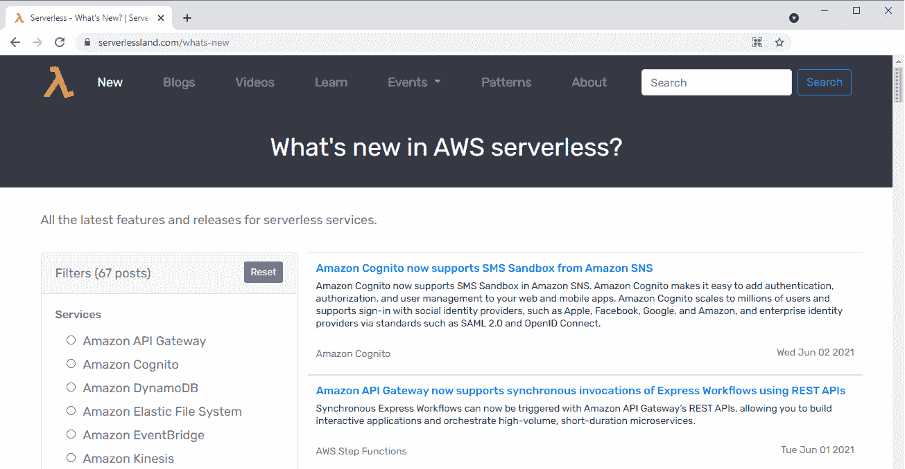
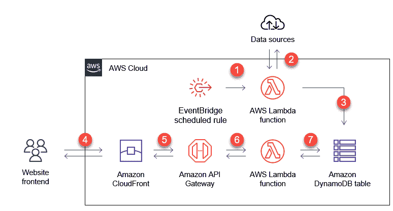
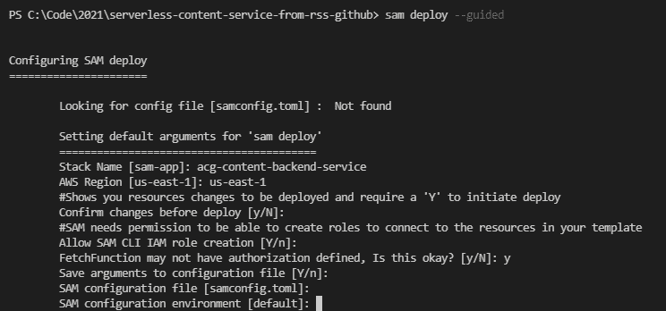
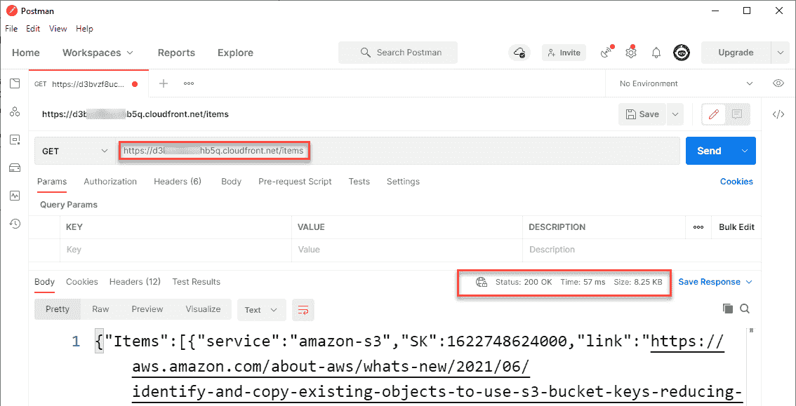

# 使用无服务器架构提供动态网站内容

> 原文：<https://acloudguru.com/blog/engineering/serving-dynamic-website-content-with-serverless-architecture>

网页内容通常是静态或动态的。静态内容是提供给每个访问者的相同内容，而动态内容是变化的。一些世界上最繁忙的网站是基于动态内容的，比如有标题列表的新闻网站，或者有最新交易的电子商务网站。

要使用传统的基于服务器的 web 应用程序提供动态内容，通常服务器脚本或应用程序会从数据库获取结果并呈现页面。扩展这种设计以服务大量的访问者可能是具有挑战性的。每个页面视图都需要 web 服务器查询数据库并将结果呈现给读者。对于大流量，这会增加服务器和数据库的负载。

对于使用 [LAMP stack 架构](https://acloudguru.com/hands-on-labs/provisioning-a-lamp-stack-with-vagrant)的站点，比如 WordPress，或者其他基于服务器的 web 应用程序，你可以采用一种混合的无服务器方法来提供这种功能。这有助于加速开发，使其更容易扩展，并促进基于[微服务的模型](https://acloudguru.com/blog/engineering/using-your-first-microservice-with-aws-lambda)。

一个[无服务器架构](https://acloudguru.com/course/serverless-concepts)可以通过使用专为扩展而设计的服务，更轻松地为每秒数以千计的访问者提供服务。在混合方法中，它也不改变现有的服务器代码或数据库模式。在这篇博文中，我解释了如何使用最少的定制代码构建高度可伸缩的解决方案来提供动态内容。

## 概观

虽然您可以使用无服务器技术来构建[整个网络应用](https://github.com/aws-samples/happy-path/)，但是您也可以使用基于微服务的后端来为现有网站带来动态功能。

[无服务器之地](https://serverlessland.com/whats-new)网站使用这种方法为访问者生成动态结果。在该网站上，[新功能](https://serverlessland.com/whats-new)页面聚集了来自十几个不同 AWS 服务的功能发布信息。后端服务从公共 RSS 提要收集这些信息，然后前端从公共端点获取数据。当访问者导航到该站点时，他们会看到一个检索汇总结果的页面:



无服务器架构

## 该解决方案使用两个独立的微服务。一种是按计划从外部数据源获取数据，并将结果存储在数据库中。另一个服务于前端 web 应用程序，从数据库获取结果。架构看起来是这样的:

The solution uses two separate microservices. One fetches the data on a schedule from external data sources and stores the result in a database. The other serves the frontend web application, fetching the results from the database. The architecture looks like this:  



一个 [Amazon EventBridge](https://aws.amazon.com/eventbridge/) 预定规则每小时运行一次来调用一个 Lambda 函数。

1.  [AWS Lambda](https://aws.amazon.com/lambda/) 函数从外部数据源获取新数据，并过滤要保存的记录。
2.  该函数将项目写入一个 [Amazon DynamoDB](https://aws.amazon.com/dynamodb/) 表。
3.  网站前端调用一个[亚马逊 CloudFront](https://aws.amazon.com/cloudfront/) 发行版的 URL。缓存设置为 5 分钟。
4.  每当缓存为空或过期时，CloudFront 都会从 API 网关端点获取最新的内容。
5.  [亚马逊 API 网关](https://aws.amazon.com/api-gateway/)调用第二个λ函数。
6.  Lambda 函数从 DynamoDB 表中加载数据。
7.  部署示例

## 这个示例使用 [AWS 无服务器应用程序模型](https://aws.amazon.com/serverless/sam/) (AWS SAM)将解决方案部署到您的 AWS 帐户。要开始，你需要安装 [AWS CLI](https://docs.aws.amazon.com/cli/latest/userguide/install-cliv2.html) 和 [AWS SAM](https://docs.aws.amazon.com/serverless-application-model/latest/developerguide/serverless-sam-cli-install.html) 。您还需要一个 [AWS 帐户](https://portal.aws.amazon.com/billing/signup)，但是这里显示的一切都可以在 [AWS 自由层](https://aws.amazon.com/free/)中部署和测试。

要部署此示例:

从样本库中克隆代码:
`git clone https://github.com/aws-samples/serverless-content-service-from-rss`

1.  更改目录:
    `cd ./serverless-content-service-from-rss`

2.  运行 AWS SAM build 下载并安装使用的依赖项:
    `sam build`

3.  要将应用程序部署到您的 AWS 帐户，请运行 AWS SAM guided deploy:
    `sam deploy –guided`

4.  部署向导会提示您一系列问题。输入您的首选堆栈名称、AWS 区域，并允许 AWS SAM 创建 API，而无需定义授权。

5.  The deployment wizard prompts you with a series of questions. Enter your preferred stack name, AWS Region, and allow AWS SAM to create the API without authorization defined.



随着应用程序的部署，EventBridge 调度规则每小时调用一次 *Import* Lambda 函数。这将从一个公共 RSS 提要中获取数据，并将项目存储在应用程序的 DynamoDB 表中。

了解 AWS SAM 模板

## repo 中的[模板](https://github.com/aws-samples/serverless-content-service-from-rss/blob/main/template.yaml)定义了该应用程序使用的所有资源。首先，它使用[按需容量模式](https://aws.amazon.com/dynamodb/pricing/on-demand/)声明一个带有分区键和排序键的 DynamoDB 表:

接下来，模板定义了 *Import* Lambda 函数。它将内存大小设置为 128 MB，将运行时设置为 Node.js 14。RSS 提要 URL 是作为函数的环境变量提供的，因此您可以根据自己的需要在这里更新它，而无需更改 Lambda 函数中的代码:

```
DDBtable:
    Type: AWS::DynamoDB::Table
    Properties:
      AttributeDefinitions:
      - AttributeName: PK
        AttributeType: S
      - AttributeName: SK
        AttributeType: N
      KeySchema:
      - AttributeName: PK
        KeyType: HASH
      - AttributeName: SK
        KeyType: RANGE
      BillingMode: PAY_PER_REQUEST
```

这使用了一个 [AWS SAM 策略模板](https://docs.aws.amazon.com/serverless-application-model/latest/developerguide/serverless-policy-templates.html)来授予对模板的 DynamoDB 表的权限。AWS SAM 自动提供调用该功能并将日志保存到 [Amazon CloudWatch](https://aws.amazon.com/cloudwatch/) 的最小权限。在*事件*中，模板使用 [EventBridge 预定规则](https://docs.aws.amazon.com/eventbridge/latest/userguide/eb-create-rule-schedule.html)定义了每小时一次的调用。这两个部分定义了第一个微服务按计划获取数据并将结果存储在 DynamoDB 中所需的一切。

```
ImportFunction:
    Type: AWS::Serverless::Function 
    Properties:
      Timeout: 10
      CodeUri: parser/
      Handler: app.handler
      Runtime: nodejs14.x
      MemorySize: 128
      Environment:
        Variables:
          Feed: 'https://aws.amazon.com/about-aws/whats-new/recent/feed/'
          TableName: !Ref DDBtable        
      Policies:
        - DynamoDBCrudPolicy:
            TableName: !Ref DDBtable        
      Events:
        EventBridgeSchedule:
          Type: Schedule
          Properties:
            Schedule: 'rate(1 hour)'
            Name: ImportSchedule
            Enabled: True
```

第二个微服务为客户端应用程序创建一个 HTTP 端点来获取项目。该模板定义了 API 网关端点和 Lambda 函数:

在[HTTP API](https://docs.aws.amazon.com/apigateway/latest/developerguide/http-api.html)配置中，这定义了一个开放的 [CORS 配置](https://docs.aws.amazon.com/apigateway/latest/developerguide/http-api-cors.html)用于测试和开发目的。在生产应用程序中，您应该相应地确定这种访问的范围。Lambda 函数的事件处理程序配置 API 路径和方法。

```
MyApi:
    Type: AWS::Serverless::HttpApi
    Properties:
      CorsConfiguration:
        AllowMethods:
          - GET
          - POST
          - DELETE
          - OPTIONS
        AllowHeaders:
          - "*"   
        AllowOrigins: 
          - "*"      

  GetItems:
    Type: AWS::Serverless::Function 
    Properties:
      Timeout: 3
      CodeUri: getItems/
      Handler: app.handler
      Runtime: nodejs14.x
      MemorySize: 128
      Environment:
        Variables:
          TableName: !Ref DDBtable        
      Policies:
        - DynamoDBReadPolicy:
            TableName: !Ref DDBtable        
      Events:
        UploadAssetAPI:
          Type: HttpApi
          Properties:
            Path: /items
            Method: get
            ApiId: !Ref MyApi
```

最后，模板定义了 CloudFront 发行版。这使用 API 网关端点作为起点，并将[生存时间](https://docs.aws.amazon.com/AmazonCloudFront/latest/DeveloperGuide/Expiration.html) (TTL)值设置为 300 秒:

测试应用程序

```
 CloudFront:  
    Type: AWS::CloudFront::Distribution
    Properties:
      DistributionConfig:
        Enabled: true
        IPV6Enabled: true
        HttpVersion: http2
        Comment: !Ref 'AWS::StackName'
        Origins:
        - Id: APIGOrigin
          DomainName: !Sub ${MyApi}.execute-api.${AWS::Region}.amazonaws.com
          CustomOriginConfig:
            HTTPSPort: 443
            OriginProtocolPolicy: https-only
        DefaultCacheBehavior:
          AllowedMethods: ["GET", "HEAD"]
          CachedMethods: ["GET", "HEAD"]
          ForwardedValues:
            Headers:
            - Access-Control-Request-Headers
            - Access-Control-Request-Method
            - Origin
            QueryString: true
          TargetOriginId: APIGOrigin
          ViewerProtocolPolicy: https-only
          Compress: true
          DefaultTTL: 300
```

## 随着后端的部署， *Import* 函数每小时获取一次新内容。您也可以在 [Lambda 控制台](https://console.aws.amazon.com/lambda/home)中手动运行该功能以立即获取内容。

运行`sam deploy`命令后，堆栈中的 [AWS CloudFormation](https://aws.amazon.com/cloudformation/) 输出显示了您的发行版的基本 URL:

After running the `sam deploy` command, the [AWS CloudFormation](https://aws.amazon.com/cloudformation/) outputs from the stack show the base URL for your distribution: 

完整的端点是附加了“/items”路径的基本 URL。您可以使用类似于 [curl](https://curl.se/) 或 [Postman](https://www.postman.com/) 的工具来查询这个 url，并查看返回的项目列表:


The complete endpoint is the base URL with the ‘/items’ path appended. You can use tools like [curl](https://curl.se/) or [Postman](https://www.postman.com/) to query this URL and see the list of items returned:



与 web 应用程序集成

## 为了让 web 应用程序使用这个后端，它必须对前一个端点进行 API 调用。这个过程使用 JavaScript 直接从浏览器前端调用端点。在 React、Vue.js 或 Angular 等单页面应用程序框架中，可以设置页面组件在页面首次加载时调用端点。

无服务器的 Land 网站是用 Vue.js 编写的，下面的代码片段展示了页面上的组件实例如何在[挂载的生命周期钩子](https://v3.vuejs.org/api/options-lifecycle-hooks.html#mounted)中进行 API 调用。*launchs _ URL*变量包含从 CloudFront 发行版中获取项目列表的 URL:

目前，这将返回最近的 100 个结果。在高级实现中，API 还可以通过查询参数支持搜索和分页。您可以使用底层 DynamoDB 表中的 sort 键按照时间戳对结果进行排序。

```
const axios = require('axios')
const ITEMS_URL = 'https://d11abcdef12345.cloudfront.net/items

export default {
  data () {
    return {
      items: [],
    }
  },
  mounted: async function() {
    // Load dynamic data from backend service
    const result = await axios.get(ITEMS_URL)
    this.items = result.data.Items
  }
}
```

配置 CloudFront 缓存

## 在这个解决方案中，前端 web 应用程序可以直接调用 API 网关端点并接收相同的响应。然而，在繁忙的 web 应用程序中，这会导致对 API Gateway 的大量调用，而 API Gateway 又会调用 Lambda 和 DynamoDB。因为动态项目列表可能很少改变，所以您可以使用 CloudFront 来缓存结果，改善延迟，并降低总成本。

在本例中，*导入*功能每小时运行一次。您可以安排轮询过程以更短的时间间隔运行，例如每分钟一次。根据工作负载的需要，您可以在短至一秒的时间内定制 [CloudFront TTL 值](https://docs.aws.amazon.com/AmazonCloudFront/latest/DeveloperGuide/Expiration.html)。

实时网站使用五分钟的缓存。如果有大量的站点访问者到达，大多数请求都由 CloudFront 发行版处理。只有当缓存过期或现有缓存为空时，CloudFront 才会调用 API 网关端点。

结论

## 动态网页内容可以让你的网站对访问者更有用。它通常用于提供功能，如最新的电子商务交易、最近的客户评论或您产品的最新功能发布。

使用传统的基于服务器的方法，这会增加 web 服务器和底层数据库的负载。横向扩展或处理峰值工作负载也是一项挑战。

这篇博文展示了一种支持高吞吐量的无服务器方法。这使用了一个微服务，它获取数据并将结果存储在 DynamoDB 表中。客户端应用程序调用一个 CloudFront 分发端点，该端点使用另一个微服务从表中获取项目。

如需更多无服务器学习资源，请访问[无服务器世界](https://serverlessland.com/whats-new)。

For more serverless learning resources, visit [Serverless Land](https://serverlessland.com/whats-new).