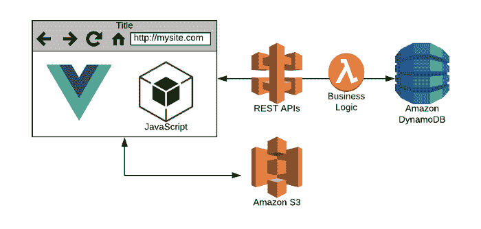

# 我在使用无服务器的前 6 个月学到的 6 件事

> 原文：<https://acloudguru.com/blog/engineering/six-months-of-serverless-lessons-learned>

在 10 月份的无服务器会议结束后，我决定我的整个公司将无服务器运营。前几个月我一直在碰壁[，试图将 Python Flask app](https://read.acloud.guru/adventures-in-migrating-to-serverless-a63556b39042) 迁移到 Lambda——这些努力帮助我找到了更好的方法。

将一个简单的 web 应用程序迁移到无服务器的恐惧和沮丧——我花了一个周末的时间与功能斗争，同时试图将托管在 [Elastic Beanstalk 上的 Flask 应用程序迁移到 AWS](https://acloudguru.com/blog/engineering/adventures-in-migrating-to-serverless) 。

六个月后，我们现在正在部署我们的第四个主要项目。这就是我们如何做到的——包括发展的[云技能](https://acloudguru.com/solutions/individuals)、吸取的教训*以及在此过程中形成的强烈意见*。

### 第 1 课-放弃 Python

flashboard 是一个很好的小框架，适用于服务器管理会话的网站的老式请求-响应风格。这很奇怪——但在互动网络的新世界里，这就像试图用橡皮筋和橡胶扫帚建造一所房子。

The old way: Python Flask app runs on Elastic Beanstalk, storing data in RDS

随着您开始将更多的工作转移到客户端来支持交互，您将别无选择，只能使用 JavaScript。这通常会导致内联到你的 Python 模板中，而技术债务的恶魔为你打开了另一个信用额度。

Flask 解决方案逐渐成为不同语言的混合体。我很快得出结论，这种方法非常糟糕——我不确定为什么我还要使用 Python。

在切换到 Node 之后，一切都变得更容易维护和更符合逻辑，并且不需要使用一种以上的语言。通过在 Webpack 上进行简单的 Node/Express 配置，您还可以使用 ES6 来消除 Python 开发人员取笑的可怕的 JavaScript 结构。

在 Zappa/Flask 做同样的事情比做我的税务还糟糕。但是，在大约 5 分钟内，你可以构建一个完全成熟的 Node/Express 应用程序，它可以像 1040EZ 一样在 Lambda 上工作——这没什么大不了的。所以我们抛弃了 Python，加入了 JavaScript 阵营中的酷孩子。

Lambda Function As Monolith

我们放弃了什么？Pythonistas 会热情洋溢地讲述所有很酷的语言特性，但与 JavaScript 的实用异步魅力相比，这些只是玩具。现在我们不再担心 Python 版本 2 或 3(它会升级吗？).至少对我们的项目来说，这是一个非常容易的转变。

当然， [Ben Kehoe](https://medium.com/u/586bd5b557d2?source=post_page-----f6da86a73526--------------------------------) 提供了一个引人注目的[替代的煽情陷阱](https://read.acloud.guru/node-is-the-wrong-runtime-for-serverless-jk-c69595f6a8eb)，他的观点和见解是关于使用 Python 还是 Node 来实现无服务器！

### 第二课——将中间层夷为平地

我们花了令人惊讶的时间才意识到无服务器的明显优势——可能是因为我们一直在构建 web 应用程序，或者可能只是因为我变老了。

我们最初的一些 web 应用程序仍然有一个 Node Express 层，它要么(1)意外地希望用户一次又一次地点击同一个 Lambda 容器，要么(2)由于设计的悲剧，我们滥用 DynamoDB 来让它记住会话 id。我们到底在做什么？

在“过渡”的第一阶段，我们的中间层就像 Lambda 上的 web 服务器，这是错误的，也是糟糕的。然后我们得到了 html 页面，其中充满了调用 REST APIs 的 JavaScript。这种方法非常原始，难以维护，并且很快变得脆弱——但是我们已经杀死了中间层。在无服务器中，*中间层要去*。

State moves to the client, logic moves to Lambda

### 第 3 课—享受 Vue

能够把所有东西都塞进前端是很棒的，但是很快就变得一团糟。你最终停止签入代码，因为你不好意思分享你一直在创造的 Rube Goldberg 机器魔术。“不签入代码”对开发人员来说不是一个好的工作目标。

进入单页面应用程序(SPAs)的世界让我接触到了 React——这是构建用户界面最流行的方法。React 很棒，但是有一个陡峭的学习曲线，大量的 Webpack/Babel 设置，以及 JSX 的引入。虽然它可能是我们最终使用的东西，但对于我们的直接需求来说，它太重了，所以要探索替代方案。

幸运的是，我很快发现 [Vue.js](https://vuejs.org/) 并且我的无服务器生活变成了绝对的幸福。事情是这样的:*你可以在一天内学会 Vue！*

Vue 的设计方法与我们的设计模型非常契合——一切都是管理自己的内容、设计和代码的组件。这使得管理我们的多个客户项目和分散的团队变得非常容易，并且对于无服务器的思维模式也非常适用。

开源 JavaScript 框架为您提供了强大的调试工具、出色的组织和开箱即用的 Webpack 构建，从而节省了时间。安装路由器和商店管理插件——你就可以像脸书工程师一样制作实时性感的应用程序。谁知道单页应用会如此简单？

从无服务器的角度来看，Vue 将你所有的优点编译成 index.html 和 bundle.js 文件，准备上传到 S3。键入`npm run build`是新的编译命令。

请花点时间考虑一下——在过去，我们会通过 Elastic Beanstalk 部署应用程序，监控利用率，在需要时自动扩展，并管理合理的基础架构。

SPAs 的真正神奇之处在于，当您“部署”一个应用程序时，您只是简单地将 index.html、bundle.js 和一些文件依赖项复制到一个由 CloudFront 发行版作为前端的 S3 存储桶中。这为您提供了稳定的分发和加载行为，还支持多版本管理和您喜欢的任何部署方法——只需管理文本文件。

我们的规模实际上是无限的，并且只为我们使用的东西付费，没有应用程序基础架构管理。

Vue 本质上允许您在浏览器中构建桌面应用程序，这意味着您可以显著改善用户体验。所有的状态都可以在这里管理，没有无休止的请求/响应，您可以用标准的 UI 技巧(如转换效果)隐藏延迟，整个应用程序现在行为正常。

### 第 4 课—学会爱上 DynamoDB

在许多方面，实现无服务器最困难的部分是真正掌握 DynamoDB。在最初的几次迭代中，您肯定会犯一些错误，并且很容易放弃所有的东西，回到 RDS，在那里一切都是已知的和舒适的。

很长一段时间以来，SQL 一直是我的支柱，我承认在数据库中放入了太多的业务逻辑。但是 RDMS 系统只是另一个庞然大物——无法很好地扩展，并且它们不支持有机进化敏捷系统的想法。

DynamoDB 是完全不同的动物。如果使用得当，NoSQL 数据库可以提供极高的性能、巨大的规模，而且几乎没有管理开销。但是你真的需要花时间去探索它是如何工作的——而且最初的阶段充满了陷阱。

发电机表字段不能包含空字符串。时间点备份不是自动的。如果您弄错了分区和排序键，您必须从表开始。如果您试图过于接近地模拟 SQL 查询，那么您的表可能会从太少变得太多。一直以来，RDS 给人的感觉都很陌生。

经过许多教程，尝试，失败和最终成功与 DynamoDB，我学会了…

*   您需要了解 DynamoDB 的工作方式，花一些时间了解索引策略，以及您打算如何查询数据。很容易在不知道你需要知道的一切的情况下就投入进去，所以很多人被烧伤，然后在完全错误的时间搬回 RDMS。犯错误并克服它们。
*   DynamoDB 最少被讨论的乐趣之一是可以使用流将代码附加到表事件上——就像可以做任何事情的 SQL 触发器。这些都是极其强大的。我们使用的一个非常简单的模式是总是将表更新推送到 SNS 主题，其中的更改可以被您可能还没有编写的其他无服务器代码*接收。*
*   不要忘记，DynamoDB 可以支持其他存储系统(RDMS、红移或纯文本文件)，可以用来有效地消除流量峰值或保护另一个数据库免受海量数据的影响。DynamoDB 有一个 TTL 特性，允许您使行过期——这对于存放您想推到其他地方的数据非常有用。

### 第 5 课—无服务器框架 FTW

我早期对 Lambda 的实验是一件笨拙的事情，直接编码到 AWS 控制台中，并对做一些琐碎的事情需要大量的工作和错误消息感到沮丧。缺少将 IDE 连接到生产环境的桥梁。

嗯，直到你发现了无服务器框架，这是我多年来发现的最令人兴奋的东西。

一个简单的`sls deploy`拥有巨大的力量，将你宝贵的代码捆绑起来，直接发送到亚马逊的大脑。如果你因为代码行为不当而需要检查日志，只需输入`sls logs -f functionname -t`，你就可以像专业人士一样跟踪你的 CloudWatch 日志，而无需打开浏览器。

这个。变化。一切。没有服务器的人应该因为做了每个云提供商从第一天起就应该提供的事情而获得大量赞誉。简直太棒了。而且*这么多赢*。

### 第六课——授权是镇上的新警长

在传统的应用程序中，你对用户进行一次身份验证，然后通过一个会话 ID 来跟踪这个人。我们喜欢它，因为你只需要做一次艰苦的工作，然后 ID 就可以让你在用户登录的整个生命周期内作弊，只要你愿意。

In the old world, the session ID controls access

但是这种方法有问题。只有当您将服务器放在中间时，它才会起作用，而我们刚刚将该服务器夷为平地。它也潜在地将你暴露给一些讨厌的攻击——像跨站点请求伪造(CSRF)——并且不允许你非常容易地将身份传递给其他服务。所以这种方法基本上支持 Monolith ( *boooo！*)。

我们讨厌巨石柱和 CSRF 袭击——但是我们喜欢我们的新朋友，JWT 令牌。当我知道这是如何工作的时候，我有一个禅宗般的兴奋时刻，但我需要一个图表来做好它。

第一步，获得一个 JWT，第二步，使用它与您编写的任何服务进行通信:

The first step looks familiar: the authorization process gets a JWT token

The second step is magic: any lambda function can accept and validate the token

基本的难点是每个请求都要经过身份验证，客户端甚至可以与多个无服务器活动对话。它非常安全，它是反垄断的，CSRF 甚至不存在于 JWT 土地上。您的无服务器代码所需要的就是使用一个定制的授权器来检查标题中的 JWT 是否有效(使用样板代码)，我们就完成了。

JWT 让所有其他类型的认证看起来过于复杂。我们把一切都换成了 [Auth0](https://auth0.com/) (在某些情况下还有 Cognito)，再也没有回头。无服务器身份验证既简单又非常有效，所以，团队加油。

### 这是一个勇敢的新世界

虽然我与 AWS 合作了很长时间，但我从未如此接近底层。即使在 EC2 的土地上，也有很多帮助，因为我参加聚会相对较晚。离开云专家的无服务器会议后，这感觉像是真正未被探索的领域，在黑暗中有明显更多的发现。

在我们最初的几个实验中，我们在尝试使用现有的工具和技术时有一些失误——结果并不理想。经过几个月的准备，我们已经正式开始以 100%无服务器的方式交付项目。我相信我们的迁徙和早期探索是值得的。

我们正在构建流畅的实时水疗应用，这些应用完全使用无服务器基础设施，可轻松扩展，成本降低 70–90%。我对回报既高兴又震惊。我从未如此确信无服务器技术将彻底改变云中的应用交付。

结果是革命性的。

* * *

## 获得更好职业所需的技能。

掌握现代技术技能，获得认证，提升您的职业生涯。无论您是新手还是经验丰富的专业人士，您都可以通过实践来学习，并在 ACG 的帮助下推进您的云计算职业生涯。

* * *