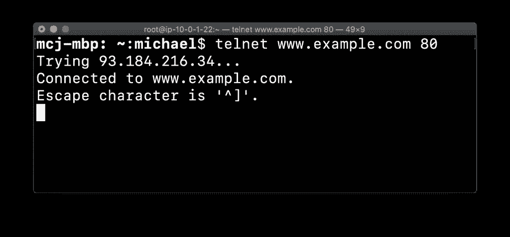
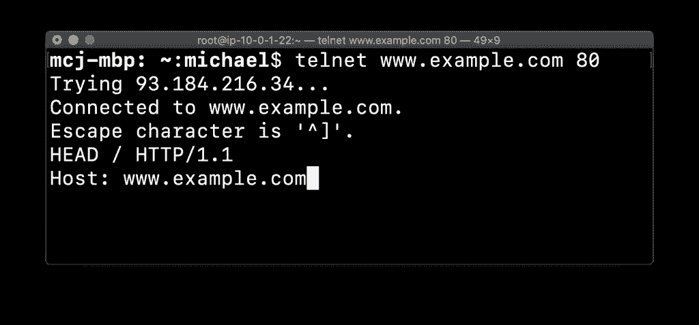
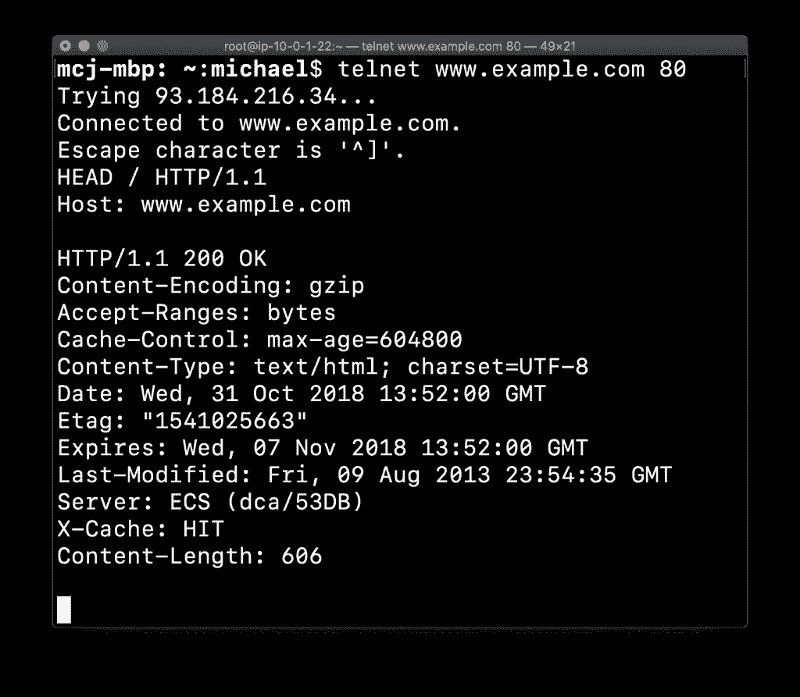

# 使用 Telnet 进行 TCP 连接测试

> 原文：<https://acloudguru.com/blog/engineering/tcp-connection-testing-with-telnet>

Telnet 的美妙之处在于它几乎适用于任何操作系统，并且默认安装在许多操作系统上。虽然使用不安全的 Telnet 进行网络通信最终让位于加密协议，如 [SSH](https://wpengine.linuxacademy.com/linux/ssh-and-scp-howto-tips-tricks/) ，但它的用处仍然存在。Telnet 是测试 TCP 端口连通性的完美工具。让我们按照 [Linux 网络和故障排除](https://linuxacademy.com/linux/training/course/name/linux-networking-and-troubleshooting?utm_source)中的教导，演练一下如何使用 Telnet 进行 TCP 连接测试。**使用 Telnet** 也许您刚刚在 AWS 中构建完一个环境，并准备将一些本地 web 内容迁移到更具可扩展性的环境中。您已经配置了您的 VPC，添加了安全组，并实例化了 EC2 实例。对于您计划迁移到 EC2 实例的工作负载，如何验证您的入口规则设置是否恰当？对于监听 TCP 端口的服务，这很简单——只需使用 Telnet！这里有一个例子。**检查 HTTP 连接**假设您想要检查到*www.example.com*的 HTTP 连接，您可以使用:

```
telnet www.example.com 80
```

你要找的是这个:

```
Connected to example.com.Escape character is '^]'
```

这将告诉您何时能够成功建立连接。此时，您通常会点击`CTRL+C`并键入`quit`来退出 Telnet，但是您也可以使用 Telnet 来请求一些数据。**拉 HTTP 头**假设您想要拉*www.example.com*的 HTTP 头，您可以键入:

```
HEAD / HTTP/1.1Host: www.example.com
```

后面跟着`ENTER`两次:您不仅能够验证端口 80 是打开的并且允许通信，而且还能够针对服务本身执行一些验证。用例也可以扩展为提取网页的 HTML，使用类似于:

```
GET /index.html HTTP/1.1
```

当然，这是假设`index.html`存在于站点的根级别，并且 1.1 是正确的 HTTP 主机头规范。这些只是 Telnet 可以提供帮助的几个例子。为了获得更大的灵活性，包括监听 TCP 和 UDP 端口的能力，您应该看看 netcat！在最新的实践培训课程中，您可以更深入地了解这一切: [Linux 网络和故障排除](https://linuxacademy.com/linux/training/course/name/linux-networking-and-troubleshooting?utm_source)。相关资源: