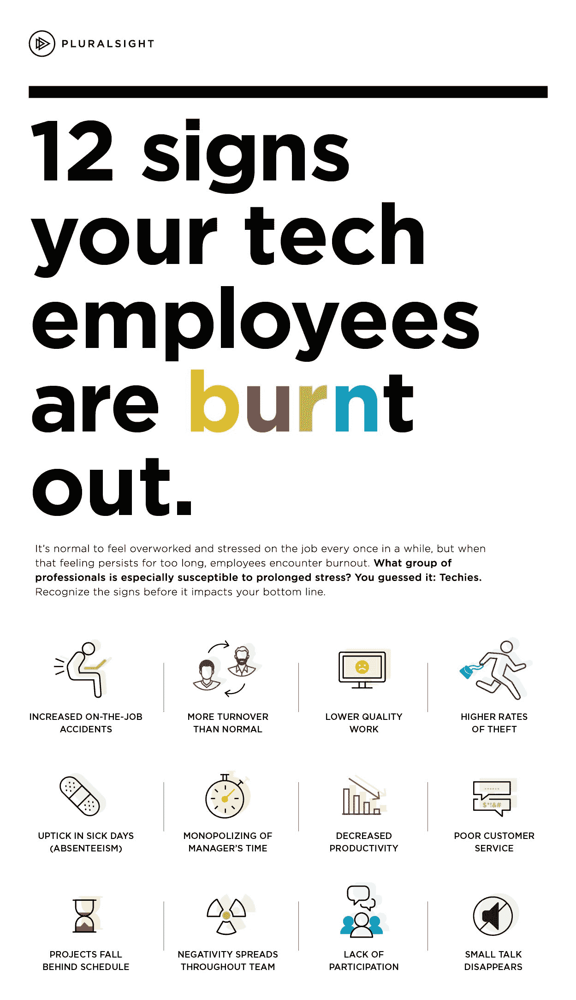
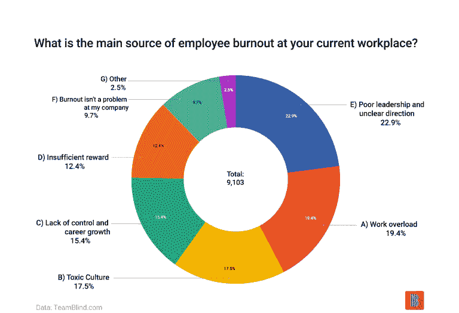

# 科技工作者的倦怠:什么是倦怠，如何应对

> 原文：<https://acloudguru.com/blog/engineering/tech-it-worker-burnout>

你是否在科技行业工作，并感到筋疲力尽？如果是的话，你并不孤单。全球研究表明，五分之二的 it 专业人员处于高度疲劳的风险中，在 IT 安全方面，超过一半的 IT 专业人员处于高度疲劳的风险中。当新冠肺炎来袭，人们转而在家工作时，许多科技员工变得更有压力，而不是更少。

那么，为什么行业内的专业人士都这么串门呢？

在这篇文章中，我们回答了这个问题，以及要注意的倦怠迹象(在你自己和他人身上)，以及你可以做些什么来战胜它。

## 技术倦怠的迹象是什么？

根据世界卫生组织和世界上最著名的职业倦怠研究人员之一、T2 的 Christina Maslach 博士的研究，有三种主要的职业倦怠迹象值得警惕。

### 1.极端犬儒主义

你是否觉得你对工作的负面感觉正在排挤积极的感觉(如果有的话)？你所做的一切都不被欣赏，一切都很糟糕，什么都不会改变？

虽然有些人可能认为“愤世嫉俗的 IT 专业人士”是陈词滥调，但愤世嫉俗实际上是倦怠的危险信号。如果你或你团队中的某个人认为工作是一个半空的杯子——或者完全没有水——是时候质疑这是否是一个更大问题的迹象了。

犬儒主义有多种表现形式，包括:

*   超脱
*   不断的挫折
*   失去意义
*   感觉幻灭
*   刻薄
*   工作中缺乏乐趣
*   非人化的同事(例如，“X 活该。”)

这可能会影响你和他人的工作表现，尤其是当你在一个面向人或基于团队的岗位上时。如果你在 IT 支持部门工作，你可能会回复一个带有刻薄的 [LMGTFY](https://lmgtfy.app/) 链接的标签，并尽最大努力提供帮助，因为“什么都不重要”作为一名软件开发人员，团队中的其他人可能会犹豫是否要求您进行代码审查，因为您对承担“另一项任务”缺乏耐心且脾气暴躁。

### 2.慢性疲劳

你是否一点精力都没有——早上几乎起不来了，工作时没有全力以赴，一天下来完全筋疲力尽？

通常，当一个人度过了艰难的一天，他们能够在休息和停机后恢复过来——就像他们的电池充电一样。但对于慢性疲劳的人来说，就像电荷都消失了，你就是找不回来。

看起来你的疲劳是情境性的——由最近一个大项目造成的压力引起的，或者因为你在待命而服务器持续停机。但是如果你一直很累——即使工作结束了，或者你度假回来了——这可能是一个危险信号。

其他一些精疲力竭的迹象:

*   没有动机
*   感觉需要“坚持下去”
*   无法集中注意力
*   害怕花时间充电
*   周末的绝对放松
*   没有精力持续高效地工作

### 3.负面自我评价

像大多数 STEM 工作一样，技术是一个充满高绩效者的领域，这就是为什么感觉自己没有表现出来会特别具有破坏性。

没有人喜欢感觉自己在工作中无能，或者觉得自己一事无成。如果你觉得自己一直在工作却一事无成，或者“我做的每件事都是错的”，这可能是精疲力竭的迹象。

其他一些迹象可能包括:

*   觉得自己的角色不合适
*   思考灾难性的想法
*   工作感觉混乱，压力大
*   感觉你为太多人做了太多
*   一种你的努力没有带来变化的感觉

在 Yerbo 的一份名为“技术领域的倦怠状态”的研究报告中，33 个国家的 30，000 名 IT 专业人士接受了调查。在这些专业人士中，他们发现:

*   56%的男性和 69%的女性在一天工作结束后无法放松
*   43%的人觉得脱离了他们的工作，27%的人看不到工作的价值
*   51%的人认为他们取得的成绩低于预期

这三个因素:疲惫、愤世嫉俗和消极的自我评价是技术倦怠的征兆。

## 技术领袖可以警惕倦怠的迹象

如果你是人事经理，你不会读心术，所以很难判断某人是否有上述任何感觉。为了提供帮助，Pluralsight】制作了一个信息图,上面有你可以注意的标志。

## 为什么技术员工会精疲力竭？

精疲力尽是由一件事引起的:持续不断的长期压力。但是它的原因是什么，它已经持续了多长时间？

根据 Cristina Maslach 博士在 2018 年 DevOps 企业峰会上的演讲，科技行业的压力并不新鲜。事实上，从 60 年代起，它就已经是其中的一部分了。

“在硅谷的早期，我们听到了很多关于倦怠店的事情。人们试图招聘，说，'我们是累垮店。我们不仅仅想要 A 型血的人。我们需要 A++型的人，”马斯拉奇博士说。

“有趣的是，我认为我们现在越来越多地看到，这已经成为许多职业的商业模式……你必须放弃时间。你必须放弃生活中的其他事情，才能做到这一点。”

在 STEM，从一开始就有一种“不成功便成仁”的心态，40%的学生在四年内离开这些项目。

在工作场所的原因方面，由 [Blind](https://www.teamblind.com/) 对顶级科技公司进行的一项调查显示，领导不力、工作超负荷、有毒文化、缺乏职业发展以及奖励不足是导致倦怠的主要原因。

## 我该如何对抗技术倦怠？

你感到筋疲力尽，你想做点什么。这里有一个清单，你可以试着用你的工作回到一个健康的地方，保护你的精神健康。

### 1.设定家庭和工作的界限

还记得我说过，技术专业人士报告说，在疫情开始后，他们感到更加疲惫，即使他们在家工作也是如此。这是因为家和工作之间的界限模糊了，所以没有逃避的余地——他们“在工作中生活”。

你可以做以下事情来建立物理边界:

*   从手机中删除工作邮件和信息平台，或者关闭非工作时间的通知
*   当你外出一天、周末或度假时，设置外出电子邮件
*   在日历中设置时间段，以便在停工期间自动拒绝会议
*   如果你混合工作或者远程工作，为你的办公室设立一个单独的房间，不要去那里进行娱乐活动

### 2.尽可能自动化

根据 Adam Bertram 的说法，技术专家可以使用的一个工具是[自动化你能做的一切](https://www.pluralsight.com/blog/career/3-ways-it-pros-can-prevent-job-burnout-)来减轻负担。

“除了让部门里更多热情的人来帮忙，自动化是下一个最好的选择，”他说。

“花点时间放松一下，放松一点，意识到为了节省时间，你必须首先找到自动化的时间。”

### 3.向他人伸出援手

当你觉得自己是为了工作而存在时，那么除此之外就很难评价自己了。花时间和你的家人和朋友在一起，或者只是去外面的世界，可以让你开始重视“真实的你”，而不是只想着“工作的你”。

如果你感到筋疲力尽，向医疗保健专家(比如你的医生、咨询师或心理学家)寻求帮助是很重要的。因为精疲力尽是如此普遍，所以要知道你并不孤单，有很多经过实践检验的方法可以帮助你。

向你的同事寻求帮助——或者简单地和他们谈谈你的问题——是一个很好的举措。这不仅对你有好处，也鼓励他们在挣扎的时候也这样做。如果你的工作场所提供员工援助计划，这也是值得利用的。

### 4.和你的老板谈谈

有时候，你的主管不知道你在挣扎。告诉他们你不好不是软弱的表现，而是专业力量和成熟的表现。记住，你的老板也想在工作上取得成功，这就是确保他们支持自己的团队。

员工告诉他们的老板他们没有处理好，这让他们觉得他们正在危及他们的工作，这种情况并不少见。如果你有这种感觉，请记住，如果你筋疲力尽而辞职，对他们来说会有更多的麻烦。然后，他们必须发布招聘广告，面试人员，花几个月时间培训他们——这还是假设他们找到了替代者。所有这些都需要时间和金钱。

从大的方面来看，做出一些让步以确保你不会筋疲力尽，这符合双方的利益。

你可以讨论的一些事情:

*   将一些任务转移给其他团队成员，或者将工作外包
*   改变让你感到不堪重负的任务的最后期限
*   强化界限，让人们更少来找你，尤其是在下班时间
*   改变你的角色职责，解决对你不利的事情
*   带薪休假休息和充电
*   在你觉得最有效率或最有效率的时候，采用弹性工作时间
*   给你更多的自主权、认可和有意义的工作
*   要求更明确的工作期望

### 5.找一家重视你的公司

有时候，不是你，是他们。技术倦怠的最大部分是觉得自己无关紧要，受到了不公平的对待——工作环境是有害的。

如果你已经提出了问题，但什么都不会改变，是时候调查你的其他选择了。然而，当你要逃离一份糟糕的工作时，接受你得到的第一份工作会很有诱惑力。

这可能是一个错误——你可能会再次陷入完全相同的境地！相反，当你面试一份新工作时，确保你也面试了他们。要自信，要知道你的幸福值多少钱。

你应该试着了解一下你的新工作场所:

*   公司文化是什么样的？有公司活动或欢乐时光吗？
*   他们对加班和弹性工作时间是什么态度？你的营业时间是什么时候？包括周末和假期吗？
*   假期有多长？
*   他们会希望你随时待命吗？有危机时刻吗？
*   你需要履行多少职责？如果你的 PD 上有“需要的额外职责”，那包括什么？
*   你相信他们的使命和产品吗？他们会向慈善机构捐款或支持慈善事业吗？
*   他们如何识别他们的员工，如果有的话？

### 来自技术专家的其他提示和技巧

以下是 Pluralsight 的作者使用的个人技巧列表，介绍他们如何在科技职业生涯中避免筋疲力尽。

## 防止技术团队中的员工倦怠

想知道如何处理团队中的倦怠？我们推荐阅读 Pluralsight 的指南《对抗倦怠:如何让你的技术团队保持高效和快乐》要访问它，[点击这里](https://www.pluralsight.com/resource-center/guides/employee-burn-out)。

如果你有随叫随到的员工，Pluralsight 提供了一个免费的课程“[如何建立健康的随叫随到文化](https://www.pluralsight.com/courses/allthetalks-session-36)”我们还推荐收听特雷西·布瑟博士的播客，名为[“领导力透视:浴弹不能治愈倦怠。](https://www.pluralsight.com/blog/teams/pil-bath-bombs-dont-cure-burnout)

## 摘要

如果你正在经历精疲力竭的症状，这是你的身体告诉你一切都不好，需要改变。值得庆幸的是，压力和倦怠是可以补救的，承认是应对压力和倦怠的第一步。

记住，你值得拥有最好的自己！