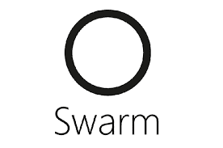
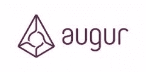

# 了解为什么区块链技术有潜力改变每个行业

> 原文：<https://acloudguru.com/blog/engineering/the-blockchain-stack-get-ready-for-big-things-to-come>

## 新兴的区块链解决方案指出了一个触手可及的、可靠的、分散的、值得信赖的交易的未来

我从写区块链中学到的一个教训是，你必须提供一点关于技术的介绍——否则，我会失去 80%的观众。鉴于区块链技术的复杂性以及围绕不同平台、网络、令牌和应用程序的混乱，这是可以理解的。

公众的注意力大多集中在加密货币价值的涨跌以及涌入该领域的巨额美元。这是一种耻辱——因为在区块链的引擎盖下是一些令人印象深刻的建筑和愿景，它们有望创造一个巨大的创新浪潮，随之而来的是相当大的破坏。

在我到达那里之前，为了区块链第一法则的利益，这里有一些关于加密货币和区块链的关键点作为基础。

## 区块链 101

*   加密货币独立于区块链技术。第一个是感知价值的数字表示；第二种是用于分布式事务处理和存储的方法。
*   区块链平台的核心是一个分布式事务处理引擎，它对事务进行验证和加密密封。
*   区块链由使用加密算法封装在一个“块”中的多组事务组成。通过使用散列值，连续的块被链接到前面的块，从而有一个顺序链，该顺序链在很大程度上是永久的和不可变的。
*   区块链网络由几乎相同的节点组成，这些节点以分布式但独立的方式运行。节点网络用于验证事务并将其封装在链中的块内。
*   区块链交易在分布式账本中维护，该账本通过共识算法在网络中的节点之间保持一致。
*   区块链矿工是网络中节点的运营商，通过加密货币伪造区块获得奖励。第一个到达某个参数范围内的散列的矿工将获得该块的奖励。
*   如果区块链平台允许额外的交易，未成年人也可以因处理交易和存储附带数据而获得奖励。

需要更全面的介绍区块链到底是什么，以及为了理解它需要知道什么？获得[区块链认证](https://acloudguru.com/course/blockchain-essentials)并了解这项革命性技术的来龙去脉。

## 区块链用例及潜力

好了，现在我们已经了解了基础知识，并且我们已经确定区块链技术允许创建分布式事务处理和存储网络——应该更容易看到它的潜力。

拥有一个允许对交易记录进行独立验证的公共或私有网络，满足了许多行业的许多需求，这些记录已经被散列并连接起来，以创建一个不可变的链。如果有人强调这样一个前提，即今天占主导地位的集中式处理和存储需要对每个中央组织的信任——这种信任现在和将来的许多人都不太可能分享。

用例列表本身就是一个帖子，所以我不会在这里对它们进行分类，但是如果你感兴趣的话，有很多文章涉及到这个主题——包括理论和实践。我最近最喜欢的[之一](https://shift.newco.co/graphic-blockchain-for-every-industry-dfcbdcfe23ea)是由人群公司的创始人 Jeremiah Owyang 以图形形式提供的。

## 区块链技术的案例

如果你需要更多的说服力，简单看一看伯尼·麦道夫诈骗案就知道区块链科技是如何阻止它的。2008 年，伯尼·麦道夫承认操作了一个 648 亿美元的庞氏骗局——是的，十亿美元。这被认为是历史上最大的金融欺诈案之一。

在随后的调查中，发现他的资产管理公司多年来(如果不是几十年的话)一直在编造交易和发布虚假回报。客户的震惊和影响是毁灭性的，普通投资者的恐惧是显而易见的，在某种程度上，甚至持续到今天。

监管者的失误，或者说渎职，是导致欺诈继续的主要原因。但是在另一个世界里，如果所有的交易都被记录在一个不可改变的可访问的区块链记录里，那么即使不是不可能，也是很难实现的。

根据交易的区块链来验证交易，会让监管者很容易发现交易是否真的发生了。它还将允许账户持有人根据交易日志核对账户。

如果交易是在区块链进行的，如果他们是证券记录上的最后所有者，那么他们的账户报表是可信的。交易对手也可以用类似的方式进行验证。

相反，监管者被误导了他们所寻找的东西，而且永远无法看到这个庞大的计划，即使它就在他们面前。

> [麦道夫]表示，奥斯特罗和拉摩尔“从未真正接触过与股票记录或 DTC 记录相关的书籍和记录。”麦道夫声称“他们甚至从来没有看过我的股票记录”，也没有“清点过”
> 
> 他说，他对他们没有要求 DTC 记录感到“惊讶”，并表示只有监管机构才能从 DTC 获得这些记录，而 SEC 将“不得不去 DTC”他补充说，DTC 没有为每个客户设立单独的账户，而是提供一份全球报告，但他表示，如果他们去 DTC，他们会看到他的做市头寸，而且“他们很容易看到”庞氏骗局。
> 
> 马多夫表示，证交会本可以去找交易对手，如果他们去了，他们“会看到的”，并补充说，“他们没有这样做。”他表示“这是唯一要做的事情”，并澄清说，“如果你在关注一个庞氏骗局，这是你要做的第一件事。”
> 
> –亨利·布洛杰特，商业内幕，2009 年 10 月 31 日
> “[麦道夫谈“白痴”证交会调查员:他认为自己是“上尉·科伦博”](http://www.businessinsider.com/henry-blodget-madoff-on-clueless-sec-investigator-he-thought-he-was-lieutenant-columbo-2009-10)

## 区块链堆栈

如果你接受区块链技术将是未来交易处理的重要因素这一前提，那么看看区块链先驱们描绘的愿景是有意义的。我们将通过查看一些早期架构图以及深入了解一些新兴组件和网络来实现这一点。

首先要看的地方之一(除了最初的[比特币白皮书](https://bitcoin.org/bitcoin.pdf))是以太坊协议的创始人 Vitalik Buterin 描绘的愿景。下图包含了加密货币生态系统的早期模型。这些层展示了处理复杂事务和交互所需的广阔视野。它列出了在分散网络中运行所需的大量组件。

正如您所看到的，这是一个复杂的愿景，但要实现它还有很长的路要走——无论是在开发商的行动中，还是在市场的接受度中。

## 区块链核心–协议、接口、网络

下面显示了基础层的一个更受约束的视图。它是在以太坊推出后不久由核心以太坊团队成员制作的。基础层包含协议以及接口、网络和测试工具。

这个核心视图提供了控制事务处理逻辑以及块的锻造的基本原则和交互。称为智能合同的概念是以太坊内灵活处理能力的核心——参见我早期的[帖子](https://read.acloud.guru/blockchain-and-serverless-processing-similarities-differences-and-how-they-fit-together-c12142373287)了解更多关于这个主题的信息。

在查看区块链架构师图表和各种组件时，关键的一点是要记住“不可信”这个词。虽然围绕事务处理的架构或堆栈图并不具有开创性，但在公共区块链平台中所做的许多事情都是独一无二的。

原因是区块链系统被设计成无信任的，这意味着被设计成以一种方式执行一个动作和操作，使得各方之间的信任不是该动作或操作的条件。

换句话说，当交易比特币或以太币时，不要求一个交易伙伴确定另一个交易伙伴有足够的货币进行交易。相反，区块链本身提供了在提交交易之前验证所有权的能力。

一笔交易是否在之前的某个日期完成，不是由一个单一的中央机构来决定，而是通过使用分布式分类账作为事实的来源来决定。

这种不信任的本质应该是一个人在观察区块链平台和网络中的其他层和组件时使用的透镜。分散化也是一个需要记住的描述符，但“不可信”是与几乎所有其他平台和网络的关键区别，这也是区块链获得如此强大追随者的原因。

## 区块链组件

区块链平台的基础层处理交易设置和处理以及链中每个模块的伪造/创建。对于简单的资产交易——一方将资产交易给另一方——来说，这个基础或内核就足够了。

然而，更复杂的事务需要更深入地思考如何构建各种工作流(参见我之前帖子中的[棋局](https://read.acloud.guru/blockchain-and-serverless-processing-similarities-differences-and-how-they-fit-together-c12142373287)解释)。还需要注意处理交易中可能涉及的大量数据。

为了处理这种增加的复杂性并满足更多的使用情况，已经提出了额外的组件和网络。下面是一些更重要的纲要。

注意使用术语“层”、“组件”、“应用”、“平台”和“网络”。原因是为了区分技术的概念方面(层或组件)、技术实现(应用程序或平台)、运行应用程序或平台(网络)的一组独立节点。

## 身份解决方案

安全且可验证的数字身份对于稳健的区块链网络的运行至关重要。进行交易的各方以及构成交易基础的资产都需要身份。

关于交易方的身份有许多问题。一个是当事人是可识别的还是匿名的。大多数区块链平台将允许匿名，尽管网络结构或对连接到网络的各方的监管要求可能会将真实世界身份与链上 id 进行离网关联。

例如，美国国税局已经向比特币基地和其他在线存储库施压，要求提供将用户与其比特币、以太坊或莱特币账户 id 联系起来的数据。另一个复杂情况是，实体可能想要或需要多个身份，因此任何结构都需要适应这一点。

例如，一个 ID 可能与可识别姓名/人相关联(与驾驶执照、选民登记或护照相关联的区块链 ID)，其他 ID 可能是半私有的——仅在特定的封闭网络中已知，还有其他 ID 可能保持匿名，被创建以建立合法的实体，但是该实体不可追踪到链外实体。

至于资产的身份，问题同样复杂。使用系统的加密货币进行交易是一回事，因为系统能够验证该货币的合法性。但是，对于非数字资产和没有硬连接到交易处理引擎的数字资产，情况就不同了。

对于非数字资产，建立与物理资产匹配的数字标识可能会有问题。例如，一幅画可能需要一张或多张照片以及详细的描述(标题、艺术家、媒体类型、尺寸、区别标志)和/或状况报告，但仍可能存在合法性问题。

有 VIN 号的汽车看起来似乎很容易识别。问题是，一个单一的车辆识别号只是皮毛。汽车是由许多零件和子部件组成的，其中许多都有独特的标识。一辆汽车可能包含多达 30，000 个不同的项目(如果你把它分解到单个螺母和螺钉)。如果对汽车进行了修理并且更换了零件，则需要修改清单以反映这些变化。

由此可以看出，区块链的身份是复杂的。它还处于早期阶段，但许多方面都在关注它，并努力解决其复杂性。例如，微软积极参与区块链身份认证，并推出一些开创性的想法。

随着技术的进步和标准方法的采用，区块链网络将变得更容易使用。当易用性增加时，提交给区块链的交易数量也将增加，区块链科技将不再那么陌生和奇怪，而更多的是事实。

如果你怀疑这一点，那么想想手机中的数码相机对网络照片使用的影响。无处不在的网络连接使得上传和分享照片变得更加容易。这使得脸书、Instagram、Pinterest、Snapchat 和其他社交媒体平台出现并呈指数级增长。一旦实体和资产 id 的形式在区块链网络中易于使用，区块链应用程序也会发生同样的事情。

## 离线数据验证

离线数据验证是解决更复杂的区块链解决方案的另一个关键领域。可以存储在链上的数据量是有限的。实际上，大宗交易规模限制以及创建区块链交易所需的费用会对监管者产生影响。

与链上事务处理一样，链上数据存储也有成本。交易方必须在交易时支付费用，以弥补存储成本。这篇 [StackExchange 帖子](https://ethereum.stackexchange.com/questions/1106/is-there-a-limit-for-transaction-size)提供了更多关于区块链数据存储的信息——尽管请注意，鉴于最近乙醚价格的上涨，解释中详述的收费可能已经过时。

关于在区块链交易中包括什么信息，这在很大程度上是一个架构决策——显然是交易中涉及的实体和交易的资产，但交易的其他数据和方面也可能记录在链上数据中。

然而，对于交易来说至关重要但大小较大的数据元素将无法包含在链上——至少是整个链上。示例可能包括法律协议或合同、大型资产购买(例如，房子)的随附文档、集装箱运输的冗长清单，或者艺术品的照片和状况报告。

然而，不能将它们直接包括为链上交易的一部分，并不意味着识别数据元素不能作为交易的一部分被锚定或固定到区块链中。换句话说，可能不包括完整的文档，但是可以包括唯一的并且可以在以后验证的表示。

一家名为 [Tierion](https://tierion.com/) 的公司开发了一种协议和不断发展的数据证明网络，它提供了一种将数据锚定到公共区块链的交钥匙方式，该网络本质上采用任何形式的数据的散列——文档、文件集、数据库记录。csv，。xls 或其他文件格式——在时间戳中散列，然后在比特币和以太坊的交易中固定或锚定结果散列和其他散列。

通过这种方式，他们能够提供交易记录并生成数据证明。在以后的任何时候，都可以验证手头的任何数据是否与原始数据相匹配。这意味着，如果您手头有一份合同或一组财务数据，您可以通过将它们与区块链交易中的哈希值进行比较，来验证该合同或财务数据是否处于原始状态。虽然该网络不提供这种辅助数据的存储(这留给交易方练习)，但它提供了一种方法来确定任何存储的数据是否与先前交易的原始数据相匹配。

*充分披露:我与* [*蒂尔昂*](http://www.tierion.com/) *的人关系密切，是公司和技术的支持者。它为区块链技术提供了一个现成的用例，但也可用于任何需要独立于任何区块链连接的数据证明的解决方案。*

## 离线数据存储

在深入研究上面的第一个[图](https://blog.ethereum.org/wp-content/uploads/2014/12/application_stack.png)时，您会注意到链外数据存储包含在生态系统的各个层中。例如，Swarm 突出地出现在一个较高层中。它和 IPFS 是两个旨在满足这一需求的协议/解决方案。

***Swarm*** [Swarm](http://swarm-gateways.net/bzz:/1b5d887cea699d18560ae6dcaf06676f5064f630978b8031d9beb6fbddd82a82)在区块链圈子里获得了大量的关注，因为它的起源更多地源于区块链平台，而不是 IPFS，尽管 IPFS 已经存在了很长时间。2016 年 5 月发布了一组描述 Swarm 背后技术的橙色论文[。](https://themerkle.com/swarm-announces-the-releases-of-the-orange-paper-series/)

以下是出现在 Swarm [github 页面](https://github.com/ethereum/ethereum-org/blob/master/views/content/swarm.md)上的对 Swarm 的描述。

> Swarm 是一个分布式存储平台和内容分发服务，是以太坊 web 3 栈的原生基础层服务。Swarm 的主要目标是为以太坊的公共记录提供足够分散和冗余的存储，特别是存储和分发 app 代码和数据以及区块链数据。从经济角度来看，它允许参与者有效地集中他们的存储和带宽资源，以便向所有参与者提供上述服务。
> 
> 从最终用户的角度来看，Swarm 与 WWW 并没有太大的不同，除了上传不是到特定的服务器。目标是点对点存储和服务解决方案，该解决方案具有抗 DDOS、零停机、容错和抗审查能力，并且由于内置的激励系统而能够自我维持，该激励系统使用点对点记账并允许交易资源进行支付。Swarm 旨在与以太坊的 devp2p 多协议网络层以及以太坊区块链深度集成，用于域名解析、服务支付和内容可用性保险。

***IPFS*** [IPFS](https://ipfs.io/)代表星际文件系统，是一种点对点文件存储分发协议，它使用基于内容的寻址约定，因此可以独立于服务器。这种能力意味着地址可以是永久的和灵活的，而不是绑定到特定的服务器或位置。它的历史早于区块链技术，但它的实现了区块链开发者提出的一些相同的要求。

下面是几年前 Techcrunch 对 IPFS 的描述:“IPFS 还解决了困扰我们基于 HTTP 的互联网的安全问题:内容寻址和内容签名保护了基于 IPFS 的网站，使 DDoS 攻击变得不可能。为了帮助减轻停产网站的损害，IPFS 还对重要的公共记录内容进行存档，并且可以轻松存储重要的公共记录内容。”区块链论坛中提到了 IPFS，尽管我目前还不知道它的任何生产用途。

想了解更多关于 Swarm 和 IPFS 的信息，这里有一篇比较两者的 StackExchange 帖子。

鉴于分布式存储面临的挑战，它肯定还处于发展的早期。不仅不清楚分布式存储的经济性，也不清楚市场将如何接受它。处理交易是一回事，尤其是在身份匿名的情况下，存储数据是另一回事——即使数据被加密、分区、混淆，并以其他方式变得安全和匿名。

一种可能性是将私有存储解决方案与公共分布式网络融合在一起。换句话说，Dropbox、box 或 OneDrive 可以创建自己的令牌，并使用这些令牌在其现有用户中使用边缘存储容量(即使用其现有用户的本地存储作为网络)来支持类似群集的功能。)

或者，一家创业公司(与硅谷电视节目中的 [Pied Piper](https://www.youtube.com/watch?v=BnKpNVHw-TQ) 相似)可以通过使用移动电话、智能冰箱和其他设备作为基于边缘的存储网络而兴起。#开玩笑#不开玩笑

## 支付渠道

使用区块链网络记录交易在速度和吞吐量方面都有成本，记录每笔交易的物理成本也是如此。

区块链网络非常适合记录大型一次性交易，如转让房屋、汽车、设备或其他值得注意的购买。但是，对于小额交易或交易发生频率较高的情况，这种方法并不适用。

一种被称为支付通道的方法已经被提出来解决这些类型的情况，并且一些网络在一些区块链平台中处于不同的发展阶段。

付费频道可能适用的一个例子是按次付费功能。其工作方式是，初始存款是在链上交易中创建的，但有一个时间延迟。每次查看或下载时，都会创建一个已签名的事务，但它是在离线网络中维护的。每一次新的观看/下载都会创建一个新的交易来替换先前的交易，但是要转移的金额会增加。

这与礼品卡不同，每次使用都会从余额中扣除另一笔金额，尽管在这种情况下，直到某个事件迫使最后一笔交易在链上处理，余额才会达到。任何一方都可以在任何时间点触发任何正式签署的链外交易的链内识别。

另一个使用案例是忠诚卡，其中每次使用代币，奖励以代币的一部分的形式提供，但是连续的奖励保持在链外，直到在链上刷新。

> “[支付]通道是一项重要的技术，有可能极大地提高许多类别的区块链应用程序的可伸缩性和隐私性；结合分片和其他隐私保护加密技术，它们是帮助去中心化系统实现主流个人和机构用户期望和应得的属性的重要组成部分。”
> 
> –以太坊创造者维塔利克·布特林

***闪电网络***[闪电网络](https://lightning.network/)是比特币区块链的支付通道网络，旨在提供高容量和高速度的交易能力。它的工作原理是记录比特币区块链网络中的初始交易——例如，一方和另一方之间的支付。然而，交易方随后的修改是在闪电网络中进行的。修改以区块链可解析智能合同脚本的形式存储，只有最近的链外修改在网络中有效。

在交易中使用时间锁，以允许延迟确认初始存款和确认临时调整。这种认识上的滞后使得外链网络中的最新条目可以在任何时候被关闭，从而取消存款，只承认交易的真实金额。在不合作的情况下，区块链是使用初始状态和最近达成一致的事务的仲裁器。

***雷电网***

*[雷电网络](http://raiden.network/)是以太坊的支付通道网络。就像上面的闪电网络一样，雷电网络建立了一个离线状态网络，以提供一组增加链上以太坊能力的属性。在这种模式中，雷电网络中的私有签名消息提供了价值转移。通过对等网络结合初始链上存放来维护消息。消息将以与上述类似的方式使用时间锁和最近的链外交易来建立当前余额(一旦交易在链上提交)。*

*创作者列出了许多用途，包括内容分发、广告和订阅的小额支付；带宽、存储、cpu 处理、能源或传感器数据的按需市场；代币系统和私人货币。*

## *通信网络*

*商业中使用的大多数当前通信协议和网络允许通信方的识别和位置的追踪。然而，各种区块链平台具有处于工作或提议阶段的协议/网络，这些协议/网络被设计成对在网络内通信的各方隐藏位置，从而屏蔽各方的识别元素。这个想法是，虽然区块链 ID 可以被创建以便匿名，但是作为通信消息的一部分包括的位置信息可以最终提供足够的信息以便暴露这个 ID。*

*请注意，保护身份并不一定意味着非法交易或不法行为。在大多数交易情况下，完全或部分匿名是一个关键和常见的因素，尤其是在建立和报价阶段。*

*例如，拍卖在很大程度上是匿名的。交易股票或期权也一样。在每次报价或交易中，身份不会广播到整个网络。相反，拍卖行和票据交换所作为中央机构保护各方的身份，但允许可信的交易。*

*在区块链网络中，没有中央机构可以缓冲通信信息。因此，作为广播通信的一部分传送到网络的任何位置信息都可能泄露区块链参与者的身份。因此，需要一种能够隐藏位置信息并保持匿名的通信设施。*

****耳语****

*[Whisper](https://github.com/ethereum/wiki/wiki/Whisper) 是以太坊的通信协议，允许客户端传递不需要永久存储在区块链中的消息。根据文档，Whisper 协议旨在维护发送、多播和广播消息的安全性和效率。*

## *结果认证*

*分散式事务的另一个挑战是如何以可用于确定链上事务的结果的方式来认证离线事件的结果。*

*通过评估游戏的当前状态以及之前的移动或动作，在线活动(国际象棋比赛、扑克游戏或其他活动)的结果在理论上应该可以在区块链网络中进行仲裁。确定一个链外活动的结果要困难得多。*

*就足球比赛的赌注而言，如果双方对结果达成一致，就可以承认并支付赌注。然而，如果一方不同意结果——无论是出于疏忽、恶意、不诚实还是其他原因，那么就需要一种机制来提供将结束打赌的结果。*

*20 世纪 70 年代的电影《骗局》展示了为什么有必要以一种经过验证的方式获得结果。两个主角建立了一个假的赌博大厅来欺骗一个黑帮老大。他们使用一个叫做电线的骗局。这种骗局最初是从延迟消息开始的，因此允许投注者提前预测结果。后来，它演变成一种更为复杂的诡计，利用假赌场和先进信息的假象来欺骗赌徒。*

> *电报在 20 世纪早期最为流行，当时赛马和赛狗的结果通过电报发送到赌场。它始于早期的电报时代，当时电报员可以将比赛结果推迟足够长的时间，让一些联盟成员下注，赚一大笔钱。*
> 
> *随着电报越来越普及，当地的 bunco 小队采取措施防止延迟结果，骗子开始制造他们可以延迟结果的假象，从而产生了电汇诈骗。这种诈骗需要大量的时间和人员，需要一个诈骗团队来建立和运营一个人员充足但假冒的赌场。对骗局至关重要的是“罗珀”，一个骗子，他必须用预先了解情况和保证获胜的承诺来引诱目标。
> –[网络诈骗](http://leverage.wikia.com/wiki/The_Wire_Scam)，利用维基*

*创建一个能够以可靠的方式提供结果的系统，用于分散的、不可信的交易处理系统，并不是一件简单的事情。致力于解决方案的两个比较突出的网络是 Augur 和 Gnosis。*

****占卜*** [占卜](https://augur.net/)也是预测市场在以太坊上像一个分散的网络一样运行。它们提供了一个根据现实世界事件的结果进行虚拟股票交易的设施。预测市场的概念并不新鲜，但其理论是，区块链网络提供的分散化降低了交易对手的风险，以及可能对任何单一中央机构造成的威胁。要获得更深入的观点，请查看他们的 [FAQ](http://blog.augur.net/faq-frequently-asked-questions/) ，因为它包含了关于它如何工作以及运营分散预测市场所涉及的问题的可靠概述。*

**

****灵知***
[灵知](https://gnosis.pm/)也是预测市场在以太坊上作为一个分散的网络运行。从本质上说，他们正在创建一个平台，通过这个平台可以提供关于未来事件的预期结果的聚合信息的机制，并允许基于该结果的交易活动。用途包括金融化、保险和对冲、价格发现、绩效激励和体育博彩等。*

*Gnosis 架构包含了许多有趣的元素，其中之一被称为“神谕”先知是决定赌博结果的工具。他们列出了四类神谕:*

1.  *链上神谕*
2.  *集中式 oracle*
3.  *分散神谕*
4.  *混合神谕。*

*他们在[白皮书](https://gnosis.pm/resources/default/pdf/gnosis_whitepaper.pdf)中的讨论提供了每种类型的性质和环境的相当多的细节。这篇文章值得一读，以了解在一个被设计为去中心化、无权限和无信任的市场中，集中式工作流中的一个简单工作流——拉斯维加斯的一个体育博彩——是如何变得更加难以管理的。*

*关于占卜和灵知的比较，请看这里的帖子[和这里](https://medium.com/@EthereumRussian/gnosis-vs-augur-comparison-rep-tokens-gno-tokens-ad58d970e759)的[。](https://medium.com/@akhounov/hopefully-impartial-comparison-of-gnosis-and-augur-f743d11d6d37)*

## *区块链平台——现在和未来*

*目前媒体对区块链加密货币元素的关注已经从底层技术上转移了相当多的注意力。这一点尤其正确，因为它关系到区块链先驱们提出的更完整的愿景。*

*当前网络的增长相当惊人。想想吧。几年前，没有多少人会认为由数千个独立节点组成的大型分散式网络会在这个时间点运行，这些节点处理数百万美元的交易。*

*加密货币为支持交易处理提供的经济激励是一个案例研究，将标志着历史上的这一时间点——就像其他经济 IT 突破在过去所做的那样。*

*区块链的故事很容易与早期个人电脑软件制造商的故事相提并论，他们出售软盘上的软件，创造了数十亿美元的市场。*

*它将在开源先锋公司中找到自己的位置，这些先锋创造了大量流行的非商业软件，以及建立在此基础之上的大公司。*

*它还将加入云计算和无服务器公司的行列，这些公司不仅找到了实现实用计算的方法，还重塑了未来许多年的 it 架构和部署。*

*区块链技术同样有潜力改变几乎每个行业。创建可靠的工作流并以分散和不可信的方式允许可信的交易的能力是一个巨大的愿景——但不是不可实现的。*

*区块链技术的进步是真实的，未来的愿景肯定是触手可及的。*

* * *

**FWIW，我正在帮助制作 2017 年 8 月 4 日星期五在加州圣马特奥举行的区块链研讨会。详细内容可以在这里找到***。***

***这篇文章是最近[博客](https://read.acloud.guru/blockchain-and-serverless-processing-similarities-differences-and-how-they-fit-together-c12142373287)关于区块链技术和无服务器处理的异同的后续。***

***感谢阅读！如果你喜欢你所读的，按住* ***点击下面的*** *按钮，这样其他人也能发现。可以* [*在 Twitter 上关注我*](https://twitter.com/frommww) *。***