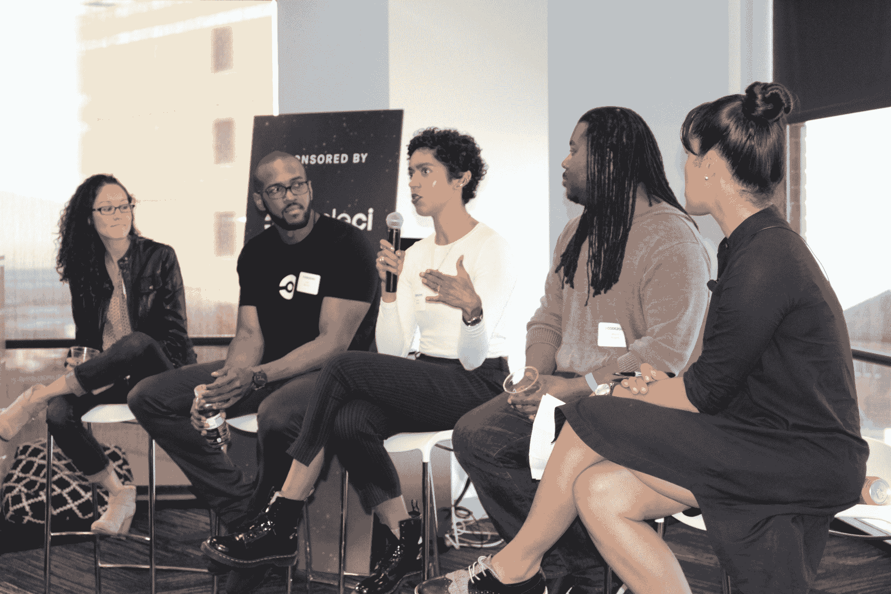

# 黑人和拉丁裔人才在科技领域获得成功的 10 种方式

> 原文：<https://circleci.com/blog/10-ways-to-get-ahead-for-black-and-latinx-talent/>

上周，我们与 [Code2040](http://www.code2040.org/) 合作，在 CircleCI 总部举办了他们的首次 PopUp 活动。PopUp 系列旨在吸引更广泛的社区，特别是新兴的黑人和拉丁裔技术专业人士。我们很高兴接待了 Code2040 团队，这是一个令人难以置信的特邀演讲者小组(包括我们自己的 Jose Browne！)和 75 名与会者。在整个晚上，我们探讨了领先的主题。小组成员讲述了他们作为拉丁裔和黑人技术专业人员的亲身经历，并分享了一些宝贵和来之不易的智慧。

小组成员包括 CircleCI 公司的工程师 Jose Browne 马尔科·罗杰斯，杠杆公司工程总监；雪莉·桑德伯格&戴夫·戈德堡家族基金会产品和人力运营主管雷娜·萨德勒·舍林格；Nadia Gathers 是 GitHub 的内部通讯人员，也是斯坦福大学教学团队的成员；以及主持人，Code2040 的社区动员高级主管米米·福克斯·梅尔顿。

> “15 年前，这里只有白人和我。我的旅程让我离我的人民越来越远。现在，能够坐在这个满是黑人和棕色人种的房间里，这只是在过去几年才发生的。我不得不说服自己这没什么大不了的，没关系的。我还在忘记这一点。你不能就这样让创伤过去。有更多的人在我身边，我感觉更好，更集中。在一个我不可能永远是黑人的地方，我可以是黑人。”—马可·罗杰斯

对于那些不能来的人，我们为你浓缩了 10 个最有价值的外卖。在 [Code2040 的博客](https://medium.com/@Code2040/10-ways-to-get-ahead-for-black-latinx-tech-talent-1bddb7fa5492)上查看它们。

再次感谢我们的合作伙伴 Code2040 和不可思议的小组成员，是他们让这一令人惊叹的活动得以发生！