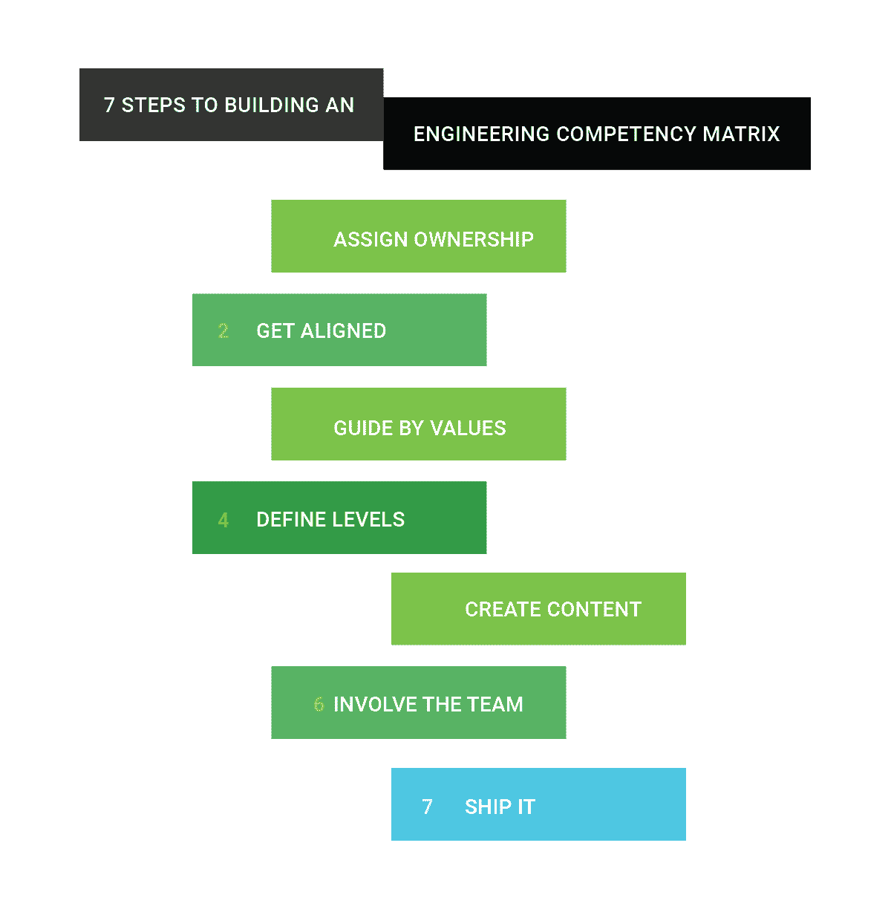

# 构建工程能力矩阵的 7 个步骤

> 原文：<https://circleci.com/blog/7-steps-to-building-an-engineering-competency-matrix/>

每个工程师都应该有一个清晰的成长路径，这样他们才能理解、规划和执行有意义的职业发展。为这种增长提供一个框架(我们称之为能力矩阵；它也被称为职业阶梯或职业发展阶梯)是一项重要的工作，也是任何想要培养和发展员工的组织的责任。回到 2018 年初，我们有 32 名开发人员，并计划在全年翻一番，我们已经有了一个能力矩阵，但它已经过时了。它专注于我们更初级的水平，在一些开发者已经达到的水平上最大化。它也与我们组织逐渐重视的技能不一致，这意味着在实践中，我们经常忽略它。是时候重新设计了。

建立一个新的能力矩阵是一个学习的过程，也是一个漫长的过程，大约需要八个月才能完成。在这个过程中，我们发现了我们重视的东西，以及建立职业阶梯的关键步骤是什么(以及哪些步骤是浪费的)。虽然每个矩阵都是不同的，并且会反映编写它的组织的价值观，但制作一个简洁的职业阶梯来指导您的团队的过程是一致的。

当我们在 12 月发布新的[工程能力矩阵](https://circleci.com/blog/why-we-re-designed-our-engineering-career-paths-at-circleci/)时，我们收到了许多来自团队的电子邮件，称他们正在开发类似的系统。因为这个反馈，我想分享我们所经历的步骤，以及我们所学到的教训，来帮助团队以更少的浪费和更短的时间达成一个富有成效的结论，而不是试图从头开始。

如果你想为你的员工和下属提供一个清晰、一致、定义明确的成长路径，那么这篇博文就是为你准备的。

### 第一步:让这个人优先考虑

回想起来，这是我们漫长的重新设计过程中最大的因素。我最初接手这个项目是作为我的许多副业之一。我唯一必须奉献给《黑客帝国》的时间是清晨、深夜和周末。这对我来说是一个充满激情的项目，我喜欢为它工作，但是我不能给它所需要的关心。

当我们的新工程总监莉娜·赖因哈德加入时，她将此作为她的第一个大项目。此后，我们密切合作，但她现在“拥有”它的事实让我立即意识到，我有限的可用性对这个项目的阻碍有多大。如果我在空闲时间继续驾驶它，我不知道我们是否会看到它在 2018 年完成。

如果你接手这个项目，给它应有的关注，把它交给某人，作为他们的首要工作。

### 第二步:就你正在构建的东西达成一致

除非所有利益相关者都同意你的目标，否则任何实施的尝试都会停滞不前。

能力矩阵是设定文化基调和方向的有力工具，因此在设计矩阵时，你将有许多有影响力的选择。每一个都有后果，只有团队团结一致，你才能度过难关。我们反复遇到的一个问题是:这是对现状的编纂，还是一种期望？(我们花了大约一半的时间才明确同意这是两者的混合。)

另一个关键的共识是:谁会受到影响？在我们的案例中，这个问题取决于我们的新矩阵是否会影响我们的站点可靠性工程师(我们认为会)。也许你正在为你的整个公司构建一个矩阵，或者也许你正在为你的前端开发团队构建一个矩阵。受影响的角色范围将极大地改变您选择编纂的能力，以及您需要使用的抽象层次。所以问这些问题，并得到明确的同意。

最后，我们需要就矩阵的目标达成一致。我们决定，首要目标是 CircleCI 工程师个人的绩效评估和发展规划。其次，我们希望用它来影响我们的招聘过程，并对外传达成为不同层次的工程师意味着什么。了解潜在的用途，以及这些用途的优先级，可以指导某些决策。

### 第三步:以你的价值观为指导

对我来说，这是整个过程中最有趣的部分。这是你坐下来讨论“什么对我们重要？”我们优秀的人力资源主管大卫·曼恩给了我们一些帮助，他拿着卡片详细列出了 100 种作为专业人士很有价值的行为特征。这些都不是具体的工程，从沟通到政治意识。我们还利用了其他公开的能力矩阵来播种什么样的*可能参与竞争的想法。*

 *作为一个团队，我们也喜欢提出自己的价值观。我印象最深刻的是经济思维，管理团队一直认为这是区分优秀开发人员和优秀开发人员的关键技能之一。我们没有从任何人力资源悬崖笔记或我们参考的其他矩阵中借用这种能力，但从一开始，这就是我们知道将在最终削减中的关键能力。

开始要宽，梦想要大！不如前期广撒网，后期合并切割。

一旦你有了一个清单，做几遍合并相似的能力是一个好主意，因为它会在以后的过程中节省你的时间。例如，我们合并了实用主义和经济思维，因为我们意识到这些能力的表现会导致相同的行为。

### 第四步:定义你的等级

在你真正开始填写内容之前，最好先定义一下矩阵的 x 轴:职位和职责的增长。在 CircleCI，我们已经有了我们想要使用的现有头衔(E1/E6 的助理软件工程师/首席软件工程师)。然后，我们明确地就每个标题的一般责任达成一致。

我们把它分成两类，都侧重于个人贡献者:E1，E2 和 E3 侧重于掌握软件工程的技能，成为一个高效的集成电路。E4、E5 和 E6 专注于利用这些技能来扩大影响，并在越来越多的人群中创造影响力。一旦我们有了这个高层次的指导，我们就把它进一步分解，给每一个执行层次分配范围。在我们开始创建内容之前，我们有以下指导原则:

*   E1 - E3:工程的实施
    *   E1:在任务范围内
    *   E2:项目内
    *   E3:团队内部
*   E4 - E6:利用技能扩大规模并产生杠杆效应
    *   E4:敬团队
    *   E5:至一组相关团队
    *   E6:至工程部

当然，这些是指导方针，不是规则。例如，我们期望 E4、E5 和 E6 以不同的频率为组织实践和流程做出贡献。职业发展，就像所有人类的追求一样，实际上比理论上更混乱。然而，通过预先设定明确的指导方针，你可以使低阻力路径变得容易，并利用你的时间专注于那些更困难、更混乱的部分。

### 步骤 5:创建内容

这一步肯定是最费力的。但是，如果您遵循了步骤 1-4，那么这一步对您来说会比对我们来说容易得多。在整个过程中，我多次试图解决这一步，但没有正确的框架来形成我的方法，我经常感到漫无目的和分散。一旦框架就位，填写内容就变得简单多了。

考虑到这一步的内容，我将把它进一步分解成子步骤。遵循这一顺序应该可以最大限度地减少任何浪费的工作。

1.  为所有能力定义一个级别
2.  寻找合并能力的机会
3.  填写其余的关卡
4.  作家

**步骤 5.1:为所有能力定义一个级别**

我强烈建议的第一步是为所有能力定义一个级别，比如你的高级软件工程师。与其试图描述 E2 和 E3 在提供反馈方面的细微差别，不如通过定义一个级别来具体说明每项能力的含义，这是一个非常有启发性和协调性的过程。

我们的方法略有不同，定义了两个瓦片:E3(最高级别的个人贡献者)和 E4(规模和杠杆的第一名)。考虑到我们执行和扩展的两种方法，这让我们更好地了解了 CircleCI 开发人员职业生涯中一个关键阶段的增长情况。

**第 5.2 步:寻找机会合并能力**

当你为每项能力定义一个级别时，令人惊奇的事情会发生:你会意识到一些价值观指向相同的行为。这是一个合并的机会！

在我们定义了单个级别之后，我们注意到我们有两个惊人相似的瓦片:自我启动和交付责任。尽管这些能力看起来不同，但是我们所编写的行为非常相似，因此我们将它们合并成一个单一的部分:可靠性和交付责任。

早些时候，我们达成了明确的协议，我们希望我们的矩阵是 CircleCI 开发人员增长情况的集体详尽定义，同时也尽可能简单。最终，我们获得了 27 项能力。然而，当我们开始 5.1 时，我们有将近 50 个。定义每种行为向我们展示了我们有机会巩固的地方。

步骤 5.3:填写剩余的关卡&文字师

现在你知道你的矩阵中有你想要的行为和能力，是时候填写剩下的单元格了！这一步需要做大量的工作，但是非常重要，因为它是矩阵的核心。

在这一步，将是开始言语表达的最佳时机。当你在痛苦地定义经济思维对一个团队或多个团队意味着什么的本质细节时，是批评你使用的语言是否恰当地传达了意图的最佳时机。我强烈建议不要在此之前进行文字修饰，但这将是一个很好的时间来重温你在第一遍中定义的图块。

**步骤 5.4:抛光&一致性**

我毫不怀疑在你定义每一个单幅图块的过程中，你会学到一些你想应用到你已经定义好的图块上的东西。大约进行到一半的时候，Lena 和我发现我们用“经常”和“通常”来表示同样的事情，比例大约是 50/50。由于一致性是我们的一大重点，我们决定“通常”并把它放在一个众所周知的停车场，以备后用。

我建议采用类似的方法。当你发现需要润色的机会时(比如用“通常”代替所有出现的“经常”)，把它们写下来，并把它作为你最后一遍的待办事项清单。这样，如果您的学习内容相互矛盾，您可以在应用之前解决这些冲突，最大限度地减少流失，并确保更大的一致性。

### 第六步:让受影响的人参与进来

太好了，你有一个能力矩阵，你完成了！实际上，不完全是。对我们来说，莉娜和我坐下来，写下一堆价值观和行为，让我们的工程副总裁签字，然后向全世界展示它是一个可笑的提议。这将影响我们的文化，我们的招聘，最重要的是，为所有与我们一起工作的人以及我们关心其职业生涯的人塑造职业发展。在设计它的几个月里，我们一直在测试矩阵的不同版本和方面，但现在是真正测试它的时候了。第一遍完成后，我们开始收集反馈。

Lena 以焦点小组的形式组织了一次出色的反馈会议，由各个级别的个人贡献者、经理和人力资源组成，包括异步和同步部分。有许多方法可以收集反馈，例如让不同部分的个人贡献者与他们的经理一起完成模拟自我评估。不管你怎么做，重要的是确保你从将会受到影响的人那里收集反馈。

我们收到的反馈非常有价值，原因有两个:它提出了一些好问题，这让我们调整了矩阵，使它传达了我们的意图。这一过程还确保了我们已经将组织的价值观，而不仅仅是几个经理的价值观，以及价值观的进步代表了我们的工程师如何看待他们的职业发展。这一步非常重要，它让我们相信我们开发的产品代表了我们想要的，并且会受到欢迎。

### 第七步:发货！

所有步骤中最好的一步——发货！你已经有了一个经过文字修饰和压力测试的成品，并且得到了组织中受人尊敬的个人的认可。然而，即使你遵循一个彻底的过程，它也永远不会是完美的。当人们开始使用和测试你创造的东西时，他们会发现细微的不一致和改进的机会。现在就为反馈做好准备，并且是持续的。

现在有了矩阵，你应该建立两个机制:一个收集反馈的方法和一个达成一致的解决时间表。不断地重复你的能力矩阵不是一个好主意，因为这意味着不断地改变你组织中职业发展的目标。然而，假装它是完美的，永远不会改变是有勇无谋的，也是不现实的。

我们已经开发了一个收集反馈的机制(剧透:这是一个谷歌文档),并将在六个月后重新访问矩阵，以解决我们所学到的问题。这提供了一个重要的稳定性级别，同时还允许随着时间的推移进行迭代和演进。我建议您提供一种机制来实现相同的目标。

祝贺您获得新的能力矩阵！希望这个指南能让这个过程比我们想象的更快更简单。

如果你对构建能力矩阵有自己的想法、经验或问题，我很乐意倾听！请随时通过电子邮件([justin@circleci.com](mailto:justin@circleci.com))或推特( [@JustinC474](https://twitter.com/justinc474) )联系我。

附言:想成为重视个人成长和职业发展的文化的一部分吗？我们正在招聘！

阅读更多信息:*