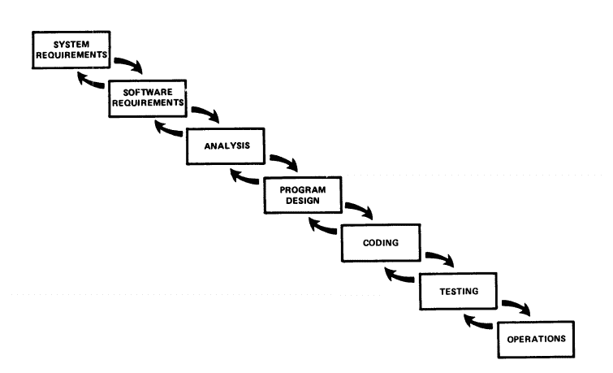

# DevOps 简史，第一部分:瀑布| CircleCI

> 原文：<https://circleci.com/blog/a-brief-history-of-devops-part-i-waterfall/>

这是一个四部分系列的第一部分。在这里看零件[两个](https://circleci.com/blog/a-brief-history-of-devops-part-ii-agile-development/)、[三个](https://circleci.com/blog/a-brief-history-of-devops-part-iii-automated-testing-and-continuous-integration/)，以及[四个](https://circleci.com/blog/a-brief-history-of-devops-part-iv-continuous-delivery-and-continuous-deployment/)。)

软件工程师醒着的大部分时间都在他们前辈的泥淖中跋涉。只有少数人有幸在冲突改变地形之前看到绿色的田野；其余的都运到了前线(终点)。在那里，当断电的炮弹在他们周围爆炸时，他们在战壕中煎熬。进展通常是缓慢的，尽管可以通过英勇的冲刺来覆盖地面。

但是老兵们确实出现了，伤痕累累，身经百战。他们热衷于向新兵讲述他们最大胆的壮举和漏洞。就像个人学到了写代码的个人经验一样，我们的行业也学到了大规模软件开发的集体经验。当你在地面上时，并不总是容易看到这些更大的趋势——埋在 bug 中，把火力集中在功能上。 [DevOps](https://aws.amazon.com/devops/what-is-devops/) 就是这些大趋势中的一个。这是两个传统上截然不同的世界统一成一个紧密的循环。但这不是最近的发明或时尚；这是多年迭代的结果，因为工程师已经将风险分解成越来越小的块。不是每个工程师都亲身经历过这个过程。对于那些错过了持续发展进程的人来说，在理解**为什么**或**我们如何**走到这一步上可能会有差距。

乔治·桑塔亚纳写道，“那些不记得过去的人注定要重复过去。”他写这篇文章的时候肯定没有想到软件，但他现在已经去世了，这意味着我可以断章取义地引用他的话。哦，公共领域的乐趣！

本系列将讲述软件开发方法的历史——尤其是它们与传统最佳实践相交叉的地方。你可以把它想象成硅谷的 *Silmarillion* ，只不过它更短，图片更多。在投入这湍急的时间之河之前，请注意，这个年表在理论上是完整的，实际上也在进行中。换句话说，即使一个术语或过程可能已经被创造出来，最佳实践也总是需要更多的时间才能渗透到实际产品中。涓涓细流是我们的起点。

## 瀑布

当软件开发还很年轻的时候，工程师们就在硬件世界中模拟他们的工作。这是一个犯错代价高昂的环境，因此在生产 1000 件产品之前消除缺陷是有意义的。例如，如果一家玩具公司决定一个填充的驼鹿也应该提供机智的政治评论，这个发现需要在开始生产之前发生在 T2。否则，他们会制造数以千计的静音驼鹿单元，每个人都知道那些卖不出去。

1970 年，Winston Royce 博士写了一篇名为[管理大型软件系统开发](http://www.txtscribe.me/athenaeum/waterfall.pdf)的文章。这篇文章概述了一个过程(如下所示),这个过程与硬件世界公认的方法有着惊人的相似之处。

*或简称 SSAPCTO】*

流程本身由几个阶段组成，在进入下一个阶段之前，每个阶段都必须全部完成**——相邻阶段之间的少量迭代除外。罗伊斯在他的论文中从未使用过瀑布这个词；事实上，最初将这个词与过程联系在一起的天才已经消失在历史中了。**

但是每个人都欣然接受了它，因为它是有意义的:正如瀑布向下流一样，软件开发的阶段也是如此。水(通常)不会向上流动——只有在受到压力时才会向上流动。多么出色的表现力！永远不要让别人说软件工程师没有激情、诗意的内核。

 </blog/media/2018-01-19-waterfall.mp4> 

Behold nature in all its Relatively Linear Sequential glory!

瀑布模型背后的意图是创建一个有条不紊的，不令人惊讶的生产周期。它的支持者大声宣扬它的优势:它甚至在编码开始之前就生成了大量的文档；它传递某种预先定义的东西；知道还剩下多少工作总是很容易的。理论上，这些听起来都很棒，但是瀑布开发在付诸实践时会受到影响。

### 压力下

虽然罗伊斯在概念上相信瀑布模型，但他认为实际的实现是“有风险的，会招致失败的”。这是因为该方法以不灵活著称。问题在于第一次就让每个阶段**完全正确**。从测试阶段吸取经验教训回到设计阶段的余地很小；这将破坏瀑布开发的真正目标:可预测性、确定性、一致性——所有那些保持事情缓慢和稳定的粘性好东西。

因此，具有讽刺意味的是，瀑布开发并不是非常流畅。在规模上，这种模式的移动速度不够快，无法利用软件的速度或适应市场不断变化的需求。因为时间表是最重要的，所以经常会有大规模的拖延和随后的死亡行军来保证火车准时。

 *“一个人不像开发硬件那样简单地开发软件。”——温斯顿·罗伊斯博士*

就像你的祖父母一样，瀑布开发是出于良好的动机，但是有点脱离技术循环。当项目坚持他们的瀑布枪时，通常会有大量的工作堆积。在软件世界中，这可能意味着在任何编码发生之前需要数月的设计和计划。当它完成时，产品[可能甚至不相关或者甚至不需要](https://en.wikipedia.org/wiki/Development_of_Duke_Nukem_Forever)！

## 敏捷的头脑

软件是建立在硬件之上的。

早期的软件从硬件那里获取指针，因为它不知道任何更好的东西。因此，软件开发人员继承了一种不太适合编写代码的开发策略。随着世界加速发展，公司意识到他们需要更加灵活。

瀑布经常被描绘成软件开发方法中的小丑。我们将它定义为与那些还没有成功地走向现代实践的“落后的传统主义者”保持距离。但事实是，瀑布开发一度是现实；如果没有它作为基线，我们就无法迭代到未来。

每个旅程都要从某个地方开始！在这个博客系列的例子中，那个地方是一个过时的实践——肯定会导致压力和戏剧性的紧张。

但是，当我们深入到[敏捷运动](https://circleci.com/blog/a-brief-history-of-devops-part-ii-agile-development/)时，这种戏剧性的紧张将在下一篇文章中得到解决！

### 来源

[http://www . base 36 . com/2012/12/agile-waterfall-methodologies-a-side-by-side-by-side-comparison/](http://www.base36.com/2012/12/agile-waterfall-methodologies-a-side-by-side-comparison/)https://en.wikipedia.org/wiki/Waterfall_model