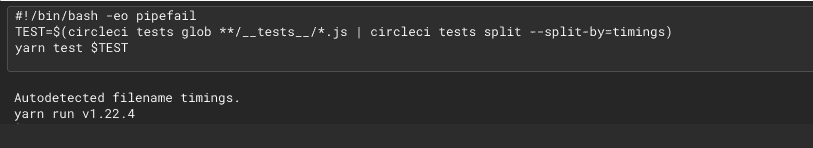

# 测试分裂指南| CircleCI

> 原文：<https://circleci.com/blog/a-guide-to-test-splitting/>

测试分割是在 CircleCI 上加速构建的最简单的方法之一。特别是，通过计时数据分割测试可以极大地改善构建时间。本教程描述了如何使用 CirlceCI 进行测试分割。我们将使用 jest-junit 设置一个 React.js 应用程序来保存测试结果，这样您就可以在后续运行中通过计时数据进行分割。

## 先决条件

*   [React.js](https://reactjs.org/) 的基础知识
*   系统上安装的 [Node.js](https://nodejs.org/en/)
*   一个[圆](https://circleci.com/signup/)的账户
*   [纱](https://classic.yarnpkg.com/en/docs/install/#mac-stable)包管理器(此流程也可应用于 npm)

[https://www.youtube.com/embed/zeukH6V_gEk](https://www.youtube.com/embed/zeukH6V_gEk)

视频

## 测试拆分会带来什么

CircleCI 接受一个测试列表，并将这些测试划分到 parallelism 键定义的多个节点上。每个节点都有自己独立的容器，所以每个节点都需要启动，检查代码，并执行运行测试所需的任何步骤。运行测试的步骤会使每个容器上运行的步骤在时间上有所不同。

> 了解为什么 CircleCI Rob Zuber 认为测试拆分是[智能 CI/CD](https://circleci.com/blog/intelligent-ci-cd-with-circleci-test-splitting/) 的重要组成部分。

如果启动容器、签出代码和安装缓存的依赖项需要大约 60 秒，那么您应该预期这在所有并行节点上都是一致的。这些步骤在所有容器中都是相同的。测试步骤是我们在每个容器上运行的唯一独特的步骤。这就是为什么并行度为 2 并不能将时间精确地减少 1/2。

在许多测试中，并行性大大减少了执行冗长步骤所需的时间。CircleCI CLI 分散测试，以便步骤尽可能以均匀的步调完成。也就是说，没有神奇的排比数。每个测试套件都是不同的，所以我们建议您尝试找到最适合您的节点数量。

## 用纱线测试分裂

要分割测试，您需要给 [CircleCI CLI](https://circleci.com/docs/local-cli/) 一个要分割的测试文件或类名的列表。

像许多其他测试套件一样，Jest 不接受作为文件或类名列表的测试文件。默认情况下，Jest 会寻找符合其[命名约定](https://create-react-app.dev/docs/running-tests/#filename-conventions)的文件。这不是问题。我们可以通过 Jest 查找测试文件的方式将测试文件打包，并将其作为标准输入传送到 CLI。

```
 - run:
                name: Test application
                command: |
                    TEST=$(circleci tests glob "src/__tests__/*.js" | circleci tests split)
                    yarn test $TEST 
```

该示例查找位于任何`__tests__`子目录中的任何`.js`文件。如果您的设置不同， [globster.xyz](https://globster.xyz/) 是一个非常有用的工具，可以用来试验像大括号扩展这样的 globbing 模式。

CLI 可以按名称、文件大小或历史计时数据进行分割(稍后将详细介绍)。目前，由于没有定义任何内容，CLI 将退回到按名称拆分。

## 按时序数据分割

对于大多数项目来说，通过计时数据分割测试是最快的。CircleCI 查看历史计时数据，并跨节点动态拆分测试，以使测试套件尽可能一致地完成。要启用按时间划分，设置您的管道来收集和存储测试结果。这一步我们将使用 jest-junit。

要使这项工作成功，您需要在我们的项目中添加一些东西。首先将它安装为一个开发依赖项:

```
yarn add --dev jest-junit 
```

接下来，将您的测试分割步骤更新为按时序数据分割:

```
 - run:
                name: Test application
                command: |
                    TEST=$(circleci tests glob "src/__tests__/*.js" | circleci tests split --split-by=timings)
                    yarn test $TEST 
```

接下来，您需要在`package.json`文件中做一些修改。

*   向`jest`配置添加一个`reporters`条目
*   添加一个`jest-junit`条目
*   让 jest-junit 知道向测试结果添加一个文件属性

CircleCI 需要这些信息来筛选计时数据。这些新增内容将确保测试结果得到正确存储:

```
...
  "jest": {
    ...
    "reporters": [
      "default",
      "jest-junit"
    ],
    ...
  }
  ...
  "jest-junit": {
    "addFileAttribute": "true"
  },
... 
```

接下来，让 CircleCI 知道它需要使用`store_test_results`步骤存储这些信息。使用`store_artifacts`步骤，可以将每个节点的结果保存为与作业相关的工件。这是我们最后的测试工作:

```
 build-and-test:
        docker:
            - image: cimg/node:12.16
        parallelism: 5
        steps:
            - checkout
            - node/install-packages:
                pkg-manager: yarn      
            - run: mkdir ~/junit
            - run:
                name: Test application
                command: |
                    TEST=$(circleci tests glob "src/__tests__/*.js" | circleci tests split --split-by=timings)
                    yarn test $TEST
            - run:
                command: cp junit.xml ~/junit/
                when: always
            - store_test_results:
                path: ~/junit
            - store_artifacts:
                path: ~/junit 
```

### 确认一切正常

要确认正在使用计时数据，请检查测试步骤的日志。

## 结论

就是这样！我们涵盖了并行运行测试套件和存储计时数据所需的一切。

本教程中使用的项目的完整存储库可从[这里](https://github.com/ryanpedersen42/circleci-react-test-splitting)获得。