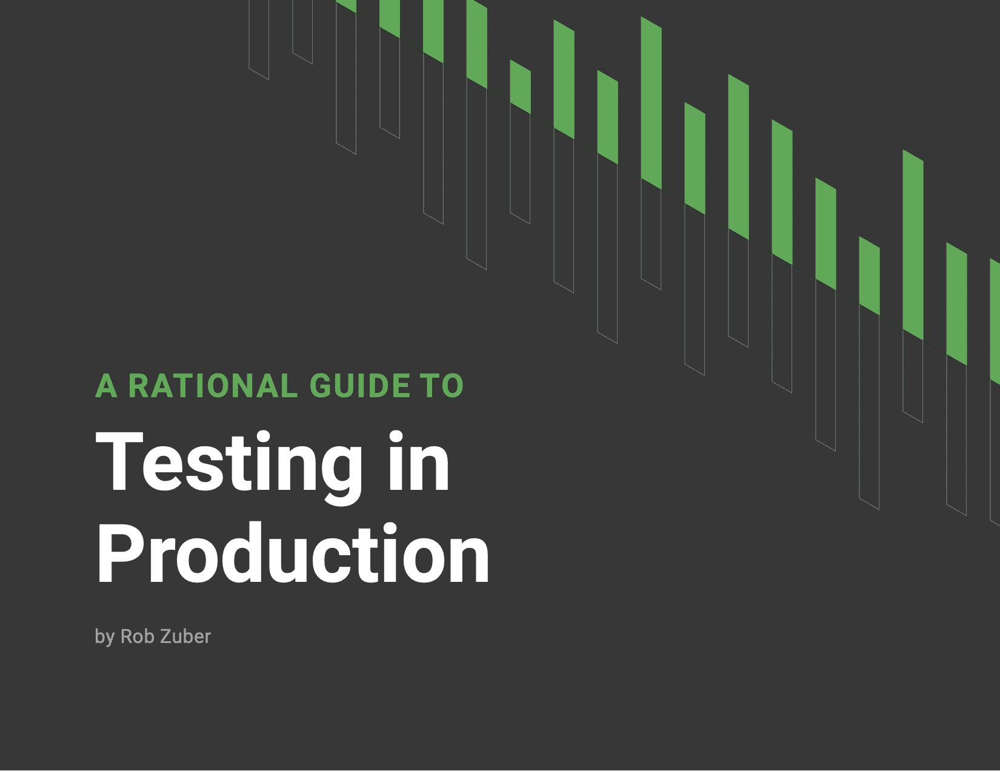

# 生产测试的合理指南

> 原文：<https://circleci.com/blog/a-rational-guide-to-testing-in-production/>

在过去的十年中，我们已经看到了软件的复杂性和复杂性的急剧增长。越来越常见的是，公司的代码库中只有一小部分实际上来自内部开发人员，这导致了变更验证的挑战越来越复杂。

作为回应，我们看到许多测试方法越来越受欢迎，包括“在生产中测试”的概念生产中的测试可能是一个令人困惑的术语，因为它经常与看起来不像传统测试的实践联系在一起。因此，我们认为生产中的测试是验证范围的延伸。当与其他测试方法结合使用时，生产验证可以帮助团队降低风险，因为第三方服务的使用越来越多，数据集越来越大等趋势使得在代码投入生产之前对其进行完全验证变得更加困难。

虽然在生产中进行测试的想法本身并不新鲜，但对于那些希望降低成本并收集关于其产品或工具性能的真实数据的团队来说，它最近已经从一个笑话演变成了一个可行的策略。

但是在生产中测试到底意味着什么呢？有什么好处？有什么风险？你怎么能安全地去做呢？

在这本电子书中，CircleCI 首席技术官 Rob Zuber 分享了他对生产测试在实践中的看法，对企业和客户的潜在风险，以及在什么情况下这是风险最低的方法。

[下载这本电子书](https://circleci.com/resources/testing-in-production/)了解更多关于持续验证的概念，以及如何对你的团队的测试工具和策略做出明智的决定。

