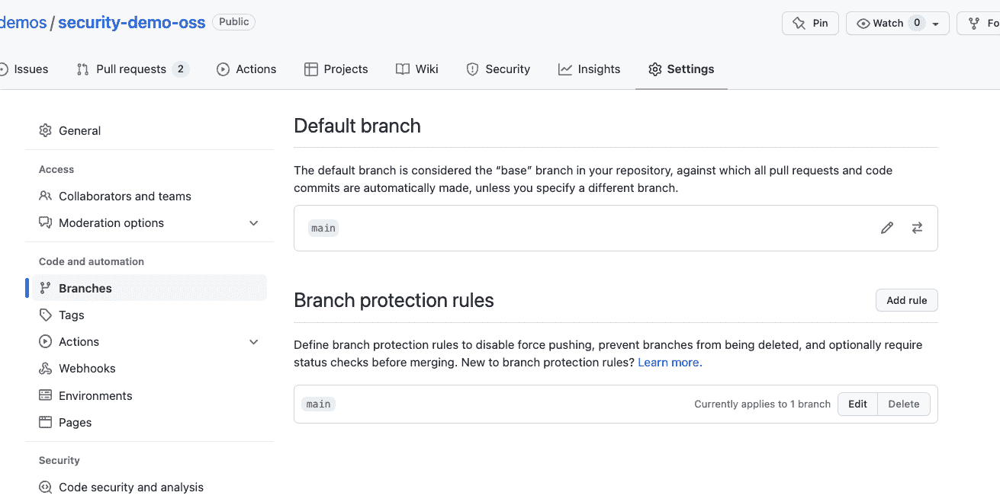
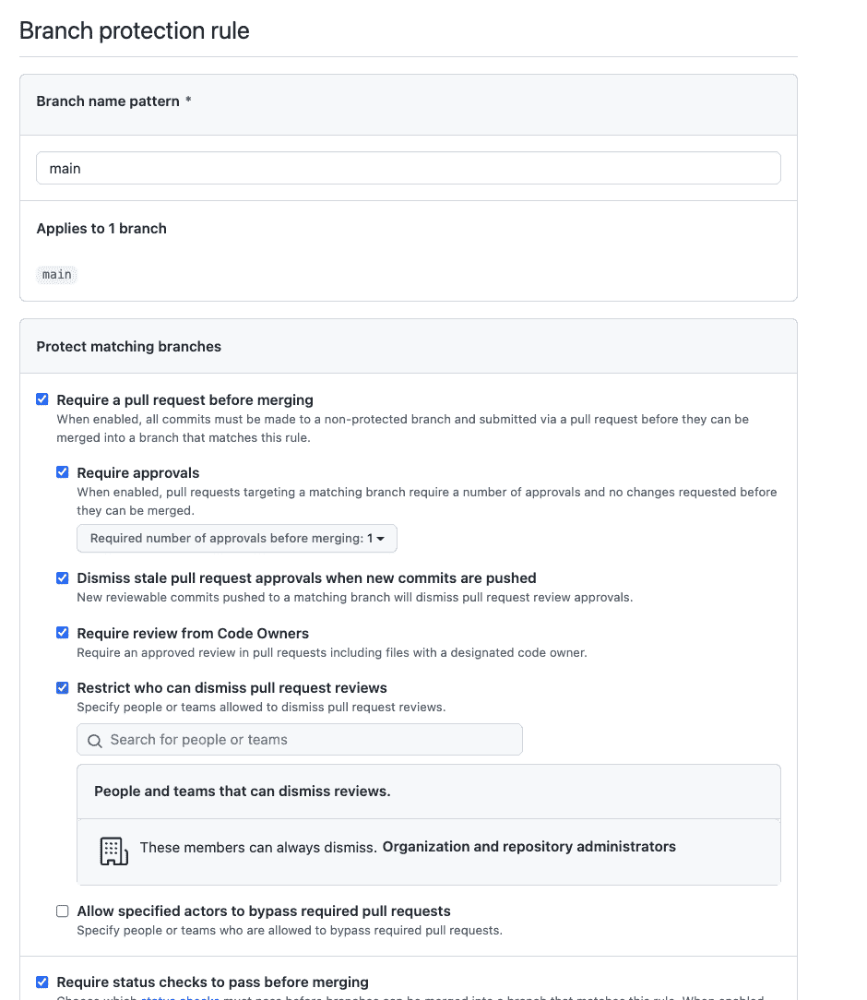
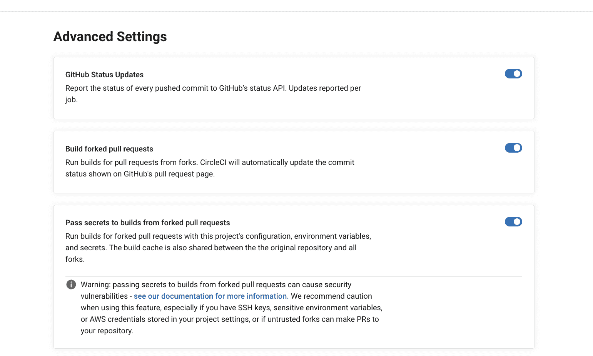

# 在 CI/CD 管道中实现访问控制策略

> 原文：<https://circleci.com/blog/access-control-cicd/>

> 本教程涵盖:
> 
> 1.  GitHub 中受保护的分支和安全组
> 2.  在 CircleCI 中使用上下文
> 3.  在 CircleCI 中设置审批作业

想象一下你自己处于这种情况:你是一个积极的、熟练的 DevOps 或 DevEx 工程师。您计划实施自动化、完整的 [CI/CD 管道](https://circleci.com/blog/what-is-a-ci-cd-pipeline/)。您知道如何去做，并且您知道额外的生产力和自动化将如何使您的团队和整个公司受益。但是出于安全考虑，该项目从未被批准。

许多组织，尤其是那些受监管行业的组织，对发布他们的软件有严格的要求，这是理所当然的。谁可以触发一个发布，什么时候，在什么条件下，以及在发布开始之前需要什么样的特定检查，都必须是严格控制的、可审计的和可逆的。

这些复杂的过程通常需要一个专门的交付经理来收集所有相关的特性简介、测试数据、安全评估和回滚计划，并提交给公司的决策者委员会。该团队可以为交付经理的部署开绿灯，通常也是按照特定的时间表。

还有另一种方法。您可以建立有效的和完全自动化的 CI/CD 管道，其中包括人工交付经理和批准委员会可以完成的所有检查。本教程将向您展示为管道创建细粒度访问控制的方法。您可以将这些方法用于企业严格管理的内部公司项目，也可以用于流行的开源项目。

## 先决条件

本教程假设您有使用 CI/CD 管道的经验，最好是 CircleCI。要实现这些步骤，您还需要对 GitHub 和 CircleCI 组织的管理员访问权限(以及这两个服务的帐户)。

如果您没有 GitHub 组织的管理员权限，您可以在 GitHub 中创建一个免费的，并与免费的 CircleCI 帐户一起使用。

## 企业项目中 CI/CD 管道的访问控制

对于企业组织来说，遵守现有的检查并进行良好的沟通是至关重要的。该过程通常包括在继续发布之前，对支持文档和对业务的潜在影响进行手动检查。我将指导您实现一个管道，该管道自动执行许多验证步骤，并在专门的交付经理手动批准流程后，仅在继续部署到生产*。*

要实现访问控制，您需要设置一些东西:

*   GitHub 中受保护的分支
*   GitHub 中的安全组
*   CircleCI 的语境
*   CircleCI 的审批工作

### 受保护的分支

设置受保护的分支是设置访问控制的第一步。受保护的分支禁止团队成员将代码直接推送到该分支，而是强制所有的变更通过拉请求(PR)过程。通常你会保护你用来创建发布的分支；`main`比如说。您可以在 repo 的设置中切换受保护的分支。



您还可以指定规则和例外，例如审查要求、合并前需要通过的检查、历史规则等等。



在我的例子中，我将我的`main`分支设置为一个受保护的分支，需要通过审查和 PR。

### 设置安全组

如果没有正确上下文权限的用户触发了 CircleCI 管道(例如，通过提交)，则需要该上下文的作业将被标记为 403(未授权)。

在我们的组织中，我们将建立两个安全组:`development-leads`和`delivery-managers`

您组织中的所有开发人员都可以推进到他们自己的分支并发布拉请求，但是应该只要求团队领导审查任何新的拉请求。只有团队领导批准，变更才能合并到受保护的`main`分支中。然后，当交付经理获得放行许可时，他们就是触发软件发布的人。在本教程中，我们将为他们创建一个单独的安全组。

CircleCI 将使用这些带有上下文的安全组来限制哪些作业可以由谁来执行，以便只有交付经理可以手动触发它们。

### 使用 CircleCI 上下文

CircleCI 的语境有双重作用。一个角色限制与作业共享的机密范围，而另一个角色控制访问权限。

只有在工作流中指定了上下文的作业才能将上下文的秘密用作环境变量。在 CircleCI 中，上下文在整个组织中共享，因此它们可以在多个项目中重用。您可以使用 CircleCI 仪表板左侧的“组织设置”菜单进行设置。

对于访问控制，您可以为任何上下文指定安全组。对于本教程，
,我们将创建一个名为`release`的上下文，并为其指定`delivery-mgrs`安全组。

现在您可以设置您的管道了。示例项目使用以下流程:

1.  试验
2.  安全扫描
3.  开发环境部署
4.  交付经理的审批工作
5.  生产部署

```
workflows:
 build-test-deploy:
   jobs:
     - test
     - security-scan:
         context: security
     - deploy-app:
         name: deploy-app-dev
         env: dev
         context: deployment-dev
         requires:
           - test
           - security-scan
         filters:
           branches:
             only:
               - main
     - approve-for-prod:
         type: approval
         requires:
           - deploy-app-dev
     - deploy-app:
         name: deploy-app-prod
         env: prod
         requires:
           - approve-for-prod
         context: release-prod 
```

管道使用环境变量的上下文，比如我们的 API 键，但是也使用`release-prod`上下文。`release-prod`上下文是封闭的，因此它只能由交付经理使用。

### 设置审批作业

难题的最后一块是审批工作:`approve-for-prod`。从技术上讲，任何人都可以登录并批准此作业。然而，它后面的`deploy-app-prod`作业使用`release-prod`上下文，该上下文只接受交付经理的凭证。如果没有这些凭证的人批准了它，发布作业将失败，并出现一个`unauthorized`错误，整个管道将失败终止。

### 其他有用的零碎信息

我们在工作流中设置的另一个控件是分支过滤器。由于这个过滤器，开发部署将只发生在`main`分支上。`main`分支被标记为受保护的，所以将代码放到`main`分支上的唯一方法是通过自动检查和代码审查，可能是由首席工程师进行。

您还可以使用需要人工批准的专门 QA 或安全审查步骤。将它们作为链条的一部分来构建。

## 开源项目的注意事项

到目前为止，我们已经讨论了访问控制的企业用例。大多数 OSS 项目没有像企业一样严格的遵从要求。相比之下，这些项目需要向更广泛的人群开放他们的贡献。这意味着允许更多的人触发管道。

通常发起并拥有一个流行的 OSS 项目的公司会继续雇佣核心贡献者。不属于该公司的其他定期贡献者和维护者可能会加入他们。然后是其他人——任何偶尔会贡献一个补丁或功能的人。

对于这种情况，您可以设置三个流:

1.  **公司内部流程**。成员贡献和管理一切。公司员工可能是唯一被允许发布新版本软件的人。我们可以称他们为“内核贡献者”。
2.  **半内流**。这些成员是组织的一部分，将能够直接推进到主要的 OSS 库。他们将能够使用 CircleCI 做任何事情，包括用 SSH 调试作业和触发管道。称他们为“外核贡献者”。
3.  **标准流程**。社区中的其他贡献者可以发布 PRs，否则自己工作。我们称他们为“社区贡献者”。

对于社区贡献者。流程是标准的:创建一个 fork，然后打开一个 pull 请求。您可以切换 CircleCI 来构建将自动验证其更改的 pull 请求。

您应该仍然有一个受保护的分支和必需的检查。

对于核心贡献者群体，您可能也想包含一些秘密。秘密需要更多的工作。此外，通过 forks 传递秘密本身就不安全。任何人都可以通过修改他们 PR 中的管道来获取你允许传递的任何秘密。这可能包括某些服务的 API 密钥，或者项目分发位置的凭证。

一种选择是完全避免将秘密传递给 forks。您将不得不在审查任何代码之后将其推入您自己的组织，在那里它可以被执行，然后被合并到您的默认分支中。有篇很有帮助的文章[解释了流程](https://circleci.com/blog/triggering-trusted-ci-jobs-on-untrusted-forks/)。

另一个选择是*允许*将秘密传递给 forks，但是防止这些秘密被共享，除非代码已经被团队成员彻底审查和批准。您可以在 CircleCI 项目设置中进行设置。



如果您切换密码，您将需要设置一个批准作业。将任何秘密放在一个只有属于该上下文的人才能访问的上下文中。

**注意:** *如果您使用这种方法，请确保您组织中的所有**上下文都指定了安全组。如果您不这样做，恶意的参与者可能会在执行的 PR 中猜测您的上下文名称，并从中提取环境变量。***

有了贡献者的内部和外部核心，您可以用非常相似的方式设置访问控制。也许只有内核可以发布新版本，但是在外核的任何人都可以合并任何拉取请求。或者也许你只有一组核心维护人员，他们可以做任何事情。细节由你决定！

## 结论

在本文中，我们研究了如何通过设置访问控制来进一步保护您的 CI/CD 管道，将管道的某些部分(以及相关的凭证)封锁给有限范围的人员。这是一种通用的方法，适用于企业组织和 OSS 项目。

我们使用 CircleCI 中的安全组、受保护的分支、上下文和批准作业来实现这种效果，对于 OSS 和专有项目都是如此。尝试适合您组织的最佳配置，安全可靠地发布您的应用程序。