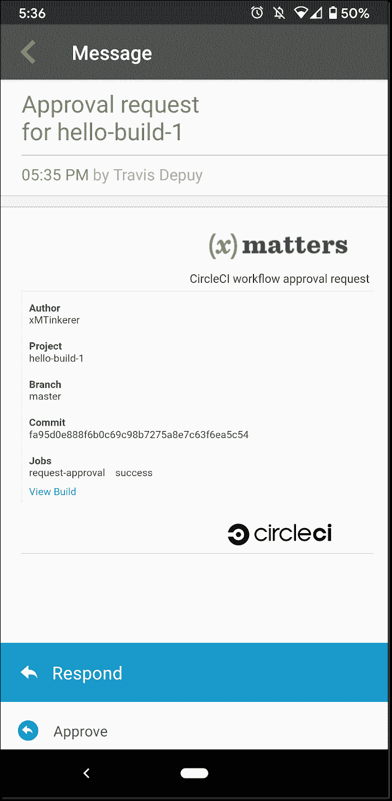

# 将审批作业添加到 CI 渠道| CircleCI

> 原文：<https://circleci.com/blog/adding-approval-jobs-to-your-ci-pipeline/>

明确的批准过程可以帮助减少生产问题，提供审计跟踪，并让您的组织相信您的工程团队正在部署正确的代码。

在本文中，我们将详细介绍如何在您的[持续集成](https://circleci.com/continuous-integration/)管道中设置一个批准作业，以便您的开发人员必须在 [CI 管道](https://circleci.com/blog/what-is-a-ci-cd-pipeline/)部署到生产之前请求批准。

## 它是如何工作的？

一个`request-approval`作业被添加到您的管道中，利用 [xMatters orb](https://circleci.com/developer/orbs/orb/xmatters/xmatters-orb) ，它将工作流的细节传递给 [xMatters](https://www.xmatters.com/) 。然后，xMatters 将通知发送到一系列设备，以到达当前的随叫随到批准资源。使用响应选项，批准人可以选择批准或拒绝请求。在批准时，请求 CircleCI 的[批准作业 API 端点](https://circleci.com/docs/api/v2/#operation/approvePendingApprovalJobById)。

让我们来看一下如何设置您的批准请求，以便您可以在生产代码发生任何更改之前对其进行监督。

## 先决条件

首先，您需要以下内容:

*   一个[圆](https://circleci.com/signup/)的账户
*   一个 [xMatters](https://www.xmatters.com/signup) 账户
*   需要审批作业的项目的回购

我们将讨论的批准流程使用 [approve a job](https://circleci.com/docs/api/v2/#operation/approvePendingApprovalJobById) API 调用来批准作业。对于各种工具来说，这样做的过程是相似的，但是这篇文章将集中在使用 [xMatters](https://www.xmatters.com/) 上。

## 配置 CircleCI

在高层次上，我们需要更新`.circleci/config.yml`文件，设置`XM_URL`值，然后将个人令牌存储在 xMatters 中。让我们开始吧。

这是一个简单的构建、保持、请求批准和部署配置文件。

```
version: 2.1

orbs:
  xmatters: xmatters/xmatters-orb@1.0.4

jobs:
  build:
    docker: 
      - image: circleci/node:4.8.2
    steps:
      - run: echo "Building building building!"

  request-approval:
    docker:
      - image: circleci/node:4.8.2
    steps:
      - xmatters/notify:
          recipients: Engineering Managers

  deploy-stuff:
    docker:
      - image: circleci/node:4.8.2
    steps:
      - run: echo "Deploy stuff here"

workflows:
  build-test-and-approval-deploy:
    jobs:
      - build
      - request-approval
      - hold:
          type: approval
          requires:
            - build
            - request-approval
      - deploy-stuff:
          requires:
            - hold 
```

这里要注意的项目是`hold`和`request-approval`作业。您可以在 workflows 部分看到，标记为类型`approval`的挂起作业依赖于`build`和`request-approval`作业的成功执行。然后`deploy-stuff`作业取决于`hold`作业的批准。这意味着只有当应用程序成功构建并且使用 xMatters orb 的`request-approval`作业被执行后，才能批准`hold`。审批作业没有要执行或运行的步骤，它们只是一个工作流构造。

我们的目标是`Engineering Management`组，以便当前的电话技术经理可以批准(或拒绝！)管道。一旦挂起作业被批准，管道继续执行`deploy-stuff`作业，代码被部署到生产环境中。

我们需要在 CircleCI 的项目设置中设置`XM_URL`值。在此之前，我们将获取一个个人 API 令牌，以便 xMatters 可以正确地进行身份验证。进入你的账户设置，选择**个人 API 令牌**标签。


点击**创建新令牌**并将值复制到文本文件，直到我们准备好使用它。

## 配置 XML 模式

接下来，转到您的 xMatters 实例并导航到**工作流**屏幕。点击**导入工作流**，找到`CircleCI.zip`文件。这个文件可以从 repo 下载，[这里](https://github.com/xmatters/xm-labs-circleci-orb)。导入后，点击进入工作流程并导航至**流程**选项卡。将会列出两个画布。在这种情况下，我们需要**批准请求**，它具有处理大多数响应的逻辑。


单击画布，在右侧显示步骤面板中的步骤。


我们在这里获取入站 URL，所以双击左上角的**批准请求-从 CircleCI** 入站步骤。这将显示带有我们的入站 URL 的 **HTTP 触发器**对话框。复制这个值并保存起来以备后用。


退出该窗口并导航回**工作流程**。点击导航菜单底部的**管理齿轮**，点击**自定义字段**。这些字段是与用户相关的元数据。这是我们存储访问令牌的地方。


点击**添加字段**，并将其命名为“CircleCI Token Plain”。

**注意** : *使用此名称很重要，因为它将在流设计器画布上的“查找用户属性值”步骤中使用。如果您在这里使用不同的名称，请确保也在那里更改名称。*

将类型设置为`Text`。点击**保存**。然后，我们将向用户添加令牌。如果是你的令牌，点击右上角的用户名，然后点击**个人资料**。


找出我们从 CircleCI 复制的个人令牌，并将其粘贴到我们刚刚创建的字段中。


**注意** : *此令牌以纯文本形式存储，但只有您和您的主管有权查看此值。我们正在评估存储该令牌的其他方法，因此请密切关注这一领域的变化！*

最后，回到 CircleCI，导航到需要批准的项目。确保选择管道列表中的项目，因为这将启用右上角的**项目设置**按钮。单击此按钮将显示项目的设置。我们将添加`XM_URL`值作为一个新的环境变量。


最后一步需要设置接收者。如果您的目标是一个组，请导航到 **Groups** 部分，创建一个新组，并添加适当的用户。

**注意** : *您需要在个人资料中填写您自己的令牌。*


## 测试和批准

就是这样！当管道被触发时，它将在我们在`.circleci/config.yml`文件中配置的`hold`步骤暂停。


这将向我们在上面的`Create xMatters Event`步骤中定义的用户触发一个通知。指定的收件人将收到通知，其中包含管道详细信息以及必要的响应选项。这是它在 xMatters 移动应用程序上的外观，但电子邮件非常相似。右侧的图像打开了响应抽屉，显示了可用的响应。

 

就像这样，选择 **Approve** 使 API 回调 CircleCI 以批准管道并将您的代码部署到生产环境中。

