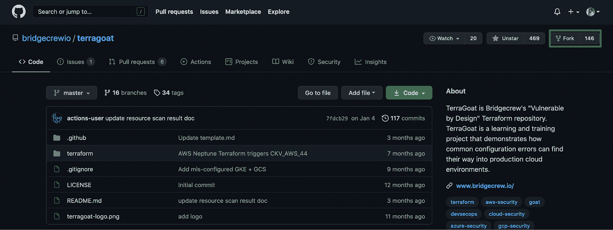
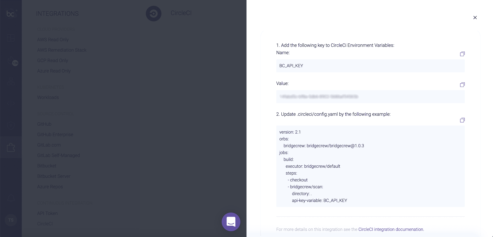
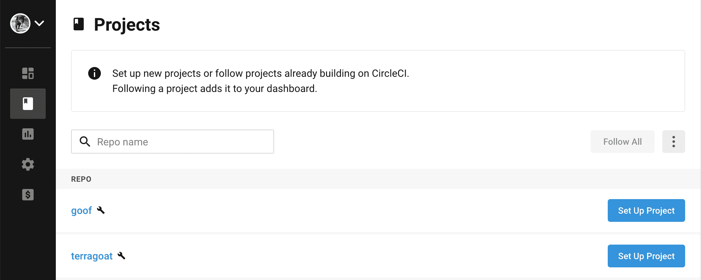
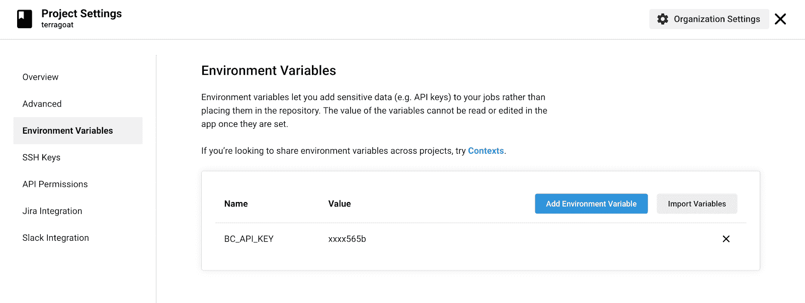
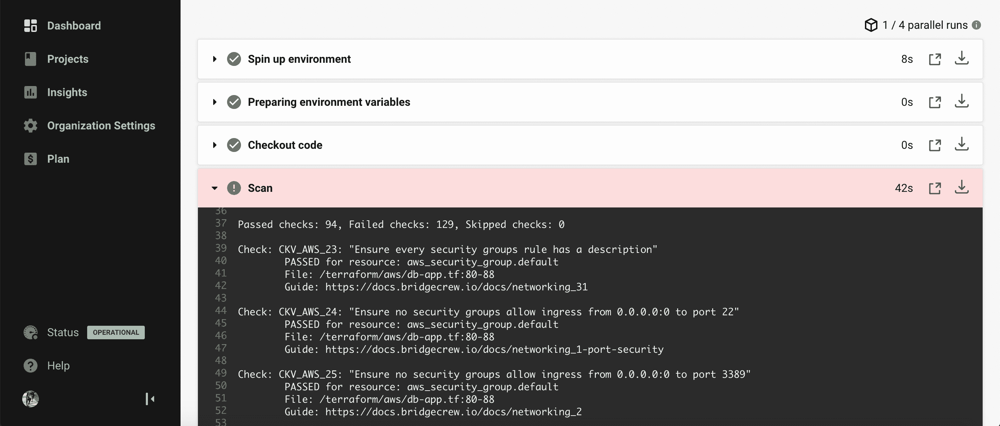
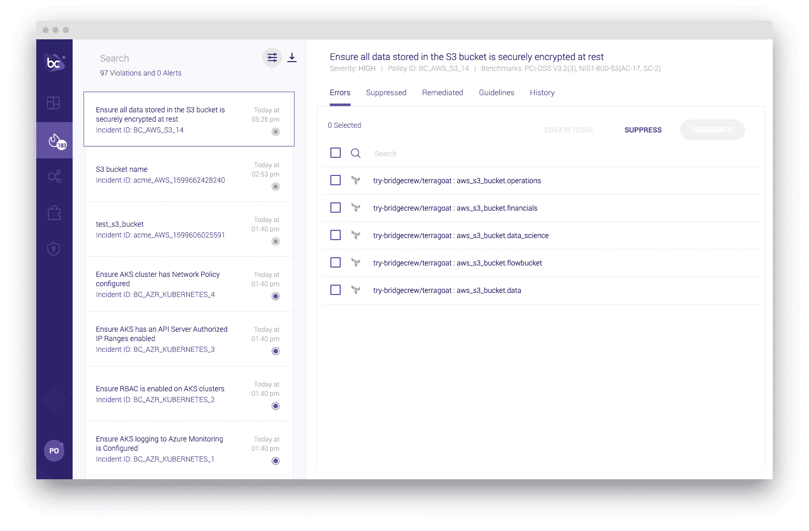

# 将 IaC 安全扫描添加到您的 CI 管道| Bridgecrew 和 CircleCI

> 原文：<https://circleci.com/blog/adding-iac-security-scans-to-ci-pipelines/>

随着工程师们寻求更快、更高效地部署云基础设施的方法，近几年来，[基础设施作为代码](https://circleci.com/blog/how-do-i-iac/) (IaC)的采用量激增。IaC 是指使用机器可读语言(代码)管理和配置基础架构的技术和流程，而不是低效的手动操作。像 Terraform 和 [Pulumi](https://www.pulumi.com/) 这样的语言和框架，提供了一种统一的语言来编纂基础设施，并简化跨不同环境和提供商的云编排。云提供商使用原生 IaC 框架，如 AWS CloudFormation 和 Azure Resource Manager (ARM ),将手动、一次性流程转变为一致、可扩展和可重复的供应。

## 将云安全转移到 IaC

IaC 将基础架构部署向左转移，为自动化、扩展和保护云环境提供了新的机会。

从历史上看，团队不得不在事后处理云安全。他们通过在运行时对违反策略的情况进行资源监控来做到这一点。即使有了自动化，对于需要被动解决已识别问题的工程师来说，这种方法也会变得既耗时又费力。通过将云基础设施外推到代码中并将其嵌入到开发生命周期中，团队现在可以预防性地解决云安全问题。

有了 IaC，除了容器扫描、依赖扫描、SAST、DAST 等，您还可以实施安全最佳实践。然而，为了使 IaC 安全真正有效，它必须嵌入到自动化 CI 管道中。

**有关 CI/CD 安全最佳实践的更多信息，请阅读我们的[CI/CD 安全和开发安全终极指南](https://circleci.com/blog/security-best-practices-for-ci-cd/)**

## 安全实施入门

如何发现用于构建 AWS、Google Cloud、Azure 和 Kubernetes 资源的基础设施中的政策违规和错误配置？将物联网安全扫描添加到您的 CI 渠道中。Bridgecrew 通过持续扫描基础设施来识别已知的安全漏洞，并提供代码来修复这些漏洞。例如，以下是一些经常被忽视的政策:

*   确保存储在 S3 存储桶中的所有数据在静态时都得到安全加密
*   确保没有安全组允许从 0.0.0.0:0 进入端口 22
*   确保存储在发布配置 EBS 卷中的所有数据都得到安全加密

为了使 IaC 安全高效可行，it 需要提供一致的反馈。获得这种一致性的最佳方式是将 IaC 安全性嵌入到您的自动化 CI 管道中。我们将使用 [Bridgecrew CircleCI orb](https://circleci.com/developer/orbs/orb/bridgecrew/bridgecrew) 来自动化每次提交的 IaC 安全性。

## 先决条件

要跟进，你需要几样东西:

1.  一个[圆](https://circleci.com/signup/)的账户
2.  GitHub 的一个账户
3.  一个 [Bridgecrew](https://www.bridgecrew.cloud/?utm_source=circleci-blog&utm_campaign=adding-iac-security-scans-to-ci-pipelines) 账户

## 分叉错误配置的地形项目

在本教程中，我们将分叉 Bridgecrew 的“设计脆弱”项目，TerraGoat。前往 [TerraGoat 项目](https://github.com/bridgecrewio/terragoat)并将其转入你自己的 GitHub 账户。



在你的分叉项目中，选择**添加文件**，然后**创建新文件**。将文件路径设置为`.circleci/config.yml`，并添加以下 CircleCI 配置:

```
version: 2.1
orbs:
    bridgecrew: bridgecrew/bridgecrew@1.0.3
jobs:
    build:
      executor: bridgecrew/default
      steps:
        - checkout
        - bridgecrew/scan:
            directory: .
            api-key-variable: BC_API_KEY 
```

滚动到底部并选择**直接提交到主分支**。这将把 Bridgecrew orb 添加到我们接下来要创建的 CircleCI 管道中。

## 使用 Bridgecrew 实现自动化 IaC 安全

前往 Bridgecrew 平台中的 [CircleCI 整合](https://www.bridgecrew.cloud/integrations/circleci/addProject/?utm_source=circleci-blog&utm_campaign=adding-iac-security-scans-to-ci-pipelines)页面。在那里，您将找到环境变量、您的 API 键以及我们刚刚添加到我们的存储库中的 CircleCI config.yaml。



我们的下一个任务是将集成添加到 CircleCI 中。进入 [CircleCI 项目页面](https://app.circleci.com)。如果设置了 GitHub 集成，那么新分叉的 TerraGoat 项目将会列出。



选择`terragoat`旁边的**设置项目**。选择**使用现有配置**和**开始构建**。构建将会失败，因为我们没有将 API 键作为环境变量[添加。为此，请转到**项目设置**并选择**环境变量**。选择**添加环境变量**。从 Bridgecrew 集成页面添加`BC_API_KEY`和您的 API 密钥。](https://circleci.com/docs/env-vars/)



新的构建应该开始。如果没有，选择**从构建旁边的开始**重新运行工作流。如果您打开管道和**扫描**部分，您可以找到在构建过程中失败的所有检查。



由于列出了 129 个失败的检查，此构建失败。为了防止这种情况，您可以通过跳过不相关的检查来自定义您组织的防护栏，或者您可以在没有使构建失败的情况下触发失败检查的警报。

## 更进一步

要按严重性、类别或合规性基准对事件进行进一步调查，您可以前往 Bridgecrew 平台。一旦到了那里，您就可以深入问题，了解它们的影响和受影响的资源，并根据需要修复代码。



有了拉式请求集成，您可以立即将补救推送到您的 VCS、合并并重新构建。这种连续的工作流是确保错误配置不会部署到调配的云资源中的最佳方式。🙌

## 结论

IaC 帮助云原生团队将其基础设施提升到一个新的水平，带来与速度、可扩展性、成本节约和安全性相关的好处。通过自动化您的 IaC 安全，您可以利用 IaC 固有的不变性来强化您的云安全状况并节省时间。