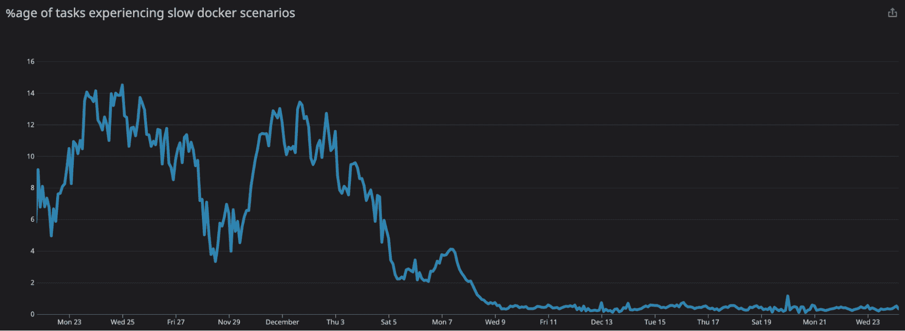
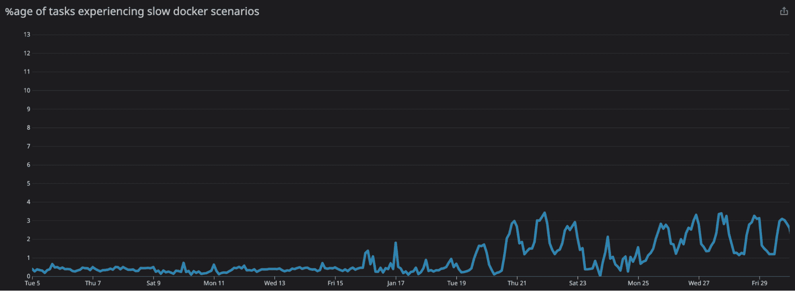

# 改进 Docker 容器管理和性能的指标

> 原文：<https://circleci.com/blog/adding-metrics-for-docker-container-performance/>

当运行云服务时，让客户成为第一个注意到问题的人从来都不是好事。在几个月的时间里，我们的客户遇到了这种情况，我们开始积累一系列关于码头工人工作不可预测的启动时间的报告。起初报告很少，但频率开始增加。具有高度并行性的工作在报告中出现得不成比例。

虽然我们怀疑哪些部分的旋转速度较慢，但我们还是想确定一下。首先，我们查看了报告问题的具体工作。为了帮助解决这个问题，我们改进了启动步骤中的日志，以便它们显示每个阶段花费的时间。日志显示，在问题案例中，下载、提取和创建阶段花费的时间最多。

原因如下。当 Docker 作业启动时，我们会查看用户在其配置中指定的 Docker 映像列表，并提取所有映像以确保它们位于主机虚拟机的映像缓存中。拉取图像是每个图像层的多个阶段的结果:

*   在下载过程中，我们从 Docker 存储库中获取压缩层
*   在提取期间，该层被解压缩
*   然后，我们在配置中为每个图像创建一个容器
*   然后，作业步骤在主容器中运行

这个过程重复 *n* 次，其中 *n* 是作业的并行度。作业的每个实例都被称为一个“任务”。使用这些定义，可以清楚地了解为什么具有高并行性的作业可能会受到更大的影响。这份工作只是将“放慢速度”掷出更多次。

更糟糕的是，我们自己也无法快速轻松地发现问题。我们决心解决客户的报告，但我们也想确保我们将来更有可能自己发现问题。我们在制定解决方案时考虑了这两个想法。

## 我们的方法

最初，我们需要回答下载、提取和创建阶段的以下问题:

*   典型的表现是什么样的？
*   “慢”是什么意思？
*   事情“慢”的频率有多高？

## 衡量绩效

我们开始研究如何为下载、提取和创建这三个阶段中的每一个阶段生成度量。事实证明，跟踪层下载和提取的性能有点棘手。

*   Docker 的 pull API 并不直接提供下载或提取图层所需时间的详细汇总信息。
*   pull API 只提供了一个 JSON 消息流，用于生成进度条。如果您曾经在命令行上运行过 docker pull，您可能对消息流很熟悉。

经过对消息流的深思熟虑，我们发现，通过合计跨每一层和下载/提取阶段传输的时间和数据，我们可以产生相当准确的性能指标。

幸运的是，测量容器创建的性能就像添加一个计时器一样简单！

除了将这些数据输入我们的指标处理系统之外，我们还将这些数据包含在启动步骤的日志中:

```
...
Starting container cimg/go:1.16
  image cache not found on this host, downloading cimg/go:1.16
1.16: Pulling from cimg/go
...
Digest: sha256:6621f92d57703a89f82d20660e8947aa00eb07baba90be16e64666a3c726077c73MB/1.873MBB
Status: Downloaded newer image for cimg/go:1.16
  pull stats: download 124.3MiB in 1.283s (96.84MiB/s), extract 124.3MiB in 2.806s (44.28MiB/s)
  time to create container: 3.201s
  using image cimg/go@sha256:6621f92d57703a89f82d20660e8947aa00eb07baba90be16e64666a3c726077c
Starting container circleci/postgres:12.4-ram
  image cache not found on this host, downloading circleci/postgres:12.4-ram
12.4-ram: Pulling from circleci/postgres
...
Digest: sha256:368f896494f6cc56cbd1993b1f789548e78a1348e88e94a79aeca7c6ca8f8ac328kB/8.228kBB
Status: Downloaded newer image for circleci/postgres:12.4-ram
  pull stats: download 108.1MiB in 1.099s (98.33MiB/s), extract 108MiB in 3.853s (28.03MiB/s)
  time to create container: 2.973s</b>
  using image circleci/postgres@sha256:368f896494f6cc56cbd1993b1f789548e78a1348e88e94a79aeca7c6ca8f8ac3
Time to upload agent and config: 1.256190772s
Time to start containers: 1.347100754s 
```

## 决定什么是“慢拉”

CircleCI 不控制下载速度；它依赖于外部托管的 Docker 存储库的性能。在可能的情况下，我们确保能够快速连接到流行的存储库，包括 Docker Hub 和 Amazon 的 ECR。谷歌似乎在 GCR 速度方面做得很好，尽管我们的连接依赖于公共互联网。根据我们的指标得出的数据，我们选定 20 MiB/s 作为一个好指标。

Extract 在我们的控制之下，完全依赖于运行 Docker 的虚拟机的可用资源。我们发现 10 MiB/s 是一个很好的指标，表明提取性能已经下降到足以引起明显的用户影响。由于小数值的舍入问题，我们发现必须排除完成时间少于 5 秒的拉动。

对于 create，我们决定(有点武断地)创建容器的时间不应该超过 10 秒。我知道我不想再等了！

### 那么问题有多严重呢？

遗憾的是，情况比我们预期的要糟糕得多。这是我们的仪表盘显示的 2020 年 11 月的情况:

*   3.5%的下载速度很慢。
*   6.7%的提取物反应缓慢。
*   12%的创作都很慢！

这些数字(尤其是对 create 而言)令人震惊！然而，该团队对可能的原因以及如何改善这些数字有一些想法。

## 我们做了什么来改进我们的发现

我们做的第一件事，也是最简单的一件事，就是升级我们运行的 Docker 基础设施。我们已经发现了 AUFS 文件系统驱动程序中的各种补丁，这些补丁看起来与容器创建性能有关。结果是:

*   3.5%的下载速度很慢。
*   7.8%的提取物是缓慢的。
*   0.77%的创建很慢——好得多！

这为容器创建时间提供了显著的即时改进，尽管提取时间的代价很小。这是朝着正确方向的一个有希望的转变，但光靠它还不够。

## 图层下载和提取性能怎么样？

既然我们对容器创建性能感到满意，我们就把注意力转向另外两个指标:层下载和提取。在这种情况下，找到解决方案并不容易。我们花了相当多的时间检测 Docker 守护进程，以确定 Docker 层子系统的哪些部分运行缓慢。我们希望发现类似锁争用的问题。这个搜索产生了不确定的结果，可能是因为在个人 Linux / Mac 机器上运行 Docker 容器的兼容性问题。事实上，AUFS 将被否决也可能是一个促成因素。

> **另外值得注意的是:**作为切换到 overlay2 文件系统驱动程序的一个副作用，我们看到了磁盘性能的显著提高。

我们还研究了从我们运行的 AUFS 驱动程序到重叠 2 文件系统驱动程序的迁移。我们决定在 overlay2 driver 上测试我们 Docker 车队的一小部分，这将使我们能够与 AUFS 进行性能比较，并解决客户可能面临的任何问题。

比较指标看起来很有希望。虽然在创建指标上有轻微的回归，但是提取性能有显著的提高，下载也有轻微的改善。

### 缓慢提取改进



### 缓慢创造进步



这一过程的下一部分是慢慢地开始向我们所有的用户推出这一变化。我们希望在这个过程中遇到一些小的兼容性问题，并努力与客户合作，帮助他们解决遇到的任何问题。虽然统计数据看起来更好，但我们认为仍有改进的空间，特别是因为随着推出的进展，缓慢创建统计数据回升到 1.7%。

## 改进 CircleCI Docker 垃圾收集器

我们有一个名为 docker-gc 的组件，它负责维护 docker 实例的健康。它的两个职责是确保实例不会耗尽存储空间，并删除任何现在未使用的 Docker 对象，如容器、映像、卷和网络。

当前的实现是一个简单的 BASH 脚本，由 cron-job 安排定期运行。这有几个问题:

*   它是不可观察的，只产生简单的日志。
*   如果一个 GC 周期花费了很长时间，cron 调度程序会尝试同时运行两个周期。
*   测试并不容易，因为 BASH 本身并不特别容易测试。
*   推出更改需要很长时间，因为它们包含在实例的虚拟机映像中。需要实例替换来更新。

对于编写这样的低资源占用代理来说，Go 是一种优秀的语言。我们决定将脚本移植到 Go，并将其部署为 Docker 容器本身。除了立即解决我们遇到的所有问题，我们还深入了解了 docker-gc 对我们的 docker 实例的正面和负面影响。

我们看到的非常清楚。当 docker-gc 运行其垃圾收集周期时，会对启动阶段(下载、提取和创建)产生重大影响。因为我们的车队很大，所以这不会对整体数字产生很大的影响。然而，对于那些不幸在 docker-gc 收集垃圾时开始运行的任务，它有负面影响。

我们花了大约一个月的时间，在新的可观察性的推动下，对事情进行了调整:

*   Docker / CircleCI build-agent 只会泄漏网络。
*   在 Docker 中修剪卷和容器花费了很长时间，修剪结果显示没有删除任何内容。由于这些新的见解，我们将 docker-gc 改为只修剪网络。
*   快速删除大量图像与旋转减速密切相关。这似乎与 Docker 守护进程中的锁争用有关，但事实证明很难解决这个问题。

我们希望更频繁地运行垃圾收集周期，但我们担心这会使问题“不那么严重，但更频繁”。经过一番思考，我们决定当实例上的任何任务处于“旋转”状态时，暂停垃圾收集。

## 项目的成果——成功！

遵循所有这些优化，我们能够实现以下改进。

*   下载速度慢:3.6%到 3.2%，提高了 0.4%
*   慢提取物:6.7%到 0.84%，提高了 5.8%
*   慢速创建:12%到 1.7%，提高了 10.3%

所以，进步了。尽管如此，该团队认为可能还有进一步改进的余地。我们一定会与您分享。