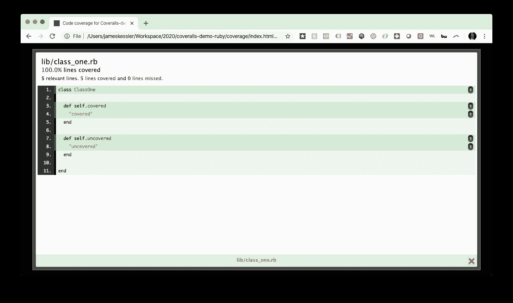

# 将测试覆盖范围添加到 CI 管道|工作服和 CircleCI

> 原文：<https://circleci.com/blog/adding-test-coverage-to-your-ci-pipeline/>

健康代码库的关键指标之一是良好的测试覆盖率。一旦你接受了 CI/CD 的价值，使用测试覆盖服务来跟踪项目测试覆盖随时间的变化是有意义的。它不仅可以确保测试以与代码相同的速度增长，还可以帮助您控制您的开发工作流，通过/失败检查和 PR 注释来显示哪里缺少覆盖率以及如何改进它。

在本教程中，我们将把一个包含测试覆盖的简单代码库放入 CircleCI 上的一个 [CI 管道](https://circleci.com/blog/what-is-a-ci-cd-pipeline/)中，然后配置 CircleCI 将我们项目的测试覆盖结果发送给 [Coveralls](https://coveralls.io/) ，这是一个流行的测试覆盖服务，被世界上一些最大的开源项目所使用。

我们将通过使用 CircleCI 的 [orb 技术](https://circleci.com/orbs/)来实现这一点，这使得它可以快速而轻松地与第三方工具(如工作服)集成。

## 先决条件

要跟进这篇文章，您需要以下内容:

*   对 Ruby 足够熟悉，可以阅读一些基本代码和测试
*   一个[圆](https://circleci.com/signup/)的账户
*   GitHub 的一个账户

**注意** : *我们会创建一个免费的工作服账户。*

## 测试覆盖率，而不是测试

如果你是测试*覆盖率*的新手，下面是它的工作方式:

对于由代码和测试组成的项目，可以添加一个测试*覆盖*库来评估项目的代码被其测试*覆盖*的程度。(*在我们的 Ruby 项目中，我们使用了一个叫做 Simplecov 的测试覆盖库。*)

在项目测试套件的每次运行中，测试覆盖*库*都会生成一个测试覆盖*报告*。

## 它在 CI/CD 中如何工作

1.  你在你的 SCM(即 GitHub)。
2.  您的 CI 服务构建您的项目，运行您的测试，并生成您的测试覆盖报告。
3.  您的 CI 向工作服发布测试覆盖报告。
4.  连体工作服将覆盖范围更改发布到共享工作空间。
5.  如果您选择这样做，工作服会向您的 PRs 发送评论和通过/失败检查，以控制您的开发工作流程。

## 一个具有测试覆盖的简单应用程序

下面是一个极其简单的 Ruby 项目，它同时采用了测试和测试覆盖:


(在 GitHub 上找到[这里](https://github.com/coverallsapp/coveralls-demo-ruby)。)

这是该项目的全部代码:

```
class ClassOne

  def self.covered
    "covered"
  end

  def self.uncovered
    "uncovered"
  end

end 
```

这些是测试:

```
require 'spec_helper'
require 'class_one'

describe ClassOne do

  describe "covered" do
    it "returns 'covered'" do
      expect(ClassOne.covered).to eql("covered")
    end
  end

  # Uncomment below to achieve 100% coverage
  # describe "uncovered" do
  #   it "returns 'uncovered'" do
  #     expect(ClassOne.uncovered).to eql("uncovered")
  #   end
  # end
end 
```

**注意** : *现在，`ClassOne`中的两种方法只有一种正在测试。*

我们已经安装了我们的测试覆盖库 Simplecov，作为我们的`Gemfile`中的一块宝石:

```
source 'https://rubygems.org'

gem 'rspec'
gem 'simplecov' 
```

我们在`spec/spec_helper.rb`中向 Simplecov 传递了一个配置设置，告诉它忽略测试目录中的文件:

```
require 'simplecov'

SimpleCov.start do
  add_filter "/spec/"
end 
```

### 运行测试

让我们第一次运行测试套件，看看结果:

```
bundle exec rspec 
```

结果:

```
ClassOne
  covered
    returns 'covered'

Finished in 0.0028 seconds (files took 1 second to load)
1 example, 0 failures

Coverage report generated for RSpec to /Users/jameskessler/Workspace/2020/afinetooth/coveralls-demo-ruby/coverage. 4 / 5 LOC (80.0%) covered. 
```

**注意** : *除了测试结果本身，Simplecov 告诉我们它在一个新的`/coverage`目录中为我们生成了一个测试覆盖报告。*

方便的是，它生成了 HTML 格式的结果，我们可以像这样打开:

```
open coverage/index.html 
```

我们的第一份报道是这样的:


整个项目的覆盖率达到了 80%。

点击`lib/class_one.rb`调出文件结果:


你会注意到绿色的覆盖线和红色的未覆盖线。

在我们的例子中，4/5 的线路被覆盖，相当于 80%的覆盖率。

### 添加测试以完成覆盖

要添加测试，取消对 ClassOne 中第二个方法的测试的注释:

```
require 'spec_helper'
require 'class_one'

describe ClassOne do

  describe "covered" do
    it "returns 'covered'" do
      expect(ClassOne.covered).to eql("covered")
    end
  end

  # Uncomment below to achieve 100% coverage
  describe "uncovered" do
    it "returns 'uncovered'" do
      expect(ClassOne.uncovered).to eql("uncovered")
    end
  end
end 
```

现在再次运行测试套件:

```
bundle exec rspec 
```

在`coverage/index.html`打开新结果。

新报告如下所示:


覆盖率从 80%提高到 100%(并变绿)。

现在，如果我们点击`lib/class_one.rb`，我们会看到:



现在已经覆盖了五个相关行中的五个，导致了文件的 100%覆盖率，这意味着我们的单个文件项目的 100%总覆盖率。

## 设置 CI 渠道

既然我们理解了测试覆盖在这个项目中是如何工作的，我们很快就能通过工作服来验证同样的结果。

首先，我们需要建立 CI 渠道。

### 将项目添加到 CircleCI

**注意** : *如果你想跟进，现在是一个好时机[从这个回购](https://github.com/coverallsapp/coveralls-demo-ruby)中分支出项目，并将其克隆到你的本地机器上。一旦你做到了这一点，你可以按照这些步骤与你自己的副本。从现在开始，我们假设您正在开始一个全新的项目，对原始项目没有任何更改。换句话说，测试覆盖率从 80%开始。*

要向 [CircleCI](https://circleci.com/) 、[添加新的公共回购，请使用您的 GitHub 登录名登录](/vcs-authorize/):


如果您属于多个 GitHub 组织，请选择适用于您的项目的组织:


然后您将看到贵组织的 GitHub 项目列表:


点击新项目旁边的**设置项目**:


然后你会看到**新项目设置**页面:


在这里，您可以选择让 CircleCI 引导您设置项目，或者手动添加您自己的配置文件。

我们将手动添加我们的配置文件，以便更仔细地查看，因此单击**手动添加**:


您将收到一个提示，询问您是否已经将一个`./circle/config.yml`文件添加到您的 repo:


我们还没有，所以我们现在就去做吧。

### 将配置文件添加到项目存储库中

在项目的基本目录下，创建一个名为`.circleci/config.yml`的新的空文件。

```
vi .circleci/config.yml 
```

现在，将以下配置设置粘贴到空的`.circleci/config.yml`文件中:

```
version: 2.1

orbs:
  ruby: circleci/ruby@1.0

jobs:
  build:
    docker:
      - image: cimg/ruby:2.6.5-node
    steps:
      - checkout
      - ruby/install-deps
      - ruby/rspec-test

workflows:
  build_and_test:
    jobs:
      - build 
```

### 那些配置设置是什么意思？

值得指出的是，我们使用的是 CircleCI 管道配置规范的 2.1 版，这是最新版本，在我们的文件顶部有所说明:

```
version: 2.1 
```

v2.1 配置规范的两个核心概念是 orb 和工作流。

orb 是可重用的配置包，为了方便和标准化，可以跨项目使用。这里我们利用 CircleCI 新提供的 [Ruby orb](https://circleci.com/developer/orbs/orb/circleci/ruby) ，它可以快速建立一个新的 Ruby 项目。

```
orbs:
  ruby: circleci/ruby@1.0 
```

[工作流](https://circleci.com/docs/workflows/)是收集和编排工作的一种方式。这里我们定义了一个简单的工作流`build_and_test`。

```
workflows:
  build_and_test:
    jobs:
      - build 
```

这调用了一个我们已经定义的作业，称为`build`，它检查我们的代码，安装我们的依赖项，并在 CI 环境中运行我们的测试——一个运行 Ruby 2.6.5 和 Node:

```
jobs:
  build:
    docker:
      - image: cimg/ruby:2.6.5-node
    steps:
      - checkout
      - ruby/install-deps
      - ruby/rspec-test 
```

[作业](https://circleci.com/docs/jobs-steps/#section=getting-started)是你的管道的主要构件，它包括[步骤](https://circleci.com/docs/concepts/#steps)和完成你的管道工作的命令。

请注意，在我们工作的最后一步，我们使用一个内置命令来运行 RSpec 测试，这是 CircleCI 的新 [Ruby orb](https://circleci.com/developer/orbs/orb/circleci/ruby) ，称为 [`rspec-test`](https://circleci.com/developer/orbs/orb/circleci/ruby#commands-rspec-test) :

```
steps:
   [...]
   - ruby/rspec-test 
```

这不仅为运行我们的 RSpec 测试提供了一行程序，还为我们提供了一些免费的东西，包括自动并行化和默认的测试结果目录。

### 为什么是自动并行化？

它允许我们从我们的测试套件[中并行运行测试](https://circleci.com/docs/parallelism-faster-jobs/)，这提高了速度，并且在运行大量测试时特别方便。更多的实际操作，参见[circle ci](https://circleci.com/blog/a-guide-to-test-splitting/)中的测试拆分教程。

### 为什么有一个默认的测试结果目录？

为了方便起见，这给了我们一个单一的地方来存储我们的 CI 环境中的测试结果，这些结果已经从任何并行运行中合并了。

保存文件，提交并推送:

```
git add .
git commit -m "Add .circleci/config.yml."
git push -u origin master 
```

就是这样！CircleCI 在其远程 CI 环境中构建您的项目。

## 确认您的首次构建

CircleCI 在您提交最后一个提交时开始构建您的项目:

```
git push -u origin master 
```

要向自己证明这一点，只需访问你在 CircleCI 的项目。

对我来说，这意味着去这里:
[https://app . circle ci . com/pipelines/github/coverallsapp/coveralls-demo-ruby](https://app.circleci.com/pipelines/github/coverallsapp/coveralls-demo-ruby)

您的 URL 会有所不同，但应遵循以下格式:

```
https://app.circleci.com/pipelines/github/<your-github-username>/<your-github-repo> 
```

所以我们正在检查我们的第一个构建，而且——*哎呀，这看起来不太对劲* …

我们的第一次构建失败了:


*为什么？*

 *请注意错误消息:

```
bundler: failed to load command: rspec [...]
LoadError: cannot load such file -- rspec_junit_formatter 
```

CircleCI Ruby orb 似乎在寻找`rspec_junit_formatter`，查看 [orb docs](https://circleci.com/developer/orbs/orb/circleci/ruby#commands-rspec-test) ，有道理:https://circle ci . com/developer/orbs/orb/circle ci/Ruby # commands-r spec-test


`rspec-test`命令上的注释如下:

```
You have to add `gem `spec_junit_formatter`` to your Gemfile. 
```

所以我们就这么做吧。

将`rspec_junit_formatter`宝石安装在您的`Gemfile`中:

```
# Gemfile
[...]
gem 'rspec_junit_formatter' 
```

运行`bundle install`:

```
bundle install 
```

推动变革:

```
git add .
git commit -m "Add 'rspec_junit_formatter'."
git push 
```

然后再次检查我们的构建…然后- *太好了！*

成功的构建:


注意那些测试结果，看起来很像我们在本地运行[时得到的结果:](#run-tests)

```
[...]

ClassOne covered returns 'covered'
  0.00042 seconds ./spec/class_one_spec.rb:7

Finished in 0.0019 seconds (files took 0.12922 seconds to load)
1 example, 0 failures

Coverage report generated for RSpec to /home/circleci/project/coverage. 4 / 5 LOC (80.0%) covered. 
```

就像在我们的本地环境中一样，Simplecov 正在生成一个覆盖报告，并将其存储在`/coverage`目录中。

```
Coverage report generated for RSpec to /home/circleci/project/coverage. 4 / 5 LOC (80.0%) covered. 
```

我们现在在 CI 中有测试覆盖率。

## 将项目配置为使用连体工作服

现在，让我们告诉 CircleCI 开始发送那些测试覆盖结果给工作服。

我们很幸运，因为连体工作服已经发布了一个[连体工作服 orb](https://circleci.com/developer/orbs/orb/coveralls/coveralls) 遵循 [CircleCI orb 标准](https://circleci.com/docs/orb-intro/)，这使得这个即插即用。

但在我们设置这个之前，我们需要在 [Coveralls](https://coveralls.io/) 创建一个新账户，这个账户对拥有公共(开源)回购的个人开发者是免费的。

### 将项目添加到连体工作服

要将您的回购添加到[工作服](https://coveralls.io/sign-in)，请前往 http://coveralls.io/sign-in并登录 GitHub:


首次登录时，您不会有任何活动的回购，因此请转到**添加回购**并找到您的公开回购列表:


要添加您的回购，只需点击您的回购名称旁边的切换控件，将其切换到上的**:**


太好了！工作服正在追踪你的回购。

### 完成设置

在发布连体工作服 orb 之前，设置 Ruby 项目以使用连体工作服的默认方法是安装连体工作服 RubyGem，它利用 Simplecov 作为其主要依赖项，并负责将 Simplecov 的结果上传到连体工作服。

然而，为了坚持 CircleCI 的 v2.1 配置，并利用 CircleCI 的新 Ruby orb 的优势，我们将设置工作服 orb 来与 Ruby orb 一起工作。

#### 准备使用连体工作服圆球

现在，第一个考虑，这有点违反直觉，是工作服 orb 是用 Javascript 而不是 Ruby 编写的，它依赖于 Node。不过这没关系，因为，如果您还记得，我们配置了 Ruby orb 来安装包含 Ruby *和*节点的 Docker 映像:

```
jobs:
  build:
    docker:
      - image: cimg/ruby:2.6.5-node
    steps:
      [...] 
```

然而，工作服 orb 的另一个要求是它期望 LCOV 格式的测试覆盖报告。因此，为了满足这个要求，我们将对我们的项目进行一些修改。

首先，我们将把`simplecov-lcov`宝石添加到我们的`Gemfile`中:

```
# Gemfile
[...]
gem 'rspec_junit_formatter'
gem 'simplecov-lcov' 
```

其次，我们将在`spec_helper`中更改一些与 Simplecov 相关的配置:

```
# spec_helper.rb
require 'simplecov'
require 'simplecov-lcov'

SimpleCov::Formatter::LcovFormatter.config.report_with_single_file = true
SimpleCov.formatter = SimpleCov::Formatter::LcovFormatter
SimpleCov.start do
  add_filter "/spec/"
end 
```

这里我们需要`simplecov-lcov`，我们告诉 Simplecov 做两件事:

首先，将多个报告文件合并成一个文件。

```
SimpleCov::Formatter::LcovFormatter.config.report_with_single_file = true 
```

第二，以 LCOV 格式导出结果。

```
SimpleCov.formatter = SimpleCov::Formatter::LcovFormatter 
```

#### 更新您的`.circleci/config.yml`

接下来，我们将把工作服球体添加到我们的`.circelci/config.yml`的`orbs`部分:

```
# .circleci/config.yml
version: 2.1

orbs:
  ruby: circleci/ruby@1.0
  coveralls: coveralls/coveralls@1.0.4

[...] 
```

在`jobs`部分，我们将为我们的`build`工作添加一个新步骤:

```
# /circleci/config.yml
[...]
orbs:
  ruby: circleci/ruby@1.0
  coveralls: coveralls/coveralls@1.0.4

jobs:
  build:
    docker:
      - image: cimg/ruby:2.6.5-node
    steps:
      - checkout
      - ruby/install-deps
      - ruby/rspec-test
      - coveralls/upload:
          path_to_lcov: ./coverage/lcov/project.lcov

[...] 
```

这个命令`coveralls/upload`调用了连体工作服 orb 的`upload`命令。在它下面，我们将传递`path_to_lcov`参数，它告诉 orb 在哪里找到它应该上传到工作服 API 的覆盖报告。

#### 添加一个`COVERALLS_REPO_TOKEN`

最后，如果您使用像 CircleCI 这样的私有 CI 服务，那么工作服 API 需要一个访问令牌来安全地标识您的 repo。这叫你的`COVERALLS_REPO_TOKEN`。

如果您在构建之前访问连体工作服项目的起始页，就会遇到这种情况:


但是您也可以随时从您项目的**设置**页面获取它:


要让 CircleCI 代表您的 repo 安全地发布到工作服 API，只需将您的`COVERALLS_REPO_TOKEN`作为环境变量添加到 CircleCI web 界面的**项目设置>环境变量**下，如下所示:


现在我们准备把覆盖结果发给 CircleCI 的工作服。

因此，让我们推动我们刚刚做出的所有更改:

```
git add .
git commit -m "Finish coveralls setup."
git push 
```

### 通过工作服验证测试覆盖率

既然我们了解了[测试覆盖在这个项目](#simple_app)中是如何工作的，那么让我们通过工作服服务来验证那些相同的结果。

假设我们将我们的项目配置为使用 CircleCI 和工作服，并将这些更改推送到我们的 repo，最后一次推会触发 CircleCI 的新构建:


然后根据构建日志将测试结果上传到连体工作服 API:

```
#!/bin/bash -eo pipefail

[...]

sudo npm install -g coveralls
if [ ! $COVERALLS_REPO_TOKEN ]; then
  export COVERALLS_REPO_TOKEN=COVERALLS_REPO_TOKEN
fi
export COVERALLS_ENDPOINT=https://coveralls.io

[...]

cat ./coverage/lcov/project.lcov | coveralls

[...]

[info] "2020-09-25T21:53:13.404Z"  'sending this to coveralls.io: ' '{"source_files":[{"name":"lib/class_one.rb","source":"class ClassOne\\n\\n  def self.covered\\n    \\"covered\\"\\n  end\\n\\n  def self.uncovered\\n    \\"uncovered\\"\\n  end\\n\\nend\\n","coverage":[1,null,1,1,null,null,1,0,null,null,null,null],"branches":[]}],"git":{"head":{"id":"c6b825b7bd7d4f7bbe4e75e530884a4b9fd9d9cd","committer_name":"James Kessler","committer_email":"afinetooth@gmail.com","message":"Configure project for CircleCI & Coveralls using the Coveralls orb.","author_name":"James Kessler","author_email":"afinetooth@gmail.com"},"branch":"circle-ci","remotes":[{"name":"origin","url":"git@github.com:coverallsapp/coveralls-demo-ruby.git"}]},"run_at":"2020-09-25T21:53:13.376Z","service_name":"circleci","service_number":"1917bc85-51f8-4646-80db-8b15cc40ad6c","service_job_number":"17","repo_token":"*********************************"}'

CircleCI received exit code 0 
```

引发了工作服的新版本:


显示覆盖率为 80%。这正是我们所期望的。

现在，让我们验证一下，在我们项目的测试覆盖中，工作服正在跟踪*变化*。为此，让我们重新添加那个将覆盖率提升到 100%的测试。

打开测试文件`/spec/class_one_spec.rb`，取消对文件中第二个测试的注释:

```
require 'spec_helper'
require 'class_one'

describe ClassOne do

  describe "covered" do
    it "returns 'covered'" do
      expect(ClassOne.covered).to eql("covered")
    end
  end

  # Uncomment below to achieve 100% coverage
  describe "uncovered" do
    it "returns 'uncovered'" do
      expect(ClassOne.uncovered).to eql("uncovered")
    end
  end
end 
```

现在，保存文件，提交更改，并将其推送到 GitHub:

```
git commit -m "Add tests to make coverage 100%."
git push 
```

这一推动将引发 CircleCI 的新建筑:


这反过来又引发了工作服的新款式:


现在读数是 100%:


嘭！从工作服自动测试覆盖更新。

## 后续步骤

既然您的项目已经设置为自动跟踪测试覆盖率，接下来您可能想要做的一些事情包括:

1.  **获得徽章** -给你的回购人的自述文件添加一个漂亮的“覆盖”徽章。
2.  **配置 PR 注释**——在合并之前通知合作者测试覆盖的变化。
3.  **设置通过/失败检查** -除非达到覆盖阈值，否则阻止合并。
4.  **探索更复杂的场景** -为更大的项目利用并行性。

从这里的[工作服文档](http://docs.coveralls.io)开始。

## 结论

一个健康的代码库是经过良好测试的代码库，一个健康的项目是测试覆盖率在整个开发过程中保持在前端和中心的项目。

一个测试覆盖服务，像[工作服](https://coveralls.io)，让你跟踪项目测试覆盖随时间的变化，让你的整个团队看到这些变化，甚至停止降低项目质量的合并。

使用 [CircleCI](https://circleci.com/) 的最新 orb 规范，本教程展示了通过使其成为您的 CI/CD 管道的一部分，将您的项目与测试覆盖服务连接起来是多么容易，特别是当服务利用您的 CI 平台的配置标准时。*