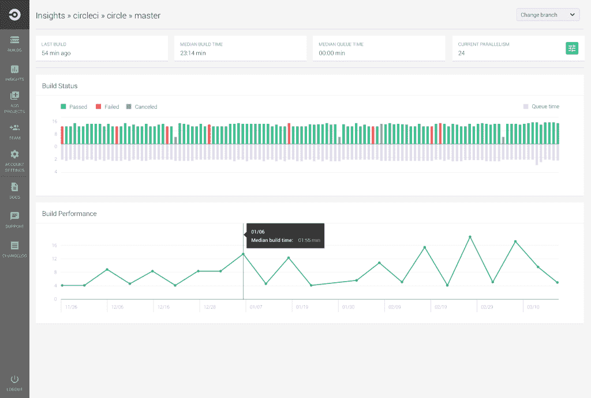
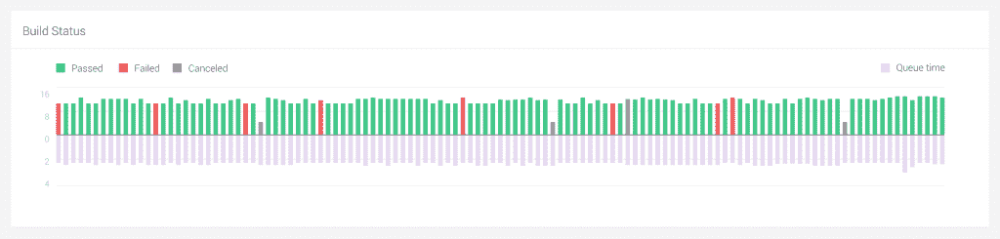
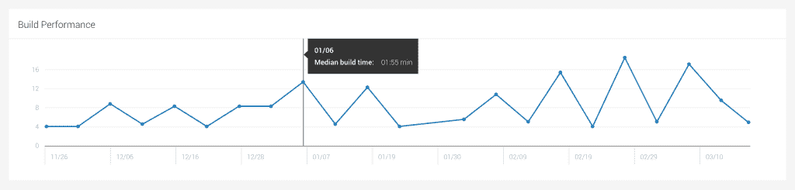

# 宣布 CircleCI 每个项目的见解- CircleCI

> 原文：<https://circleci.com/blog/announcing-circleci-per-project-insights/>

**来自出版商的说明:**您已经找到了我们的一些旧内容，这些内容可能已经过时和/或不正确。尝试在[我们的文档](https://circleci.com/docs/)或[博客](https://circleci.com/blog/)中搜索最新信息。

* * *

我们很高兴宣布每个项目的见解。CircleCI per-project Insights 通常面向所有付费和开源客户，帮助您了解您的项目在一段时间内的表现。

**开始:**点击主导航上新的“洞察”图标。在 Insights 仪表板上，您可以单击您的回购名称来访问每个项目的见解。

“每个项目的细节”页面为您提供了对所选分支的以下两个图表的访问:构建状态和构建性能。

 *每个项目的见解*

* *构建状态:* *目前，在 Insights 仪表板上，用户可以访问其默认分支的最后 50 个构建。作为该页面的一部分，用户可以选择所需的分支，并访问所选分支的 100 多个构建状态。

 *构建状态图*

**Build Performance:**Build Performance 聚集了特定一天的构建数据，并绘制了该天的中位数，可以追溯到 90 天。现在，您可以通过选择一个特定的分支机构来监控回购的性能。

 *构建性能图*

我们将继续向此页面添加功能，并帮助您优化构建。我们总是很高兴收到你的来信。请随时在[feedback@circleci.com](mailto:feedback@circleci.com)向我们发送反馈。