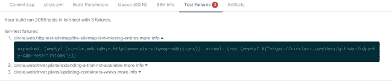

# 宣布详细的测试失败报告

> 原文：<https://circleci.com/blog/announcing-detailed-test-failure-reporting/>

**来自出版商的说明:**您已经找到了我们的一些旧内容，这些内容可能已经过时和/或不正确。尝试在[我们的文档](https://circleci.com/docs/)或[博客](https://circleci.com/blog/)中搜索最新信息。

* * *

*TL；DR: CircleCI 现在会告诉你哪些测试在我们的 web UI、电子邮件通知和聊天集成中失败了。*

CircleCI 建立在让开发人员测试不那么痛苦的承诺上，今天我们宣布在实现这一承诺方面向前迈出了一大步。我们大多数人都习惯于知道 CI 失败是一个小狩猎期的开始。我们收到一封电子邮件或一条聊天消息，说一个构建失败了，然后洞穴探险开始追踪根本原因。CircleCI 现在通过在我们的 web UI、构建电子邮件和聊天集成中显示关于哪些测试用例失败的详细信息来减轻或消除这种麻烦。

当然，在某些情况下，很难找到 CI 失败的确切原因，但是我们发现，仅仅看到失败的特定测试就会产生一种“哦，是啊，是啊…”的感觉，很明显为什么最后一次推送会导致一些集成测试中断，完全消除了在 STDOUT 中查找失败细节的麻烦。

## 谢谢你，朱尼特！

我们许多日常编程 Clojure、JavaScript 或 Ruby 的人可能不会经常想到领先的 Java 单元测试运行程序，但是 JUnit 的 xml 输出格式已经成为机器可读测试输出的事实上的标准，受到从 Ruby 到 Node.js 的许多平台上的测试运行程序的支持。(我们实际上也处理 Cucumber 的 JSON 输出，但是 JUnit XML 更像是一个标准。)

## 开箱即用的支持

CircleCI 推断的测试命令将自动收集和解释以下测试运行程序的测试失败详细信息:

*   RSpec

*   迷你测试

*   黄瓜

*   鼻子

*   Xcode

如果您使用 CircleCI 的自动测试命令为这些运行程序之一运行您的测试，一切都应该正常工作。(请注意，在 RSpec 或 Minitest 的情况下，您需要在项目中包含一个特殊的 JUnit 格式 gem。更多信息见[文档](https://circleci.com/docs/1.0/test-metadata/)。)

## 其他测试跑步者

如果您使用不同的测试运行程序，或者如果您覆盖了 CircleCI 的默认测试命令，不要绝望！您仍然可以享受详细测试失败信息的所有好处。您需要做的就是确保将任何 JUnit 格式的 XML 保存到目录“`$CIRCLE_TEST_REPORTS/<my-runner>/<my-tests>.xml` `, where` `<my-runner>` `and` `<my-tests>`”是您选择的名称。我们 CircleCI 仍然使用这种方法来保存我们的 Karma 测试输出。详见[文档](https://circleci.com/docs/1.0/test-metadata/)。

## 更多精彩即将到来！

这还不是 CircleCI 向更聪明、更强大、更好理解您的测试的进化的终点！我们有很多相关的功能即将推出，所以请关注更多。此外，如果你对我们如何更明智地运行你的测试有任何想法，或者如果你有任何其他反馈，请在[sayhi@circleci.com](mailto:sayhi@circleci.com)给我们一声欢呼！