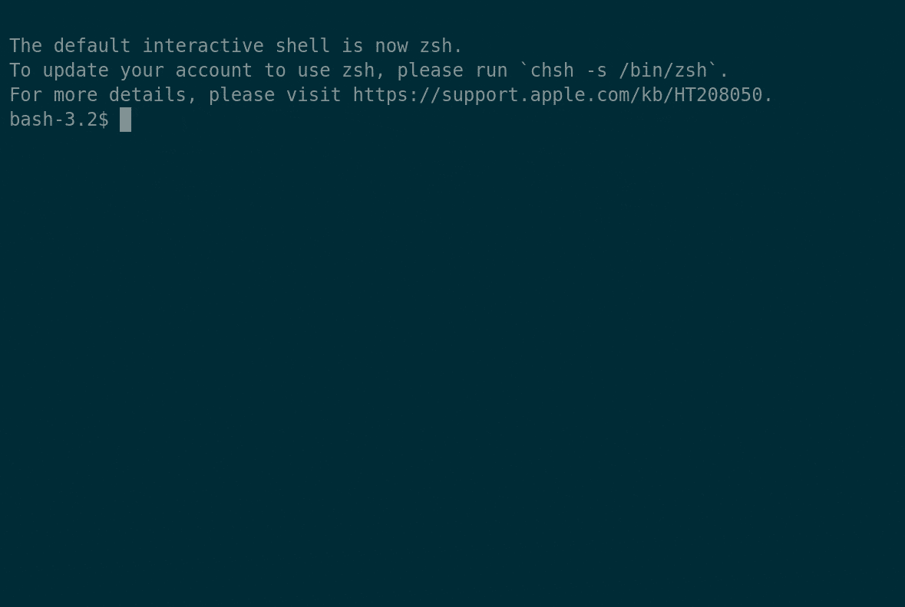

# 在 CircleCI 的 API v2 中宣布新的见解端点

> 原文：<https://circleci.com/blog/announcing-new-insights-endpoints-in-circleci-s-api-v2/>

今天，我们很高兴地宣布 CircleCI 的 API v2 中的 insights 端点的稳定性。我们的 API 的最新版本提供了所有的灵活性和智能工程团队想要的，所以你可以得到更多的 CircleCI。管道优先的方法提高了测试套件的效率，而我们的 insights 端点则释放了工作流和消费的关键数据。

在本帖中，我们将概述目前稳定用于生产的端点。

## 更多数据意味着更明智的决策

insights 端点已经预览了几个月，允许用户:

*   **跟踪状态—** 查看哪些工作失败，哪些工作流有不稳定的测试，并确定流水线改进工作的优先级。
*   **监控持续时间—** 找出哪些工作流或作业花费的时间最长，并找出缓存、并行化和我们新的便利映像可以帮助加快速度的机会。
*   **优化消费—** 通过洞察每项工作和/或工作流程的信用支出，优化 CircleCI 上的使用。可预测的逐月消耗计划。



## 四个新端点

借助 insights 端点，用户可以在工作流和/或工作级别检索信用消费和持续时间的汇总历史数据，以构建自己的仪表盘。端点当前返回项目和分支内特定工作流的数据。

### 在作业和工作流级别查看聚合数据

```
GET https://circleci.com/api/v2/insights/{project-slug}/workflows  
GET https://circleci.com/api/v2/insights/{project-slug}/workflows/{workflow-name}/jobs 
```

检索有关指定分支的项目作业和工作流的聚合数据。有效负载包含以下字段:

*   名字
*   聚集时段开始时间(UTC)
*   聚集时段结束时间(UTC)
*   成功运行
*   失败的运行
*   总运行次数
*   接通率
*   吞吐量(平均运行次数/天)
*   平均恢复时间
*   使用的信用总额
*   持续时间统计:最大值、最小值、平均值、中值、p95、标准差(全部以秒为单位)

### 查看作业和工作流执行数据

```
GET https://circleci.com/api/v2/insights/{project-slug}/workflows/{workflow-name}
GET https://circleci.com/api/v2/insights/{project-slug}/workflows/{workflow-name}/jobs/{job-name} 
```

检索指定分支的命名项目工作流的最近 250 次运行(或最近 90 天内的运行，以先到者为准)。有效负载包含以下字段:

*   身份证明
*   状态
*   使用的信用
*   持续时间(秒)
*   创建时间(UTC)
*   停止于(UTC)

查看我们的[文档](https://circleci.com/docs/api/v2/#circleci-api)了解更多信息。

## 用有意义的度量改进软件交付

工程性能是许多组织的首要考虑因素，成功的团队已经发现持续集成是交付成果的关键。在 CircleCI，我们非常荣幸能够亲眼目睹这一演变，并在我们的报告[数据驱动的 CI 案例](/blog/the-data-driven-case-for-ci-what-30-million-workflows-reveal-about-devops-in-practice/)中分享了这些发现。

我们的结果证明，竞争情报将高绩效者与其他人区分开来。考虑到这一点，我们很高兴能够继续提供工具和智能，推动团队踏上 DevOps 之旅。

通过利用这些洞察端点，工程团队可以访问关键的工作流聚合信息，这些信息显示工作流在更长时间内的执行情况，使组织能够跟踪成功/失败率、吞吐量、平均恢复时间以及持续时间指标。类似地，工作流运行数据允许用户跟踪用于特定工作流的执行时间和信用。最后，对作业聚合信息的访问提供了特定工作流中的作业在更长时间内如何执行的概览，从而增强了衡量成功率/失败率和吞吐量的能力。

我们迫不及待地想看到用户如何使用这些数据，并期待继续为我们的客户增强智能。如果您有任何问题或想了解更多信息，请查看以下相关资源或观看[circle ci 新见解端点](https://www.youtube.com/watch?v=pAupuaIyX7w&feature=youtu.be)网络研讨会，了解您的管道。

## 相关: