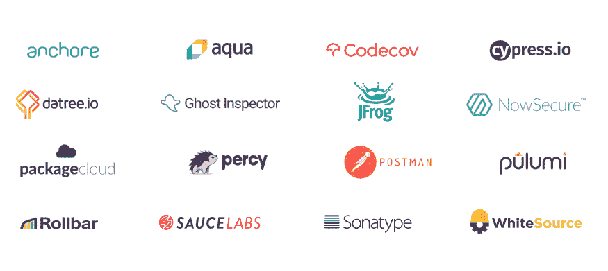

# 宣布 CircleCI Orbs 和我们新的技术合作伙伴计划

> 原文：<https://circleci.com/blog/announcing-orbs-technology-partner-program/>

在 CircleCI，我们从一开始就是 DevOps 的支柱，致力于重新定义软件交付的效率，并与世界上许多最有效的软件组织合作。随着我们行业的成长和发展，我们一直致力于帮助世界上最好的软件组织改进他们构建、测试和部署软件的方式。今天，我们以一流的方式向合作伙伴和社区贡献者开放我们的平台，标志着我们在这一使命上向前迈进了一大步。

今天，我很高兴地宣布我们新的技术合作伙伴计划。随着我们合作伙伴计划的推出，CircleCI 不再仅仅是成千上万顶级工程组织首选的 DevOps 工具，而是一个开放平台，可供全球合作伙伴、团队和开发人员构建。

我们今天将与顶级 DevOps 工具领域的合作伙伴一起发布:

随着这一合作伙伴生态系统的推出，我们也很高兴推出 CircleCI Orbs，这是世界上第一个专门为软件交付自动化配置而设计的包管理器。orb 实现了一个可共享组件的生态系统，现在可以通过我们的平台获得。orb 是“可参数化”的包，它将命令、执行器和作业压缩成一行可重用的代码，为您的 CircleCI 配置带来新的效率。我们今天发布了一组用于云项目的初始 orb,这些 orb 使团队能够利用自动化的力量、简化配置，并高效地扩展他们的 DevOps 组织。

> " CircleCI 球体是继 Docker 容器之后 CI 世界中最令人兴奋的东西."

“CircleCI Orbs 是继 Docker containers 之后 CI 世界中最令人兴奋的东西，”Cypress 工程副总裁 Gleb Bahmutov 说，他是早期访问 Orbs 的客户和贡献者。“从开发人员的角度来看，orb 是对常规‘阅读文档、复制/粘贴示例、调整 30 分钟直到 CI 通过’的一种非常需要的改进，这是一种过时的工作流。这绝对是一次不可思议的经历。CircleCI 不断创新软件交付自动化，这只是他们最新的获胜功能之一。”

使用 orbs，您可以在团队和项目之间共享您喜欢的 CI/CD 设置，并且只需几行代码就可以轻松集成工具和第三方解决方案。开发社区的成员可以编写 orb 来解决常见问题并帮助管理配置。在常见用例中共享和重用 orb 使团队能够解决有趣的、独特的问题，使他们的业务与众不同，同时为社区中的其他人提供加速 CI/CD 工作流的解决方案。

了解所有社区成员在我们的平台上访问和创作 orb 的可能性:

| **对于使用 orb 的开发人员和团队:** | **对于创作 orb 的技术合作伙伴和团队:** |
| 使用 Orbs 帮助编写配置文件，在 CircleCI 上快速启动并运行。 | 通过创作 orb 来帮助开发人员集成您的解决方案，从而减少采用的摩擦。 |
| 通过打包常用的技术有效地扩展，以分发给跨多个项目的团队。 | 利用使用 CircleCI 的庞大开发人员网络来扩大您的覆盖范围。 |
| 将您其余的 DevOps 工具与我们的技术合作伙伴提供的可信 orb 轻松集成。 | 成为不断增长的 orb 作者社区的一员，贡献您的解决方案来帮助他人。 |

有了 orbs，现在开始使用 CircleCI、与他人共享解决方案以及将您的 [CircleCI 工作流](https://circleci.com/docs/workflows/)与您的 DevOps 工具链所依赖的所有其他工具连接起来比以往任何时候都更加容易。