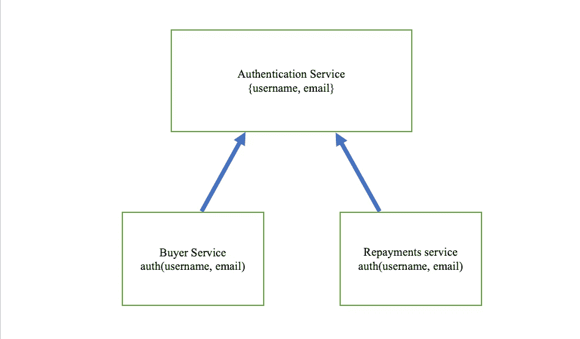
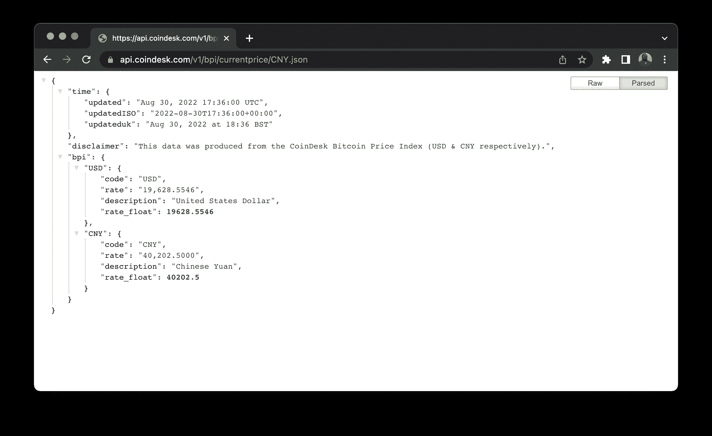
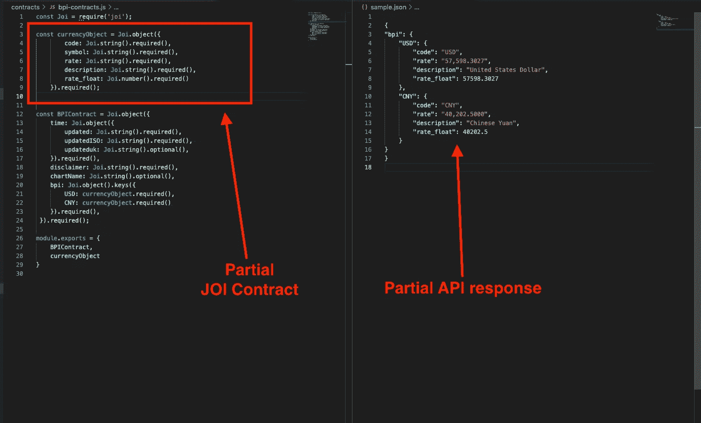
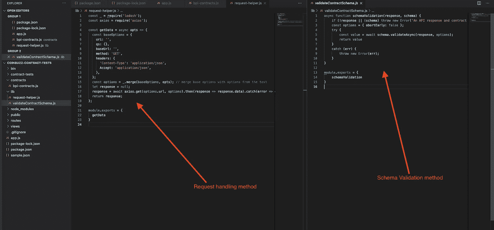
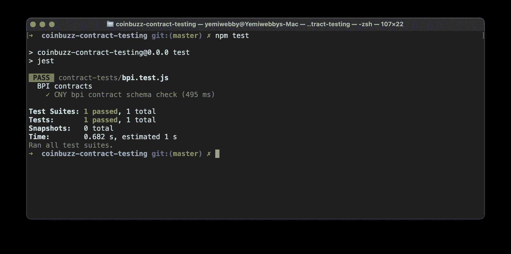
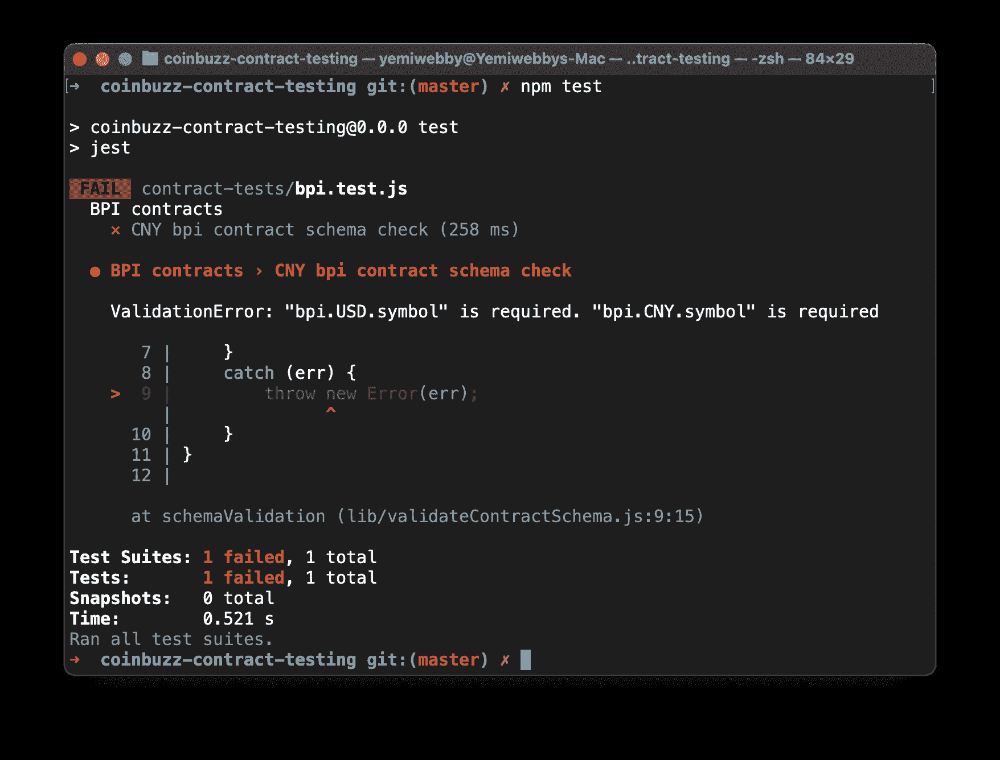
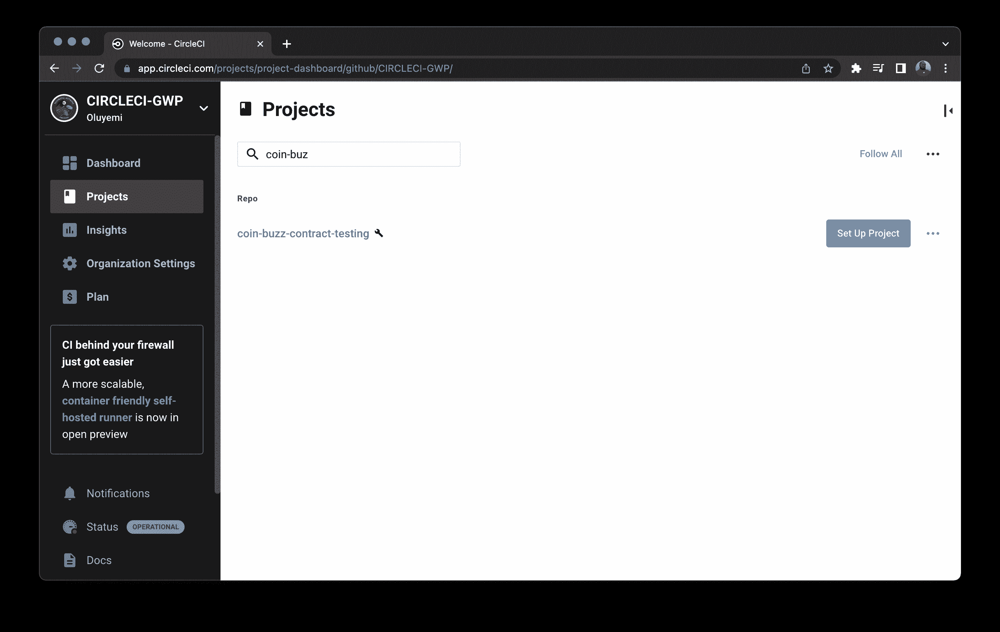
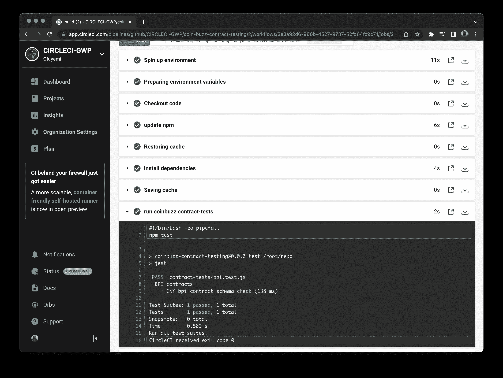

# 与 Joi | CircleCI 的 API 合同测试

> 原文：<https://circleci.com/blog/api-contract-testing-with-joi/>

> 本教程涵盖:
> 
> 1.  设置 Joi 合同测试框架
> 2.  使用 Joi 编写契约测试并验证 API 响应
> 3.  根据模式验证 API 响应

当你签合同的时候，你希望双方都能信守承诺。测试应用程序也是如此。[契约测试](https://martinfowler.com/bliki/ContractTest.html)验证服务可以相互通信，并且服务之间共享的数据符合一组指定的规则。在这篇文章中，我将指导您使用 Joi 作为一个库来为使用 API 的服务创建 API 契约。

## 先决条件

要完成本教程，您需要:

1.  JavaScript 的基础知识
2.  写作测试的基础知识
3.  您系统上安装的 [Node.js](https://nodejs.org) (版本> = 11.0)
4.  一个[圆](https://circleci.com/signup/)的账户
5.  GitHub 的一个账户

> 我们的教程是平台无关的，但是使用 CircleCI 作为例子。如果你没有 CircleCI 账号，请在 注册一个免费的 [**。**](https://circleci.com/signup/)

在这篇文章中，我将演示如何为一个开源 API 端点编写契约测试。您将测试的端点监控不同货币的比特币价格指数。然后，您将使用 NodeJS 应用程序来测试由比特币基地 API 返回的响应的契约。

## 克隆演示项目

要开始这个练习，您需要克隆这个演示项目。该项目是一个构建在`Express.js`之上的节点应用程序。Coinbuzz 应用程序本身尚未开发。在本教程中，您将关注契约测试，这些测试将有助于确保应用程序的稳定性，就像它将被开发一样。

该项目将使用`Coinbase`API，对于本教程，您将使用端点`https://api.coindesk.com/v1/bpi/currentprice/CNY.json`。该端点获取人民币相对于美元的比特币价格指数。

通过运行以下命令克隆项目:

```
git clone https://github.com/CIRCLECI-GWP/coin-buzz-contract-testing.git 
```

从项目文件夹安装依赖项:

```
cd coin-buzz-contract-testing;

npm install 
```

不需要运行应用程序；您将只运行该项目中的测试。

## 为什么使用合同测试

在开始之前，让我给你一些关于契约测试的背景知识。这种测试提供了不同服务在需要时工作的信心。假设一个组织有多个使用`Authentication` API 的支付服务。API 用一个`username`和一个`password`让用户登录到一个应用程序。然后，当登录操作成功时，它会给它们分配一个`access token`。其他服务如`Loans`和`Repayments`需要用户登录后使用`Authentication` API 服务。



如果`Authentication`服务改变了它的工作方式，需要`email`而不是`username`，那么`Loans`和`Repayments`服务将会失败。通过契约测试，`Loans`和`Repayments`服务都可以跟踪`Authentication` API，让服务发出的请求具有一组预期的行为。这些服务可以访问有关故障发生的时间、方式和位置的信息。还有关于故障是否由外部依赖引起的信息，在本例中是`Authentication`。

## 设置合同测试环境

契约测试旨在监控应用程序的状态，并在出现意外结果时通知测试人员。当依赖于其他服务的稳定性的工具使用契约测试时，它们是最有效的。两个例子:

*   一个前端应用程序，依赖于后端 API 的稳定性(就像在这个项目中)
*   微服务环境或依赖另一个 API 来处理信息的 API

从 CoinDesk 测试端点将帮助您了解不同货币在不同日期的比特币价格指数。要了解更多信息，请查看[克隆应用程序](https://github.com/CIRCLECI-GWP/coin-buzz-contract-testing/blob/master/app.js)中的`app.js`。

在开始测试 API 之前，您需要了解它的结构。这些知识会帮助你写合同。首先，使用浏览器向这个 URL 发出一个简单的`GET`请求:

```
https://api.coindesk.com/v1/bpi/currentprice/CNY.json 
```

这个请求获取某段时间内比特币的当前价格。然后显示美元和 CNY 的换算。



虽然响应对象一开始看起来有些吓人，但我会帮助您完成它。在教程的下一部分，我们将使用`Joi`把它分解成单独的对象。

## 创建 Joi 合同

Joi 是一个工具，它使得分析对象并把它们分成可以验证的块成为可能。Joi 将一个响应视为具有两个键值`time`和`bpi`的单个对象。每个值都属于特定的数据类型。通过分解响应，Joi 可以分析响应，并根据定义的模式契约创建成功或失败的断言。

要为您的项目安装`joi`包，请打开一个终端窗口并运行以下命令:

```
npm install joi 
```

太好了！您已经开始创建您的 Joi 合同。本节教程将介绍如何创建对象的一部分，然后可以扩展到创建响应的其他部分。您将使用一个示例代码块来展示如何将对象分解成块。您可以测试`currencyObject`并在以后将其重新用于美元或 CNY。

```
const currencyObject = Joi.object({
        code: Joi.string().required(),
        symbol: Joi.string().optional(),
        rate: Joi.string().required(),
        description: Joi.string().required(),
        rate_float: Joi.number().required()
  }).required(); 
```

在这个代码块中，您正在分解货币对象，并告诉 Joi 您希望货币对象具有关键字`code`、`symbol`、`rate`、`description`和`rate_float`。同样在契约中，描述了你对象中物品的状态，包括它们应该是`optional()`还是`required()`。在这种情况下，您添加了可选的`symbol`键，因为您希望在具有类似结构的其他响应中重用`currencyObject`。



货币对象与美元和 CNY 的货币响应并行匹配。它可以被重用，因为`currencyObject`合同符合 CNY 和美元响应对象的标准。完整的`BPIContract`与`currencyObject`集成在一起，可以多次重复使用。回应的完整合同的更大背景是来自[coin desk CNY](https://api.coindesk.com/v1/bpi/currentprice/CNY.json)的请求。

教程的这一部分已经介绍了如何创建 Joi 契约，以及如何定义需要由契约模式验证的响应的属性。请记住，为了“收紧”模式，您应该定义契约模式值是`required`还是`optional`。这就为失败时是抛出错误还是忽略它创造了一个界限。

## 处理 Joi 合同错误

在撰写合同时，处理可能由响应问题引起的错误是很重要的。您需要知道每次执行测试时，以及当契约模式失败时，响应是否一致。理解潜在的契约失败将帮助您学习如何调整应用程序来处理失败。

为了处理这些错误，创建一个目录并将其命名为`lib`。将两个文件添加到目录中:

1.  一个是请求助手，它使用`axios`帮助发出 API 请求
2.  另一个文件供`schemaValidation()`方法根据定义的模式验证响应



模式验证文件验证所提供的响应和契约是否一致。如果不是，就会导致错误。下一个代码块展示了一个方法如何根据定义的 Joi 契约模式来验证收到的响应。

```
 async function schemaValidation(response, schema) {
    if (!response || !schema) throw new Error('An API response and contract are required');
    const options = { abortEarly: false };
    try {
        const value = await schema.validateAsync(response, options);
        return value
    }
    catch (err) {
        throw new Error(err);
    }
}

module.exports = {
    schemaValidation
} 
```

Joi 方法负责根据创建的模式验证响应。在这种情况下，您已经在文件`contracts/bpi-contracts.js`中创建了一个模式。在下一节中，您将通过编写一个测试并传入模式和从比特币基地 API 收到的 API 响应来验证这个方法是否有效。

## 编写测试和断言

您已经成功地编写了合同和方法，在检查不一致性的同时根据 API 响应来验证它们。下一步是编写一个使用这种方法的测试。要使用您的模式测试 API，您需要安装 jest(一个 JavaScript 测试框架)和 axios(一个 JavaScript 请求生成框架)。

```
npm install jest axios 
```

您将使用 [Jest](https://jestjs.io/) 运行您的测试，使用 [axios](https://axios-http.com/) 向比特币基地端点发出 API 请求。要进行设置，添加`test`命令来运行`package.json`文件中的测试:

```
"scripts": {
    "start": "node ./bin/www",
    "test": "jest"
  }, 
```

在 scripts 部分添加这个命令可以让 Jest 扫描您的项目，查找任何扩展名为`.spec`或`.test`的文件。当一个被发现时，Jest 把它们当作测试文件并运行它们。

现在，在`contract-tests`目录中创建一个测试。该测试在发出 API 请求后调用模式验证方法。

```
const { getData } = require('../lib/request-helper')
const { schemaValidation } = require('../lib/validateContractSchema');
const { BPIContract } = require('../contracts/bpi-contracts');

describe('BPI contracts', () => {
    test('CNY bpi contract schema check', async () => {
        const response = await getData({
            url: 'https://api.coindesk.com/v1/bpi/currentprice/CNY.json' });
        return schemaValidation(response, BPIContract);
    });
}); 
```

这个调用使用`getData()`方法发出请求。`getData()`方法使用 axios 来调用比特币基地 API。然后，它使用响应根据模式验证方法`schemaValidation()`来验证 API 响应。对于从端点接收到的响应，这里已经有了 Joi 模式定义。运行您的测试并验证它是否有效:

```
npm test 
```

检查你的终端有一些好消息。



瞧啊。你的测试通过了。

然而，我们还没有完成。您需要验证测试是否也能处理合同*不*正确的情况。在之前的契约模式中，您在`currencyObject`中使用了字段`symbol: Joi.string().optional()`。您可以将 Joi 期望更改为`required()`，并查看 Joi 是否会产生错误。编辑`currencyObject`使其与此匹配:

```
const currencyObject = Joi.object({
        code: Joi.string().required(),
        symbol: Joi.string().required(),
        rate: Joi.string().required(),
        description: Joi.string().required(),
        rate_float: Joi.number().required()
    }).required(); 
```

重新运行测试后，您确实会看到一个错误。



Joi 能够捕获错误，现在期望货币对象中的`symbol`对象项是`required()`而不是`optional()`。来自 API 的响应没有将`symbol`作为响应的一部分，Joi 拒绝了 API 响应。回应不符合合同标准。

您已经能够证明您的契约模式是可行的。对响应的修改将导致失败，您将收到警告。

将`currencyObject`中的字段`symbol: Joi.string().required()`改回`optional()`继续本教程。

## 编写 CI 管道配置

在本节中，您将通过为 CircleCI 添加管道配置来自动化测试。首先在根目录下创建一个名为`.circleci`的文件夹。在文件夹中，创建一个`config.yml`文件。现在添加配置详细信息:

```
version: 2.1
jobs:
  build:
    working_directory: ~/repo
    docker:
      - image: cimg/node:10.16.3
    steps:
      - checkout
      - run:
          name: update npm
          command: "npm install -g npm@5"
      - restore_cache:
          key: dependency-cache-{{ checksum "package-lock.json" }}
      - run:
          name: install dependencies
          command: npm install
      - save_cache:
          key: dependency-cache-{{ checksum "package-lock.json" }}
          paths:
            - ./node_modules
      - run:
          name: run coinbuzz contract-tests
          command: npm test
      - store_artifacts:
          path: ~/repo/coinbuzz 
```

在这种配置中，CircleCI 使用从环境中提取的节点 Docker 映像。然后，它会更新 npm 程序包管理器。接下来，如果缓存存在，它将被恢复。仅当使用`save-cache`检测到变化时，应用程序依赖关系才会更新。运行 Coinbuzz 测试，缓存的项目存储在工件的`coinbuzz`目录中。

## 在 CircleCI 建立一个项目

如果您克隆了示例项目存储库，那么它已经在 git 中初始化并设置好了。了解您的项目如何与 CircleCI 集成会有所帮助，因此，要设置 CircleCI，请通过运行以下命令在您的项目中初始化 GitHub 存储库:

```
git init 
```

接下来，在根目录下创建一个`.gitignore`文件。在该文件中，添加`node_modules`来忽略 npm 生成的模块被添加到您的远程存储库中。添加一个提交，然后[将你的项目推送到 GitHub](https://circleci.com/blog/pushing-a-project-to-github/) 。

登录 [CircleCI](https://app.circleci.com/) ，进入`Projects`。列出了与您的 GitHub 用户名或您的组织相关的所有存储库，包括您想要在 CircleCI 中设置的存储库。这种情况下是`coin-buzz-contract-testing`。



点击**设置项目**按钮。将提示您是否已经在项目中定义了 CircleCI 的配置文件。输入分支名称(对于本教程，您将使用 main)。点击**设置项目**完成该过程。

这将成功运行。



## 结论

在本教程中，您已经为 API 响应创建了一个契约模式，一个处理模式中错误的方法，以及一个验证契约模式工作的测试。我希望我已经展示了为依赖于外部服务可用性的 API 或前端应用程序建立契约测试是多么容易。既然您可以将失败的服务精确定位到已更改的响应对象，那么您就可以向未检测到的依赖性剥落说再见了。

* * *

Waweru Mwaura 是一名软件工程师，也是一名专门研究质量工程的终身学习者。他是 Packt 的作者，喜欢阅读工程、金融和技术方面的书籍。你可以在[他的网页简介](https://waweruh.github.io/)上了解更多关于他的信息。

[阅读更多 Waweru Mwaura 的帖子](/blog/author/waweru-mwaura/)