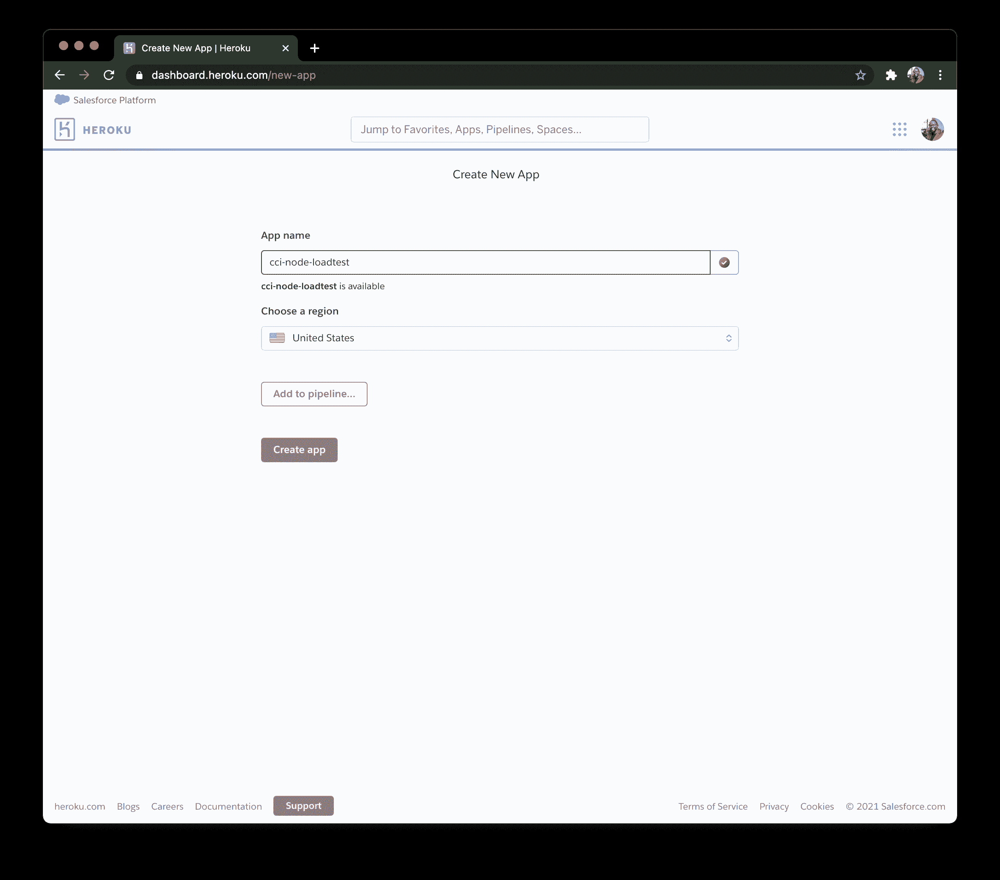
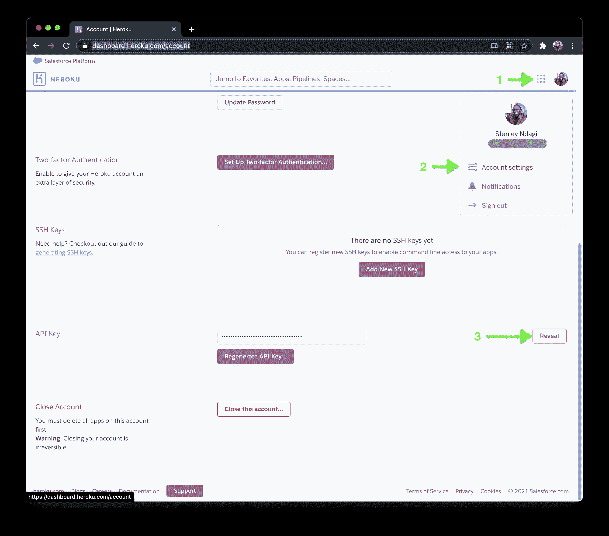
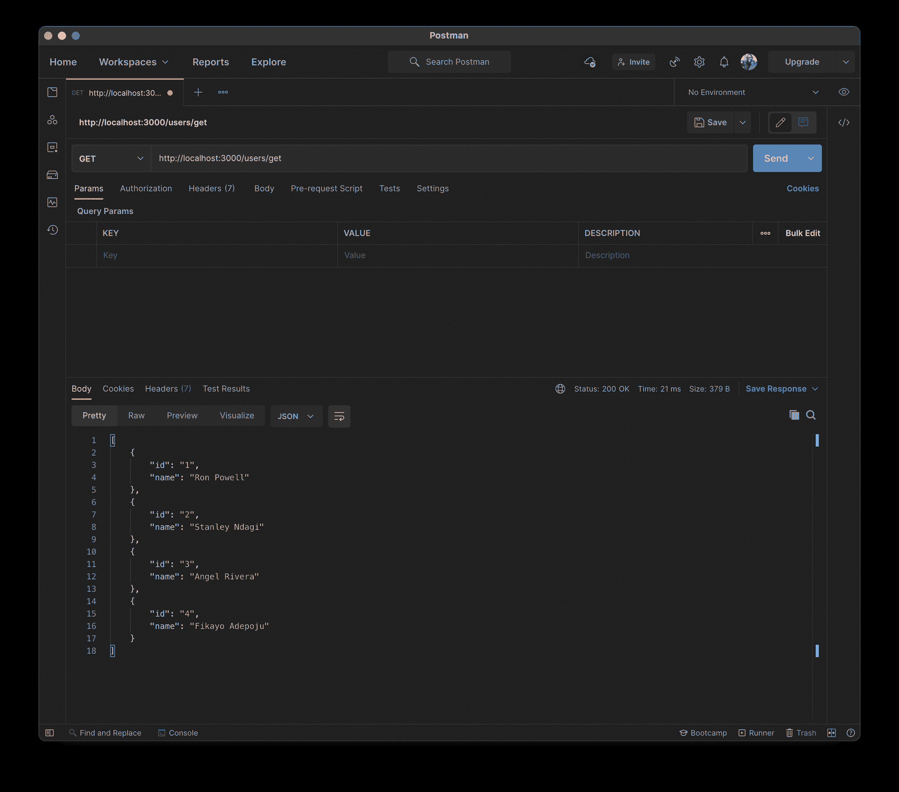
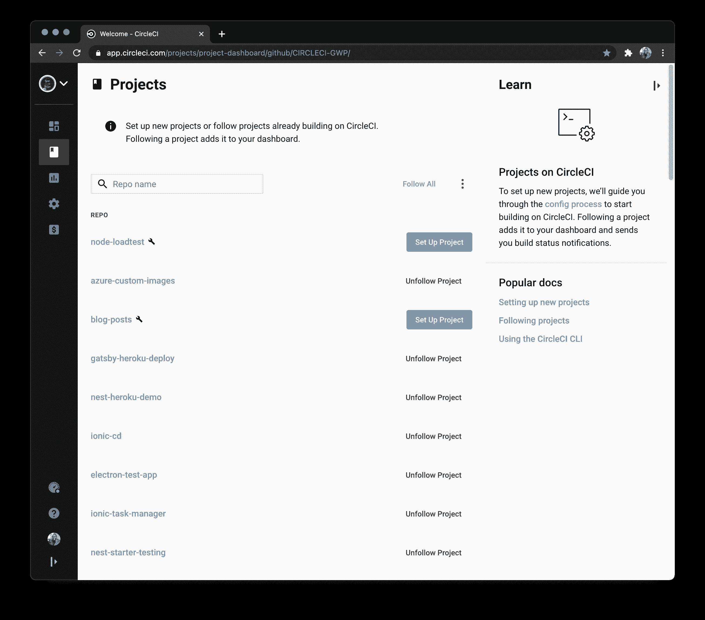
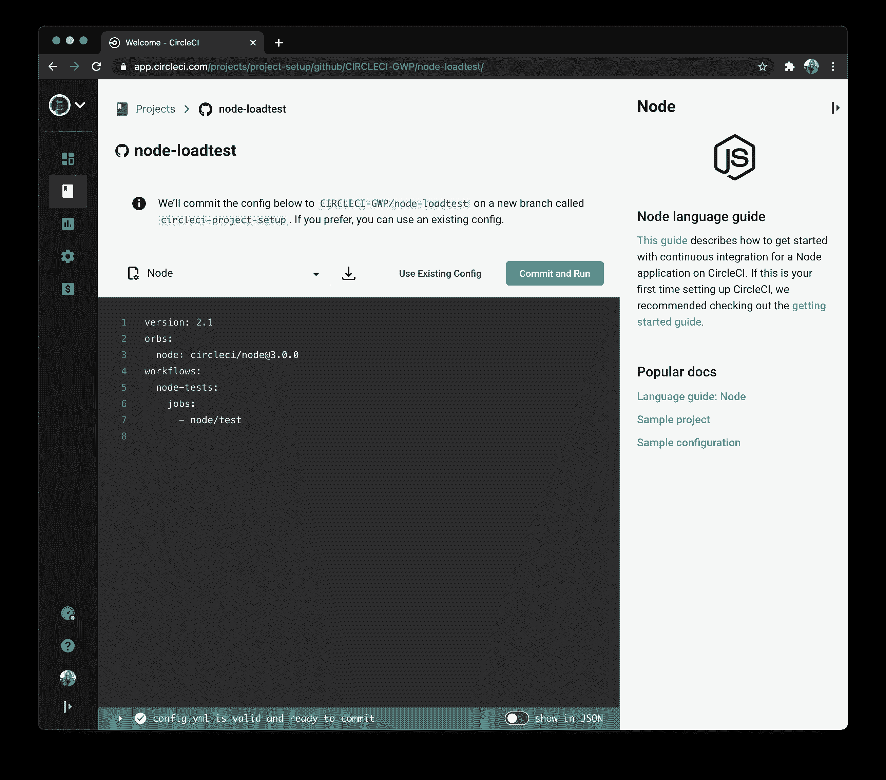
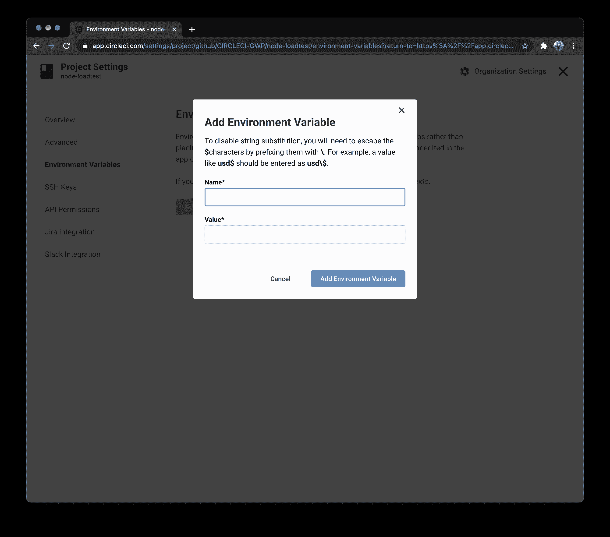
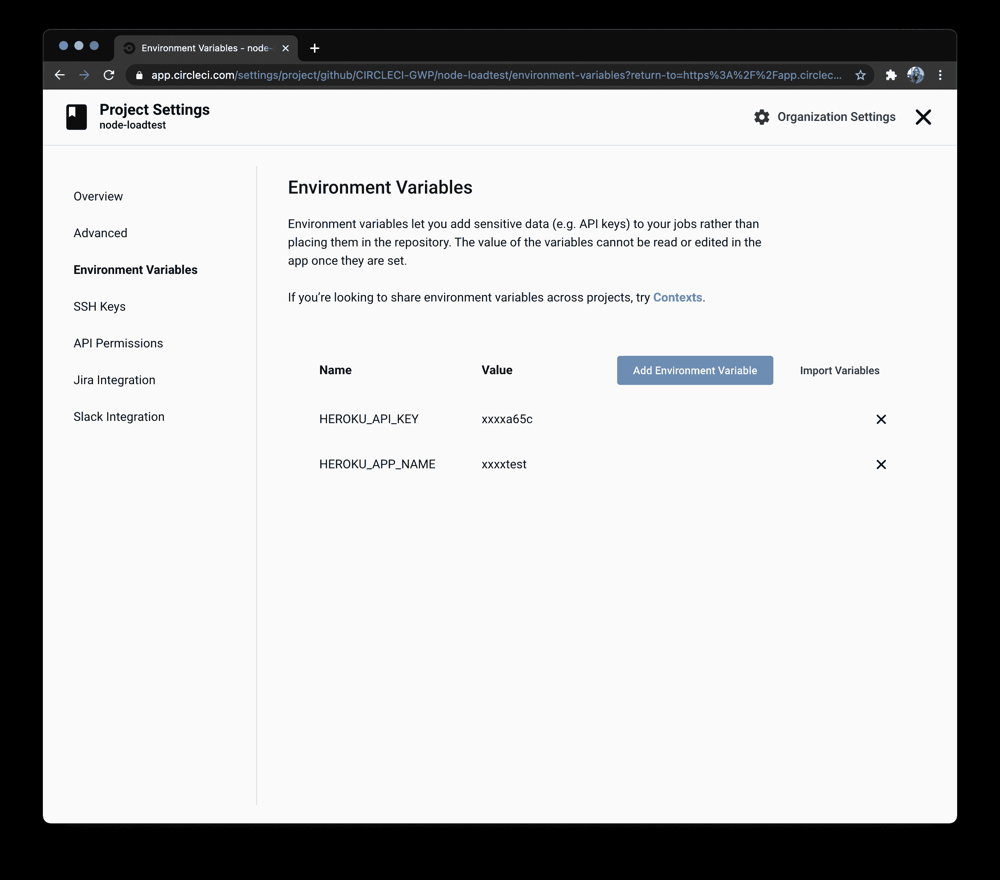
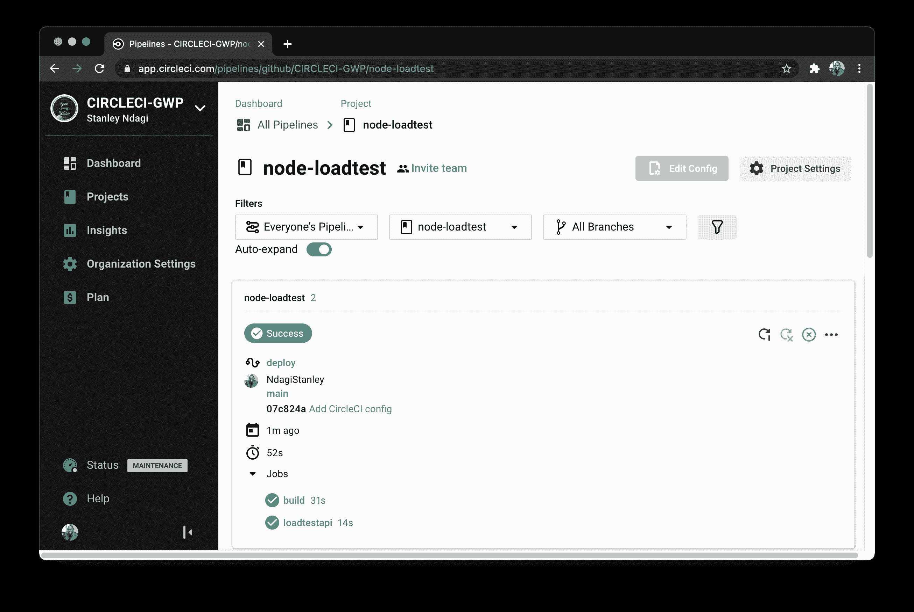
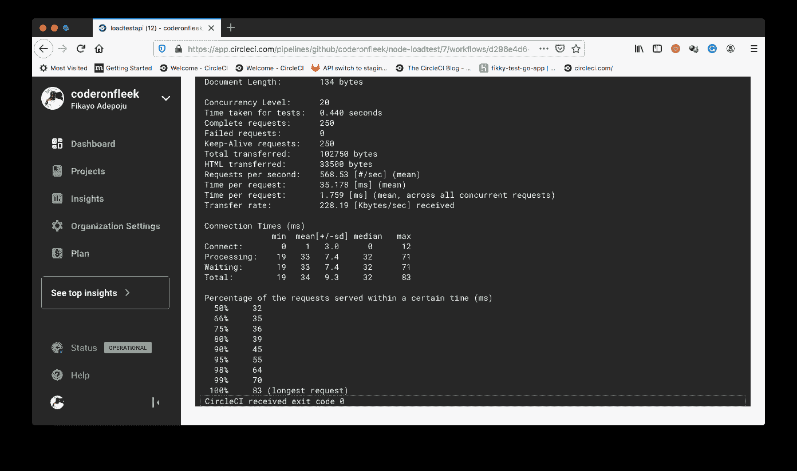

# 自动化 API 的负载测试| CircleCI

> 原文：<https://circleci.com/blog/api-load-tests/>

在大多数情况下，当用户开始访问和使用一个新的应用程序或新版本时，app 的表现相当好。随着用户群的增长和使用量的增加，应用程序可能会超出其基础架构。用户可能会开始体验到性能下降。延迟增加，带宽和内存很快耗尽，一些代码架构开始失败，因为它们不能很好地随着用户数量的增加而扩展。这不是一个意料之外的问题；基础设施和应用程序架构应该随着使用量的增加而扩展。风险在于无法提前知道应用程序何时会“崩溃”,或者基础架构何时会因服务器负载增加而停机。这个问题会导致巨大的损失，尤其是在财务方面。

负载测试是软件应用程序生命周期中最重要的测试之一。通过负载测试，您可以让您的应用程序承受生产中预期的压力类型。这为您提供了微调基础架构和体系结构的信息，确保您的应用程序不会低于您的性能阈值。

在本教程中，我们将使用 [Apache benchmark](https://httpd.apache.org/docs/2.4/programs/ab.html) 对一个简单的 Node.js API 进行负载测试，这是一个针对 HTTP 服务器的负载测试和基准测试工具。

## 先决条件

要遵循本教程，需要做一些事情:

1.  Javascript 的基础知识
2.  您系统上安装的 [Node.js](https://nodejs.org) (版本> = 10.3)
3.  英雄的叙述
4.  一个[圆](https://circleci.com/signup/)的账户
5.  GitHub 的一个账户

所有这些安装和设置，我们可以开始教程。

## 为主机设置 Heroku

第一步是建立一个 Heroku 应用程序来托管我们的 API。导航至您的 [Heroku 应用仪表板](https://dashboard.heroku.com/apps)。点击**新建**，然后**新建 app** 。使用您喜欢的名称，创建一个新应用程序。



记下您刚刚输入的应用程序名称(`node-loadtest`此处)。在本教程的后面部分，您将需要用到它。

接下来，在你的仪表板的 [`Account Settings`部分找到你的 Heroku API 密匙。](https://dashboard.heroku.com/account)



在教程的后面部分，您也将需要它。

## 克隆测试项目

下一步，您将需要克隆 API 项目。API 项目是一个简单的 Node.js API 应用程序，具有一个根端点和另一个用于获取用户集合的端点。通过运行以下命令克隆项目:

```
git clone --single-branch --branch base-project https://github.com/coderonfleek/node-loadtest 
```

克隆过程完成后，进入项目的根目录，通过运行以下命令安装依赖项:

```
cd node-loadtest
npm install 
```

安装完成后，使用以下命令运行应用程序:

```
npm start 
```

应用程序将开始监听默认端口`3000`。打开[邮递员](https://www.postman.com/)，向`http://localhost:3000/users/get`端点发出`GET`请求。这应该会返回一个用户数组。



结果？API 似乎工作得很好。

## 连接到 CircleCI

要在 CircleCI 上设置 API 项目，首先需要[将项目推送到 GitHub](https://circleci.com/blog/pushing-a-project-to-github/) 。

接下来，进入 [CircleCI 仪表板](https://app.circleci.com/projects)上的**项目**页面(选择合适的 GitHub 账户)添加项目。



点击**设置项目**按钮开始。这将加载下一个屏幕。



在设置页面上，点击 **Use Existing Config** 以指示 CircleCI 我们正在手动添加一个配置文件，并且不使用显示的示例。接下来，将提示您下载管道的配置文件或开始构建。


点击**开始建造**。这个构建将会失败，因为我们还没有设置配置文件。我们稍后将完成这一步。

我们需要在 CircleCI 控制台上做的最后一件事是为我们刚刚添加的项目设置环境变量。这将使我们的项目能够对我们的 Heroku 应用程序进行身份验证访问以进行部署。

点击 Pipelines 页面上的**项目设置**按钮，转到您的项目设置。确保您的项目是当前选定的项目。


在项目设置页面，点击**环境变量**(在侧边菜单中)。

在环境变量页面上，点击**添加环境变量**。



添加以下环境变量:

*   `HEROKU_APP_NAME`是您的 Heroku 应用程序的名称(在本例中是`cci-node-loadtest`
*   `HEROKU_API_KEY`是你的 Heroku 账号 API 密匙(前面提到过)。



现在，您已经在 CircleCI 控制台上为部署到 Heroku 做好了一切准备。

## 在管道配置中添加负载测试

现在是时候构建部署管道了，它将在每次进行部署时对 API 的`/users/get`端点进行负载测试。在项目的根目录下，创建一个名为`.circleci`的文件夹和一个名为`config.yml`的文件。在`config.yml`内，输入该代码:

```
jobs:
  build:
    executor: heroku/default
    steps:
      - checkout
      - heroku/install
      - heroku/deploy-via-git

  loadtestapi:
    docker:
      - image: circleci/node:10.16.3
    steps:
      - run:
          name: Run Load Test
          command: |
            sudo apt-get update
            sudo apt-get install apache2-utils
            ab -k -c 20 -n 250 https://$HEROKU_APP_NAME.herokuapp.com/users/get

orbs:
  heroku: circleci/heroku@0.0.10
version: 2.1
workflows:
  deploy:
    jobs:
      - build
      - loadtestapi:
          requires:
            - build 
```

在您刚刚创建的配置中，有两个作业:

*   `build`作业使用 CircleCI 的 Heroku orb 将 API 项目从 GitHub 存储库部署到托管平台上创建的 Heroku 应用程序

*   一旦部署了 API，`loadtestapi`安装 Apache 基准测试工具，然后使用该工具将`250`请求发送到`/users/get`端点，使用`20`的并发性和`Keep-Alive`的连接类型实现带有`-k`标志的持久连接

使用工作流，`loadtestapi`作业在`build`作业完成之前不会运行，确保我们在 API 成功部署之前不会运行负载测试。

运行负载测试管道的时间。提交对项目的所有更改，并推送到您的远程 Github 存储库。这将自动触发管道，您应该有一个成功的构建。



单击工作流中的`loadtestapi`任务，查看负载测试的结果。



结果显示所有的`250`请求都在`0.44`秒内得到了服务。这是否是一个好结果取决于您或您的组织为您的应用程序设置的性能指标。还显示了测试运行的其他细节。这些细节有助于调整您的应用程序架构，以便更好地为使用该应用程序的数千到数百万用户进行伸缩。

## 结论

任何为用户提供软件服务的企业或创业组织都应该认真对待负载测试。负载测试使您能够在用户使用应用程序时避免停机的后果。在本教程中，我们已经能够部署一个 API 并立即运行一个负载测试来验证它处理 web 流量的能力。使用 Apache benchmark 有许多方法来扩展这些负载测试。还有一些专门的工具可以插入到流程中，或者作为 Apache benchmark 的替代品，比如 [k6](https://k6.io/) 。

编码快乐！

* * *

Fikayo Adepoju 是 LinkedIn Learning(Lynda.com)的作者、全栈开发人员、技术作者和技术内容创建者，精通 Web 和移动技术以及 DevOps，拥有 10 多年开发可扩展分布式应用程序的经验。他为 CircleCI、Twilio、Auth0 和 New Stack 博客撰写了 40 多篇文章，并且在他的个人媒体页面上，他喜欢与尽可能多的从中受益的开发人员分享他的知识。你也可以在 Udemy 上查看他的视频课程。

[阅读 Fikayo Adepoju 的更多帖子](/blog/author/fikayo-adepoju/)