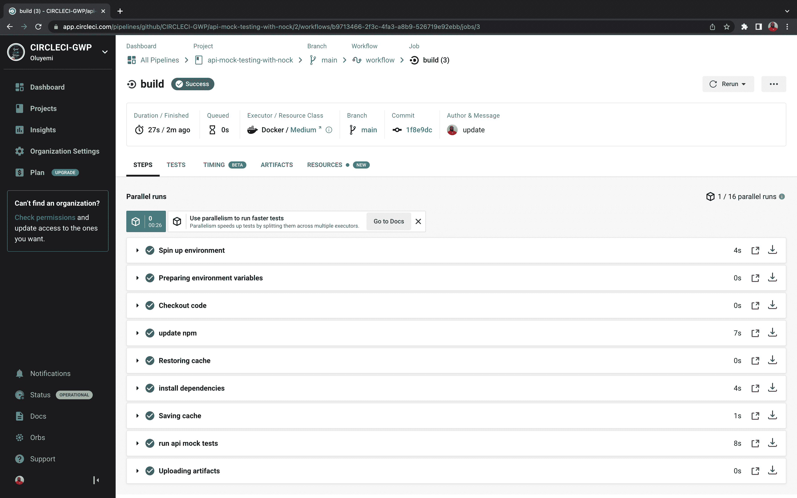

# 用 Nock | CircleCI 进行 API 模拟测试

> 原文：<https://circleci.com/blog/api-mock-testing-nock/>

> 本教程涵盖以下主题:
> 
> 1.  设置 Nock 节点库
> 2.  使用 Nock 编写 API 模拟测试
> 3.  使用 Nock 启用实际的 HTTP 请求

为了让最新的全栈应用程序工作，需要后端服务。当前端服务依赖后端服务来呈现数据时尤其如此。在许多情况下，很难复制后端服务的设置，以便测试应用程序。本教程将向您展示如何模拟来自 API 的 HTTP 请求，以便您可以测试端点，而无需在测试中真正调用它们。

## Nock 是什么？

Nock 是一个 HTTP 服务器模仿和期望库。您可以使用这个库来测试正在执行 HTTP 请求的前端模块。您可以单独测试，因为 Nock 让您决定我们的 API 响应是什么。

在本教程中，我们将使用一个现有的 API todo 应用程序来测试它如何使用 Nock 对后端 API 做出反应。因为这是一个托管应用程序，所以您可以只关注测试，而不是开发应用程序本身。

## 先决条件

为了从本教程中的步骤中获得最大收益，您需要准备一些东西:

1.  [JavaScript](https://www.JavaScript.com/) 的基础知识
2.  HTTP 请求和测试的基本知识
3.  您系统上安装的 [Node.js](https://nodejs.org) (版本> = 10)
4.  一个[圆](https://circleci.com/signup/)的账户
5.  GitHub 的一个账户

> 我们的教程是平台无关的，但是使用 CircleCI 作为例子。如果你没有 CircleCI 账号，请在 注册一个免费的 [**。**](https://circleci.com/signup/)

本教程的第一步是从 [GitHub](https://github.com/CIRCLECI-GWP/api-mock-testing-with-nock) 克隆测试库。

一旦您克隆了存储库，就不需要设置应用程序了。在验证文件`todo.spec.js`中的步骤时，您可以简单地按照教程进行操作。该文件位于克隆存储库的应用程序根目录中。

## 为什么我应该使用模拟测试？

一个简单的客户端-服务器架构 web 应用程序既有后端服务又有前端服务。前端服务包含应用程序的表示逻辑，在大多数情况下充当用户界面。当用户执行一个动作时，客户端向后端应用程序发送一个请求。在本教程中，我将把后端应用程序称为服务器。

模拟测试使运行测试的过程更快，因为您可以消除对外部系统和服务器的依赖。本质上，您“模拟”了后端应用程序。使用模拟依赖项的另一个好处是，您可以在不导致外部系统资源(如数据库)紧张的情况下进行测试。

**注意** : *模拟测试应该总是与[其他类型的测试](https://circleci.com/blog/testing-methods-all-developers-should-know/)一起使用，以提供最好的测试覆盖。好的测试可以增加发布过程中的信心。*

## 测试 API HTTP 架构

第一个示例测试应该检查向一个`todo`应用程序的实际后端发出请求需要多长时间。这个请求将让您了解模仿可以节省多少时间，尤其是在运行模仿后端的测试的情况下。

对于用户来说，应用程序创建、显示和获取所有的`todo`项。该测试检查返回所有已经创建的`todo`项所花费的时间。

```
describe('todo-app-barkend mocked tests', () => {
   it('can get todos', async () => {
       const response = await getTodoItems.getAllTodos();
       console.log(response)
   })
}) 
```

结果显示了执行简单测试并返回结果所花费的时间。因为我们调用的是一个真实的数据库，所以我们将返回所有的结果，而不仅仅是我们需要的特定结果。


检索所有已添加的项目大约需要 3.591 秒。当运行测试时，每当您想要在响应中断言一些东西时，检索这些项目大约需要 3.591 秒。当运行测试时，这增加了大量的开销和时间限制。

### 没有模拟的测试执行架构

这里有一个图表，显示了在没有任何模拟服务干预的情况下，该测试如何运行的简化架构。


通过建立一个测试数据库来测试这个架构以确保得到响应可能是一件令人头疼的事情。相反，您可以隔离所有后端依赖项，只关注前端应用程序。然后使用 Nock mock 服务拦截对 API 后端的请求，并返回自定义响应。

### 模拟测试执行架构


这个架构图显示了返回的内容不是来自 API，而是自定义响应。

如果需要，您可以覆盖模拟 API 响应并直接访问端点。在这一节中，我将指导您使用 Nock 库来测试如何模仿 API 服务，甚至覆盖被模仿的调用。

首先，花点时间在您的存储库上设置 CircleCI 和 Git。如果您已经克隆了存储库，并且已经设置了应用程序，则不需要执行此步骤。

## 设置 Git 并推送到 CircleCI

要设置 CircleCI，请通过运行以下命令在项目中初始化 Git 存储库:

```
git init 
```

接下来，在根目录下创建一个`.gitignore`文件。在文件中添加`node_modules`，防止 npm 生成的模块被添加到您的远程存储库中。下一步是添加一个提交，然后[将你的项目推送到 GitHub](https://circleci.com/blog/pushing-a-project-to-github/) 。

登录 CircleCI，进入项目。列出了与您的 GitHub 用户名或您的组织相关的所有 GitHub 存储库。在本教程中，您希望在 CircleCI 中设置的特定存储库是`api-mock-testing-with-nock`。

在项目仪表盘上，点击**设置项目**按钮。然后点击**使用现有配置**。


出现提示时，点击**开始建造**。管道出现故障，这是意料之中的。在项目正确构建之前，您需要将定制的`.circleci/config.yml`配置文件添加到 GitHub。


## 编写 CI 管道配置

设置完 CircleCI 管道后，就该将 CircleCI 添加到本地项目中了。首先在根目录下创建一个名为`.circleci`的文件夹。在文件夹中，创建一个`config.yml`文件。现在添加配置详细信息:

```
version: 2.1
jobs:
  build:
    working_directory: ~/repo
    docker:
      - image: cimg/node:10.16.3
    steps:
      - checkout
      - run:
          name: update npm
          command: "npm install -g npm@5"
      - restore_cache:
          key: dependency-cache-{{ checksum "package-lock.json" }}
      - run:
          name: install dependencies
          command: npm install
      - save_cache:
          key: dependency-cache-{{ checksum "package-lock.json" }}
          paths:
            - ./node_modules
      - run:
          name: run api mock tests
          command: npm test
      - store_artifacts:
          path: ~/repo/api-mock-testing-with-nock 
```

在此配置中，CircleCI 使用从环境中提取的节点 Docker 映像，然后更新 npm 程序包管理器。下一阶段恢复缓存(如果存在)并在 save-cache 检测到更改时更新应用程序依赖关系。最后，它运行`api-mock-testing-with-nock`测试，并将缓存的项目存储在工件`api-mock-testing-with-nock`目录中。

将您的更改推送到 GitHub 和 CircleCI 会自动开始构建过程。因为还没有测试，所以您的管道将(再次)失败。这是可以的，因为您将在添加测试后重新运行它。即使没有测试，也可以查看管道的详细信息。

## 用 Nock 测试

就像在架构图中一样，Nock 位于后端应用程序和前端应用程序之间，拦截任何被测试的请求。不是调用后端服务来测试应用程序，而是提供一组模拟(模仿)应用程序的已知响应。

在这个测试中，您将重写先前的测试，模拟返回对`todo`项的响应的 API 请求。测试位于文件`todo.spec.js`中的克隆存储库中。

```
it('can get todos', async () => {
       const todoObject = {
           todos: [
               { task: "Two", _id: 9, "completed": false },
               { task: "three", _id: 84, "completed": false }]
       }
       nock('https://todo-app-barkend.herokuapp.com/todos/')
           .get('/')
           .reply(200,
               todoObject
           )
       const res = await got('https://todo-app-barkend.herokuapp.com/todos/')
       expect(res.body).to.eq(JSON.stringify(todoObject))
       expect(res.statusCode).to.equal(200)
   }) 
```

Nock 拦截任何路由到`/todos/`端点的 GET 请求。Nock 返回使用`nock()`方法定义的响应，而不是使用来自 API 的响应进行测试。

**注** : *Heroku 自由层 dynos 睡眠 30 分钟无活动后。如果测试失败，dynos 可能处于非活动状态，您可能需要重新运行测试。*

当您检查测试的运行时间时，您应该会发现使用模拟服务运行测试比测试真实服务更快。被模仿的服务运行大约需要`1.58`秒。这比之前没有模拟服务的请求要好得多，之前的请求运行了大约`3.59`秒。


运行新的测试清楚地表明，模拟请求运行得更快，这可以为您的团队节省大量时间。当多个测试需要调用后端时尤其如此。

**注意** : *当 Nock 模仿 API 请求时，它需要在测试执行时在端点上执行 HTTP 请求，以确保端点存在。因此，如果被模拟的端点不可用，或者测试中指定的路由无效，测试将会失败。*

## 绕过 Nock HTTP 模仿

虽然模拟端点有助于理解应用程序如何与后端服务交互，但您可能需要在测试中绕过模拟请求。当向后端服务发出 HTTP 请求时，如果需要验证是否从端点获得了正确的响应，就必须绕过模仿。

下一个示例测试使用 Nock `enableNetConnect`方法来定义在模拟我们的测试时可以绕过的链接。一个很好的例子是启用到`localhost` URL 的连接，并用托管的 URL 进行模拟，以验证一切都正常工作。您可以在文件`todo.spec.js`的克隆存储库中找到这个测试。

```
it('can create todos - enabled backend', async () => {
       var options = {
           headers: {
               'content-type': 'application/json'
           },
           body: JSON.stringify({
             task: 'Cook Lunch'
           })
         };

       nock.enableNetConnect(/(todo-app-barkend)\.herokuapp.com/)
       const res = await got.post('https://todo-app-barkend.herokuapp.com/todos/', options)
       expect(JSON.parse(res.body)).to.have.property('task', "Cook Lunch");
   }) 
```

创建`todo`项的后端测试指定了要绕过的 URL 的正则表达式。然后，它稍后会向该 URL 发出请求。第二个请求是确保当您向远程 URL 发出请求时，应用程序确实创建了一个`todo`项。

### 清除模拟和块

在运行每个测试后清除模拟是很重要的。您还需要启用任何被阻止的 HTTP 请求。清除模拟和阻塞可以防止它们干扰后续测试，并允许其他测试发出 HTTP 请求。

要在运行测试后清除模拟，请在测试的`afterEach`部分输入以下代码:

```
afterEach(() => {
       nock.cleanAll()
       nock.enableNetConnect()
   }) 
```

### 验证 CircleCI 管道成功

既然测试已经开始，CI 管道已经建立，那么您可以将所有文件添加到 git 中，并将它们推送到 GitHub 远程存储库。我们的 CircleCI 管道应该可以自动运行我们的测试。要观察管道执行，请转到 CircleCI 仪表板，并单击项目名称:`(api-mock-testing-with-nock)`。

要查看构建状态，请从 CircleCI 仪表板中选择构建。您将能够查看 CircleCI 配置文件中定义的每个步骤的状态。



要观察管道执行，请转到 CircleCI 仪表板，并单击项目名称:`(api-mock-testing-with-nock)`。

要查看构建状态，请从 CircleCI 仪表板中选择构建。您将能够查看 CircleCI 配置文件中定义的每个步骤的状态。


太棒了。我们有一栋绿色建筑。

## 结论

在本教程中，我已经向你展示了什么是 API 模仿，以及它有多有用。我们在测试中使用 Nock 模拟 HTTP 请求，并展示了模拟如何减少测试执行所需的时间。您已经学习了如何单独测试应用程序的行为，而不涉及外部依赖。

您练习了使用模拟运行测试，并学习了清除模拟的价值以及何时这样做。有了这些知识，您和您的团队就能更好地测试 API，而不需要调用它们进行响应。快乐(更快)测试！

* * *

Waweru Mwaura 是一名软件工程师，也是一名专门研究质量工程的终身学习者。他是 Packt 的作者，喜欢阅读工程、金融和技术方面的书籍。你可以在[他的网页简介](https://waweruh.github.io/)上了解更多关于他的信息。

[阅读更多 Waweru Mwaura 的帖子](/blog/author/waweru-mwaura/)