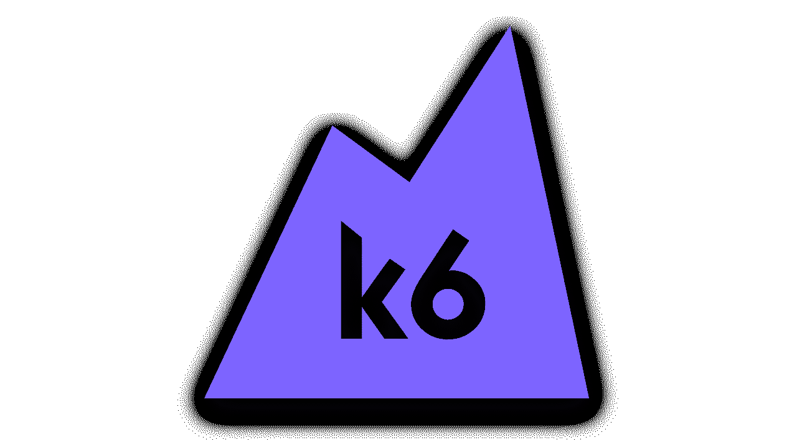
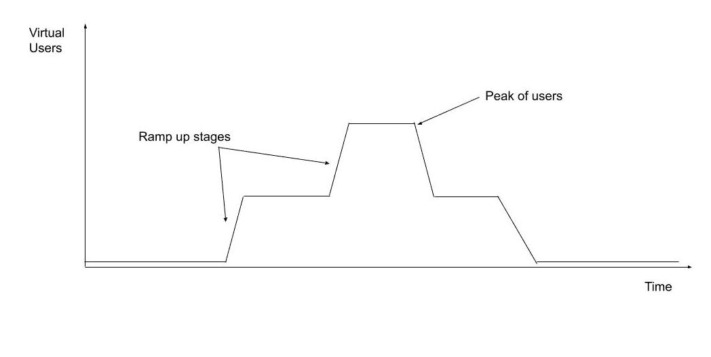
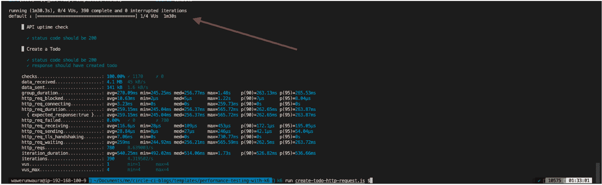
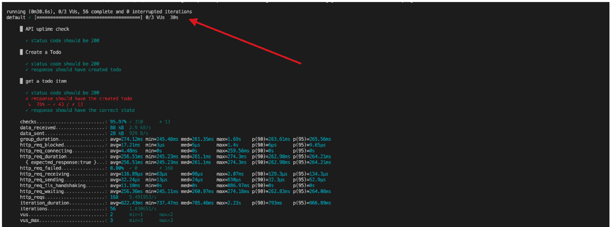
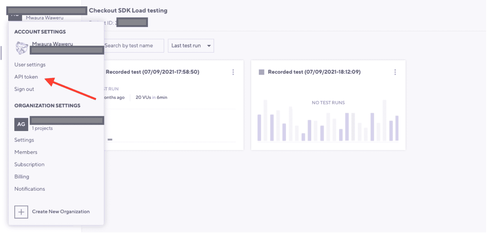
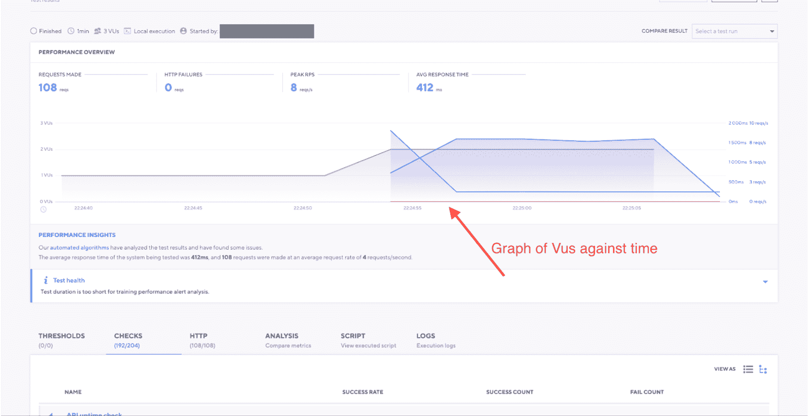
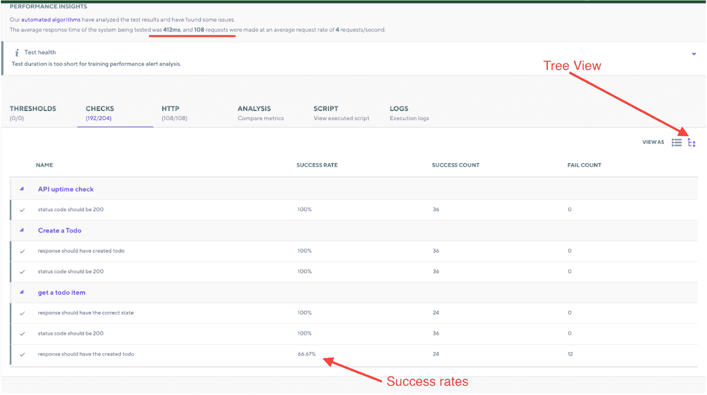
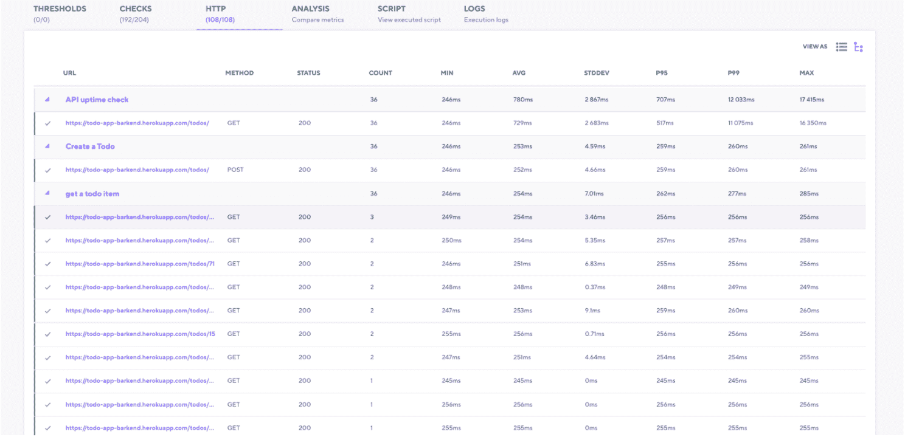
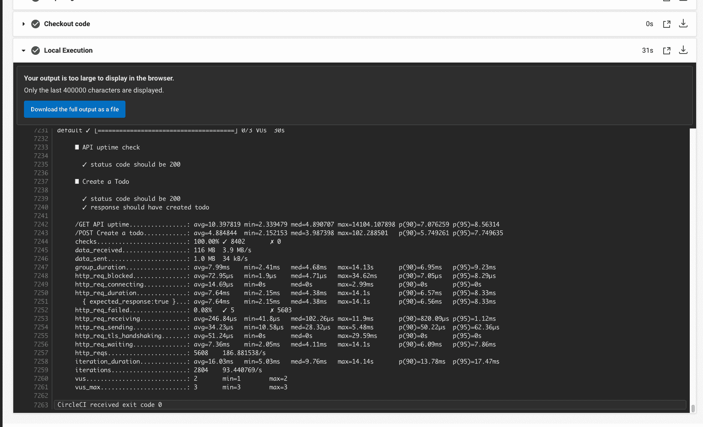
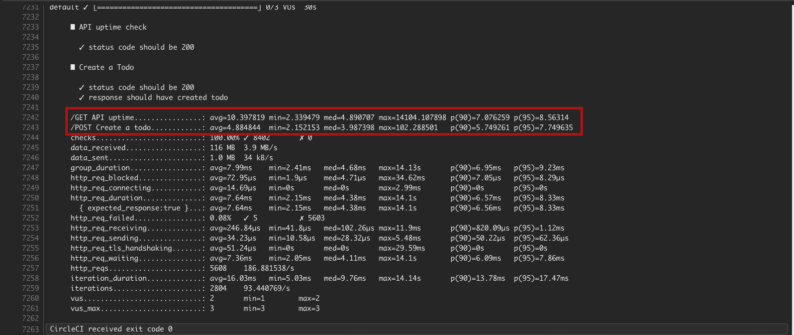

# 使用 k6 进行 API 性能测试

> 原文：<https://circleci.com/blog/api-performance-testing-with-k6/>

> 本教程涵盖:
> 
> 1.  什么是 k6，它是如何工作的
> 2.  编写和执行 k6 性能测试
> 3.  分析 k6 性能测试结果

性能测试衡量系统在各种工作负载下的表现。被测试的关键品质是稳定性和响应性。性能测试通常显示系统的健壮性和可靠性，以及特定的潜在断点。在本教程中，您将使用 k6 在 Heroku 平台上托管的简单 API 上进行负载测试。然后你将学习如何解释从测试中获得的结果。本教程是用 k6 测试 [HTTP 请求的指南。](/blog/http-request-testing-with-k6/)

## 先决条件

要学习本教程，您需要:

> 我们的教程是平台无关的，但是使用 CircleCI 作为例子。如果你没有 CircleCI 账号，请在 注册一个免费的 [**。**](https://circleci.com/signup/)

k6 是一个开源框架，旨在为开发者带来性能测试的乐趣。k6 脱颖而出，因为它能够封装可用性和性能，同时还捆绑了一些工具，如执行脚本的命令行界面和监控测试运行结果的仪表板。



k6 是用 [goja](https://github.com/dop251/goja) 编程语言编写的，是 ES2015(ES6) JavaScript 在纯 [Golang](https://golang.org/) 语言上的实现。这意味着您可以使用 JavaScript 编写 k6 脚本，尽管语言语法将只与 JavaScript ES2015 语法兼容。

**注意** : *k6 不在 Node.js 引擎上运行。它使用 Go JavaScript 编译器。*

既然您已经知道了 k6 下运行的是什么，为什么不着手设置 k6 来运行您的性能测试呢？

## 克隆存储库

首先，[从](https://docs.github.com/en/repositories/creating-and-managing-repositories/cloning-a-repository) [GitHub 库](https://github.com/CIRCLECI-GWP/api-testing-with-k6)中克隆示例应用程序。

```
git clone https://github.com/CIRCLECI-GWP/api-performance-testing-with-k6.git 
```

下一步是在您的机器上安装 k6。

## 安装 k6

与 JavaScript 模块不同，k6 必须使用包管理器安装。在 macOS 中你可以使用[自制](https://brew.sh/)。在 Windows 操作系统中，你可以使用[巧克力糖](https://github.com/chocolatey/choco)。k6 文档中有更多适用于其他操作系统的安装选项。对于本教程，我们将遵循 macOS 安装指南。在 Homebrew 中执行此命令:

```
brew install k6 
```

这是我们开始编写 k6 测试时需要运行的唯一命令。

## 编写您的第一个性能测试

干得好！你已经安装了 k6，知道它是如何工作的。接下来是理解 k6 测量什么，以及您可以使用什么度量来编写您的第一个负载测试。负载测试通过模拟多个用户同时访问系统来模拟系统的预期使用情况。在我们的例子中，我们将模拟多个用户在指定的时间段内访问我们的 API。

### 负载测试我们的应用程序

示例中的负载测试测量我们的 API 系统在面对不同用户组时的响应性和稳定性。示例测试确定了系统的断点和可接受的限制。

在本教程中，我们将针对 k6 测试文件运行脚本，该文件首先在 [Heroku](https://dashboard.heroku.com/apps) 上已经托管的 API 应用程序中创建一个 todo。要将这视为负载测试，我们必须包括可伸缩虚拟用户、可伸缩请求或可变时间等因素。在我们的例子中，随着测试的进行，我们将关注应用程序的用户规模。这个特性是用 k6 框架预构建的，这使得我们的实现非常容易。

为了模拟这一点，我们将使用 k6 概念的[执行者](https://k6.io/docs/using-k6/scenarios/executors/)。执行器为 k6 执行引擎提供动力，并负责脚本如何执行。跑步者可以确定这些:

*   要添加的用户数量
*   要提出的请求的数量
*   测试持续时间
*   测试应用程序收到的流量

在我们的第一个测试中，我们将使用一个 k6 执行器和一个被 k6 称为`ramping up`的方法。在加速方法中，k6 逐渐增加虚拟用户(VUS)来运行我们的脚本，直到达到峰值。然后在规定的时间内逐渐减少数量，直到执行时间结束。

编写这个负载测试来结合执行者、虚拟用户和测试本身的思想。这里有一个例子:

```
import http from 'k6/http';
import { check, group } from 'k6';

export let options = {
   stages: [
       { duration: '0.5m', target: 3 }, // simulate ramp-up of traffic from 1 to 3 virtual users over 0.5 minutes.
       { duration: '0.5m', target: 4}, // stay at 4 virtual users for 0.5 minutes
       { duration: '0.5m', target: 0 }, // ramp-down to 0 users
     ],
};

export default function () {
   group('API uptime check', () => {
       const response = http.get('https://todo-app-barkend.herokuapp.com/todos/');
       check(response, {
           "status code should be 200": res => res.status === 200,
       });
   });

   let todoID;
   group('Create a Todo', () => {
       const response = http.post('https://todo-app-barkend.herokuapp.com/todos/',
       {"task": "write k6 tests"}
       );
       todoID = response.json()._id;
       check(response, {
           "status code should be 200": res => res.status === 200,
       });
       check(response, {
           "response should have created todo": res => res.json().completed === false,
       });
   })
}); 
```

在这个脚本中，`options`对象在给定的时间内在定义的阶段中逐渐增加用户的数量。虽然默认没有定义执行人，但是 k6 识别了`options`对象中的`stages`、`durations`和`targets`，确定执行人是 [ramping-vus](https://k6.io/docs/using-k6/scenarios/executors/ramping-vus) 。

在负载测试脚本中，我们的目标是在`1m 30 seconds`时间段内最多有`4`个并发用户。因此，脚本将逐渐增加应用程序用户，并在这段时间内执行尽可能多的`create-todo`请求迭代。

换句话说，我们将尝试在指定的时间范围内发出尽可能多的请求，同时根据提供的阶段改变活动虚拟用户的数量。该测试的成功将取决于应用程序在该时间段内发出的成功请求的数量。这是我们测试的虚拟用户随时间变化的图表:



这个`ramp-up graph`图显示了随着时间的增加，虚拟用户逐渐增加到负载测试中，直到用户数量达到峰值。当虚拟用户完成他们的请求并退出系统时，这个数字在最后阶段达到。对于本教程，峰值用户数为`4`。`ramping-vus`执行器类型不是唯一可以运行负载测试的类型。其他执行人有[可用](https://k6.io/docs/using-k6/scenarios/executors/)在 k6。使用取决于您想要执行的性能测试的需要和性质。

示例性能测试脚本显示，我们可以使用 k6 来定义我们的测试，我们的机器将运行的虚拟用户的数量，并且还可以在我们的执行脚本的`group()`块下使用`check()`创建不同的断言。

**注意**:*[K6 中的](https://k6.io/docs/using-k6/tags-and-groups/)组可以让你结合一个大的负载脚本来分析测试的结果。[检查](https://k6.io/docs/using-k6/checks/)是组内的断言，但是工作方式不同于其他类型的断言，因为它们不会在负载测试失败或通过时暂停负载测试的执行。*

## 使用 k6 运行性能测试

现在您已经准备好开始执行测试，这将帮助您了解您的系统和应用程序的性能。我们将测试 Heroku free dyno 和部署在其上的托管 Todo API 应用程序的极限。虽然这不是运行负载测试的理想服务器，但它让我们能够确定系统何时以及在什么情况下达到其临界点。对于本教程，断点可能出现在 Heroku 或我们的 API 应用程序中。该测试将通过虚拟用户(VUS)向 Heroku 发出多个`HTTP`请求。从一个虚拟用户开始，增加到 4 个，虚拟用户将创建 todo 项，持续时间为 1 分 30 秒。

**注意** : *我们假设 Heroku 能够处理 4 个与我们的 API 交互的并发用户会话。*

要从前面的代码片段中运行性能测试，只需在我们的终端上运行以下命令:

```
k6 run create-todo-http-request.js 
```

当这个测试完成后，你将得到 k6 测试的第一个结果。



使用结果来验证性能测试执行了 1 分 30.3 秒，并且测试的所有迭代都通过了。您还可以验证在测试执行期间，4 个虚拟用户总共进行了 390 次迭代(完成了创建 todo 项的过程)。

您可以从数据中获得的其他指标包括:

*   `checks`，测试中声明的已完成的`check()`个断言的数量(全部通过)
*   Total `http_reqs`，发出的所有 HTTP 请求的数量(`780`个请求)
*   创建新 todo 项的总迭代次数和用于检查 Heroku 服务器正常运行状态的 HTTP 请求的组合

这个测试是成功的，我们能够获得关于应用程序的有意义的信息。然而，我们还不知道我们的系统是否有任何断点，或者在一定数量的并发用户开始使用我们的 API 后，我们的应用程序是否会开始表现异常。这是我们将在下一节中尝试完成的任务。

添加另一个 HTTP 请求将有助于我们发现是否可以破坏 Heroku 服务器甚至我们的应用程序。我们还将减少虚拟用户的数量和测试的持续时间，以节省资源。这些调整可以在配置部分通过简单地注释掉执行的最后两个阶段来完成。

**注:** *“破坏应用”指的是在不改变资源或应用代码的情况下，使系统崩溃到返回错误而不是成功执行的地步。这意味着系统仅根据用户数量或请求数量的变化返回错误。*

```
stages: [
       { duration: '0.5m', target: 3 }, // simulate ramp-up of traffic from 1 to 3 users over 0.5 minutes.
       // { duration: '0.5m', target: 4 }, -> Comment this portion to prevent execution
       // { duration: '0.5m', target: 0 }, -> Comment this portion to prevent execution 
```

有了这个配置，我们能够缩短执行的持续时间，并减少用于执行测试的虚拟用户的数量。我们将执行与之前相同的性能测试，但是添加一个 HTTP 请求到:

*   获取创建的`Todo`
*   验证其`todoID`与创建的内容一致
*   验证其创建的`state`为`completed: false`

为了执行这个性能测试，您将需要`create-and-fetch-todo-http-request.js`文件，它已经在我们克隆的存储库中的项目目录的根目录中。转到终端并执行以下命令:

```
k6 run create-and-fetch-todo-http-request.js 
```

一旦该命令执行完毕，您将获得测试结果。



这些结果表明，我们的测试实际上打破了我们的应用程序的免费 Heroku dynos 的限制。虽然有成功的请求，但并不是所有的请求都及时返回了响应。这导致了一些请求的失败。仅使用 3 个恒定的虚拟用户并对`30 seconds`执行测试，有`56`个完整的迭代。在这 56 人中，`checks`的`95.97%`成功了。

失败的检查与获取我们创建的 Todo 项目的`todoID`的响应有关。这可能是我们的 API 或系统出现瓶颈的第一个迹象。最后，我们可以验证我们的`http_reqs` total `168`，它是来自创建待办事项、获取待办事项数据和验证 Heroku 服务器正常运行时间的请求总数:

`56 requests for each iteration * 3 - each of every request item`

从这些测试来看，很明显，性能测试指标并不是所有系统和应用程序的标准。这些数字可能会根据机器配置、应用程序的性质甚至测试中应用程序的依赖系统而有所不同。目标是确保识别和修复瓶颈。您需要了解您的系统可以处理的负载类型，以便您可以规划未来，包括使用高峰和高于平均水平的资源需求。

在上一步中，我们能够对 Heroku free 计划上托管的应用程序执行性能测试，并分析命令行结果。使用 k6，您还可以使用 [K6 云仪表板](https://k6.io/docs/using-k6/dashboard/)来分析性能测试的结果。仪表板是一个基于 web 的界面，允许我们查看性能测试的结果。

## k6 云配置和输出

在您的终端上运行 k6 性能测试并获得输出是很棒的，但是与团队的其他成员共享结果和输出也是很酷的。除了许多很酷的分析功能，共享数据是 k6 仪表板真正闪耀的地方。

要配置 k6 仪表板的输出，请使用您之前创建的帐户详细信息登录 k6 cloud。接下来，找到您的访问令牌。



一旦您进入 API 令牌页面，复制访问令牌，这样您就可以运行测试并将它们上传到云中。

接下来，添加`K6_CLOUD_TOKEN`作为环境变量。在您的终端中运行以下命令来设置 k6 云令牌:

```
export K6_CLOUD_TOKEN=<k6-cloud-token> 
```

**注意:** *将示例中的云令牌值替换为您刚刚从仪表板中复制的 k6 令牌。*

现在，您可以执行负载测试了。使用此命令:

```
k6 run --out cloud create-and-fetch-todo-http-request.js 
```

`--out cloud`告诉 k6 将结果输出到云端。当执行开始时，k6 自动创建带有测试结果的仪表板。您可以使用仪表板来评估性能测试的结果。

仪表板使结果的解释比终端输出更方便、更容易共享。上传运行的第一个指标是请求总数以及不同虚拟用户发出请求的方式。还有关于不同用户何时发出请求的信息。



此图显示了虚拟用户的总数与发出的请求数的关系，以及每个请求的平均响应时间。随着你对每个请求的深入研究，事情变得越来越有趣。k6 仪表盘使用`groups()`和`checks()`实现了这一点。

尝试这样做:选择 Checks 选项卡，然后使用树视图过滤结果。



测试运行中的所有请求都按时间顺序列出，并通过所有请求花费的平均时间以及执行的请求总数来评估失败和成功的执行率。

要评估单个请求及其时间，请在同一个 performance insight 页面中选择 HTTP 选项卡。您可以查看发出的所有请求、它们执行所用的时间，以及执行与其他请求相比的情况。例如，一个请求属于第 95 百分位，而另一个请求属于第 99 百分位。仪表板显示了执行最长请求所花费的最长时间，并附有一个标准偏差图以供参考。该页面为您提供了几乎所有类型的数据点，您和您的团队可以使用这些数据点来识别瓶颈。



您还可以使用 k6 仪表板来选择一个特定的请求，并根据平均运行时间来确定其性能。这将有助于识别当多个用户访问资源时由大量锁定资源导致的数据库瓶颈等问题。

您和您的团队可以从使用 k6 [仪表盘](https://k6.io/docs/results-visualization/cloud/)的功能中获益良多。

下一步是用 CircleCI 触发 k6 性能测试，并配置它们在每次部署时运行。

## 设置 Git 并推送到 CircleCI

**注意** : *如果您已经克隆了项目存储库，那么您可以跳过这部分教程。如果你想学习如何建立自己的项目，我在这里添加了一些步骤。*

要设置 CircleCI，通过运行以下命令初始化项目中的 Git 存储库:

```
git init 
```

接下来，在根目录下创建一个`.gitignore`文件。在文件中添加`node_modules`来防止 npm 生成的模块被添加到您的远程存储库中。然后，添加一个提交，[将你的项目推送到 GitHub](https://circleci.com/blog/pushing-a-project-to-github/) 。

登录 CircleCI 并转到项目仪表板。您可以从与您的 GitHub 用户名或您的组织相关联的所有 GitHub 存储库列表中选择您想要设置的存储库。本教程的项目名为`api-performance-testing-with-k6`。在“项目”面板上，选择设置所需项目的选项。选择使用现有配置的选项。

**注意:** *在启动构建之后，预计您的管道会失败。您仍然需要将定制的`.circleci/config.yml`配置文件添加到 GitHub 中，以便正确构建项目。*

## 设置 CircleCI

在根目录下创建一个`.circleci`目录，然后添加一个`config.yml`文件。配置文件保存每个项目的 CircleCI 配置。在此配置中使用 CircleCI k6 `orb`执行 k6 测试:

```
version: 2.1
orbs:
 k6io: k6io/test@1.1.0
workflows:
 load_test:
   jobs:
     - k6io/test:
         script: create-todo-http-request.js 
```

### 使用第三方球体

CircleCI orbs 是 YAML 配置的可重用包，它将代码压缩成一行。要允许使用像`python@1.2`这样的第三方球体，您可能需要:

*   如果您是管理员，请启用组织设置，或者
*   向您组织的 CircleCI 管理员请求权限。

现在，通过进一步的调查，您可以验证在 k6 中运行您的性能测试是成功的，并且它们已经被集成到 CircleCI 中。干得好！



现在是时候添加度量来测量每个端点的执行时间了。

## 评估 API 请求时间

从前面的性能测试中可以清楚地看出，测试结构没有系统在任何特定时间对测试负载的反应重要。k6 附带了一个名为`Trend`的指标特性，可以让你为你的控制台和云输出定制指标。您可以使用`Trend`通过定制如何定义时间来找出向端点发出的每个请求的具体时间。下面是一个代码块示例:

```
import { Trend } from 'k6/metrics';

const uptimeTrendCheck = new Trend('/GET API uptime');
const todoCreationTrend = new Trend('/POST Create a todo');

export let options = {
   stages: [
       { duration: '0.5m', target: 3 }, // simulate ramp-up of traffic from 0 to 3Vus
   ],
};

export default function () {
   group('API uptime check', () => {
       const response = http.get('https://todo-app-barkend.herokuapp.com/todos/');
       uptimeTrendCheck.add(response.timings.duration);
       check(response, {
           "status code should be 200": res => res.status === 200,
       });
   }); 
```

要实现 k6 `Trend`，从`k6/metrics`导入，然后定义你想要的每个趋势。对于本教程的这一部分，您只需要在进行正常运行时间检查或创建新的 todo 时检查 API 的响应时间。一旦创建了趋势，导航到特定的测试并将您需要的数据嵌入到声明的趋势中。

使用以下命令执行 todo 创建性能测试文件:

```
k6 run create-todo-http-request.js 
```

检查控制台响应。您可以在克隆的存储库的根目录中找到这个测试文件。一旦这在本地通过，提交并将更改推送到 GitHub。



一旦您的测试完成执行，您就可以回顾您在上一步中添加的趋势描述。每个都有单独请求的时间，包括平均、最大和最小执行时间以及它们的执行百分比。

## 结论

本教程向您介绍了什么是 k6，以及如何使用它来运行性能测试。您经历了创建一个简单 k6 测试的过程，该测试用于创建一个针对 Heroku 服务器运行的 todo 列表项。我还向您展示了如何在命令行终端中解释 k6 性能测试结果，以及如何使用云仪表板。最后，我们探索了使用自定义指标和 k6 趋势。我鼓励你与你的团队分享这个教程，并继续扩展你所学到的东西。

我希望你和我一样喜欢这篇教程！

* * *

Waweru Mwaura 是一名软件工程师，也是一名专门研究质量工程的终身学习者。他是 Packt 的作者，喜欢阅读工程、金融和技术方面的书籍。你可以在[他的网页简介](https://waweruh.github.io/)上了解更多关于他的信息。

[阅读更多 Waweru Mwaura 的帖子](/blog/author/waweru-mwaura/)