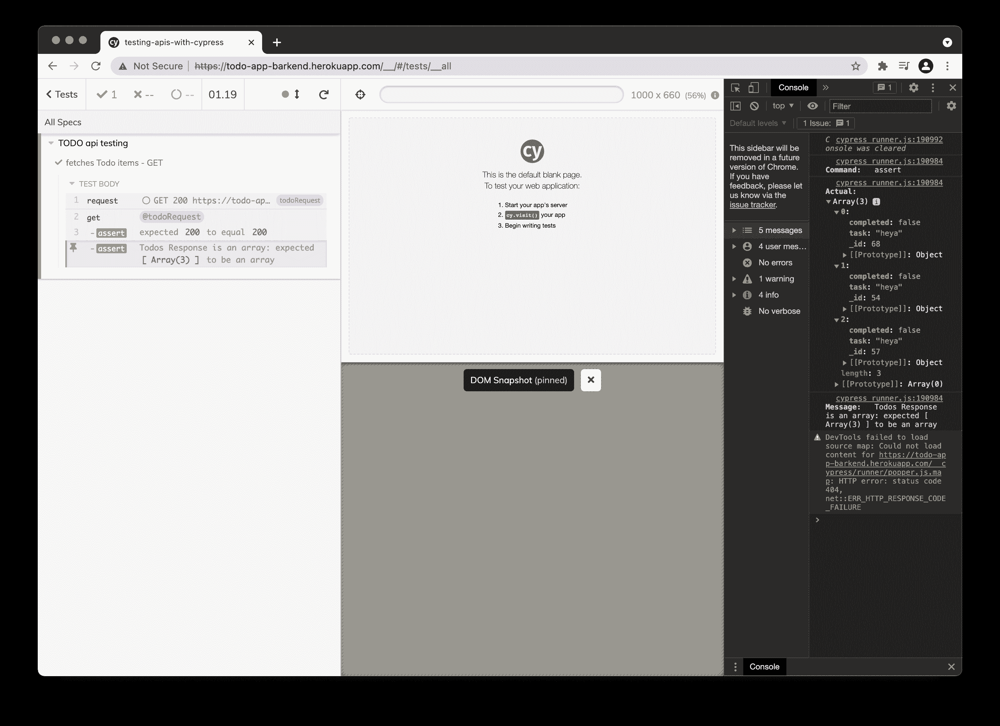

# 用 Cypress | CircleCI 测试 API

> 原文：<https://circleci.com/blog/api-testing-with-cypress/>

有没有可能只用一种工具来测试所有的东西？尽管这听起来像是开发人员的白日梦，但使用 JavaScript 前端测试框架 [Cypress](https://www.cypress.io/) 几乎是*可能的。Cypress 是专门为 JavaScript 前端开发者打造的，他们可以使用它快速开始编写测试，而不需要添加第三方依赖项或包。这是 Selenium 等其他工具所没有的好处。在本教程中，我将指导你使用 Cypress 测试一个 API。*

本教程涵盖以下内容:

1.  建立 Cypress 框架
2.  理解 Cypress 如何对 API 进行 HTTP 调用
3.  了解如何使用 Cypress `cy.request()`方法

## 先决条件

要遵循本教程，您需要准备一些东西:

*   JavaScript 和 Git/GitHub 的基础知识
*   您系统上安装的 [Node.js](https://nodejs.org) (版本> = 10.3)
*   一个[圆](https://circleci.com/signup/)的账户
*   GitHub 的一个账户

## 使用 Cypress 进行 API 测试

因为 Cypress 是一个独立的前端测试工具，它在执行时代表 web 应用程序发出 HTTP 请求。虽然看起来 Cypress 是从浏览器发出这些请求，但它实际上使用 Node.js 作为引擎向 API 服务器发出 HTTP 请求。它使用 Node.js 返回从服务器收到的响应。


**注意** : *Cypress 公开了`cy.request()`方法来从框架内部发出 HTTP 请求。这就是我们在本教程中使用 Cypress 测试端点的方法。*

## 初始化目录并设置 Cypress

首先，通过在终端上运行以下命令，创建一个空目录并初始化一个空节点项目:

```
mkdir testing-apis-with-cypress && cd testing-apis-with-cypress 
```

第一个命令创建目录，而第二个命令使用默认配置创建 Node.js 项目。我们将在本教程的后面更新默认配置。我们将在初始化的节点项目中编写我们的测试。

```
npm init -y 
```

你需要知道`npm init -y`用默认配置创建一个节点项目，并且不会提示你定制项目的`package.json`文件的内容。如果只运行了`npm init`，那么`package.json`文件将会产生不同的结果，因为*将会*提示您配置节点项目属性。

现在您已经有了一个初始化的目录，您可以安装 Cypress 框架了。Cypress 的安装就像任何其他 npm 包的安装一样，因此您可以使用以下任一选项来安装它:

```
npm install cypress 
```

或者:

```
yarn add cypress 
```

安装完 Cypress 之后，下一步是初始化 Cypress 框架。如果需要的话，这个过程将创建您需要编写测试和包含包的默认 Cypress 目录。

在终端中，运行命令`cypress open`。这个命令将首次初始化 Cypress 并创建默认的 Cypress 目录和文件。

注意: *如果你遇到问题，你可能需要在全球范围内安装 Cypress。*


## 设置 Git 并推送到 CircleCI

在开始编写测试之前，您需要设置 CircleCI。首先，通过运行以下命令初始化项目中的 Git 存储库:

```
git init 
```

接下来，在根目录下创建一个`.gitignore`文件。在文件内部，添加`node_modules`以防止 npm 生成的模块被添加到您的远程存储库中。下一步是添加一个提交，然后[将你的项目推送到 GitHub](https://circleci.com/blog/pushing-a-project-to-github/) 。

现在登录 CircleCI 并导航到项目。将会有一个与您的 GitHub 用户名或您的组织相关的所有 GitHub 库的列表。在 CircleCI 中找到您想要设置的存储库。在我们的例子中，它是`api-testing-with-cypress`项目。在“项目”面板上，选择设置所选项目的选项。选择使用现有配置的选项。


现在，在提示符下，选择开始构建过程的选项。您可以预期您的管道会失败，因为您仍然需要将定制的`.circleci/config.yml`文件添加到 GitHub。


### 编写 CI 管道

一旦建立了 CircleCI 管道，就该将 CircleCI 添加到本地项目中了。首先在根目录下创建一个名为`.circleci`的文件夹。在这个文件夹中，创建一个`config.yml`文件。将这些配置详细信息添加到 config.yml:

```
version: 2
jobs:
  build:
    docker:
      - image: cypress/base:14.16.0
        environment:
          ## this enables colors in the output
          TERM: xterm
    working_directory: ~/repo
    steps:
      - checkout
      - restore_cache:
          keys:
            - v1-deps-{{ .Branch }}-{{ checksum "package.json" }}
            - v1-deps-{{ .Branch }}
            - v1-deps
      - run:
          name: Install Dependencies
          command: npm ci
      - save_cache:
          key: v1-deps-{{ .Branch }}-{{ checksum "package.json" }}
          # cache NPM modules and the folder with the Cypress binary
          paths:
            - ~/.npm
            - ~/.cache
      - run: $(npm bin)/cypress run
      - store_artifacts:
          path: ~/repo/api-testing-with-cypress 
```

在这个配置中，CircleCI 从环境中提取一个 Cypress Docker 映像，并检查我们的依赖关系的任何[存储的缓存。](https://circleci.com/blog/config-best-practices-dependency-caching/)

下一步是恢复缓存(如果存在)，并在使用`save-cache`检测到更改时，只更新的应用依赖关系*。它运行`api-testing-with-cypress` Cypress 测试，并将缓存的项目存储在`~/repo/api-testing-with-cypress`目录中的工件中。*

将您的更改推送到 GitHub，CircleCI 应该会自动开始构建过程。在这里，由于我们目前还没有任何测试，我们的管道将再次失败。我们将在添加测试后重新运行。在 CircleCI 仪表板上，即使没有在我们的存储库中运行测试，您也应该能够看到创建的管道和执行。

## Cypress 入门

对于本教程，我们将使用 heroku 上已经构建好的 API 来测试我们的应用程序。但是要做到这一点，我们首先需要 Cypress 理解我们将在测试中使用的 API Url(Cypress 称之为`baseUrl`)。

### 设置`baseUrl`

Cypress 框架有一个由 Cypress 初始化过程生成的配置文件`cypress.json`。`cypress.json`文件存储了我们提供的所有配置变量，这是我们设置`baseUrl`的地方。这是为了确保我们在运行测试时不需要重复整个 URL。`baseUrl`将被设置为 Heroku API URL 的配置变量，如下面的`cypress.json`文件中的代码片段所示。

```
{
   "baseUrl": "http://todo-app-barkend.herokuapp.com/"
} 
```

### 设置运行命令

现在我们已经准备好了测试 URL，我们需要创建一个简单的方法来使用终端运行我们的测试。为此，我们将在脚本部分的`package.json`文件中添加一个脚本。为此，我们需要将下面的`test`命令添加到`package.json`文件脚本部分。

```
"scripts": {
   "test": "cypress open"
 }, 
```

这个命令告诉 Cypress 在非 headless 模式下运行，并在执行我们的测试时打开一个浏览器。

`package.json`文件中的脚本将您必须在终端上运行的命令和脚本自动化。相反，您使用`npm`来执行它们，同时以正在运行的程序可以理解的方式对它们进行打包。

## 用 Cypress 编写测试

Cypress 是一个前端测试工具，它生成许多文件和目录，这些文件和目录是如何编写 Cypress 测试的例子。现在我们可以忽略它们。

既然已经初始化了 Cypress，并且配置了 CircleCI 管道，那么是时候开始编写测试了。

## 编写您的第一个 Cypress API 测试

请记住，Cypress 的工作原理是使用 Node 来触发 HTTP 请求，并将它们路由回 Cypress，以进行断言并验证是否进行了预期的调用。在第一个测试中，我们将向 todo 应用程序发出一个`GET`请求，以确保它实际上将 todo 项返回给 API。在我们这样做之前，我们需要删除目录`cypress/integration/`中的所有内容。该目录包含由 Cypress 初始化生成的虚拟支架。在`cypress/integration/`中，创建另一个名为`api-tests`的目录。为了确保 Cypress 理解测试文件夹的动作，用这个配置值更新`cypress.json`文件。

```
 {
d   "integrationFolder": "cypress/integration/api-tests"
  } 
```

在`api-tests`文件夹中，创建`todo.spec.js`文件，这是我们编写测试的地方。令人敬畏的是:Cypress 是自我维持的，所以我们不需要任何其他外部依赖来测试我们的 API。

打开`todo.spec.js`文件，为 todos 的 API `GET`请求设置测试。添加此代码:

```
describe('TODO api testing', () => {
   let todoItem;
   it('fetches Todo items - GET', () => {
       cy.request('/todos/').as('todoRequest');
       cy.get('@todoRequest').then(todos => {
           expect(todos.status).to.eq(200);
           assert.isArray(todos.body, 'Todos Response is an array')
       });
   });
}); 
```

在这个例子中，Cypress 将`baseUrl`附加到了`cy.request()`方法上。该方法向托管的 API 端点发出 GET 请求，以获取我们的 todo 项，并验证 API 是否被测试调用。

**注意** : *当`cy.request()`没有被传递任何 HTTP 请求操作时，默认为 GET 请求。这就是为什么您不需要告诉测试您正在进行 API `GET`请求。*

## 执行 Cypress API 测试

要执行第一个测试并检查一切运行正常，在终端中运行命令`npm test`。我们在前面的 package.json 中定义了`npm test`命令。


当我们运行命令来执行测试时，任何添加的测试规范(文件)都会显示在 Cypress 仪表板上。选择实际的测试并观察 Cypress 执行它。



仪表板显示测试执行成功，我们能够获得所有的待办事项。默认情况下，Cypress 在浏览器中运行，因此我们可以进一步验证测试返回的所有元素。

在屏幕左侧，单击显示返回数组的最后一个断言。这会将输出打印到控制台。然后，您可以在同一个窗口中右键单击 inspect 元素，打开浏览器开发工具。单击**控制台**选项卡，显示我们在测试中断言的项目阵列。有理由庆祝，因为我们可以验证我们的 API 和测试工作正常。

## 编写和添加更多测试

现在您已经熟悉了如何添加 Cypress，您可以添加更多的测试。例如，您可以测试添加新的 todo 项和删除 todo 项。

```
 it('deletes Todo items - DELETE', () => {
       cy.request('DELETE', `/todos/${todoItem}`).as('todoRequest');
       // deletes Todo item with id = 9
       cy.get('@todoRequest').then(todos => {
           expect(todos.status).to.eq(200);
           assert.isString(todos.body, 'todo deleted!')
       });
   });

   it('Adds Todo item - POST', () => {
       cy.request('POST', '/todos/', { task: "run tests" }).as('todoRequest');
       // adds new Todo item by defining Todo name
       cy.get('@todoRequest').then(todos => {
           expect(todos.status).to.eq(200);
           cy.wrap(todos.body).should('deep.include', {
               task: 'run tests',
               completed: false,
           });
       });
   }); 
```

在这个代码片段中，我们在`cy.request()`中声明了 HTTP 请求的类型。这也是声明任何其他参数的地方，比如创建新 todo 项的`POST`请求的`body`。使用这些测试，您可以验证您可以使用我们的 API 创建一个 todo 项，创建所有的 todo 项，并删除一个 todo 项。成功！我们的 API 没有坏。

现在我们需要验证测试是否也通过了已经创建的 CircleCI 管道。你已经初始化了 CircleCI，所以你只需要提交并推送你的修改到 GitHub。CircleCI 会自动运行我们的测试。


再次，成功！你所有的测试都通过了。

## 结论

在本教程中，您已经设置了 Cypress 并配置它来运行 API 测试。您学习了如何为测试设置`baseUrl`，并在测试框架中配置了目录。您学习了使用`cy.request()`进行不同的 HTTP 操作，以及如何使用 Cypress 测试运行器。我希望你和你的团队能够从本教程中学到的东西中受益。享受开发应用程序的乐趣！

* * *

Waweru Mwaura 是一名软件工程师，也是一名专门研究质量工程的终身学习者。他是 Packt 的作者，喜欢阅读工程、金融和技术方面的书籍。你可以在[他的网页简介](https://waweruh.github.io/)上了解更多关于他的信息。

[阅读更多 Waweru Mwaura 的帖子](/blog/author/waweru-mwaura/)