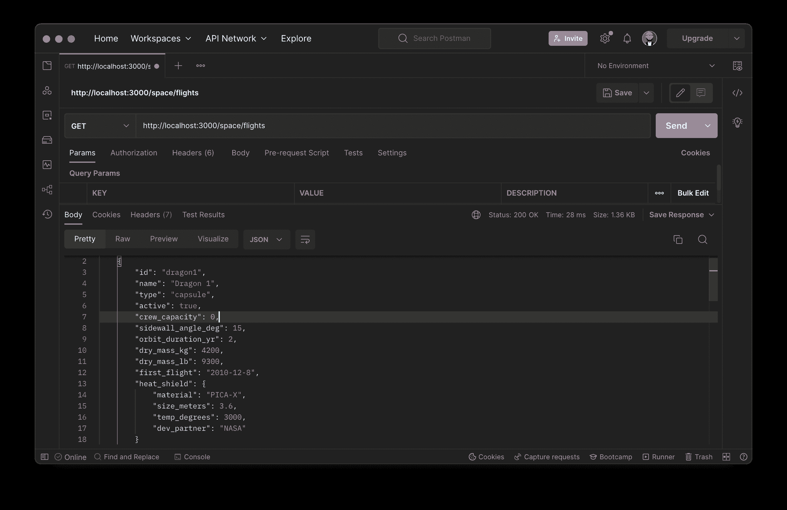
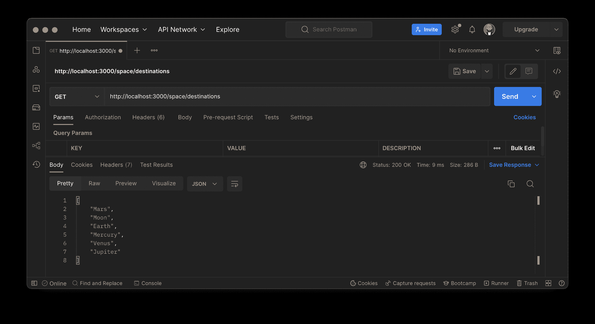
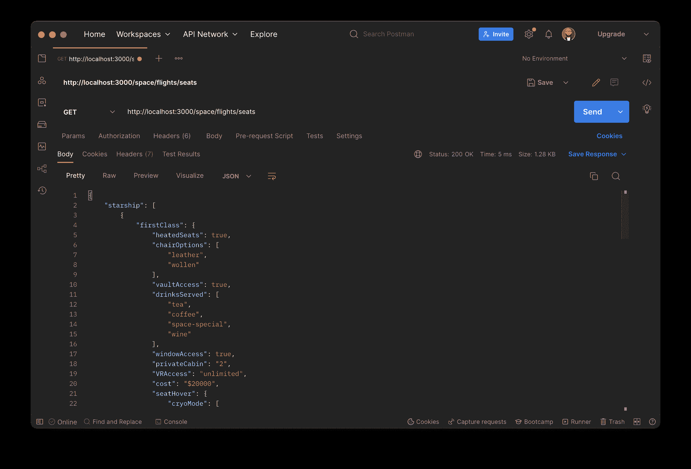
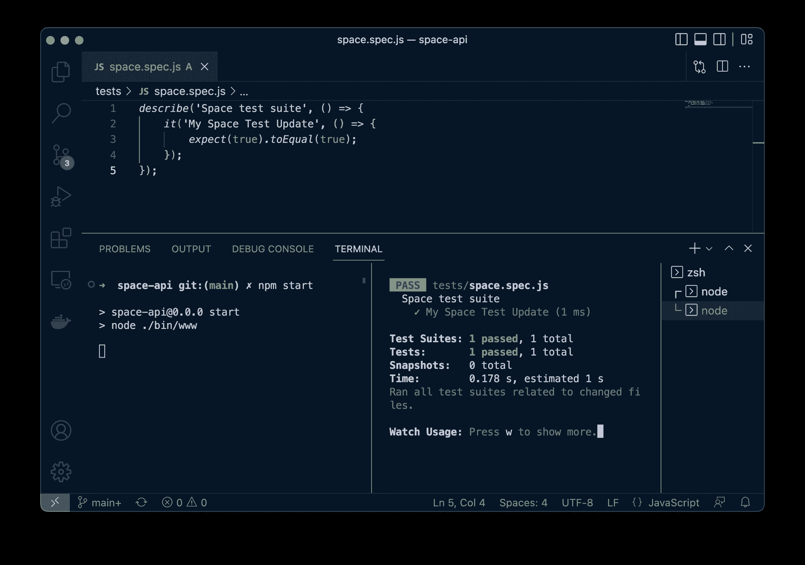
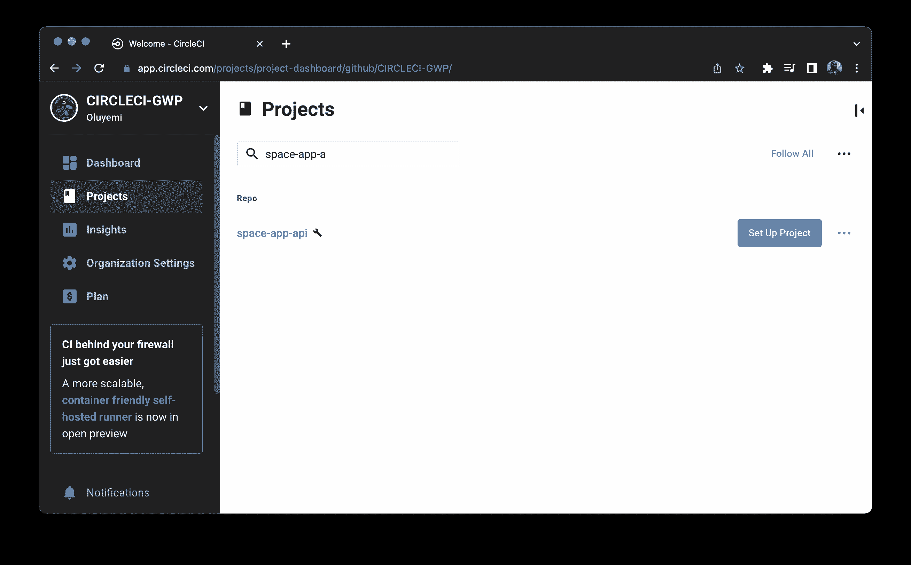
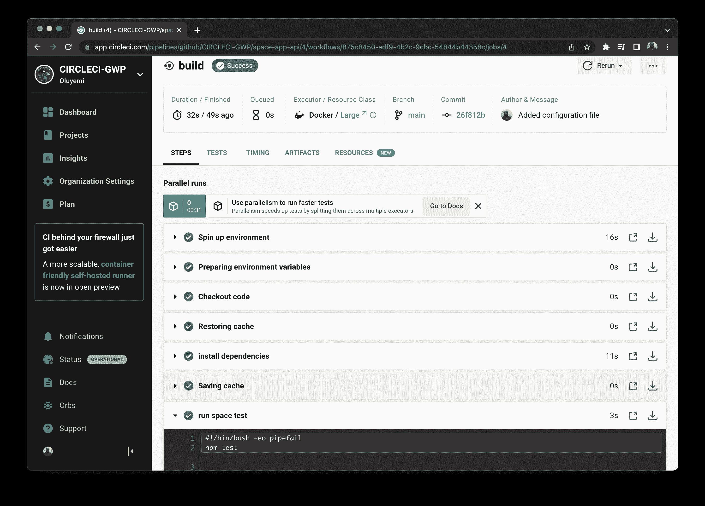

# 用 Jest | CircleCI 超越 API 测试

> 原文：<https://circleci.com/blog/api-testing-with-jest/>

Jest 是一个基于 JavaScript 的测试框架，可以测试前端和后端应用程序。Jest 非常适合验证，因为它捆绑了一些工具，使得编写测试更加易于管理。虽然 Jest 最常用于简单的 API 测试场景和断言，但它也可以用于测试复杂的数据结构。在本教程中，我们将介绍如何使用 Jest 来测试嵌套的 API 响应，并希望在这个过程中获得乐趣。

## 先决条件

要完成本教程，您需要:

1.  系统上安装的 [Node.js](https://nodejs.org)
2.  一个[圆](https://circleci.com/signup/)的账户
3.  GitHub 的一个账户
4.  Postman 或任何其他 HTTP 客户端来测试 API
5.  [JavaScript](https://www.javascript.com/) 的基础知识
6.  对 API 和单元测试的基本理解

> 我们的教程是平台无关的，但是使用 CircleCI 作为例子。如果你没有 CircleCI 账号，请在 注册一个免费的 [**。**](https://circleci.com/signup/)

### 克隆存储库

本教程将带您完成为虚拟空间 API 项目编写 Jest 测试的过程。要访问整个项目，请通过运行以下命令克隆存储库:

```
git clone --single-branch --branch base-project https://github.com/CIRCLECI-GWP/space-app-api 
```

```
cd space-app-api 
```

## 创建我们的空间应用编程接口

要开始编写我们的 cool Jest 测试，我们首先需要运行我们的 API。这就是我们将要编写测试的内容。对于本教程，我们将使用一个简单的 API，它将给出我们可以用来编写测试的响应。我已经选择了一个基于太空旅行的 API，所以准备好未来的太空探险家吧！

本教程的 API 已经开发出来了。使用以下命令进行设置，以安装应用程序依赖项:

```
npm install 
```

启动应用程序(API 服务器):

```
npm start 
```

运行这些命令后，我们可以开始编写测试了。

API 返回太空旅行所需的最关键项目的响应。它有以下端点:

*   可用的空间目的地
*   现有航班和相关信息
*   精选的航班座位及其配置

**注意** : *本教程的重点是用 Jest 进行测试，而不是开发一个[空间 API 库](https://github.com/CIRCLECI-GWP/space-app-api)，所以没有相关步骤。如果您对所有可用的端点或应用程序架构感兴趣，请在这里查看[应用程序的路由文件](https://github.com/CIRCLECI-GWP/space-app-api/blob/main/routes/space.js)。*

假设您已经在机器上克隆并设置了应用程序，所有端点都已经存在。用 Postman 这样的 API 客户端向`http://localhost:3000/space/flights`、`http://localhost:3000/space/destinations`和`http://localhost:3000/space/flights/seats`发出`GET`请求。

细节已经被硬编码到 API 端点上。







既然您已经体验了我们的 API 如何工作和模拟响应，我们可以继续测试了。

## 用 Jest 编写 API 测试

在本节中，您将测试 API 响应，学习如何测试嵌套的 JavaScript 对象和数组，并提高您作为开发人员或测试工程师的测试技能。我们将使用 JEST 来测试 API 响应的组合，从简单的数组到包含对象的复杂数组响应。我们甚至将测试一个包含有更多子数组和对象的数组的对象。

### 安装 Jest

要开始用 Jest 进行测试，请将其添加到您当前的 space API 中。要将 Jest 作为开发依赖项安装，请运行以下命令。

```
npm install --save-dev jest 
```

**注** : *开发依赖是仅用于开发目的的依赖。这些依赖项不应安装在生产环境中。*

接下来，您需要对`package.json`文件进行一些更改，以确保测试在正确的配置下运行。您将添加两个命令，一个用于测试 API 端点，另一个用于请求 Jest 监视我们文件中的更改并重新运行测试。在 package.json 文件中添加 Jest 命令:

```
"scripts": {
    "start": "node ./bin/www",
    "test": "jest"
}, 
```

您可以添加一个 [Jest 配置](https://jestjs.io/docs/configuration)文件，如果这对您的项目更好的话。不过，对于本教程，我们将使用 Jest 的默认配置。

## 在 Jest 中设置 API 测试

在根目录下创建一个`tests`文件夹。在这个文件夹中，为主路由创建一个测试文件，并添加扩展名`.spec.js`。对于教程，这将是`space.spec.js`。添加`.spec.js`扩展名告诉 Jest 该文件是一个测试。

像航天飞机发射一样，我们从静态点火开始我们的测试过程，以检查我们的测试配置中的一切都正常工作。

在`tests/space.spec.js`文件中，使用以下代码实现这个测试:

```
describe('Space test suite', () => {
    it('My Space Test', () => {
        expect(true).toEqual(true);
    });
}); 
```

现在，当您在终端上运行`npm test`时，您将获得一个成功执行的测试。当测试运行并通过时，终端上的测试结果应该是绿色的。您可以进一步将断言从`true`更改为`false`，在您的终端上的执行将导致红色，表示失败。

在我们开始火箭发射序列之前，您可能想要将 Jest 的`watch`命令添加到`package.json`中。添加这个命令意味着每当应用程序代码改变时，测试都要重新运行。当您的应用程序在一个终端上运行，而您的测试在另一个终端上运行时，这是可能的。在`package.json`文件中添加该命令:

```
"scripts": {
    "start": "node ./bin/www",
    "test": "jest",
    "test:watch": "npm run test -- --watch"
}, 
```

当您在运行 watch 命令的同时执行 Node.js API 时，您可以在更改任何代码时实时观察我们的测试的重新运行。当您的 API 由于更改而中断时，这可以方便地检测到。在一个终端窗口中运行应用程序，与测试并排，显示 watch 选项(在右边)。



## 测试我们的空间应用编程接口

为了在 Jest 测试中发出 API 请求，我们需要一个模块来查询我们的端点，并将响应返回给我们的测试。该模块是 SuperTest，您可以使用以下命令安装它:

```
npm install  --save-dev supertest 
```

Jest 和 SuperTest 已经建立，并且在 Jest 测试框架中编写了一个基本测试。在本节中，我们将重点测试端点提供的不同 API 响应对象。从端点`http://localhost:3000/space/destinations`提供的响应开始。这是一个简单的对象数组，代表太空飞行将前往的目的地。

```
[
  "Mars",
  "Moon",
  "Earth",
  "Mercury",
  "Venus",
  "Jupiter"
] 
```

数组是您可以从 API 端点接收到的最基本的响应之一，但是 Jest 为我们提供了无数种方法来断言接收到的响应符合我们的期望。

我们的第一个实际测试将集中在这个对象数组上。用这个代码片段替换`space.spec.js`文件的内容。

```
const request = require('supertest');
const app = require("../app");

describe('Space test suite', () => {
    it('tests /destinations endpoints', async() => {
        const response = await request(app).get("/space/destinations");
        expect(response.body).toEqual(["Mars", "Moon", "Earth", "Mercury", "Venus", "Jupiter"]);
        expect(response.body).toHaveLength(6);
        expect(response.statusCode).toBe(200);
        // Testing a single element in the array
        expect(response.body).toEqual(expect.arrayContaining(['Earth']));

    });

    // Insert other tests below this line

    // Insert other tests above this line
}); 
```

在这个测试中，我们使用 SuperTest 与 API 进行交互。该测试首先从`/space/destinations`端点获取响应，然后使用该响应对几个断言进行测试。最值得注意的断言是最后一个断言，它使用 Jest array `arrayContaining()`方法来验证可以在数组中找到单个项。在这个断言中，Jest 映射整个数组，知道哪些数组元素出现在数组中，哪些没有。

虽然上面的数组只包含五个项目，但是您可能会遇到更复杂的情况，在这种情况下，如果不分解对象，您将无法完全测试整个对象。

在下一个测试中，我们将测试`/space/flights/seats`端点。这个端点提供了一个比上面的数组更复杂的响应，我们将再次使用 Jest 来测试它。

鉴于我们的响应的性质，我们将使用从端点接收的响应的一部分，这将为我们提供一个测试模板，我们希望为响应中的后续对象编写该模板。

```
{ "starship": [
    {
      "firstClass": {
        "heatedSeats": true,
        "chairOptions": [
          "leather",
          "wollen"
        ],
        "vaultAccess": true,
        "drinksServed": [
          "tea",
          "coffee",
          "space-special",
          "wine"
        ],
        "windowAccess": true,
        "privateCabin": "2",
        "VRAccess": "unlimited",
        "cost": "$20000",
        "seatHover": {
          "cryoMode": [
            "extreme",
            "ludacris",
            "plaid"
          ],
          "staticMode": [
            "ludacris",
            "plaid"
          ]
        }
      },
      "businessClass": { ... }
    }
  ],
  "blueOrigin": [
    {
      "firstClass": { ... },
      "businessClass": { ... }
    }
  ]

} 
```

**注意** : *你可以通过使用 Postman* 这样的工具调用端点来查看完整的响应。

这个测试的重点是为对象编写一个详尽的测试，同时确保测试的可读性和简单性。鉴于回答的复杂性，我们将在保持测试可读性的同时，尽可能地覆盖更多内容。

```
...

    it('tests /space/flights/seats endpoint - starship', async () => {
        const response = await request(app).get("/space/flights/seats");
        expect(response.body.starship).toEqual(expect.arrayContaining([expect.any(Object)]));
        // Checking that the starship Object contains firstClass Object which then contains a set of objects
        expect(response.body.starship).toEqual(expect.arrayContaining(
            [expect.objectContaining({ firstClass: expect.any(Object) })]));

        expect(response.body.starship).toEqual(expect.arrayContaining([expect.objectContaining(
            { businessClass: expect.any(Object) })]));

        // Checking that under the bussinessClass Object we have the array drinks served
        expect(response.body.starship)
            .toEqual(expect.arrayContaining([expect.objectContaining({
                businessClass: expect.objectContaining({ drinksServed: expect.any(Array) })
            })]));

        // Checking that under the firstClass: Object we have the option ludacris in the seatHover Object
        expect(response.body.starship)
        .toEqual(expect.arrayContaining([expect.objectContaining({
            firstClass: expect.objectContaining({ seatHover: expect.objectContaining({
                cryoMode : expect.arrayContaining(['ludacris'])}) })
        })]));

        // Checking that under the firstClass: Object we have the option plaid in the seatHover Object
        expect(response.body.starship)
        .toEqual(expect.arrayContaining([expect.objectContaining({
            firstClass: expect.objectContaining({ seatHover: expect.objectContaining({
                staticMode : expect.arrayContaining(['plaid'])}) })
        })]));
    });

... 
```

这个测试使用 [Jest matchers](https://jestjs.io/docs/using-matchers) 遍历上面提供的对象的不同级别。它首先测试顶级对象，缩小到嵌套在响应中的对象和数组。这个测试一开始可能看起来有点吓人，但是它表明我们可以专门测试 API 的响应区域，而不需要断言整个响应对象。

在下一节中，我们将学习如何在发射到太空之前用 Jest 编写自定义错误消息！

## 使用 Jest 自定义匹配器进行错误消息传递

Jest 匹配器允许您以多种方式测试数据。您可以显式地测试一个特定的条件，甚至可以扩展您自己的自定义匹配器，如果该条件没有被现有的条件覆盖的话。运行测试时，您可以声明自定义匹配器并显示自定义错误。

例如，一旦我们进入太空，我们需要能够覆盖指挥中心发出的命令。为此，我们将使用来自上面创建的`/space/flights` API 端点的响应。

使用`expect.extend(matchers)`方法添加定制期望。在我们创建的 flights 端点中，对象返回每个设置为`true`或`false`的活动状态。为了只返回活动的航班，我们可以创建一个匹配器。

要创建一个使用定制匹配器的测试，需要声明匹配器并定义哪些参数会导致通过或失败。这个匹配器可以在 Jest `describe`块中的任何地方声明。为了可读性，将它放在测试文件的顶部，紧接在 describe 块之后。对于这个项目，我们希望检查返回的航班是否处于活动状态。

```
...

    expect.extend({
        toBeActive(received) {
            const pass = received === true;
            if (pass) {
                return {  
                    message: () =>
                        `expected ${received} is an acceptable flight status`,
                    pass: true,
                };
            }
        }
    });

... 
```

自定义匹配器期望接收航班的状态值并返回自定义消息。但是当我们运行我们的测试时，我们得到错误的消息，即使测试不满足传递的飞行状态值的期望。换句话说，是假阴性。要解决这个问题，添加一个`else`语句来适应我们的断言不符合标准的情况。else 语句将捕获运行测试时可能发生的所有假阴性，并报告它们。像这样更新代码:

```
...

    expect.extend({
        toBeActive(received) {
            const pass = received === true;
            if (pass) {
                return {
                    message: () =>
                        `expected ${received} to be an acceptable flight status`,
                    pass: true,
                };
            } else {
                return {
                    message: () =>
                        `expected ${received} to be an acceptable flight status of flight - only true is acceptable`,
                    pass: false,
                };
            }
        },
    });

... 
```

当测试出现假阴性时，将发出第一条定制消息。第二次发射是在试验失败时，通过接收来自太空飞行活动状态的`false`值。

将这个代码块添加到我们之前添加的`expect.extend`代码块下面。

```
...

    it('tests /space/flights endpoint - positive test', async () => {
        const response = await request(app).get("/space/flights");
        expect(response.body[0].active).toBeActive();
    });

    it('tests /space/flights endpoint - false negative', async () => {
        const response = await request(app).get("/space/flights");
        expect(response.body[0].active).not.toBeActive();
    });

    it('tests /space/flights endpoint - failing test', async () => {
        const response = await request(app).get("/space/flights");
        expect(response.body[1].active).toBeActive();
    });

... 
```

当您运行这些测试时，有些测试会失败，并显示以下输出:

```
> jest

 FAIL  tests/space.spec.js
  Space test suite
    ✓ tests /destinations endpoints (25 ms)
    ✓ tests /space/flights/seats endpoint - starship (4 ms)
    ✓ tests /space/flights endpoint - positive test (3 ms)
    ✕ tests /space/flights endpoint - false negative (2 ms)
    ✕ tests /space/flights endpoint - failing test (3 ms)
  ...

GET /space/destinations 200 2.851 ms - 51
GET /space/flights/seats 200 0.699 ms - 1073
GET /space/flights 200 0.610 ms - 1152
GET /space/flights 200 0.382 ms - 1152
GET /space/flights 200 0.554 ms - 1152
Test Suites: 1 failed, 1 total
Tests:       2 failed, 3 passed, 5 total
Snapshots:   0 total
Time:        0.512 s, estimated 1 s
Ran all test suites. 
```

**注意** : *这两个失败的测试是出于演示的目的而编写的。为了让测试在 CI 上通过，用`it.skip()`函数跳过它们，这样它们在默认情况下就不会运行。*

```
...

    it('tests /space/flights endpoint - positive test', async () => {
        const response = await request(app).get("/space/flights");
        expect(response.body[0].active).toBeActive();
    });

    it.skip('tests /space/flights endpoint - false negative', async () => {
        const response = await request(app).get("/space/flights");
        expect(response.body[0].active).not.toBeActive();
    });

    it.skip('tests /space/flights endpoint - failing test', async () => {
        const response = await request(app).get("/space/flights");
        expect(response.body[1].active).toBeActive();
    });

... 
```

我们通过了测试。复查 [GitHub](https://github.com/CIRCLECI-GWP/space-api/blob/main/tests/space.spec.js) 上`tests/space.spec.js`文件的最终状态。

## 添加 CircleCI 配置文件

这里，您将把 CircleCI 的管道配置添加到我们的本地项目中。首先在根目录下创建一个`.circleci`文件夹。在该文件夹中，创建一个`config.yml`文件。现在，通过如下代码块所示的配置，向`config.yml`文件添加细节:

```
version: 2.1
jobs:
  build:
    working_directory: ~/repo
    docker:
      - image: cimg/node:14.20.0
    steps:
      - checkout
      - restore_cache:
          key: dependency-cache-{{ checksum "package-lock.json" }}
      - run:
          name: install dependencies
          command: npm install
      - save_cache:
          key: dependency-cache-{{ checksum "package-lock.json" }}
          paths:
            - ./node_modules
      - run:
          name: run space test
          command: npm test
      - store_artifacts:
          path: ~/repo/space 
```

在此配置中，CircleCI 使用从环境中提取的节点 Docker 映像，然后更新 npm 程序包管理器。下一步是恢复缓存(如果存在)。仅当使用`save-cache`检测到变化时，应用程序依赖关系才会更新。最后，我们将运行我们的空间测试，并将缓存的项目存储在工件的`space`目录中。

现在，如果您克隆了示例项目存储库，那么它已经在 git 中初始化并设置好了。了解我们的项目是如何与 CircleCI 集成在一起的会很有帮助。要设置 CircleCI，通过运行以下命令初始化项目中的 GitHub 存储库:

```
git init 
```

添加一个提交，然后[将您的项目推送到 GitHub](https://circleci.com/blog/pushing-a-project-to-github/) 。

接下来，登录您的 CircleCI 帐户。如果您注册了您的 GitHub 帐户，所有与您的 GitHub 用户名相关联的存储库都将在您的项目仪表板上可用。从列表中选择`space-app-api`项目。



点击**设置项目**按钮。将提示您是否已经在项目中定义了 CircleCI 的配置文件。输入分支名称(对于本教程，我们使用`main`)。点击**设置项目**按钮完成该过程。

这将启动 CircleCI 管道并成功运行测试！



## 结论

在本教程中，您已经设置了一个 space-api，安装了 Jest，并编写了针对该 api 的测试。您还学习了如何使用 Jest 匹配器，甚至编写自己的自定义匹配器。通过本教程，我们还介绍了如何将 CircleCI 集成到项目中，将测试推送到 GitHub，以及为 CI 管道创建不同的构建步骤。最后，我们介绍了在管道上运行我们的测试，并验证管道的所有步骤都按预期工作。

所有系统都在为我们进入太空做准备。倒计时快乐！

* * *

Waweru Mwaura 是一名软件工程师，也是一名专门研究质量工程的终身学习者。他是 Packt 的作者，喜欢阅读工程、金融和技术方面的书籍。你可以在[他的网页简介](https://waweruh.github.io/)上了解更多关于他的信息。

[阅读更多 Waweru Mwaura 的帖子](/blog/author/waweru-mwaura/)