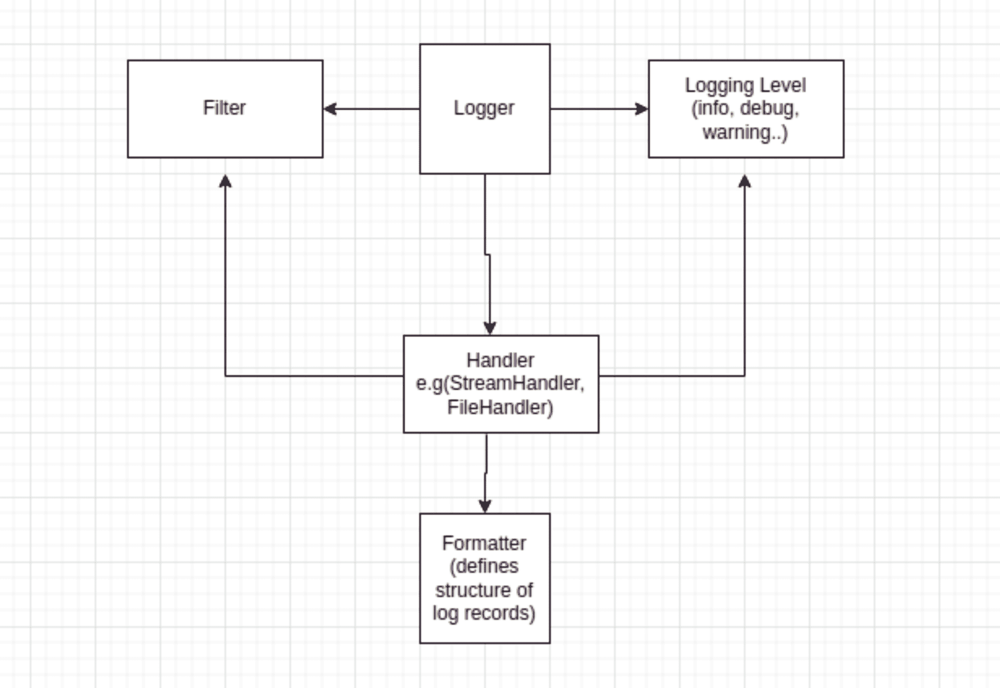
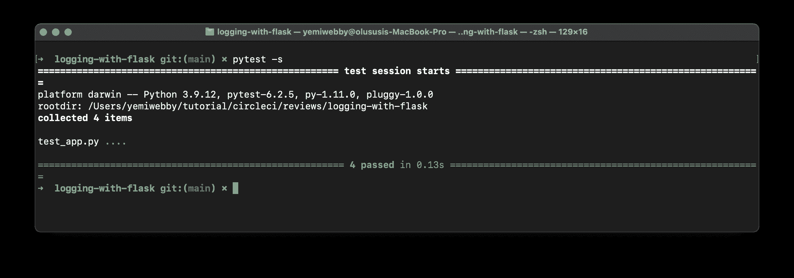
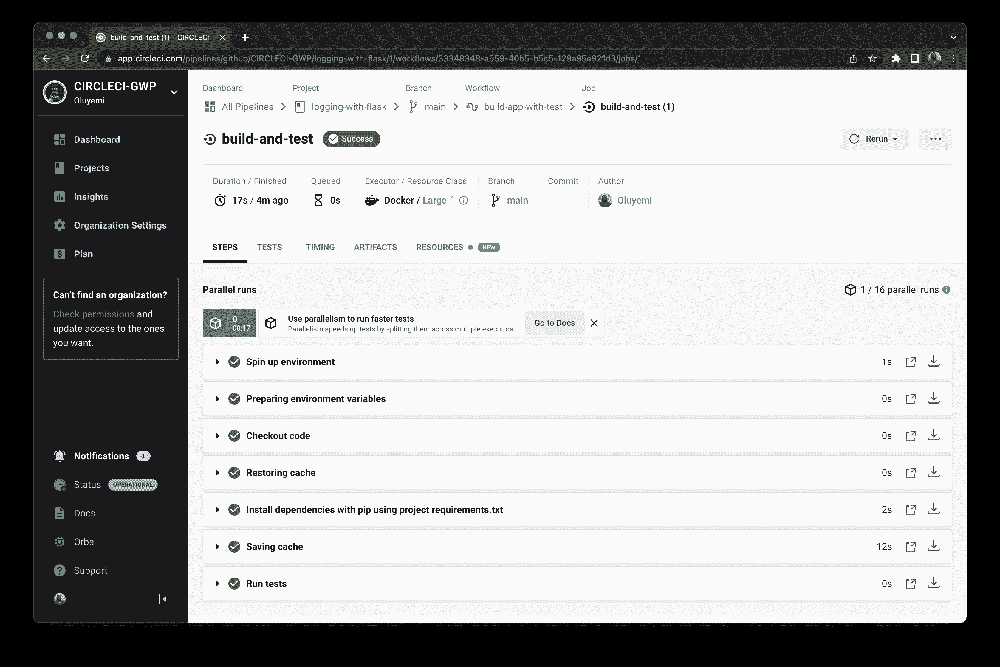

# 用 Flask 记录应用程序

> 原文：<https://circleci.com/blog/application-logging-with-flask/>

> 本教程涵盖:
> 
> 1.  烧瓶测井模块
> 2.  按严重性级别记录烧瓶事件
> 3.  测试日志模块

如果没有日志，或者对日志没有很好的理解，调试应用程序或者查看错误堆栈跟踪可能会很困难。幸运的是，Flask 日志记录可以改变您理解调试的方式，以及您与应用程序生成的日志交互的方式。Flask 日志模块为您提供了一种记录不同严重级别的错误的方法。Python 标准库中包含一个默认日志模块，它提供简单和高级日志功能。

在本教程中，我将介绍如何根据事件的严重程度记录 Flask 应用程序事件，以及如何测试日志记录模块。

## 先决条件

对于本教程，需要以下技术:

*   对 [Python](https://www.python.org/) 编程语言的基本理解
*   了解[烧瓶](https://flask.palletsprojects.com/en/2.0.x/)框架
*   对测试方法有基本的了解

您还需要安装以下软件:

1.  计算机中安装的 Python 版本> = 3.5。
2.  GitHub 账户。你可以在这里创建一个。
3.  CircleCI 账户。在这里创建一个。

> 我们的教程是平台无关的，但是使用 CircleCI 作为例子。如果你没有 CircleCI 账号，请在 注册一个免费的 [**。**](https://circleci.com/signup/)

## 克隆示例项目存储库

从从 GitHub 克隆[项目库](https://github.com/CIRCLECI-GWP/logging-with-flask)开始。

一旦项目被克隆，您还需要安装依赖项。使用项目根文件夹中的命令`pip install -r requirements.txt`。

## 了解烧瓶记录

Flask 使用标准的 Python 日志模块来记录消息:`[app.logger](https://docs.python.org/3/library/logging.html#module-logging)`。这个日志记录器可以扩展并用于记录自定义消息。为 Flask 应用程序实现一个灵活的事件日志记录系统，使您能够知道应用程序执行时什么时候出错了，或者什么时候遇到了错误。下图显示了 Flask 日志模块的不同部分，以及它们如何帮助处理应用程序日志。



Python 记录器使用四个子模块:

*   **Logger** 是记录应用程序事件的主要接口。这些事件被记录时，称为日志记录。
*   **处理程序**将日志事件/记录导向各自的目的地。
*   **格式化器**指定日志记录器编写消息时消息的布局。
*   **过滤器**帮助开发者使用参数管理日志记录。这些参数可以是日志级别的补充。

## 实现烧瓶记录器

日志允许开发人员监控程序的流程和所采取的行动。您可以使用日志记录器来跟踪应用程序流，比如跟踪电子商务应用程序中的事务数据，或者在 API 调用与服务交互时记录事件。

要在 Flask 中开始日志记录，首先从 Python 导入日志记录模块。这个日志模块是 Python 安装自带的，不需要配置。Python 日志记录模块基于预定义的级别记录事件。记录的日志事件称为日志记录。每个记录级别都有不同的严重性级别:

*   调试:10
*   信息:20
*   警告:30
*   错误:40
*   临界:50

记录器仅在严重性大于日志级别时记录日志。然后记录器将它们传递给处理程序。

这个片段展示了不同类型的记录器以及它们在 Flask route `/`中的用法。

```
@app.route('/')
def main():
  app.logger.debug("Debug log level")
  app.logger.info("Program running correctly")
  app.logger.warning("Warning; low disk space!")
  app.logger.error("Error!")
  app.logger.critical("Program halt!")
  return "logger levels!" 
```

您可以在`app.py`文件中找到这个片段。当 Flask 应用程序运行时，在浏览器中导航到`/` home route 以查看日志。

以下是如何使用记录器:

*   `Debug`为开发人员提供诊断程序错误的详细信息。
*   `Info`显示一条确认消息，表明程序的流行为正在按预期执行。
*   `Warning`表示发生了意想不到的事情，或者在不久的将来可能会出现问题(例如，磁盘空间不足)。
*   表示严重的问题，如程序无法执行某些功能。
*   `Critical`显示应用程序中出现严重错误，如程序失败。

## 配置基本记录器

对于许多应用程序来说，只提供基本功能的记录器就足够了。要在您的`app.py`文件中配置这种类型的日志记录，请添加以下内容:

```
from flask import Flask
import logging

logging.basicConfig(filename='record.log', level=logging.DEBUG)
app = Flask(__name__)

@app.route('/')
def main():
  # showing different logging levels
  app.logger.debug("debug log info")
  app.logger.info("Info log information")
  app.logger.warning("Warning log info")
  app.logger.error("Error log info")
  app.logger.critical("Critical log info")
  return "testing logging levels."

if __name__ == '__main__':
  app.run(debug=True) 
```

这个代码片段指定了 Flask 将根据从`DEBUG`开始的级别记录应用程序的位置。它还设置了当您使用 Postman 等客户端呼叫您的`/`回家路线时将被记录的消息。

**注意** : *应该在创建 Flask app 对象之前完成日志配置。如果在配置之前访问了`app.logger`，它将使用默认的 Python 处理程序。*

这个使用`logging.basicConfig`的基本配置记录消息并将日志信息存储在一个`.log`文件中。对于我们的示例项目，它是`record.log`文件。

现在，使用以下命令执行 Flask 应用程序:

```
FLASK_APP=app.py flask run 
```

打开您的客户端应用程序，向您的路线发出一个`GET`请求，以获取正在运行的应用程序。这种情况下是`http://127.0.0.1:5000/`。当程序中的`main`函数被调用时，它会创建`record.log`文件，然后将日志记录级别设置为 DEBUG。日志记录活动应该出现在文件`record.log`中，输出应该是这样的:

```
## record.log file output

DEBUG:app:debug log info
INFO:app:Info log information
WARNING:app:Warning log info
ERROR:app:Error log info
CRITICAL:app:Critical log info
INFO:werkzeug:127.0.0.1 - - [01/Mar/2022 12:35:19] "GET / HTTP/1.1" 200 - 
```

您能够操作 logger 对象，根据不同的 logger 级别记录所有已配置的 logger。当您设置了不同的记录器来记录不同级别的信息时，您可以禁止在控制台上显示某些日志，而启用其他日志。为了在终端上打印出日志，您可以删除记录日志的`logging.basicConfig()`对象中的文件配置`filename='record.log'`。

虽然这些日志输出是可读的，但是它们可能不是很有用，尤其是因为您不知道事件是何时发生的。要解决这个问题，您可以向日志添加一种格式，如下一节所述。

## 格式化日志输出

Python 格式化程序将记录的结构格式化为特定的结构，这样便于读取日志并将它们与特定事件联系起来。它可以应用在`basicConfig`配置中。

日志格式化程序由以下配置组成:

*   `%(asctime)s`将时间戳配置为字符串
*   `%(levelname)s`将记录级别配置为字符串。
*   `%(name)s`将记录器名称配置为字符串。
*   `%(threadName)s`是线程名。
*   `%(message)s`将日志消息配置为字符串。

您可以将这些格式选项应用到您的配置中，以获得更准确的对象输出:

```
.........
logging.basicConfig(filename='record.log',
                level=logging.DEBUG, format='%(asctime)s %(levelname)s %(name)s %(threadName)s : %(message)s')
app = Flask(__name__)
......... 
```

使用前面代码片段中指定的`format`配置，您的日志输出可以绑定到特定的时间戳、特定的线程，甚至特定的 threadname。当您运行应用程序并观察您的`output.log`文件时，产生的输出日志更有意义，看起来更清晰:

```
2022-03-01 13:09:11,787 DEBUG app Thread-3 : debug log info
2022-03-01 13:09:11,788 INFO app Thread-3 : Info log information
2022-03-01 13:09:11,788 WARNING app Thread-3 : Warning log info
2022-03-01 13:09:11,788 ERROR app Thread-3 : Error log info
2022-03-01 13:09:11,788 CRITICAL app Thread-3 : Critical log info
2022-03-01 13:09:11,788 INFO werkzeug Thread-3 : 127.0.0.1 - - [01/Mar/2022 13:09:11] "GET / HTTP/1.1" 200 - 
```

日志级别不仅有消息，还有时间戳、日志级别、应用程序名称、进程线程，最后还有您定义的日志的消息。如果您遇到错误，这使得通过时间戳来识别特定的进程、时间戳甚至消息变得容易。这个过程在调试时比仅仅阅读简单的错误日志有用得多。

现在您已经用 Python `basicConfig`创建了日志，您可以为您的日志模块编写测试了。

## 测试记录器

测试 Python 记录器与编写普通 Python 函数的测试几乎是 T2 一样的。要编写您的第一个测试，创建一个名为`test_app.py`的文件。打开它并添加您的第一个测试片段:

```
from flask import Flask
from  app import app

import logging
import unittest

class TestLogConfiguration(unittest.TestCase):
    """[config set up]
    """
    def test_INFO__level_log(self):
        """
        Verify log for INFO level
        """
        self.app = app
        self.client = self.app.test_client

        with self.assertLogs() as log:
            user_logs = self.client().get('/')
            self.assertEqual(len(log.output), 4)
            self.assertEqual(len(log.records), 4)
            self.assertIn('Info log information', log.output[0]) 
```

在上面的测试片段中，我们使用`test_client`首先向`/`路由发出请求，就像我们在运行我们的应用程序时所做的一样，在我们这样做之后，我们可以验证日志输出记录了`INFO`级别的日志信息。正如智者所说，知道我们的测试是否运行的唯一方法是执行它们，我们可以在您选择的终端上使用下面的命令来做到这一点:

```
pytest -s 
```

回顾你的跑步结果。



恭喜你！您已经成功执行了第一次测试。现在，您可以将您的测试扩展到应用程序中定义的其他日志级别。这里有一个例子:

```
def test_WARNING__level_log(self):
      """
      Verify log for WARNING level
      """
      self.app = app
      self.client = self.app.test_client

      with self.assertLogs() as log:
          user_logs = self.client().get('/')
          self.assertEqual(len(log.output), 4)
          self.assertIn('Warning log info', log.output[1])

def test_ERROR__level_log(self):
    """
    Verify log for ERROR level
    """
    self.app = app
    self.client = self.app.test_client

    with self.assertLogs() as log:
        user_logs = self.client().get('/')
        self.assertEqual(len(log.output), 4)
        self.assertIn('Error log info', log.output[2]) 
```

这些测试代码片段中每个不同阶段的日志级别。

**注意:** *日志对象包含更多的信息，这些信息可以根据应用程序的需要进行测试和断言。*

你最后的任务是与世界分享你的测试。您可以使用 CircleCI 作为您的持续集成平台来实现这一点。

## 设置 Git 并推送到 CircleCI

要设置 CircleCI，通过运行以下命令初始化项目中的 Git 存储库:

```
git init 
```

在根目录下创建一个`.gitignore`文件。在该文件中，添加您希望防止添加到远程存储库中的任何模块。添加一个提交，然后[将你的项目推送到 GitHub](https://circleci.com/blog/pushing-a-project-to-github/) 。

现在，[登录 CircleCI 仪表盘](https://app.circleci.com/dashboard)并导航至`Projects`。将会有一个与您的 GitHub 用户名或组织相关的所有 GitHub 库的列表。本教程的具体存储库是`logging-with-flask`。

从项目仪表板中，选择选项来设置所选项目，并将该选项用于现有配置，该配置使用存储库中的`config.yml`。开始构建。

**提示** *在启动构建之后，预计您的管道会失败。这是因为您还没有将定制的`.circleci/config.yml`配置文件添加到 GitHub 中，这是项目正确构建所需要的。*

## 设置 CircleCI

在根目录下创建一个`.circleci`目录，然后向其中添加一个`config.yml`文件。配置文件包含每个项目的 CircleCI 配置。对于这个设置，您将使用 CircleCI Python orb。使用此配置执行您的测试:

```
version: 2.1
orbs:
  python: circleci/python@1.4.0
workflows:
  build-app-with-test:
    jobs:
      - build-and-test
jobs:
  build-and-test:
    docker:
      - image: cimg/python:3.9
    steps:
      - checkout
      - python/install-packages:
          pkg-manager: pip
      - run:
          name: Run tests
          command: pytest 
```

**注意** : *CircleCI orbs 是 YAML 配置的可重用包，它将多行代码压缩成一行:`python: circleci/python@1.4.0`。您可能需要启用组织设置(如果您是管理员)或向您组织的 CircleCI 管理员请求权限，以允许在 CircleCI 仪表板中使用第三方 orb。* 

设置好配置后，[将](https://docs.github.com/en/get-started/using-git/pushing-commits-to-a-remote-repository)您的配置推送到 GitHub。CircleCI 将自动开始构建您的项目。

检查 CircleCI 仪表板并展开构建细节，以验证您已经成功运行了您的第一个 PyTest 测试。应该融入 CircleCI。



太棒了。您不仅编写了 Flask loggers，还测试了它们，并与世界共享——或者至少与您团队的其他成员共享。

## 结论

在本教程中，您已经学习了如何为不同的日志输出级别配置 API，以及如何以一种不仅简单明了而且在出现问题时易于识别的方式格式化日志输出。此外，您还学习了为 logger 方法编写测试，以及断言已定义要记录的不同消息。这就把我们带到了本教程的结尾！一如既往，我喜欢创建它，我希望你喜欢跟随。

* * *

Waweru Mwaura 是一名软件工程师，也是一名专门研究质量工程的终身学习者。他是 Packt 的作者，喜欢阅读工程、金融和技术方面的书籍。你可以在[他的网页简介](https://waweruh.github.io/)上了解更多关于他的信息。

[阅读更多 Waweru Mwaura 的帖子](/blog/author/waweru-mwaura/)