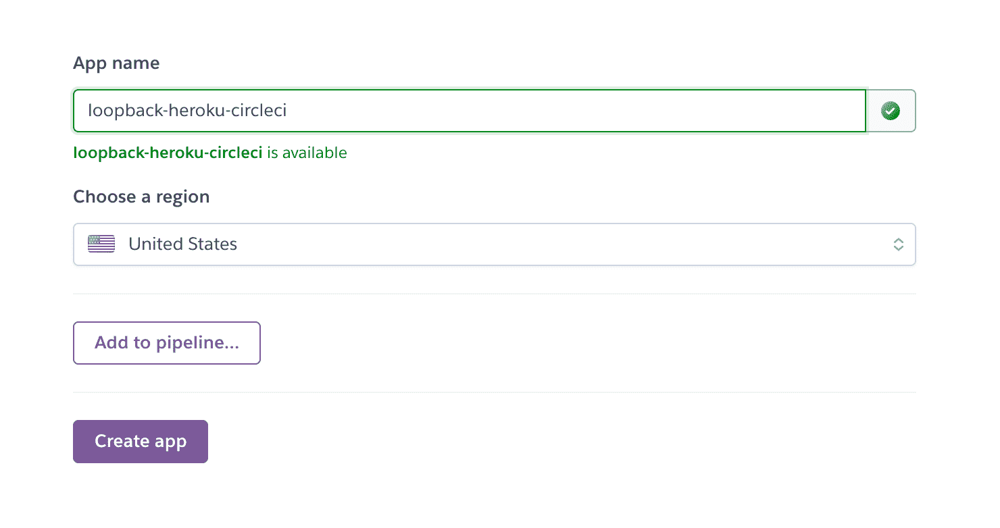
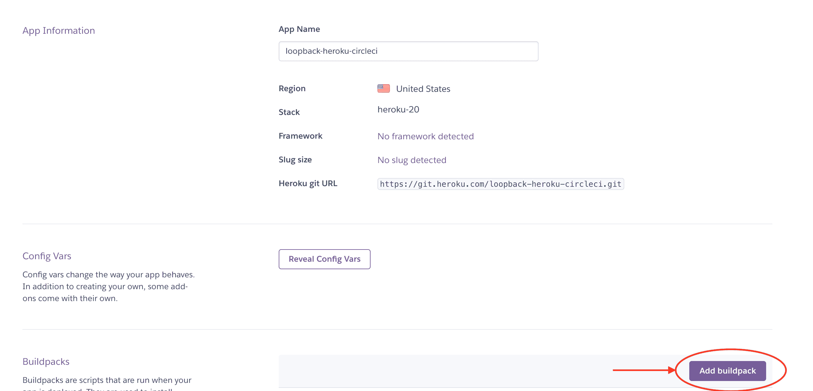
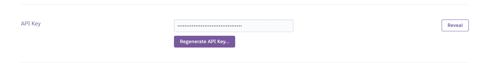
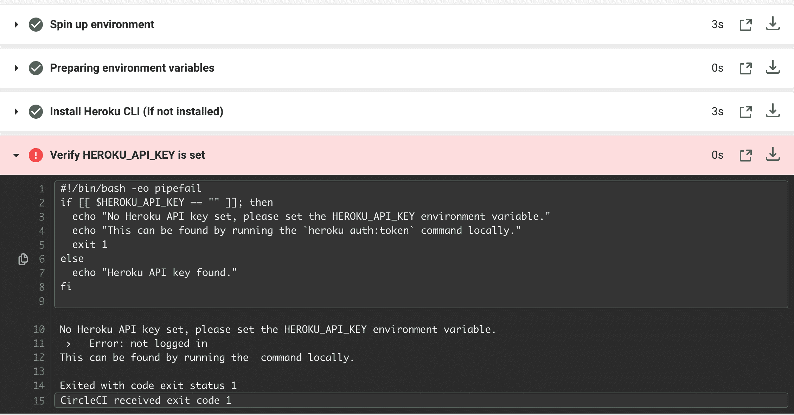
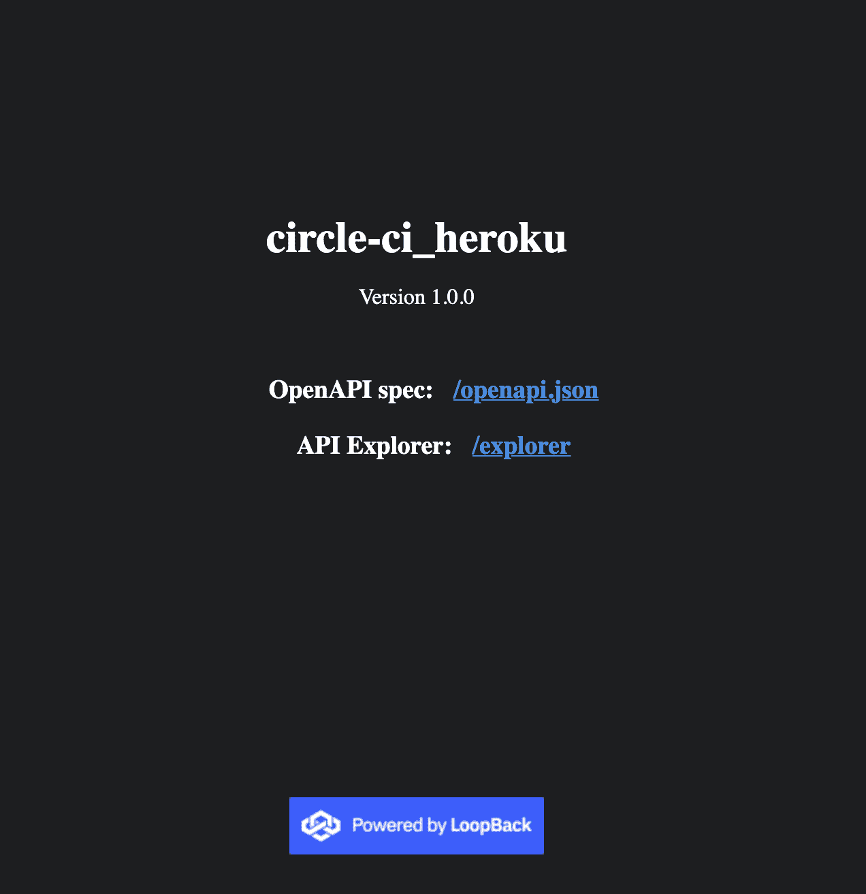
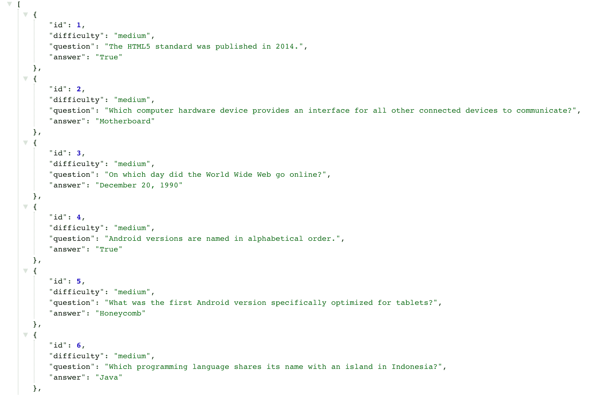

# 自动化环回部署| CircleCI

> 原文：<https://circleci.com/blog/automate-deploy-loopback/>

> 本教程涵盖:
> 
> 1.  环回入门
> 2.  自动部署环回应用程序
> 3.  为回送 API 创建问题模型和数据源

在软件开发团队普遍使用自动化之前，瓶颈、重复任务和人为错误非常普遍。自动化为组织释放了宝贵的人力资源，同时降低了活跃的人脑试图执行平凡的重复任务所导致的人为错误的风险。最近在[持续集成和持续部署](https://circleci.com/blog/what-is-a-ci-cd-pipeline/) (CI/CD)领域取得的进展使得自动部署软件应用程序的更新变得更加可行。在本教程中，我将向您展示如何自动部署一个[回环](https://loopback.io/) app 到 [Heroku](https://www.heroku.com/) 。使用 CircleCI，我将指导您如何实现连续部署(CD)管道。CD 管道将使您能够在任何时候推送更改时自动发布应用程序的更新。

本教程是为环回应用建立 CI/CD 实践系列的第二部分。前一篇教程向您展示了如何[自动测试回送 API](https://circleci.com/blog/ci-for-loopback-apis/)。

## 先决条件

开始之前，请确保您的系统上安装了以下项目:

*   8.9.x 的最低 [Node.js](https://nodejs.org/en/) 版本
*   一个最新的 JavaScript 包管理器，如 [NPM](https://www.npmjs.com/) 或[纱](https://classic.yarnpkg.com/en/)
*   环回 4 CLI

对于存储库管理和持续集成/持续部署，您需要:

> 我们的教程是平台无关的，但是使用 CircleCI 作为例子。如果你没有 CircleCI 账号，请在 注册一个免费的 [**。**](https://circleci.com/signup/)

## LoopBack 和 Heroku 是什么？

LoopBack 是一个高度可扩展的 Node.js 和 TypeScript 框架，用于构建 API 和微服务。Heroku 是一个平台即服务(PaaS ),使开发人员能够完全在云中构建、运行和操作应用程序。通过处理维护基于云的应用程序的更高要求方面，Heroku 允许开发人员专注于构建应用程序，而不是管理服务器。

这个项目始于[之前的教程](https://circleci.com/blog/ci-for-loopback-apis/)，在那里我们为一个测验应用程序构建了一个 API。

概括一下:API 有端点来处理以下操作:

1.  获取所有问题
2.  获取数据库中问题的总数
3.  获取具有特定 ID 的问题

## 入门指南

如果您尚未安装 LoopBack 4 CLI，请运行以下命令进行安装:

```
npm install -g @loopback/cli 
```

使用 Loopback CLI 命令搭建新项目。

```
lb4 app 
```

当 CLI 提示时，如下所示进行响应。请注意，指定了不同于默认值的应用程序类名。

```
? Project name: circle-ci_heroku
? Project description: Loopback project to demonstrate automated deployment to h
eroku via CircleCI
? Project root directory: circle-ci_heroku
? Application class name: MainApplication
? Select features to enable in the project Enable eslint, Enable prettier, Enabl
e mocha, Enable loopbackBuild, Enable vscode, Enable docker, Enable repositories
, Enable services
? Yarn is available. Do you prefer to use it by default? Yes 
```

## 配置 Heroku

接下来要做的是在 Heroku 上创建一个新的应用程序。我们通过 Heroku [仪表盘](https://dashboard.heroku.com/new-app)来完成这项工作。点击**新建**，然后**新建 App。**填写表格。如果您愿意，可以为应用程序使用不同的名称和地区。



接下来，点击**创建应用**按钮，完成创建过程。然后，您将被重定向到新创建的应用程序的**部署**视图。

接下来是添加构建包；只需点击**设置**选项卡。在**构建包**部分，点击**添加构建包。**



一个表单允许您选择一个官方支持的构建包或提供一个 URL。选择 **nodejs** 使用官方支持的 Heroku nodejs 构建包。点击**保存修改**。NodeJS 将用于构建您的下一个部署。

您最不需要的就是 API 密钥。您将使用它和应用程序名称将 CircleCI 管道连接到 Heroku。要获取 API 密钥，请打开[账户设置](https://dashboard.heroku.com/account)页面，向下滚动到 **API 密钥**部分。



点击**显示**按钮，复制显示的 API 密钥。

接下来，在项目的根目录下，创建一个名为`Procfile`的新文件。注意，这个文件没有扩展名。在其中，添加以下内容:

```
web: node . 
```

如果没有这个 procfile，Heroku 将默认通过调用`npm run`来启动应用程序。`npm run`尝试运行构建过程，这将导致应用程序错误，因为应用程序的开发依赖项尚未安装。

## 配置 CircleCI

接下来，为 CircleCI 添加管道配置。对于这个项目，管道由两个步骤组成:

1.  **构建**步骤构建项目并安装项目依赖项。理想情况下，您应该在这个阶段运行项目测试。为了简洁起见，我们将跳过本演示中的测试。相反，使用创建应用程序时提供的预构建测试。
2.  在**部署到 Heroku** 步骤中，当构建阶段成功完成时，您可以将最新的更改部署到 Heroku。

### 创建 CircleCI 配置文件

在项目的根目录下，创建一个名为`.circleci`的文件夹，并在其中创建一个名为`config.yml`的文件。在新创建的文件中，添加以下配置:

```
version: "2.1"

orbs:
  heroku: circleci/heroku@1.2.6
  node: circleci/node@4.7.0

jobs:
  build-and-test:
    docker:
      - image: "cimg/base:stable"
    steps:
      - checkout
      - node/install:
          node-version: 16.0.0
          install-yarn: true
      - node/install-packages:
          pkg-manager: yarn
          cache-path: ~/project/node_modules
          override-ci-command: yarn install
      - run: yarn run test

workflows:
  main:
    jobs:
      - build-and-test
      - heroku/deploy-via-git:
          force: true # this parameter instructs the push to use a force flag when pushing to the heroku remote, see: https://devcenter.heroku.com/articles/git
          requires:
            - build-and-test 
```

该配置引入了`circleci/heroku` orb，它自动让您访问一组强大的 Heroku 作业和命令。其中一个任务是`heroku/deploy-via-git`，它直接从你的 GitHub repo 将你的应用程序部署到你的 Heroku 账户。这个配置也使用了`circleci/node`球体。除此之外，这个 orb 允许您安装默认启用缓存的包。

**注意** : *你应该安装了 16 的节点版本。在发布时，node 16 是与 LoopBack 兼容的最新版本。*

配置指定了`build-and-test`作业，它:

1.  签出最新代码
2.  安装节点
3.  安装在`package.json`中声明的软件包
4.  运行项目中的测试

该配置还指定了一个工作流，该工作流先运行`build-and-test`作业，然后运行`heroku/deploy-via-git`作业。注意，有一个`requires`选项告诉 CircleCI 只有在`build-and-test`任务成功完成时才运行`deploy-via-git`任务。

接下来，在 GitHub 上建立一个存储库，并将项目链接到 CircleCI。看到这个帖子帮助[把你的项目推到 GitHub](https://circleci.com/blog/pushing-a-project-to-github/) 。

在你写代码之前，花点时间做些家务。使用此命令 Lint 您的代码并修复任何问题。

```
yarn run lint:fix 
```

登录您的 CircleCI 帐户。如果你注册了你的 GitHub 账户，你所有的库都会显示在你项目的仪表盘上。

在你的`circle-ci_heroku`项目旁边点击**设置项目**。

CircleCI 检测项目中的`config.yml`文件。点击**使用现有配置**，然后**开始建造**。您的第一个工作流将开始运行，但会失败。这是可以预料的。



部署过程失败，因为您没有提供 Heroku API 密钥。现在就去解决它。点击**项目设置**按钮，然后点击**环境变量**。添加两个新变量如下:

*   `HEROKU_APP_NAME`变量的值是 Heroku 中的应用程序名称:`loopback-heroku-circleci`。
*   `HEROKU_API_KEY`是您从帐户设置页面获取的 Heroku API 密钥。

选择**从失败的**选项重新运行工作流，以重新运行 Heroku 部署。要确认工作流是否成功，您可以在浏览器中打开新部署的应用程序。您的应用程序的 URL 是:`https://<HEROKU_APP_NAME>.herokuapp.com/`。

您将会看到您当前的索引页面。



现在我们已经有了一个管道，让我们添加 API 的问题特性。

## 构建问题模型

对于本教程，问题将包含这些属性的字段:

*   困难
*   问题
*   回答正确

创建问题时，默认情况下会分配一个唯一的主键。

您可以使用`lb4 model`命令并回答提示来生成模型。按**键，输入属性名为空的**，生成模型。请遵循以下步骤:

```
lb4 model question 
```

```
? Please select the model base class Entity (A persisted model with an ID)
? Allow additional (free-form) properties? No
Model Question will be created in src/models/question.model.ts

Let's add a property to Question
Enter an empty property name when done

? Enter the property name: id
? Property type: number
? Is id the ID property? Yes
? Is id generated automatically? Yes

Let's add another property to Question
Enter an empty property name when done

? Enter the property name: difficulty
? Property type: string
? Is it required?: Yes

Let's add another property to Question
Enter an empty property name when done

? Enter the property name: question
? Property type: string
? Is it required?: Yes

Let's add another property to Question
Enter an empty property name when done

? Enter the property name: answer
? Property type: string
? Is it required?: Yes

Let's add another property to Question
Enter an empty property name when done

? Enter the property name: 
```

将在`src/models/question.model.ts`创建一个新模型。

## 构建数据源

接下来，创建一个数据源来保存 API 的问题。对于本教程，使用内存数据库。使用以下命令创建数据源:

```
lb4 datasource 
```

回应如下所示的提示:

```
? Datasource name: db
? Select the connector for db:  In-memory db (supported by StrongLoop)
? window.localStorage key to use for persistence (browser only):
? Full path to file for persistence (server only): ./data/db.json 
```

接下来，在项目的根目录下创建一个名为`data`的文件夹。在`data`目录中，创建一个名为`db.json`的文件，并将其添加到:

```
{
  "ids": {
    "Question": 9
  },
  "models": {
    "Question": {
      "1": "{\"difficulty\":\"medium\",\"question\":\"The HTML5 standard was published in 2014.\",\"answer\":\"True\",\"id\":1}",
      "2": "{\"difficulty\":\"medium\",\"question\":\"Which computer hardware device provides an interface for all other connected devices to communicate?\",\"answer\":\"Motherboard\",\"id\":2}",
      "3": "{\"difficulty\":\"medium\",\"question\":\"On which day did the World Wide Web go online?\",\"answer\":\"December 20, 1990\",\"id\":3}",
      "4": "{\"difficulty\":\"medium\",\"question\":\"Android versions are named in alphabetical order.\",\"answer\":\"True\",\"id\":4}",
      "5": "{\"difficulty\":\"medium\",\"question\":\"What was the first Android version specifically optimized for tablets?\",\"answer\":\"Honeycomb\",\"id\":5}",
      "6": "{\"difficulty\":\"medium\",\"question\":\"Which programming language shares its name with an island in Indonesia?\",\"answer\":\"Java\",\"id\":6}",
      "7": "{\"difficulty\":\"medium\",\"question\":\"What does RAID stand for?\",\"answer\":\"Redundant Array of Independent Disks\",\"id\":7}",
      "8": "{\"difficulty\":\"medium\",\"question\":\"Which of the following computer components can be built using only NAND gates?\",\"answer\":\"ALU\",\"id\":8}"
    }
  }
} 
```

JSON 文件的`ids`键让数据库知道分配新问题的下一个 ID。在`models`部分，我们提供了每个型号的数据。还指定了`Question`模型和数据库中的基本问题。

## 创建存储库

对于本教程，您将使用存储库在数据库和问题模型之间提供一个抽象层。使用以下命令创建新的存储库:

```
lb4 repository 
```

回应如下所示的提示:

```
? Please select the datasource DbDatasource
? Select the model(s) you want to generate a repository for Question
? Please select the repository base class DefaultCrudRepository (Juggler bridge) 
```

新创建的类(位于`src/repositories/question.repository.ts`)拥有为您的模型执行 CRUD 操作所需的连接。

## 创建控制器

使用以下命令创建新的控制器:

```
lb4 controller 
```

响应 CLI 提示，如下所示:

```
? Controller class name: question
Controller Question will be created in src/controllers/question.controller.ts

? What kind of controller would you like to generate? REST Controller with CRUD functions
? What is the name of the model to use with this CRUD repository? Question
? What is the name of your CRUD repository? QuestionRepository
? What is the name of ID property? id
? What is the type of your ID? number
? Is the id omitted when creating a new instance? Yes
? What is the base HTTP path name of the CRUD operations? /questions 
```

CLI 创建了一个能够处理所有 CRUD 操作的控制器，我们不需要做任何其他事情。很漂亮吧？

提交您的代码并将最新的更改推送到您的 GitHub 库。这触发了 circle ci`build-and-test`, circle ci 成功运行并将您的新更改部署到 Heroku——就像之前做的一样。干得好！

导航至`https://<HEROKU_APP_NAME>.herokuapp.com/questions`。有包含问题的 API 响应！



## 结论

在本教程中，我向您展示了如何使用 GitHub、CircleCI 和 Heroku 为 LoopBackJS API 设置 CI/CD 管道。通过自动化发布新功能的过程，大大降低了人为错误对生产环境造成负面影响的风险。

此外，您宝贵的开发时间可以更好地应用到更复杂的开发方面。这有助于更有效的软件管理过程，因为重复的、平凡的方面是自动化的，而您的团队专注于解决问题。

本教程的全部代码可以在 GitHub 上找到。

* * *

[Oluyemi](https://twitter.com/yemiwebby) 是一名拥有电信工程背景的技术爱好者。出于对解决用户日常遇到的问题的浓厚兴趣，他冒险进入编程领域，并从那时起将他解决问题的技能用于构建 web 和移动软件。Oluyemi 是一名热衷于分享知识的全栈软件工程师，他在世界各地的几个博客上发表了大量技术文章和博客文章。由于精通技术，他的爱好包括尝试新的编程语言和框架。

* * *

Oluyemi 是一名拥有电信工程背景的技术爱好者。出于对解决用户日常遇到的问题的浓厚兴趣，他冒险进入编程领域，并从那时起将他的问题解决技能用于构建 web 和移动软件。Oluyemi 是一名热衷于分享知识的全栈软件工程师，他在世界各地的几个博客上发表了大量技术文章和博客文章。作为技术专家，他的爱好包括尝试新的编程语言和框架。

[阅读更多 Olususi Oluyemi 的帖子](/blog/author/olususi-oluyemi/)