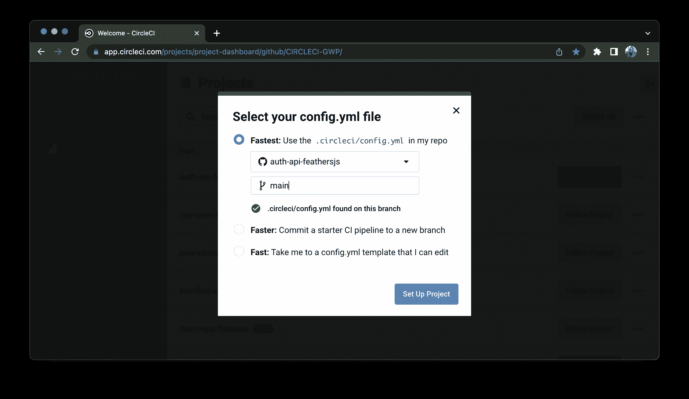
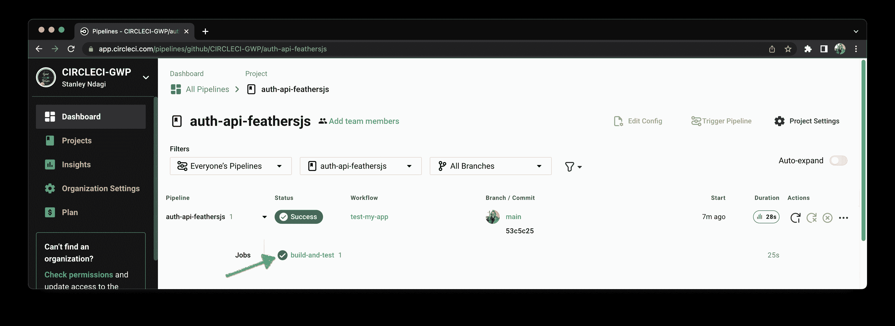
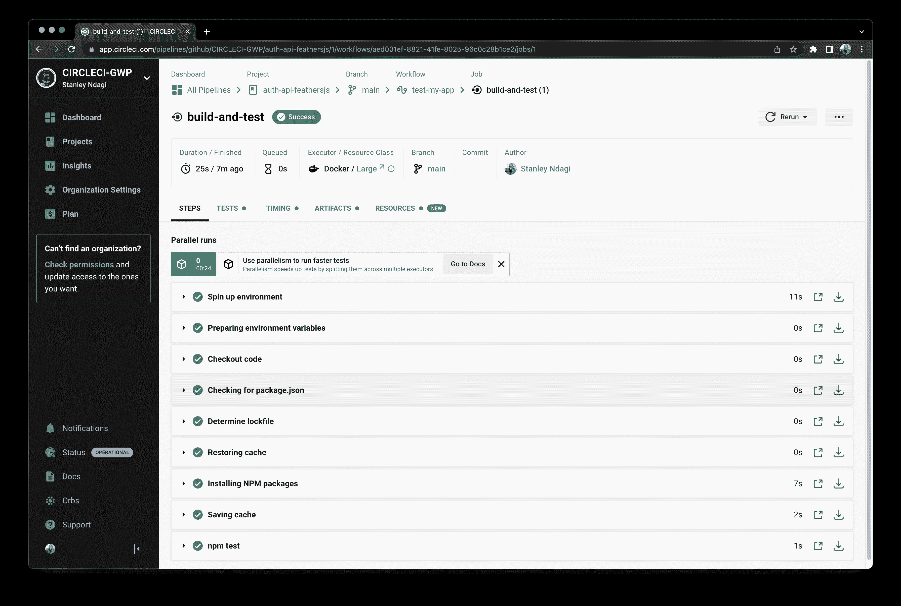
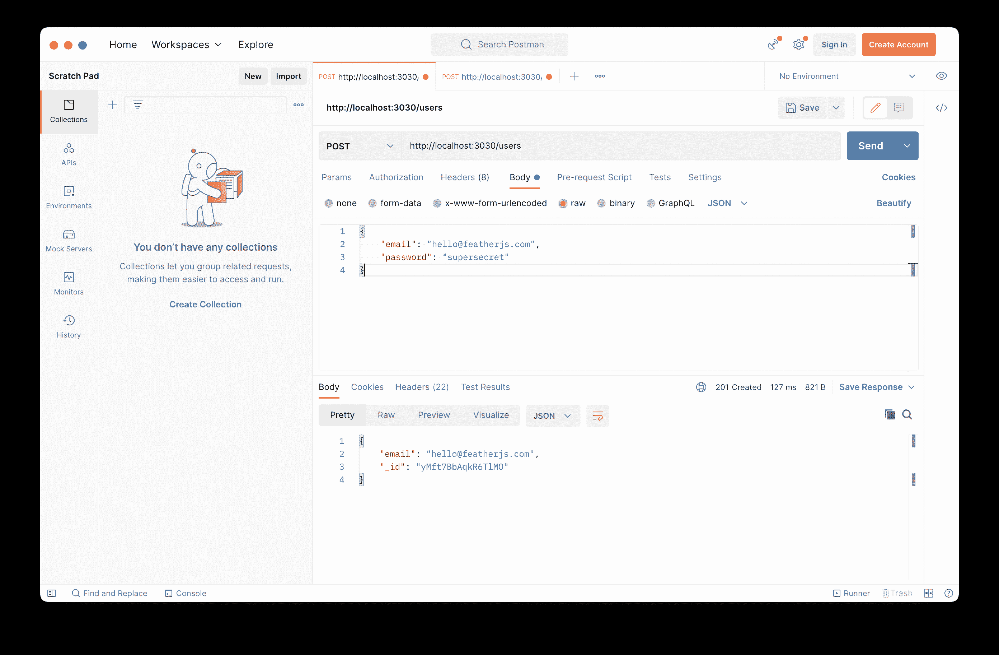
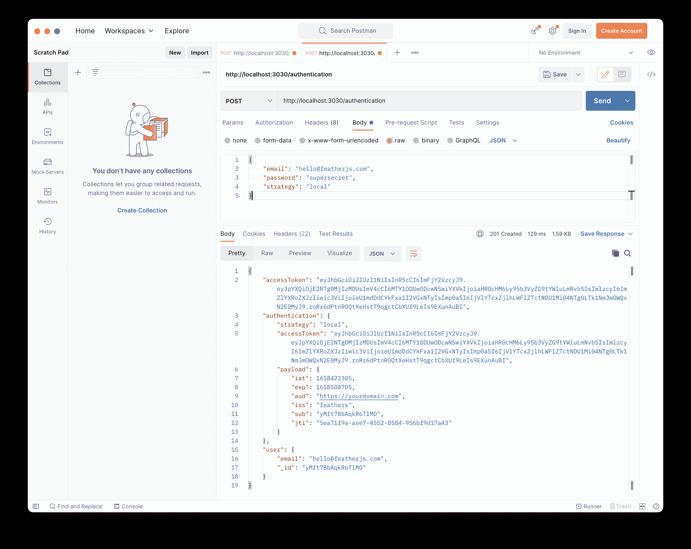
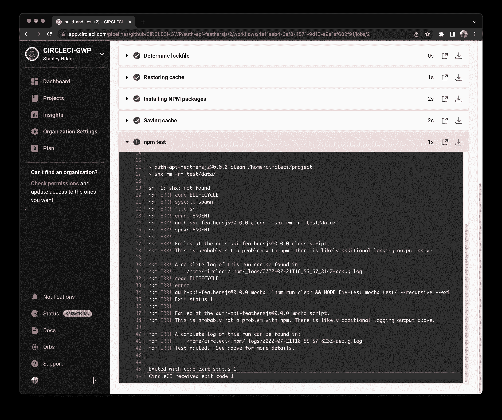
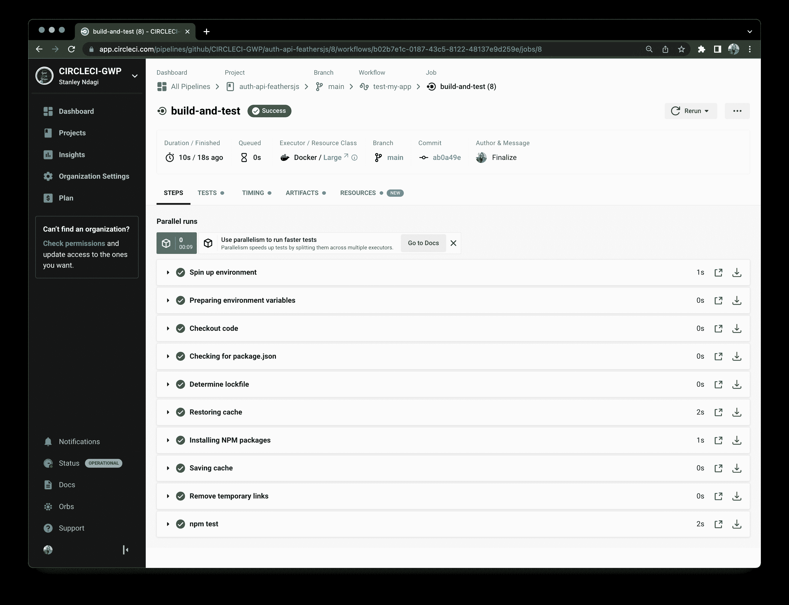

# FeathersJS 应用程序的自动化测试| CircleCI

> 原文：<https://circleci.com/blog/automate-feathersjs-testing/>

> 本教程涵盖:
> 
> 1.  构建一个 FeathersJS API
> 2.  为 FeathersJS 应用程序编写代码和测试
> 3.  创建 CI 管道以自动化测试

这是由两部分组成的系列之一。您还可以学习如何自动将 FeathersJS 应用程序部署到 Heroku 。

在软件开发生命周期中，测试提供的好处远远超出了代码本身。测试向所有各方(开发人员、客户、项目经理等)保证，虽然应用程序可能不是完全没有错误，但它确实如预期的那样做了。通过突出任何引入的回归，测试还提供了对代码进行调整和改进的信心。

大多数开发团队从中央存储库管理代码，使用版本控制系统(VCS)来推送更新并部署到生产服务器。理想情况下，测试在推送到中央存储库之前和部署到生产服务器之后运行。这使得任何问题都能在用户遇到之前被发现和处理。过去，这种手动过程会带来瓶颈，因为更新无法尽快部署。

如果在测试部署时发现问题，还会有用户体验不佳的风险，导致团队在解决问题时临时禁用应用程序。这些只是在将解决方案部署到生产环境之前，通过自动化测试流程解决的两个问题。

在本文中，我将向您展示如何使用 CircleCI 对 FeathersJS 应用程序进行自动化测试。为了帮助编写测试，我们将使用[摩卡](https://mochajs.org/)。

## 先决条件

开始之前，请确保您的系统上安装了以下项目:

*   10.0.0 的最低 [NodeJS](https://nodejs.org/en/) 版本
*   一个最新的 JavaScript 包管理器，如 [NPM](https://www.npmjs.com/) 或[纱](https://classic.yarnpkg.com/en/)
*   FeathersJS CLI

您可以通过运行以下命令来安装 FeathersJS CLI:

```
npm install -g @feathersjs/cli 
```

对于存储库管理和持续集成/持续部署，您需要:

> 我们的教程是平台无关的，但是使用 CircleCI 作为例子。如果你没有 CircleCI 账号，请在 注册一个免费的 [**。**](https://circleci.com/signup/)

## 入门指南

为项目创建新文件夹:

```
mkdir auth-api-feathersjs

cd auth-api-feathersjs 
```

接下来，使用 Feathers CLI `generate`命令生成一个新应用程序:

```
feathers generate app 
```

对于这个项目，我们将使用 JavaScript 创建一个 REST API。回答 CLI 中的问题，如下所示:

```
? Do you want to use JavaScript or TypeScript? JavaScript
? Project name auth-api-feathersjs
? Description
? What folder should the source files live in? src
? Which package manager are you using (has to be installed globally)? npm
? What type of API are you making? REST
? Which testing framework do you prefer? Mocha + assert
? This app uses authentication Yes
? Which coding style do you want to use? ESLint
? What authentication strategies do you want to use? (See API docs for all 180+
supported oAuth providers) Username + Password (Local)
? What is the name of the user (entity) service? users
? What kind of service is it? NeDB
? What is the database connection string? nedb://../data 
```

一旦 CLI 完成了应用程序的搭建，您就可以在任何您喜欢的代码编辑器中打开项目。

FeathersJS 提供了一些基本的测试来确保项目正常运行。您可以在项目根目录下的`test`文件夹中找到这些文件。使用以下命令运行测试:

```
npm test 
```

预期该输出:

```
 Feathers application tests
    ✓ starts and shows the index page
    404
info: Page not found {"className":"not-found","code":404,"data":{"url":"/path/to/nowhere"},"errors":{},"name":"NotFound","type":"FeathersError"}
      ✓ shows a 404 HTML page
info: Page not found {"className":"not-found","code":404,"data":{"url":"/path/to/nowhere"},"errors":{},"name":"NotFound","type":"FeathersError"}
      ✓ shows a 404 JSON error without stack trace

  authentication
    ✓ registered the authentication service
    local strategy
      ✓ authenticates user and creates accessToken (79ms)

  'users' service
    ✓ registered the service

  6 passing (282ms) 
```

## 配置 CircleCI

接下来，为 CircleCI 添加管道配置。对于这个项目，管道将由一个步骤组成:

1.  构建和测试——在这里，我们构建项目，安装项目依赖项，并运行项目测试。

在项目的根目录下，创建一个名为`.circleci`的文件夹，并在其中创建一个名为`config.yml`的文件。在新创建的文件中，添加以下配置:

```
# Use the latest 2.1 version of CircleCI pipeline process engine.
version: 2.1

orbs:
  node: circleci/node@5.0.2

jobs:
  build-and-test:
    executor: node/default
    steps:
      - checkout
      - node/install-packages:
          cache-path: ~/project/node_modules
          override-ci-command: npm install
      - run: npm test

workflows:
  test-my-app:
    jobs:
      - build-and-test 
```

这个配置使用 Node.js orb `circleci/node`来安装默认启用缓存的包。它还使 npm 可供您运行测试。

对于要执行的节点 orbte，管道只有一个作业`build-and-test`。这项工作的第一步是从 GitHub 库中提取代码。接下来，它安装在`package.json`文件中指定的包。通过使用指定目录中的缓存来加速此过程。该配置通过使用`override-ci-command`覆盖安装包的默认命令。这确保传递了该项目的正确安装命令。

这项工作的最后一步是运行`npm test`命令。

## 在 GitHub 上设置项目

现在您需要将这个项目转换成 Git 存储库，然后在 GitHub 上设置它。看到这个帖子寻求帮助:[把你的项目推到 GitHub](https://circleci.com/blog/pushing-a-project-to-github/) 。

登录您的 CircleCI 帐户。如果你注册了你的 GitHub 账户，你所有的库都会显示在你的仪表盘上。

点击**为`auth-api-feathersjs`项目设置项目**。

输入您的代码在 GitHub 上所在的分支机构的名称。然后点击**设置项目**。



您的第一个构建过程将开始运行并成功完成！



点击**构建和测试**查看工作步骤和每个工作的状态。



## 向您的 FeathersJS 应用程序添加测试

FeathersJS 的主要卖点之一是，它可以在几分钟内轻松构建原型，并在几天内完成生产就绪的应用程序。无需编写一行代码，您就已经有了一个 API 端点来处理注册和认证。您还拥有获取所有用户、更新用户和删除用户的端点。API 包括以下端点:

*   `GET /users`逐页列出所有用户。
*   `POST /users`创建新用户。此端点将用于注册。
*   `POST /authentication`使用提供的策略验证用户。对于本教程，我们使用“本地”身份验证。该策略使用保存在本地数据库中的电子邮件地址和密码组合。
*   `GET /users/123`返回 id 为 123 的用户的详细信息。您还可以在这个请求中包含查询，比如`/users/123?email=yemiwebby@circleci.com`。
*   `PATCH /users/123`和`PUT /users/123`更新 id 为 123 的用户的详细信息。
*   `DELETE /users/123`删除 id 为 123 的用户。

您可以在 Postman 中测试这些端点。使用以下命令运行服务器:

```
npm run dev 
```



注意，新创建的用户的密码没有在 JSON 响应中返回。这是在用户服务挂钩(位于`src/services/users/users.hooks.js`)中现成指定的。



用户服务挂钩还有助于确保在用户可以向任何端点(除了注册端点之外)发出请求之前，在请求的头中指定一个 JWT 令牌。

您已经完成了本教程中的一个重要步骤，但是还剩下一些步骤。假设您的应用程序有一个安全要求，即用户只能删除自己的帐户。尝试删除另一个用户的帐户应该会返回一个`403`错误响应。尝试更新或修补另一个用户的帐户也应该如此。

您的下一步是为这个安全需求编写一个测试套件。首先，您需要建立一个数据库，只用于测试。为此，用以下代码更新`config/test.json`中的测试环境配置:

```
{
  "nedb": "../test/data"
} 
```

您还需要确保在每次测试运行之前清理数据库。要跨平台实现这一点，首先运行:

```
npm install shx --save-dev 
```

接下来，将 package.json 文件的`scripts`部分更新为:

```
 "scripts": {
    "test": "npm run lint && npm run mocha",
    "lint": "eslint src/. test/. --config .eslintrc.json --fix",
    "dev": "nodemon src/",
    "start": "node src/",
    "clean": "shx rm -rf test/data/",
    "mocha": "npm run clean && NODE_ENV=test mocha test/ --recursive --exit"
  }, 
```

这将确保在每次测试运行之前删除`test/data`文件夹。

最后，更新`test/services/users.test.js`中的代码以匹配:

```
const axios = require('axios');
const assert = require('assert');
const url = require('url');
const app = require('../../src/app');

const port = app.get('port') || 8998;
const getUrl = (pathname) =>
  url.format({
    hostname: app.get('host') || 'localhost',
    protocol: 'http',
    port,
    pathname,
  });

describe('\'users\' service', () => {
  it('registered the service', () => {
    const service = app.service('users');
    assert.ok(service, 'Registered the service');
  });
});

describe('Additional security checks on user endpoints', () => {
  let alice = {
    email: 'alice@feathersjs.com',
    password: 'supersecret12',
  };

  let bob = {
    email: 'bob@feathersjs.com',
    password: 'supersecret1',
  };

  const getTokenForUser = async (user) => {
    const { accessToken } = await app.service('authentication').create({
      strategy: 'local',
      ...user,
    });
    return accessToken;
  };

  const setupUser = async (user) => {
    const { _id } = await app.service('users').create(user);
    user._id = _id;
    user.accessToken = await getTokenForUser(user);
  };

  let server;

  before(async () => {
    await setupUser(alice);
    await setupUser(bob);

    server = app.listen(port);
  });

  after(async () => {
    server.close();
  });

  it('should return 403 when user tries to delete another user', async () => {
    const { accessToken } = alice;
    const { _id: targetId } = bob;
    const config = { headers: { Authorization: `Bearer ${accessToken}` } };

    try {
      await axios.delete(getUrl(`/users/${targetId}`), config);
    } catch (error) {
      const { response } = error;

      assert.equal(response.status, 403);
      assert.equal(
        response.data.message,
        'You are not authorized to perform this operation on another user'
      );
    }
  });

  it('should return 403 when user tries to put another user', async () => {
    try {
      const { accessToken } = bob;
      const { _id: targetId } = alice;
      const config = { headers: { Authorization: `Bearer ${accessToken}` } };
      const testData = { password: bob.password };

      await axios.put(getUrl(`/users/${targetId}`), testData, config);
    } catch (error) {
      const { response } = error;

      assert.equal(response.status, 403);
      assert.equal(
        response.data.message,
        'You are not authorized to perform this operation on another user'
      );
    }
  });

  it('should return 403 when user tries to patch another user', async () => {
    try {
      const { accessToken } = alice;
      const { _id: targetId } = bob;
      const config = { headers: { Authorization: `Bearer ${accessToken}` } };
      const testData = { password: alice.password };

      await axios.patch(getUrl(`/users/${targetId}`), testData, config);
    } catch (error) {
      const { response } = error;

      assert.equal(response.status, 403);
      assert.equal(
        response.data.message,
        'You are not authorized to perform this operation on another user'
      );
    }
  });
}); 
```

在这个测试套件中，我们有两个角色(Alice 和 Bob)在我们的应用程序中注册。

在一个测试场景中，Alice 试图删除 Bob 的帐户。因为这是不允许的，所以您可以期待 API 返回一个`403`响应。

在第二个场景中，Bob 试图发出一个`PUT`请求来重置 Alice 的密码。如果这个请求被成功处理，Bob 将能够以 Alice 的身份登录，并按照自己的意愿使用她的帐户。您希望避免这种情况，并期望返回一个`403`响应。

第三个场景与第二个相似，只是这次 Alice 试图通过一个`UPDATE`请求重置 Bob 的密码。同样，您可以期待返回一个`403`响应。

很棒的东西！您已经有了预期场景的代码和测试。剩下要做的就是推送您的代码，让新特性生效。

```
git commit -am 'Additional security checks on user endpoints'
git push origin main 
```

回到 CircleCI 去看看你的新建筑运行得多好。一切都一帆风顺，直到我们有一个构建失败的消息。有什么问题吗？



看起来应用程序没有通过新测试套件中的测试。测试报告显示，在第一个场景中，Alice 成功删除了 Bob 的帐户。更有趣的是，因为我们删除了 Bob 的帐户，API 在第二个和第三个场景中返回了`404`响应。

假设您仍然需要为这个特性编写代码，并且您忘记了在将测试推到中央存储库之前在本地运行测试。这个场景可能看起来有些做作，但事实是这样的错误时有发生。拥有自动化测试过程可以防止这种人为错误。因为在部署更新之前必须通过一层测试，所以这个噩梦将永远无法通过测试环境。

好吧，你应该在别人发现之前解决这个问题。通过向用户服务挂钩添加验证检查，可以防止用户对其他帐户执行某些操作。

打开`src/services/users/users.hooks.js`。就在以`module.exports = {`开头的那一行的上方，加上:

```
...
const {Forbidden} = require('@feathersjs/errors');

const verifyCanPerformOperation = async context => {
  const {_id: authenticatedUserId} = context.params.user;
  const {id: targetUserId} = context;
  if (authenticatedUserId !== targetUserId) {
    throw new Forbidden('You are not authorized to perform this operation on another user');
  }
};
... 
```

这个函数将钩子上下文作为一个参数，并从中获得两个值:通过身份验证的用户的`id`和目标用户的`id`。如果这些值不相同，那么抛出一个`forbidden`错误。这个错误由钩子的错误处理器处理，它返回一个`403`响应。

接下来，更新`src/services/users/users.hooks.js`中的`before`条目以匹配:

```
...
before: {
    all: [],
    find: [authenticate('jwt')],
    get: [authenticate('jwt')],
    create: [hashPassword('password')],
    update: [hashPassword('password'), authenticate('jwt'), verifyCanPerformOperation],
    patch: [hashPassword('password'), authenticate('jwt'), verifyCanPerformOperation],
    remove: [authenticate('jwt'), verifyCanPerformOperation]
  },
  ... 
```

随着这一改变，在对`update`、`patch`和`remove`服务方法的认证检查之后执行验证检查。这些方法分别映射到`PUT`、`PATCH`和`DELETE`端点。这确保了登录用户可以检索他们的 id。

剩下的就是在本地运行测试以确保一切正常，提交最新的更改，然后将这些更改推送到您的 GitHub 存储库。这触发了 CircleCI `build-and-test`管道。



干得好！

## 结论

在本文中，您使用 FeathersJS 构建了一个身份验证和用户管理 API。您还设置了一个 CircleCI 管道，在将更改部署到生产服务器之前，自动测试对 repo 的更改。

这种方法的好处是人为错误不会危及应用程序的安全性。通过自动化测试过程，您消除了人为错误对生产环境造成意外破坏的风险。它还为维护的软件增加了额外的质量控制和保证。尝试持续集成，让代码库瓶颈成为团队的过去！

本教程的全部代码可以在 GitHub 上找到。

* * *

Oluyemi 是一名拥有电信工程背景的技术爱好者。出于对解决用户日常遇到的问题的浓厚兴趣，他冒险进入编程领域，并从那时起将他的问题解决技能用于构建 web 和移动软件。Oluyemi 是一名热衷于分享知识的全栈软件工程师，他在世界各地的几个博客上发表了大量技术文章和博客文章。作为技术专家，他的爱好包括尝试新的编程语言和框架。

[阅读更多 Olususi Oluyemi 的帖子](/blog/author/olususi-oluyemi/)