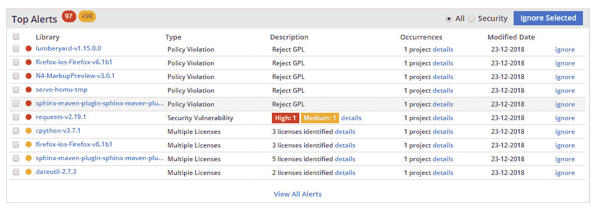
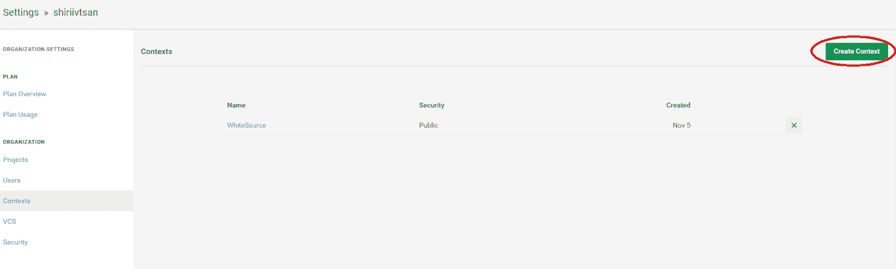

# 自动化开源安全跟踪| WhiteSource 和 CircleCI

> 原文：<https://circleci.com/blog/automate-open-source-security-tracking-with-the-whitesource-circleci-orb/>

在软件开发的敏捷时代，速度是游戏的名字。这就是为什么像 CircleCI 这样的 CI/CD 工具在改变我们的工作方式方面发挥了如此重要的作用；以极快的速度通过管道发送我们的软件。

我们总是问这样的问题:我们多快能给我们的客户推出一个新版本？我们如何添加这些新功能并保持进度？我们怎样才能尽可能少地浪费时间和精力来做这些事情呢？

开源软件组件通过为我们的产品提供构建模块而扮演着重要的角色。这些自由软件组件通过向我们提供可靠的代码，允许我们跳过自己编写基本功能的单调工作。这使我们能够专注于我们的业务逻辑，而不是从零开始构建我们自己的框架和基础设施。然而，即使我们享受开源组件的好处，它们也不是没有挑战，尤其是在安全漏洞方面。

## 不要让易受攻击的组件阻碍您的发展

事实是，影响开源组件的安全漏洞的数量在最近几年呈上升趋势，根据我们最新的[研究报告](https://www.whitesourcesoftware.com/wp-content/media/2021/04/the-state-of-open-source-vulnerabilities-2021.pdf?utm_source=circleci&utm_medium=channel&utm_term=whitesource-circleci-orb&utm_content=the-state-of-open-source-vulnerability-management&utm_origin=3rd&utm_from=CircleCI)显示，达到了 51%的峰值。这导致了更多的警报，当然，也导致了耗时的“拆旧换新”操作。

当开发人员在寻找解决我们代码中存在的问题的解决方案时，在我们从 GitHub 上的回购中获取开源组件之前，我们的第一直觉通常不会深入探究它的来龙去脉。我们根本没有时间开始调查我们使用的每个开源库是否有任何已知的漏洞，或者是否有更新的版本可用。相反，我们会问它是否做了我们需要它做的工作。如果是的话，太好了！我们把它放入代码中。没有吗？好，继续下一个组件，直到我们找到一个工作。

这里的问题是，一旦一个易受攻击的组件进入我们的代码，它可能会对您的软件构成风险，直到它在最好的情况下被标记为稍后进行补救，或者在最坏的情况下被黑客利用。无论是哪种情况，都意味着花时间回到代码中并实现某种修复。

## 处理补救措施

修复*可以像添加补丁一样简单。这当然是说起来容易做起来难。*

虽然超过 97%的开源漏洞都有补丁，但并不是所有的补救措施都像补丁一样简单。在这些情况下，我们可能需要寻找一个新版本，并希望它是向后兼容的。如果所有其他方法都失败了，唯一的选择可能是寻找一个不同的组件来做我们易受攻击的组件所做的大部分事情，并希望重新配置不会破坏其他所有事情。

所有这些听起来都像是一场争论，因为事实就是如此。好消息是，这些问题中的大部分都可以通过一开始就聪明地工作来轻松避免。

## 自始至终保护您的 CI/CD 渠道

[WhiteSource CircleCI orb](https://github.com/whitesource/whitesource_orb) 集成了 [WhiteSource 的](https://www.whitesourcesoftware.com/?utm_source=circleci&utm_medium=channel&utm_term=whitesource-circleci-orb&utm_content=whitesource-website&utm_origin=3rd&utm_from=CircleCI)自动化、持续跟踪功能，以帮助开发人员在将易受攻击的开源组件添加到他们的产品之前发现它们。Whitesource 可以在软件开发生命周期(SDLC)的最早阶段参与进来，以识别开源组件，并标记出容易受到攻击的组件，这些组件可能会在以后引起麻烦。通过在将任何易受攻击的组件添加到 CI、试运行或生产服务器之前将其捕获，它为我们提供了一个机会来找到一个不同的、更安全的版本或组件，以满足我们的需求。

尽管我们更愿意在游戏的早期发现易受攻击的组件，但有时易受攻击的组件可能已经存在于已部署的产品中。在这种情况下，我们需要补救。对于开发人员来说，可取之处在于，漏洞描述中建议的修复可以为我们指出正确的方向，节省我们自己研究和确认问题的理想解决方案的时间。



## 快速简单的实施

首先，WhiteSource 帐户持有人可以点击 Circle CI“设置”部分，并创建一个新的上下文。接下来，就是在 integrate 选项卡上添加 WhiteSource API 令牌了。



完成后，用户可以创建一个配置文件，其中包含必要的参数引用，并开始接收有关其开源使用和风险的 WhiteSource 报告。

示例用法:

```
version: 2.1

executors:
  java:
    description: The docker container to run java commands
    docker:
      - image: circleci/openjdk:8-jdk

jobs:
  scan:
    executor: java
    parameters:
      api_key:
        description: Unique identifier of the organization. Can be retrieved from the admin page in your WhiteSource account.
        type: string
        default: ""
      directory:
        description: Comma separated list of directories and / or files to scan.
        type: string
        default: "."
      config_file_path:
        description: Configuration file name (including file path).
        type: string
        default: "./whitesource-fs-agent.config"
    steps:
      - checkout
      - run:
          command: |
            if [[ -z "<< parameters.api_key >>" ]]; then
              bash <(curl -s -L https://github.com/whitesource/fs-agent-distribution/raw/master/standAlone/wss_agent_orb.sh) -c << parameters.config_file_path >> -d << parameters.directory >>
            else
              bash <(curl -s -L https://github.com/whitesource/fs-agent-distribution/raw/master/standAlone/wss_agent_orb.sh) -apiKey << parameters.api_key >> -c << parameters.config_file_path >> -d << parameters.directory >>
            fi 
```

## 包扎

我们使用开源组件来节省时间并更快地到达目的地。我们需要确保使用正确的技术来管理这些组件的使用方式，最大限度地减少安全使用这些组件所需的维护工作量。通过链接您的 CircleCI 和 WhiteSource 帐户，我们可以更轻松地捕捉漏洞，同时还能轻松管理漏洞，让您深入了解您的软件，从而在使用开源组件时做出更明智的决策。

* * *

什里·伊夫桑是一名经验丰富的云解决方案架构师和产品经理，拥有工业工程和管理学士学位。在加入 WhiteSource 之前，什里曾在 R&D 的多家公司担任多个职位，包括解决方案架构师、R&D 团队领导和产品经理。