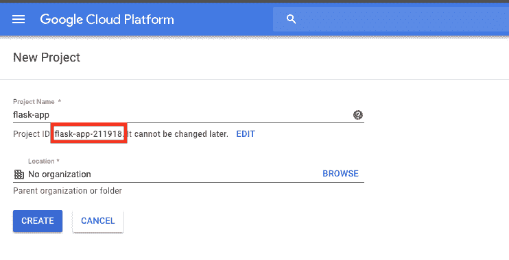

# Kubernetes -基础设施代码- Kubernetes 教程| CircleCI

> 原文：<https://circleci.com/blog/automate-releases-from-pipelines-using-infrastructure-as-code/>

[持续交付](https://circleci.com/blog/a-brief-history-of-devops-part-iv-continuous-delivery-and-continuous-deployment/)使开发人员、团队和组织能够毫不费力地更新代码并向他们的客户发布新特性。这一切都是可能的，因为团队和组织内最近的文化转变，他们开始接受 CI/CD 和 DevOps 实践。实施 CI/CD 和 DevOps 实践使这些团队能够更好地利用现代工具，以高度的信心和一致性来构建、测试和部署他们的软件。

基础设施即代码(IaC)使团队能够轻松管理他们的云资源，方法是在代码中静态定义和声明这些资源，然后通过代码部署和动态维护这些资源。在本文中，我将演示如何在 CI/CD 管道中实现 IaC。这篇文章还演示了如何在管道中实现我们合作伙伴的 Pulumi orb。这个 orb 定义并部署一个应用到一个 [Google Kubernetes 引擎(GKE)](https://cloud.google.com/kubernetes-engine/) 集群。Pulumi 将提供该职位的 IaC 部分。

## 假设

这篇文章假设您在 [GitHub](https://github.com) 上有一个现有的 Git 存储库。这里提供的代码示例需要存在于项目 repo 的目录中。

## 使用的技术

这篇文章还假设读者对以下内容有基本的了解；

## 启动装置

Pulumi 使开发人员能够用他们喜欢的语言(例如 JavaScript、Python、Go 等)编写代码。)，轻松部署云应用和基础设施，无需学习专门的 DSL 或 YAML 模板解决方案。一流语言的使用使得抽象和重用成为可能。Pulumi 在所有主要云服务提供商(如 AWS、Azure、GCP 等)中提供高级别的云包和低级别的资源定义。)这样你就可以掌握一个系统交付给所有人。

在您选择的应用程序存储库中，创建一个 Pulumi 应用程序将驻留的新目录。

```
mkdir -p pulumi/gke
cd pulumi/gke 
```

接下来，注册 Pulumi 和 Google Cloud 账户，如果你以前没有注册过的话。

在创建了一个新的 Pulumi 项目之后，现在在`pulumi/gke`目录中有三个文件:

*   **pulumi . YAML**——指定关于项目的元数据。
*   **普鲁米。<栈名>。YAML**——包含我们初始化的堆栈的配置值。 ***<栈名>*** 应该替换为创建新的 Pulumi 项目时定义的**栈名**。出于本教程的目的，我们将这个文件命名为`Pulumi.k8s.yaml`。
*   **__main__。py** -定义堆栈资源的 Pulumi 程序。这就是 IaC [魔法](https://www.brainyquote.com/quotes/arthur_c_clarke_101182)发生的地方。

编辑`Pulumi.<stack name>.yaml`文件并将以下内容粘贴到其中:

```
config:
  gcp:credentials: ./cicd_demo_gcp_creds.json
  gcp:project: cicd-workshops
  gcp:region: us-east1
  gcp:zone: us-east1-d
  gke:name: k8s 
```

编辑`__main__.py`文件并将其内容替换为:

```
import os
import pulumi
import pulumi_kubernetes
from pulumi import ResourceOptions
from pulumi_kubernetes.apps.v1 import Deployment
from pulumi_kubernetes.core.v1 import Namespace, Pod, Service
from pulumi_gcp import container

conf = pulumi.Config('gke')
gcp_conf = pulumi.Config('gcp')

stack_name = conf.require('name')
gcp_project = gcp_conf.require('project')
gcp_zone = gcp_conf.require('zone')

app_name = 'cicd-app'
app_label = {'appClass':app_name}
cluster_name = app_name

image_tag = ''
if 'CIRCLE_SHA1' in os.environ:
    image_tag = os.environ['CIRCLE_SHA1']
else:
    image_tag = 'latest'

docker_image = 'ariv3ra/orb-pulumi-gcp:{0}'.format(image_tag)

machine_type = 'g1-small'

cluster = container.Cluster(
    cluster_name,
    initial_node_count=3,
    min_master_version='latest',
    node_version='latest',
    node_config={
        'machine_type': machine_type,
        'oauth_scopes': [
            "https://www.googleapis.com/auth/compute",
            "https://www.googleapis.com/auth/devstorage.read_only",
            "https://www.googleapis.com/auth/logging.write",
            "https://www.googleapis.com/auth/monitoring",
        ],
    }
)

# Set the Kubeconfig file values here
def generate_k8_config(master_auth, endpoint, context):
    config = '''apiVersion: v1
clusters:
- cluster:
    certificate-authority-data: {masterAuth}
    server: https://{endpoint}
  name: {context}
contexts:
- context:
    cluster: {context}
    user: {context}
  name: {context}
current-context: {context}
kind: Config
preferences: {prefs}
users:
- name: {context}
  user:
    auth-provider:
      config:
        cmd-args: config config-helper --format=json
        cmd-path: gcloud
        expiry-key: '{expToken}'
        token-key: '{tokenKey}'
      name: gcp
    '''.format(masterAuth=master_auth, context=context, endpoint=endpoint, 
            prefs='{}', expToken = '{.credential.token_expiry}', tokenKey='{.credential.access_token}')

    return config

gke_masterAuth = cluster.master_auth['clusterCaCertificate']
gke_endpoint = cluster.endpoint
gke_context = gcp_project+'_'+gcp_zone+'_'+cluster_name

k8s_config = pulumi.Output.all(gke_masterAuth,gke_endpoint,gke_context).apply(lambda args: generate_k8_config(*args))

cluster_provider = pulumi_kubernetes.Provider(cluster_name, kubeconfig=k8s_config)
ns = Namespace(cluster_name, __opts__=ResourceOptions(provider=cluster_provider))

gke_deployment = Deployment(
    app_name,
    metadata={
        'namespace': ns,
        'labels': app_label,
    },
    spec={
        'replicas': 3,
        'selector':{'matchLabels': app_label},
        'template':{
            'metadata':{'labels': app_label},
            'spec':{
                'containers':[
                    {
                        'name': app_name,
                        'image': docker_image,
                        'ports':[{'name': 'port-5000', 'container_port': 5000}]
                    }
                ]
            }
        }
    },
    __opts__=ResourceOptions(provider=cluster_provider)
)

deploy_name = gke_deployment

gke_service = Service(
    app_name,
    metadata={
        'namespace': ns,
        'labels': app_label,
    },
    spec={
        'type': "LoadBalancer",
        'ports': [{'port': 80, 'target_port': 5000}],
        'selector': app_label,
    },
    __opts__=ResourceOptions(provider=cluster_provider)
)

pulumi.export("kubeconfig", k8s_config)
pulumi.export("app_endpoint_ip", gke_service.status['load_balancer']['ingress'][0]['ip']) 
```

`__main__.py`文件中的内容指定了您将从管道中部署的 GKE 集群和基础设施。这个 Pulumi 应用程序创建了一个三节点 Kubernetes 集群，它通过 Docker 容器在 pods 中运行应用程序。这段代码还创建了一个`Load Balancer`资源，它将流量均匀地路由到各个计算节点上的活动 Docker 容器。如果你想了解更多关于 Pulumi Python 应用的信息，请访问[网站](https://pulumi.io/reference/python/)获取详细解释。

## Google 云设置

在本节中，您将创建和生成必要的 GCP 凭证。这些凭证将为我们的 CI/CD 管道和 Pulumi 代码提供访问权限，以便在 GCP 上执行命令。

### 创建一个 GCP 项目

默认项目是为新帐户默认设置的。我建议您创建一个新项目，并保持它的独立性，以便以后可以轻松地拆除它。创建后，请务必将`project id`复制下来，因为它与`project name`不同。



### 获取项目凭据

接下来，设置一个服务帐户密钥，Pulumi 将使用它来创建和管理您的 GCP 项目中的资源。进入[创建服务账户密钥页面](https://console.cloud.google.com/apis/credentials/serviceaccountkey)。选择默认服务账户或新建一个，选择`JSON`作为密钥类型，点击**创建**。将这个`.json`文件保存在`pulumi/gke`文件夹中。

**重要安全提示:** *将文件重命名为`cicd_demo_gcp_creds.json`，以保护您的 Google Cloud 凭据不会在公共 GitHub 存储库中发布和暴露。此外，您可以在这个项目的`.gitignore`文件中添加凭证的`.json`文件名。您必须非常谨慎地使用该文件中的数据，因为一旦暴露，任何拥有该信息的人都可以登录您的帐户，并在您的 Google Cloud 帐户上创建资源和运行费用。*

## cicekci 设置

现在，我们需要配置 CircleCI 和我们的管道[配置文件](https://circleci.com/docs/configuration-reference/)来将 Pulumi 集成到我们的 CI/CD 管道中。

### 对 Google 服务帐户文件进行编码

服务帐户文件必须编码成一个`base64`值，以便将该数据作为一个[环境变量](https://circleci.com/docs/env-vars/)存储在 CircleCI 中。在终端中运行以下命令，对值进行编码并获得结果:

```
base64 cicd_demo_gcp_creds.json 
```

该命令的结果将类似于以下内容:

```
ewogICJ0eXBlIjogInNlcnZpY2VfYWNjb3VudCIsCiAgInByb2plY3RfaWQiOiAiY2ljZC13b3Jrc2hvcHMiLAogICJwcml2YXRlX2tleV9pZCI6ICJiYTFmZDAwOThkNTE1ZTE0NzE3ZjE4NTVlOTY1NmViMTUwNDM4YTQ4IiwKICAicHJpdmF0ZV9rZXkiOiAiLS0tLS1CRUdJTiBQUklWQVRFIEtFWS0tLS0tXG5NSUlFdlFJQkFEQU5CZ2txaGtpRzl3MEJBUUVGQUFTQ0JLY3dnZ1NqQWdFQUFvSUJBUURjT1JuRXFla3F4WUlTXG5UcHFlYkxUbWdWT3VzQkY5NTE1YkhmYWNCVlcyZ2lYWjNQeFFBMFlhK2RrYjdOTFRXV1ZoRDZzcFFwWDBxY2l6XG5GdjFZekRJbXkxMCtHYnlUNWFNV2RjTWw3ZlI2TmhZay9FeXEwNlc3U0FhV0ZnSlJkZjU4U0xWcC8yS1pBbjZ6XG5BTVdHZjM5RWxSNlhDaENmZUNNWXorQmlZd29ya3Nob3BzLmlhbS5nc2VydmljZWFjY291bnQuY29tIgp9Cg== 
```

将结果复制到您的剪贴板，因为我们将在下一部分使用它。

### 创建项目变量

为了让这个 CI/CD 管道在 GCP 上执行命令，我们必须在 CircleCI 中配置[项目级环境变量](https://circleci.com/docs/env-vars/#setting-an-environment-variable-in-a-project)。

使用 CircleCI 仪表板创建以下项目级环境变量:

*   **$DOCKER_LOGIN** =您的 Docker Hub 用户名
*   **$DOCKER_PWD** =您的 Docker Hub 密码
*   **$GOOGLE_CLOUD_KEYS** =上一节的 base64 编码结果
*   **$PULUMI_ACCESS_TOKEN** =从 PULUMI 仪表板生成访问令牌

### 集成了 Pulumi 的 CI/CD 管道

现在，您已经拥有了将 Pulumi 应用程序集成到 CircleCI `config.yml`文件中所需的所有元素。编辑您的`config.yml`并将以下配置粘贴到您的文件中。这个`config.yaml`的内容特定于我在演示和演讲中使用的一个示例 Python 项目，因此您的项目的`config.yml`将会不同。要查看完整的示例项目，请在 GitHub [点击](https://github.com/datapunkz/orb-pulumi-gcp)查看回购。我将引导您并解释这个示例配置中重要的 Pulumi 集成部分，以便您对正在发生的事情有一个清晰的理解。

```
version: 2.1
orbs:
  pulumi: pulumi/pulumi@1.0.1
jobs:
  build_test:
    docker:
      - image: circleci/python:3.7.2
        environment:
          PIPENV_VENV_IN_PROJECT: 'true'
    steps:
      - checkout
      - run:
          name: Install Python Dependencies
          command: |
            pipenv install --skip-lock
      - run:
          name: Run Tests
          command: |
            pipenv run pytest
  build_push_image:
    docker:
      - image: circleci/python:3.7.2
    steps:
      - checkout
      - setup_remote_docker:
          docker_layer_caching: false
      - run:
          name: Build and push Docker image
          command: |       
            pipenv install --skip-lock
            pipenv run pyinstaller -F hello_world.py
            echo 'export TAG=${CIRCLE_SHA1}' >> $BASH_ENV
            echo 'export IMAGE_NAME=orb-pulumi-gcp' >> $BASH_ENV
            source $BASH_ENV
            docker build -t $DOCKER_LOGIN/$IMAGE_NAME -t $DOCKER_LOGIN/$IMAGE_NAME:$TAG .
            echo $DOCKER_PWD | docker login -u $DOCKER_LOGIN --password-stdin
            docker push $DOCKER_LOGIN/$IMAGE_NAME
  deploy_to_gcp:
    docker:
      - image: circleci/python:3.7.2
        environment:
          CLOUDSDK_PYTHON: '/usr/bin/python2.7'
          GOOGLE_SDK_PATH: '~/google-cloud-sdk/'
    steps:
      - checkout
      - pulumi/login:
          access-token: ${PULUMI_ACCESS_TOKEN}
      - run:
          name: Install dependecies
          command: |
            cd ~/
            sudo pip install --upgrade pip==18.0 && pip install --user pulumi pulumi-gcp pulumi-kubernetes
            curl -o gcp-cli.tar.gz https://dl.google.com/dl/cloudsdk/channels/rapid/google-cloud-sdk.tar.gz
            tar -xzvf gcp-cli.tar.gz
            echo ${GOOGLE_CLOUD_KEYS} | base64 --decode --ignore-garbage > ${HOME}/project/pulumi/gcp/gke/cicd_demo_gcp_creds.json
            ./google-cloud-sdk/install.sh  --quiet 
            echo 'export PATH=$PATH:~/google-cloud-sdk/bin' >> $BASH_ENV
            source $BASH_ENV
            gcloud auth activate-service-account --key-file ${HOME}/project/pulumi/gcp/gke/cicd_demo_gcp_creds.json
      - pulumi/update:
          stack: k8s
          working_directory: ${HOME}/project/pulumi/gcp/gke/
workflows:
  build_test_deploy:
    jobs:
      - build_test
      - build_push_image:
          requires:
            - build_test
      - deploy_to_gcp:
          requires:
          - build_push_image 
```

下面的代码片段指定将在这个管道中使用 [Pulumi orb](https://circleci.com/developer/orbs/orb/pulumi/pulumi) 。

```
version: 2.1
orbs:
  pulumi: pulumi/pulumi@1.0.1 
```

示例管道中的`jobs:`键定义了三个单独的作业:

*   这个任务运行应用程序单元测试

*   `build_push_image`:该作业基于通常共存于项目报告中的 Docker 文件构建新的 Docker 映像

*   这个任务通过 Pulumi orb 部署到 GKE 集群

我将专注于`build_push_image`和`deploy_to_gcp`工作。

### 构建 _ 推送 _ 映像:

```
 build_push_image:
    docker:
      - image: circleci/python:3.7.2
    steps:
      - checkout
      - setup_remote_docker:
          docker_layer_caching: false
      - run:
          name: Build and push Docker image
          command: |       
            pipenv install --skip-lock
            pipenv run pyinstaller -F hello_world.py
            echo 'export TAG=${CIRCLE_SHA1}' >> $BASH_ENV
            echo 'export IMAGE_NAME=orb-pulumi-gcp' >> $BASH_ENV
            source $BASH_ENV
            docker build -t $DOCKER_LOGIN/$IMAGE_NAME -t $DOCKER_LOGIN/$IMAGE_NAME:$TAG .
            echo $DOCKER_PWD | docker login -u $DOCKER_LOGIN --password-stdin
            docker push $DOCKER_LOGIN/$IMAGE_NAME 
```

在应用程序经过测试并成功通过后，`build_push_image`作业将应用程序打包成一个可执行的二进制文件。然后它启动了`docker build`命令，该命令基于项目回购中的`Dockerfile`构建了一个新的 Docker 映像。该作业还使用现有的环境变量，并定义一些新的环境变量，用于指定唯一的 Docker 图像名称。以下是该项目的`Dockerfile`:

```
FROM python:3.7.2
RUN mkdir /opt/hello_world/
WORKDIR /opt/hello_world/
COPY dist/hello_world /opt/hello_world/
EXPOSE 80
CMD [ "./hello_world" ] 
```

`docker push`命令将我们新建的 Docker 映像上传到 Docker Hub，以便将来存储和检索。

### 部署到 gcp:

```
 deploy_to_gcp:
    docker:
      - image: circleci/python:3.7.2
        environment:
          CLOUDSDK_PYTHON: '/usr/bin/python2.7'
          GOOGLE_SDK_PATH: '~/google-cloud-sdk/'
    steps:
      - checkout
      - pulumi/login:
          access-token: ${PULUMI_ACCESS_TOKEN}
      - run:
          name: Install dependencies
          command: |
            cd ~/
            sudo pip install --upgrade pip==18.0 && pip install --user pulumi pulumi-gcp pulumi-kubernetes
            curl -o gcp-cli.tar.gz https://dl.google.com/dl/cloudsdk/channels/rapid/google-cloud-sdk.tar.gz
            tar -xzvf gcp-cli.tar.gz
            echo ${GOOGLE_CLOUD_KEYS} | base64 --decode --ignore-garbage > ${HOME}/project/pulumi/gcp/gke/cicd_demo_gcp_creds.json
            ./google-cloud-sdk/install.sh  --quiet 
            echo 'export PATH=$PATH:~/google-cloud-sdk/bin' >> $BASH_ENV
            source $BASH_ENV
            gcloud auth activate-service-account --key-file ${HOME}/project/pulumi/gcp/gke/cicd_demo_gcp_creds.json
      - pulumi/update:
          stack: k8s
          working_directory: ${HOME}/project/pulumi/gcp/gke/ 
```

上面指定的`deploy_to_gcp:`作业是管道的一部分，它利用 Pulumi 应用程序和 orb 在 GCP 上实际建立新的 GKE 集群。下面，我将简要介绍一下`deploy_to_gcp:`工作。

```
 - pulumi/login:
          access-token: ${PULUMI_ACCESS_TOKEN} 
```

上面的代码演示了 Pulumi orb 的`login:`命令的规范和执行。参数`access-token:`通过您在 CircleCI 仪表板中设置的`${PULUMI_ACCESS_TOKEN}`环境变量传递。

```
 curl -o gcp-cli.tar.gz https://dl.google.com/dl/cloudsdk/channels/rapid/google-cloud-sdk.tar.gz
            tar -xzvf gcp-cli.tar.gz
            echo ${GOOGLE_CLOUD_KEYS} | base64 --decode --ignore-garbage > ${HOME}/project/pulumi/gcp/gke/cicd_demo_gcp_creds.json
            ./google-cloud-sdk/install.sh  --quiet 
            echo 'export PATH=$PATH:~/google-cloud-sdk/bin' >> $BASH_ENV
            source $BASH_ENV
            gcloud auth activate-service-account --key-file ${HOME}/project/pulumi/gcp/gke/cicd_demo_gcp_creds.json 
```

以上命令下载并安装 [Google Cloud SDK](https://pulumi.io/reference/python/) 。此 SDK 是在 GCP 上创建和修改 GKE 集群所必需的。前两行下载并解包 SDK。`echo ${GOOGLE_CLOUD_KEYS} | base64 --decode...`命令解码`${GOOGLE_CLOUD_KEYS}`环境变量，然后用解码后的内容填充`cicd_gcp_creds.json`。这个文件必须存在于 Pulumi 应用程序项目的目录中。这个特定的`run:`块中的其余命令安装 SDK，最后一行授权服务帐户通过`cicd_demo_gcp_creds.json`文件访问 GCP。

```
 - pulumi/update:
      stack: k8s
      working_directory: ${HOME}/project/pulumi/gcp/gke/ 
```

上面的代码利用 Pulumi orb 的`update:`命令将应用程序部署到 GCP 的一个新的 GKE 集群上。`pulumi/update:`命令显示了`stack:`和`working_directory:`参数，它们代表了 Pulumi 堆栈的名称和初始化为 Pulumi 项目的目录的文件路径。您的`working_directory:`将不同于上面的代码示例。

## 结论

在本文中，我展示了如何将基础设施作为代码解决方案集成到 CI/Cd 管道中。我还演示了如何在 CI/CD 管道中声明和执行 CircleCI orb 技术。这些示例提供了对使用 CI/CD 自动化来构建、测试和部署使用 IaC 解决方案的代码的坚实理解。

使用 CircleCI orbs 通过简化我们编写 CircleCI 配置的方式来提高生产率。orb 也可以共享，这通过在我们的配置文件中使用预构建的命令、作业和执行器来节省时间。orb 并不局限于 CircleCI + GKE 部署。您可以浏览 [Orb 注册表](https://circleci.com/developer/orbs)中的可用 Orb 列表，找到符合您选择的云平台、编程语言、testng 工具等的 Orb。

要查看完整的示例项目，请查看 GitHub 上的 repo[这里](https://github.com/datapunkz/orb-pulumi-gcp)。