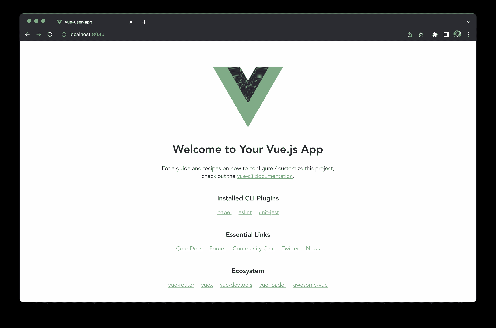
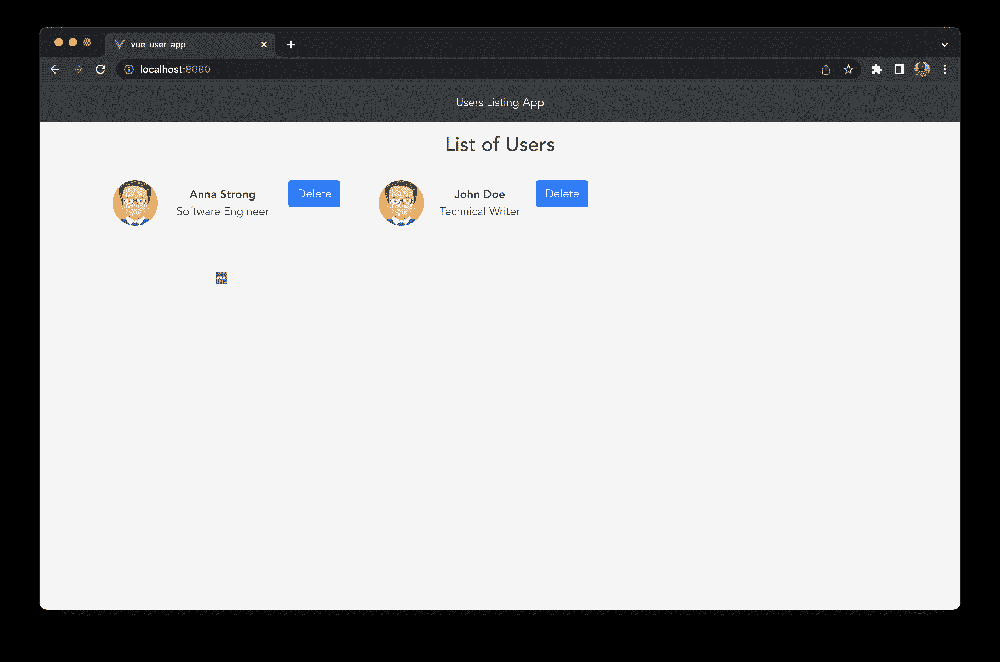
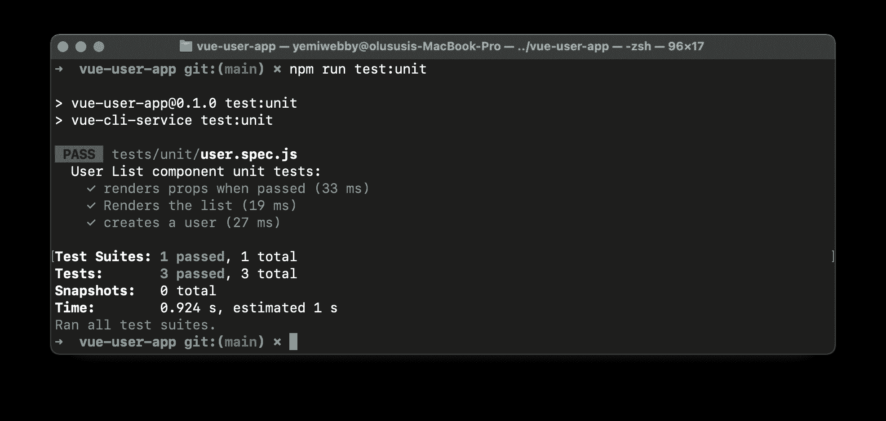
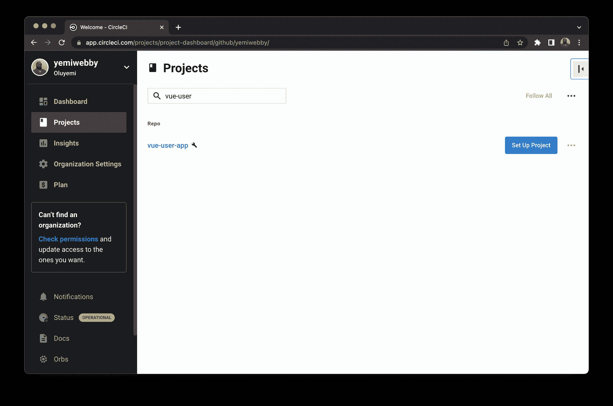
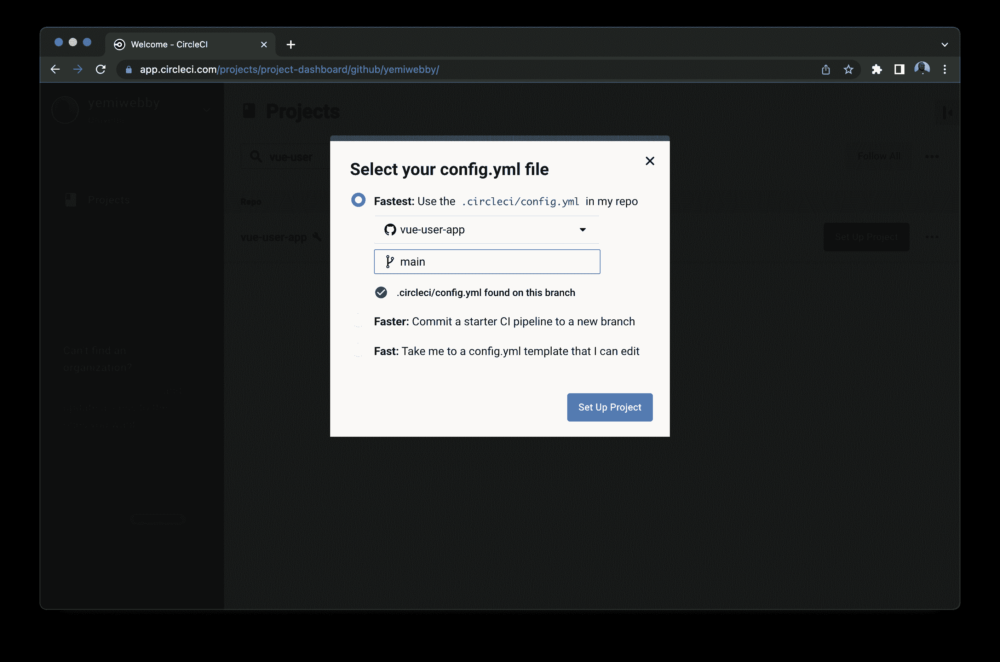
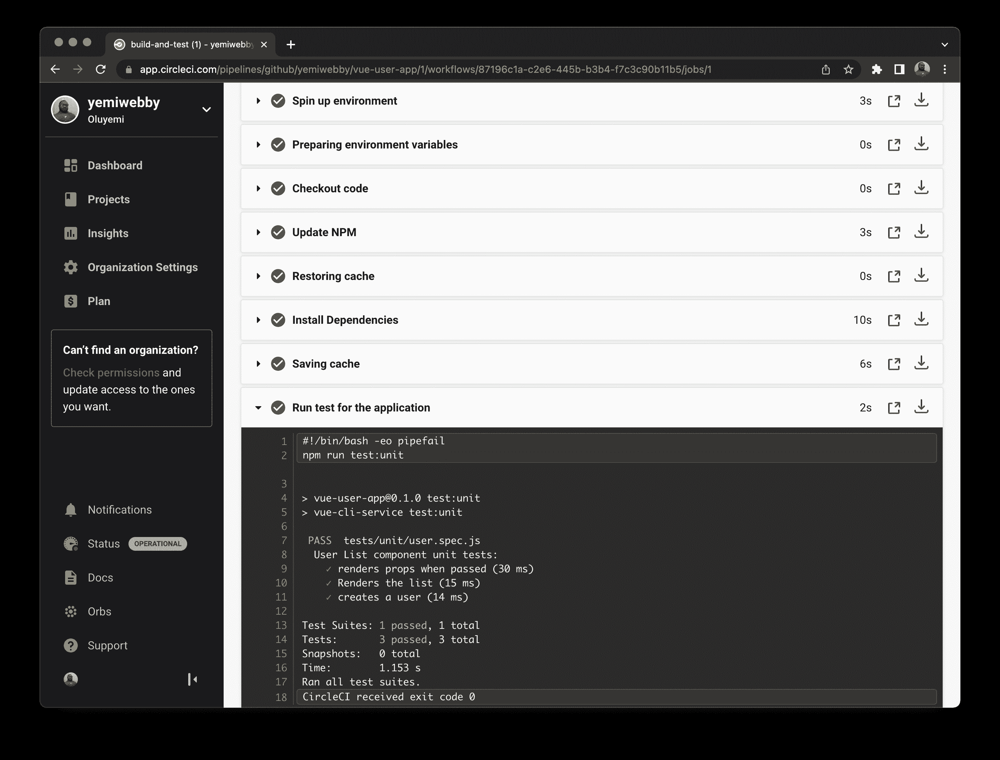

# Vue.js 应用程序| CircleCI 的自动化测试

> 原文：<https://circleci.com/blog/automate-testing-of-vue-apps/>

> 本教程涵盖:
> 
> 1.  创建和设置 Vue.js 应用程序
> 2.  为 Vue 组件编写自动化测试
> 3.  建立持续集成管道

作为 JavaScript 社区中领先的框架之一，Vue.js 是一个为 web 用户界面构建可重用组件的渐进式框架。其直观的 API 和处理前端逻辑的强大灵活性只是 Vue 被全球开发者采用的两个原因。

在本教程中，我将引导您构建一个简单的列表应用程序，显示用户的姓名和角色。我将向您展示如何为应用程序编写测试。最后，您将为自动化测试配置一个持续集成管道。

## 先决条件

对于本教程，您需要:

> 我们的教程是平台无关的，但是使用 CircleCI 作为例子。如果你没有 CircleCI 账号，请在 注册一个免费的 [**。**](https://circleci.com/signup/)

## 入门指南

您将使用 [Vue CLI](https://cli.vuejs.org/guide) 创建一个新的 Vue.js 项目。从终端运行以下命令:

```
vue create vue-user-app 
```

系统会提示您回答几个问题。对于本教程，请使用此处显示的答案:

*   请选择一个预置:**手动选择特性**
*   检查你的项目所需的特性: **Babel，Linter，Unit**
*   选择一个您想要用 **3.x** 启动项目的 Vue.js 版本
*   选择一个 linter / formatter 配置:**仅带有错误预防的 ESLint**
*   挑选附加皮棉特性:**皮棉保存时**
*   挑选一个单元测试解决方案: **Jest**
*   你更喜欢把 Babel，ESLint 等的配置放在哪里？？**在专用配置文件中**
*   将此存储为未来项目的预置？**否**

Vue CLI 将按照您的指定安装 Vue 应用程序及其依赖项。

转到新项目，使用以下命令运行它:

```
cd vue-user-app

npm run serve 
```

您可以在`http://localhost:8080`在浏览器中查看应用程序。



这将呈现新 Vue.js 应用程序的默认主页。在本教程的下一节中，您将通过创建新的可重用组件来改变这一点。

使用 **CTRL + C** 停止应用程序运行。

## 创建可重用组件

Vue.js 组件包含用于构建 web 应用程序的三个不同部分。它们是:

*   `<template></template>`
*   `<script></script>`
*   `<style></style>`

这些部分有助于为视图、业务逻辑和样式创建适当的结构。

### 创建用户组件

您将添加到应用程序的第一个组件是用于创建和列出用户。该组件包含一个带有输入字段的表单，用于接受特定用户的姓名。当提交表单时，来自输入字段的细节被推送到一个为测试目的而创建的虚拟`users`数组中。

首先，在`./src/components`文件夹中创建一个名为`UserList.vue`的新文件。打开此新文件并粘贴此内容:

```
<template>
  <div class="container">
    <div class="page-title">
      <h3>{{ message }}</h3>
    </div>
    <div class="row">
      <div
        class="col-md-4"
        v-for="user in users"
        :key="user.id"
        data-user="user"
      >
        <div class="m-portlet m-portlet--full-height">
          <div class="m-portlet__body">
            <div class="tab-content">
              <div class="tab-pane active" id="m_widget4_tab1_content">
                <div class="m-widget4 m-widget4--progress">
                  <div class="m-widget4__item">
                    <div class="m-widget4__img m-widget4__img--pic">
                      
                    </div>
                    <div class="m-widget4__info">
                      <span class="m-widget4__title"> {{ user.name }} </span>
                      <br />
                      <span class="m-widget4__sub">
                        {{ user.title }}
                      </span>
                    </div>
                    <div class="m-widget4__ext">
                      <button
                        @click="deleteUser(user)"
                        class="btn btn-primary"
                        data-cy="taskDelete"
                        id="deleteForm"
                      >
                        Delete
                      </button>
                    </div>
                  </div>
                </div>
              </div>
            </div>
          </div>
        </div>
      </div>
    </div>
    <div class="row">
      <form id="form" @submit.prevent="createUser">
        <input id="new-user" v-model="newUser" class="form-control" />
      </form>
    </div>
  </div>
</template> 
```

这是将用户列表呈现给视图的`<template></template>`部分。它还包含一个输入字段来发布新用户的名字。

接下来，将这段代码粘贴在`</template>`标签的后面:

```
<script>
export default {
  props: ["message"],
  data() {
    return {
      newUser: "",
      users: [
        {
          id: 1,
          name: "Anna Strong",
          title: "Software Engineer",
        },
        {
          id: 2,
          name: "John Doe",
          title: "Technical Writer",
        },
      ],
    };
  },
  methods: {
    createUser() {
      this.users.push({
        id: 3,
        name: this.newUser,
        title: "Crypto Expert",
      });
      this.newUser = "";
    },

    deleteUser(user) {
      const newList = this.users.filter((u) => user.id !== u.id);
      this.users = newList;
    },
  },
};
</script> 
```

这定义了一个`users`数组，其中包含要在页面上呈现的虚拟数据。`createUser()`方法通过输入字段接收新用户的详细信息，并将其推送到`users`数组。您还定义了一个名为`deleteUser()`的方法，它接受一个`user`对象作为参数，并在调用时将其从用户列表中移除。

### 创建标题组件

要为视图的标题部分创建一个组件，请转到`./src/components`文件夹并创建一个名为`NavBar.vue`的新文件。将以下代码粘贴到其中:

```
<template>
  <nav class="navbar navbar-expand-lg navbar-dark bg-dark">
    <div
      class="collapse navbar-collapse justify-content-md-center"
      id="navbarsExample08"
    >
      <ul class="navbar-nav">
        <li class="nav-item active">
          <a class="nav-link" href="#">
            Users Listing App <span class="sr-only">(current)</span></a
          >
        </li>
      </ul>
    </div>
  </nav>
</template> 
```

## 更新应用程序组件

打开应用程序的`AppComponent`，并通过包含到`NavBar`和`UserList`组件的链接来更新它。将其内容替换为:

```
<template>
  <div>
    <NavBar />
    <UserList />
    <div class="container"></div>
  </div>
</template>

<script>
import NavBar from "./components/NavBar.vue";
import UserList from "./components/UserList.vue";

export default {
  name: "App",
  components: { NavBar, UserList },
};
</script>

<style>
body {
  background: #eee;
}
#app {
  font-family: Avenir, Helvetica, Arial, sans-serif;
  -webkit-font-smoothing: antialiased;
  -moz-osx-font-smoothing: grayscale;
  text-align: center;
  color: #2c3e50;
}
.page-title {
  margin: 15px 15px;
}
.m-portlet {
  margin-bottom: 2.2rem;
}
.m-portlet {
  -webkit-box-shadow: 0 1px 15px 1px rgba(113, 106, 202, 0.08);
  -moz-box-shadow: 0 1px 15px 1px rgba(113, 106, 202, 0.08);
  box-shadow: 0 1px 15px 1px rgba(113, 106, 202, 0.08);
  background-color: #fff;
}
.m-portlet .m-portlet__head {
  border-bottom: 1px solid #ebedf2;
}
.m-widget4 .m-widget4__item {
  display: table;
  padding-top: 1.15rem;
  padding-bottom: 1.25rem;
}
.m-widget4 .m-widget4__item .m-widget4__img {
  display: table-cell;
  vertical-align: middle;
}
.m-widget4 .m-widget4__item .m-widget4__img.m-widget4__img--logo img {
  width: 3.5rem;
  border-radius: 50%;
}
.m-widget4 .m-widget4__item .m-widget4__img.m-widget4__img--pic img {
  width: 4rem;
  border-radius: 50%;
}
.m-widget4 .m-widget4__item .m-widget4__img.m-widget4__img--icon img {
  width: 2.1rem;
}
.m-widget4 .m-widget4__item .m-widget4__info {
  display: table-cell;
  width: 100%;
  padding-left: 1.2rem;
  padding-right: 1.2rem;
  font-size: 1rem;
  vertical-align: middle;
}
.m-widget4 .m-widget4__item .m-widget4__info .m-widget4__title {
  font-size: 1rem;
  font-weight: bold;
}
.m-widget4.m-widget4--progress .m-widget4__info {
  width: 50%;
}
</style> 
```

这包括一个`<style></style>`部分，包括应用程序的样式。

## 包括引导

打开公共文件夹中的`index.html`文件，并包含用于引导的 CDN 文件。这只是给页面一些默认的样式。

```
<!DOCTYPE html>
<html lang="">
  <head>
    <meta charset="utf-8" />
    <meta http-equiv="X-UA-Compatible" content="IE=edge" />
    <meta name="viewport" content="width=device-width,initial-scale=1.0" />
    <link rel="icon" href="<%= BASE_URL %>favicon.ico" />
    <link
      rel="stylesheet"
      href="https://cdn.jsdelivr.net/npm/bootstrap@4.6.1/dist/css/bootstrap.min.css"
      integrity="sha384-zCbKRCUGaJDkqS1kPbPd7TveP5iyJE0EjAuZQTgFLD2ylzuqKfdKlfG/eSrtxUkn"
      crossorigin="anonymous"
    />
    <title><%= htmlWebpackPlugin.options.title %></title>
  </head>
  <body>
    <noscript>
      <strong
        >We're sorry but <%= htmlWebpackPlugin.options.title %> doesn't work
        properly without JavaScript enabled. Please enable it to
        continue.</strong
      >
    </noscript>
    <div id="app"></div>
    <!-- built files will be auto injected -->
  </body>
</html> 
```

现在，用`npm run serve`再次运行应用程序。拜访`https://localhost:8080`。

现在您的应用程序已经启动并运行，您可以开始对`UserList`组件进行单元测试了。

## Vue.js 组件的单元测试

JavaScript 应用程序的测试框架有很多很多。Jest 是最受欢迎的笑话之一。对于 Vue.js， [Vue Test Utils (VTU)](https://test-utils.vuejs.org/guide/) 是首选的测试库。这是有道理的，因为 VTU 测试库是建立在 Jest 之上的。它旨在通过提供实用函数来简化 Vue.js 组件的测试。

当您创建这个项目并选择 Jest 作为单元测试解决方案时，Vue CLI 安装了`vue-test-utils`、`jest`和其他测试库。还创建了以下目录:

*   这个目录将包含所有的单元测试。一旦发出测试命令，Jest 将在这里搜索您的单元测试文件。

## 为应用程序编写测试

在这一节中，我们将为`UserList`组件编写单元测试。在该组件中，我们希望:

*   挂载组件并检查它是否可以渲染传递给它的道具。
*   在组件中查找元素并呈现用户列表。
*   提交一个表单，然后创建一个新用户并将其添加到现有用户列表中。

首先，转到`test/unit`文件夹，将`example.spec.js`文件重命名为`user.spec.js`。打开文件并用以下内容替换其内容:

```
import { mount } from "@vue/test-utils";
import UserList from "@/components/UserList.vue";

describe("User List component unit tests: ", () => {
  it("renders props when passed", () => {
    const message = "new message";
    const wrapper = mount(UserList, {
      props: { message },
    });
    expect(wrapper.text()).toMatch(message);
  });

  test("Renders the list", () => {
    const wrapper = mount(UserList);
    const name = "Anna Strong";
    const user = wrapper.get('[data-user="user"]');
    expect(user.text()).toContain(name);
    expect(wrapper.findAll('[data-user="user"]')).toHaveLength(2);
  });

  test("creates a user", async () => {
    const wrapper = mount(UserList);
    const newName = "John Doe";
    await wrapper.get('[id="new-user"]').setValue(newName);
    await wrapper.get('[id="form"]').trigger("submit");
    expect(wrapper.findAll('[data-user="user"]')).toHaveLength(3);
  });
}); 
```

在这个文件中，我们从`vue-test-utils`库中导入了一个名为`mount`的函数来帮助我们挂载`UserList`组件的一个实例。

我们首先编写一个测试来断言组件可以呈现从父组件传入的道具。接下来，我们将数据属性定位在`UserList`组件的视图中，确保它包含一个用户的特定名称，并呈现来自`users`数组的默认长度。

最后，我们创建了一个测试函数来确保可以在组件中创建新用户。

## 在本地运行测试

要确认定义的测试是否通过，请从终端输入以下命令:

```
npm run test:unit 
```

这是终端输出:

```
> vue-user-app@0.1.0 test:unit
> vue-cli-service test:unit

 PASS  tests/unit/user.spec.js
  User List component unit tests:
    ✓ renders props when passed (33 ms)
    ✓ Renders the list (19 ms)
    ✓ creates a user (27 ms)

Test Suites: 1 passed, 1 total
Tests:       3 passed, 3 total
Snapshots:   0 total
Time:        0.924 s, estimated 1 s
Ran all test suites. 
```



在下一节中，您将使用 CircleCI 自动化这个测试。

## 自动化测试

在本节中，您将为项目的持续集成管道创建一个配置文件。

在项目的根目录下创建一个`.circleci`文件夹，并在其中创建一个名为`config.yml`的新文件。添加此内容:

```
version: 2.1
jobs:
  build-and-test:
    working_directory: ~/project
    docker:
      - image: cimg/node:17.4.0
    steps:
      - checkout
      - run:
          name: Update NPM
          command: "sudo npm install -g npm"
      - restore_cache:
          key: dependency-cache-{{ checksum "package-lock.json" }}
      - run:
          name: Install Dependencies
          command: npm install --legacy-peer-deps
      - save_cache:
          key: dependency-cache-{{ checksum "package-lock.json" }}
          paths:
            - ./node_modules
      - run:
          name: Run test for the application
          command: npm run test:unit
workflows:
  build-and-test:
    jobs:
      - build-and-test 
```

该文件定义了为项目构建和运行测试命令的作业。这份工作:

*   从 CircleCI Docker 映像注册表中获取`cimg/node:17.4.0` Docker 映像
*   使用映像安装项目的所有依赖项
*   运行测试

现在配置文件已经设置好了，您需要在 GitHub 上设置一个存储库，并将项目链接到 CircleCI。查看[将您的项目推至 GitHub](https://circleci.com/blog/pushing-a-project-to-github/) 以获得逐步说明。

## 在 CircleCI 建立项目

使用链接的 GitHub 帐户登录到您的 CircleCI 帐户，在项目的仪表板上查看您的所有存储库。搜索`vue-user-app`项目，点击**设置项目**继续。



系统将提示您选择一个配置文件。在 repo 中选择`.circleci/config.yml`文件，并输入存储代码的分支的名称。点击**设置项目**启动工作流程。



这将初始化工作流并为您的项目运行测试。



## 结论

在本教程中，我们用 Vue.js 构建了一个列表应用程序，并介绍了为其组件编写单元测试所需的步骤。然后，我们使用 CircleCI 基础设施来配置一个持续集成管道，以自动化测试。

我希望本教程对你有所帮助。[点击 GitHub](https://github.com/yemiwebby/vue-user-app) 查看本指南中项目的完整源代码。

* * *

Oluyemi 是一名拥有电信工程背景的技术爱好者。出于对解决用户日常遇到的问题的浓厚兴趣，他冒险进入编程领域，并从那时起将他的问题解决技能用于构建 web 和移动软件。Oluyemi 是一名热衷于分享知识的全栈软件工程师，他在世界各地的几个博客上发表了大量技术文章和博客文章。作为技术专家，他的爱好包括尝试新的编程语言和框架。

[阅读更多 Olususi Oluyemi 的帖子](/blog/author/olususi-oluyemi/)