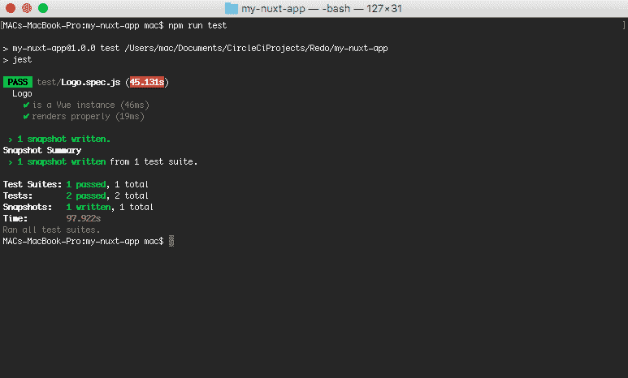

# 自动化您的 Nuxt.js 应用部署| CircleCI

> 原文：<https://circleci.com/blog/automate-your-nuxt-js-app-deployment/>

DevOps 实践包括[持续集成](https://circleci.com/continuous-integration/)和持续部署，是现代软件开发的重要组成部分。 [Vue.js](https://vuejs.org/) 用 [Nuxt.js](https://nuxtjs.org/) 构建服务器端渲染应用的开发者应该利用这些现代流程来部署他们的应用。本文将向使用 Nuxt.js 的 Vue.js 开发人员展示如何使用 CircleCI 构建、测试和部署他们的应用程序到 GitHub 页面。

## 先决条件

要跟进这篇文章，你需要一些东西:

## 创建一个 Nuxt.js 项目并将其连接到 GitHub

第一个任务是创建一个新的 Nuxt.js 应用程序，并将其连接到您的 GitHub 帐户。继续，通过运行以下命令创建一个新的 Nuxt.js 应用程序:

```
npx create-nuxt-app my-nuxt-app 
```

接受默认的项目名称和项目描述。然后，交互式项目创建过程继续询问以下问题。选择与本文相应的答案:

*   使用自定义服务器框架？(答案:**无**)
*   选择要安装的功能？(回答:点击**回车**跳过全部)
*   使用自定义 UI 框架？(答案:**无**)
*   使用测试框架？(回答: **Jest** )
*   选择渲染模式？(答案:**万能**)
*   作者？(回答:点击**回车**选择默认)
*   选择一个包管理器？(答案: **npm** )
*   选择 Nuxt.js 模块？(回答:点击**回车**跳过全部)
*   选择林挺工具？(回答:点击**回车**跳过全部)
*   选择开发工具？(回答:点击**回车**跳过全部)

**注意:** *您的 CLI 显示问题的方式可能不同，但目的是一样的。你会发现把问题和上面的答案匹配起来很容易。*

选择完所有这些参数后，`create-nuxt-app`开始搭建新的 Nuxt.js 应用程序。一旦搭建完成，下一步就是将应用程序连接到 GitHub 存储库。转到您的 GitHub 帐户并创建一个新的存储库。为了便于理解本教程，将 repo 命名为与项目相同的名称，即`my-nuxt-app`。现在，将项目连接到您刚刚创建的 GitHub repo。转到 Nuxt.js 项目的根目录，运行以下命令进行初始提交:

```
git add .
git commit -m “First Commit” 
```

然后通过运行以下命令将项目连接到 repo:

```
git remote add origin https://github.com/coderonfleek/my-nuxt-app.git
git push -u origin master 
```

**注意:** *上述存储库的 GitHub URL 将与您的不同，请用您的 URL 替换它，以便在本地和远程主分支机构之间进行首次推送和设置跟踪。*

就这样，您现在已经将您的项目连接到您的 GitHub repo 了。

## 添加测试

根据您对 Jest 作为测试框架的选择，`create-nuxt-app`设置测试应用程序所需的一切(根据所需的包和默认测试配置，这些都可以在`jest.config.js`文件中找到)。测试可以在应用程序根目录下的`test`文件夹中找到。在`test`文件夹中，我们看到了一个`Logo.spec.js`测试文件，它包含了一个对 Logo 组件的简单测试，简单地检查该组件是否是一个 Vue 实例。我们将添加另一个测试来检查组件是否正确呈现。继续用下面的代码替换`Logo.spec.js`中的代码:

```
import { mount, shallowMount } from "@vue/test-utils";
import Logo from "@/components/Logo.vue";

const factory = () => {
  return shallowMount(Logo, {});
};

describe("Logo", () => {
  test("is a Vue instance", () => {
    const wrapper = mount(Logo);
    expect(wrapper.isVueInstance()).toBeTruthy();
  });

  test("renders properly", () => {
    const wrapper = factory();
    expect(wrapper.html()).toMatchSnapshot();
  });
}); 
```

现在，保存该文件，并通过运行以下命令进行测试:

```
npm run test 
```

这将显示一个类似于下图的屏幕:



## 设置构建脚本

为了将服务器端呈现的 Nuxt.js 应用程序部署到 GitHub Pages 之类的静态托管服务，我们需要运行`nuxt generate`命令，该命令在我们的项目根目录下生成一个`dist`文件夹，其中包含我们的应用程序的生产版本。这个生成的版本只包含静态文件，这使得它适合静态主机。

现在，关于部署到 GitHub 页面的应用程序，需要认识的一点是，它们的基本 URL 是该应用程序的存储库的名称。例如，GitHub 页面上的`my-nuxt-app`项目的结果主页应该是 https://[YOUR _ GitHub _ USERNAME]. GitHub . io/my-nuxt-app。

因此，我们需要找到一种方法来指示我们的 Nuxt.js 应用程序在部署到 GitHub 页面时使用适当的路由器库生成发行版。如果不这样做，我们所有的路线都会失败。

我们需要做的第一件事是编写一个专门针对 GitHub 页面部署的`nuxt generate`脚本。将下面一行作为额外的脚本添加到您的`package.json`文件的`scripts`部分。

```
 scripts : {
    ...
    "generate:gh-pages": "DEPLOY_ENV=GH_PAGES nuxt generate --fail-on-page-error"
} 
```

`generate:gh-pages`脚本将`DEPLOY_ENV`环境变量(我们将在后面引用)设置为`GH_PAGES`(我们将为 GitHub 页面使用的标识)，并且还包含了`fail-on-page-error`标志，确保如果出现页面错误，构建会失败。

接下来，我们进入`nuxt.config.js`配置文件并设置我们的路由器基础。就在`module.exports`行之前，添加以下内容:

```
const routerBase =
  process.env.DEPLOY_ENV === "GH_PAGES"
    ? {
        router: {
          base: "/my-nuxt-app/"
        }
      }
    : {}; 
```

在这里，我们创建一个`routerBase`对象，如果我们部署到 GitHub 页面，它根据变量`DEPLOY_ENV`的值被设置为一个以 GitHub 页面为目标的路由器基本对象，否则，默认为一个空对象。这将确保为我们的项目适当地设置路由器基础。如果你使用不同的 slug，确保将`my-nuxt-app`值改为你的回购价。

为了完成我们的配置，在`nuxt.config.js`文件中的导出对象内添加以下行:

```
 ...
  module.exports =  {

    ...routerBase,

	/* Other parts of module.exports*/
} 
```

这将把`routerBase`对象扩展到配置中。

**注意:** *您的`nuxt.config.js`文件可能包含不同的导出格式，格式为:*

```
 export default {
	...
} 
```

*这完全有效，`routerBase`将包含在导出的对象中，因为它包含在上面的`module.exports`格式中。*

## 编写 CircleCI 部署脚本

现在来看主要的操作，我们可以设置部署脚本来部署到 GitHub 页面。

这是我们希望我们的脚本实现的目标:

*   安装必要的软件包
*   运行测试
*   构建项目
*   部署到 GitHub 页面

首先，让我们创建我们的 [CircleCI 配置](https://circleci.com/docs/configuration-reference/)文件。进入项目的根目录，创建一个名为`.circleci`的文件夹，并在该文件夹中添加一个名为`config.yml`的文件。

### 安装必要的软件包

文件夹`node_modules`没有被推送到项目仓库，所以我们需要为 CircleCI 构建安装必要的包。在`config.yml`文件中，输入以下配置:

```
version: 2.1
jobs:
  build:
    working_directory: ~/repo
    docker:
      - image: circleci/node:10.16.3
    steps:
      - checkout
      - run:
          name: update-npm
          command: "sudo npm install -g npm@5"
      - restore_cache:
          key: dependency-cache-{{ checksum "package-lock.json" }}
      - run:
          name: install-packages
          command: npm install
      - save_cache:
          key: dependency-cache-{{ checksum "package-lock.json" }}
          paths:
            - ./node_modules 
```

在上面的配置中，我们创建了一个使用来自 [CircleCI 注册表](https://hub.docker.com/search?q=circleci&type=image)的[节点 Docker 映像](https://circleci.com/docs/circleci-images/)的`build`作业。然后我们检查我们的代码并更新 npm。接下来，我们通过运行`npm install`命令安装我们的依赖项，并使用`save_cache`步骤创建我们的`node_modules`文件夹的缓存。我们还添加了一个`restore_cache`步骤来恢复我们的缓存资产，以便在上次运行中保存缓存后使用。

### 运行测试

接下来要添加到配置中的是运行测试的步骤。我们通过添加另一个`run`步骤来实现，如下所示:

```
 ...
      - run:
          name: test
          command: npm run test 
```

这一步运行我们之前在本地运行的`npm run test`命令，以使用 Jest 运行我们的测试。

### 构建项目

我们现在继续，通过运行`nuxt generate`命令和如下所示的另一个步骤来构建我们的项目:

```
 ...
      - run:
          name: build-project
          command: npm run generate:gh-pages 
```

**注意:** *这一步特别调用了`generate:gh-pages`脚本，该脚本是为部署到 GitHub 页面而设计的。*

### 部署到 GitHub 页面

现在，我们的最终任务是部署到 GitHub 页面。为了保持整洁，我们希望让我们的部署分支远离`master`分支。该部署分支将作为孤立分支维护，仅用于部署到 GitHub 页面。这可能是一个非常繁琐的过程，但幸运的是，我们有一个名为 [gh-pages](https://www.npmjs.com/package/gh-pages) 的 Node.js 包可以帮助我们实现这一点。这个包将帮助我们将文件推送到回购协议上的一个特殊的`gh-pages`分支，然后部署到 GitHub 页面。

将以下部署步骤添加到您的`config.yml`文件中:

```
 - run:
          name: Install and configure dependencies
          command: |
            npm install gh-pages --save-dev
            git config user.email "fikfikky@gmail.com"
            git config user.name "coderonfleek"
      - run:
          name: Deploy docs to gh-pages branch
          command: './node_modules/.bin/gh-pages --dotfiles --message "[skip ci] Updates" -d dist'
      - store_artifacts:
          path: test-results.xml
          prefix: tests
      - store_test_results:
          path: test-results.xml 
```

在上面的第一步中，我们安装了`gh-pages`包，并在我们的容器中为 GitHub 设置了`git`配置。请确保将`user.email`和`user.name`的值更改为您的 GitHub 帐户详细信息。

在下一步中，我们使用本地安装的`gh-pages`包将前面构建步骤中生成的`dist`文件夹中的所有内容发布到我们的`gh-pages`分支。

注意，我们在`gh-pages`命令中添加了一些参数。我们提供了一个包含`[skip ci]`的特殊提交消息(通过–message 传递)。这指示 CircleCI 在我们将这些内容推送到`gh-pages`分支时不要启动新的构建。我们还添加了`--dotfiles`，这样`gh-pages`命令将会忽略所有的点文件。

完整的配置文件如下所示:

```
version: 2.1
jobs:
  build:
    working_directory: ~/repo
    docker:
      - image: circleci/node:10.16.3
    steps:
      - checkout
      - run:
          name: update-npm
          command: "sudo npm install -g npm@5"
      - restore_cache:
          key: dependency-cache-{{ checksum "package-lock.json" }}
      - run:
          name: install-packages
          command: npm install
      - save_cache:
          key: dependency-cache-{{ checksum "package-lock.json" }}
          paths:
            - ./node_modules
      - run:
          name: test
          command: npm run test
      - run:
          name: build-project
          command: npm run generate:gh-pages
      - run:
          name: Install and configure dependencies
          command: |
            npm install gh-pages --save-dev
            git config user.email "fikfikky@gmail.com"
            git config user.name "coderonfleek"
      - run:
          name: Deploy docs to gh-pages branch
          command: './node_modules/.bin/gh-pages --dotfiles --message "[skip ci] Updates" -d dist'
      - store_artifacts:
          path: test-results.xml
          prefix: tests
      - store_test_results:
          path: test-results.xml 
```

提交您的更改并将它们推送到主分支。

## 我们的第一次部署

现在，让我们对部署进行一次测试。

首先，我们需要将我们的项目连接到 CircleCI。因此，请转到您的 [CircleCI 仪表板](https://circleci.com/dashboard)，在**添加项目**部分添加项目。在你的项目旁边，点击**设置项目**。

这将带您进入一个类似于下图的页面:


点击**开始构建**开始构建您的项目。

CircleCI 将运行您的配置来构建、测试和部署您的项目。

你应该已经注意到构建失败了！

为什么会这样？如果您单击 process 选项卡并检查构建过程的每一步，您会注意到部署在`gh-pages`将我们的文件推送到部署分支的时候失败了。

好吧，我坦白。我知道它会失败。我很抱歉。:)

失败的原因是我们与 GitHub 的连接，需要推送我们的文件，没有被认证。

要建立到 GitHub 的认证连接，我们需要一个私有/公共 SSH 密钥对形式的部署密钥，它保存在我们的 GitHub 帐户中，并被授予写访问权限。

### 设置 GitHub 的认证

要在本地机器上创建 SSH 密钥对，只需运行以下命令:

```
ssh-keygen -t rsa -b 4096 -C “YOUR_GITHUB_EMAIL” 
```

确保将`YOUR_GITHUB_EMAIL`替换为您 GitHub 帐户的电子邮件地址。

选择一个像`my_deploy_key`这样的目的地名称，并接受默认的无密码，在提示符下点击**输入**。

这应该会在选定的目的地自动为您生成一个名为`my_deploy_key`(私钥)和`my_deploy_key.pub`(公钥)的公钥/私钥对。

私钥保存在 CircleCI 中。进入你的 CircleCI Pipelines 页面，点击带有 cog 图标的按钮进入设置页面。


在设置页面的侧菜单上，向下滚动并点击 **SSH 权限**:


然后点击**添加 SSH 密钥**添加新密钥:


在主机名字段中，只需输入“github.com”并将您的私钥内容粘贴到私钥字段中，然后单击**添加 SSH 密钥**来添加密钥。

在文档的[中了解更多关于添加您的私钥到 CircleCI 的信息。](https://circleci.com/docs/add-ssh-key/)

添加后，您将看到新添加的密钥的指纹。CircleCI 在其脚本中使用指纹来识别私钥，因为这比公开实际的私钥更安全。

我们还需要确保“高级设置”页面上的“将秘密传递给来自分叉拉取请求的构建”选项被设置为关闭。在我们的项目设置页面的侧边菜单上可以找到**高级设置**链接。

为了完成我们的安全检查，请确保从本地系统中删除私钥。

接下来我们需要做的是将我们的公钥提交到我们的 GitHub 帐户。为此，请转到 GitHub 项目 repo 的“设置”选项卡。然后点击侧面菜单上的**部署键**。在部署密钥页面，点击**添加部署密钥**，出现如下表单。


在 Title 字段中，为它取一个方便的名称，例如“My CircleCI Deployment Key”。在密钥字段中，粘贴您的公钥(`my_deploy_key.pub`)的内容，并选中**允许写访问**复选框。然后点击**添加键**。

GitHub 可能会要求您确认您的密码，确认后您会看到您的密钥显示在部署密钥列表中。

我们需要做的最后一件事是将来自 CircleCI 的私钥的指纹添加到我们的配置文件中。我们的部署步骤现在如下所示:

```
 - run:
          name: Install and configure dependencies
          command: |
            npm install gh-pages --save-dev
            git config user.email "fikfikky@gmail.com"
            git config user.name "coderonfleek"
      - add_ssh_keys:
          fingerprints:
            - "3a:9b:c5:67:6f:06:50:55:dd:67:c9:ed:0c:9e:1f:fa"
      - run:
          name: Deploy docs to gh-pages branch
          command: './node_modules/.bin/gh-pages --dotfiles --message "[skip ci] Updates" -d dist'
      - store_artifacts:
          path: test-results.xml
          prefix: tests
      - store_test_results:
          path: test-results.xml 
```

**注意:** *把这里用的指纹改成自己的指纹。*

整个配置文件现在应该如下所示:

```
version: 2.1
jobs:
  build:
    working_directory: ~/repo
    docker:
      - image: circleci/node:10.16.3
    steps:
      - checkout
      - run:
          name: update-npm
          command: "sudo npm install -g npm@5"
      - restore_cache:
          key: dependency-cache-{{ checksum "package-lock.json" }}
      - run:
          name: install-packages
          command: npm install
      - save_cache:
          key: dependency-cache-{{ checksum "package-lock.json" }}
          paths:
            - ./node_modules
      - run:
          name: test
          command: npm run test
      - run:
          name: build-project
          command: npm run generate:gh-pages
      - run:
          name: Install and configure dependencies
          command: |
            npm install gh-pages --save-dev
            git config user.email "fikfikky@gmail.com"
            git config user.name "coderonfleek"
      - add_ssh_keys:
          fingerprints:
            - "3a:9b:c5:67:6f:06:50:55:dd:67:c9:ed:0c:9e:1f:fa"
      - run:
          name: Deploy docs to gh-pages branch
          command: './node_modules/.bin/gh-pages --dotfiles --message "[skip ci] Updates" -d dist'
      - store_artifacts:
          path: test-results.xml
          prefix: tests
      - store_test_results:
          path: test-results.xml 
```

## 成功部署我们的 Nuxt.js 应用程序

现在，让我们提交我们的更改并再次推送到主分支来触发部署。

一旦你推，一个新的构建过程将被触发，这一次将会成功。

单击 deployment 选项卡并检查 test 部分。你会注意到我们所有的测试都运行良好。


要确认我们的应用程序已部署，请访问 URL https://[YOUR _ GITHUB _ USERNAME]. GITHUB . io/my-nuxt-app 并查看已部署的应用程序。您应该会看到默认的 Nuxt.js 索引页面，如下所示:


## 结论

在本文中，我们看到了如何使用持续集成和持续交付来成功地将 Nuxt.js 应用程序部署到 GitHub 页面。有了 CircleCI 详尽的配置选项列表，我们可以微调我们的配置，以满足我们的特定需求，并部署到其他托管服务。

我希望你在这个项目上和我一样开心。快乐编码:)

* * *

Fikayo Adepoju 是 LinkedIn Learning(Lynda.com)的作者、全栈开发人员、技术作者和技术内容创建者，精通 Web 和移动技术以及 DevOps，拥有 10 多年开发可扩展分布式应用程序的经验。他为 CircleCI、Twilio、Auth0 和 New Stack 博客撰写了 40 多篇文章，并且在他的个人媒体页面上，他喜欢与尽可能多的从中受益的开发人员分享他的知识。你也可以在 Udemy 上查看他的视频课程。

[阅读 Fikayo Adepoju 的更多帖子](/blog/author/fikayo-adepoju/)