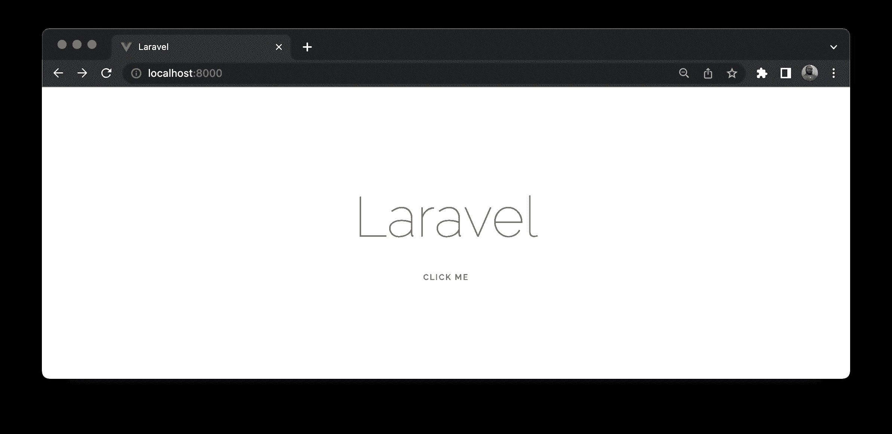
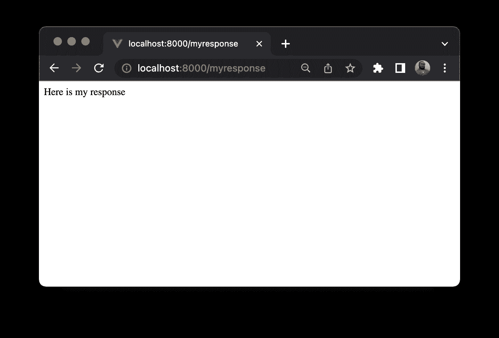
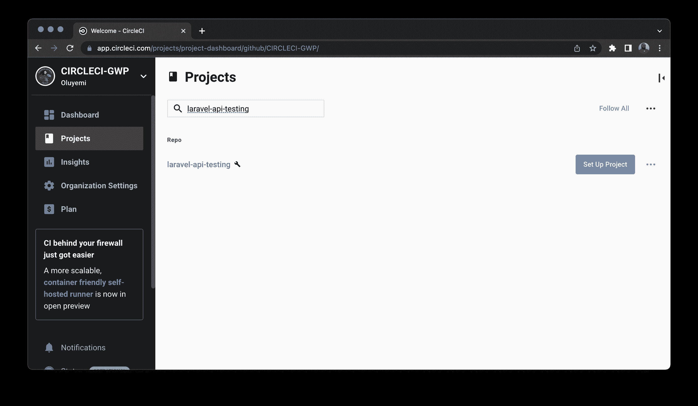
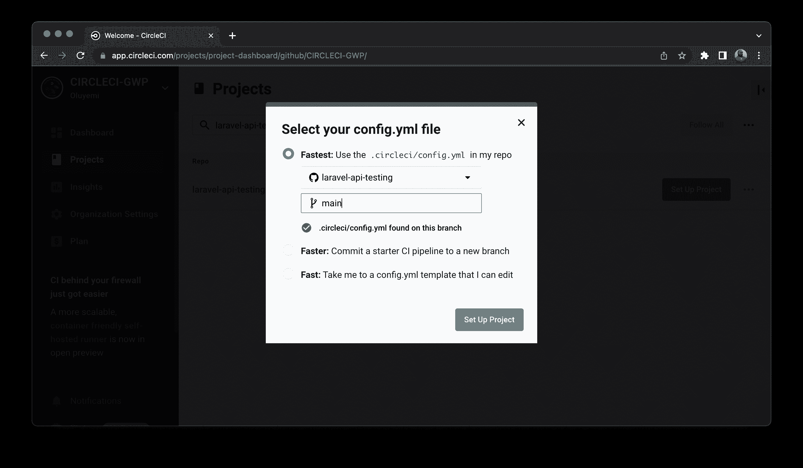
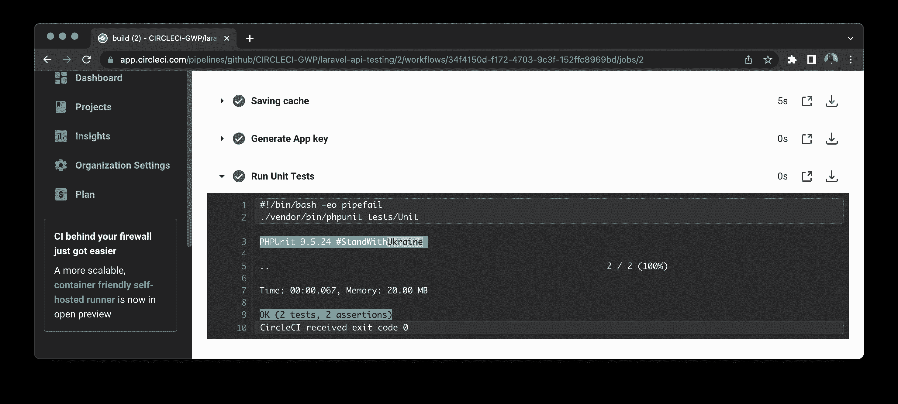
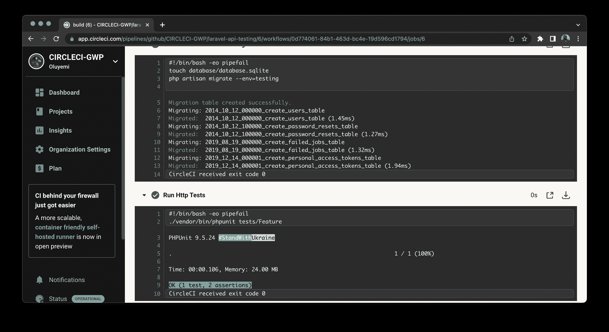
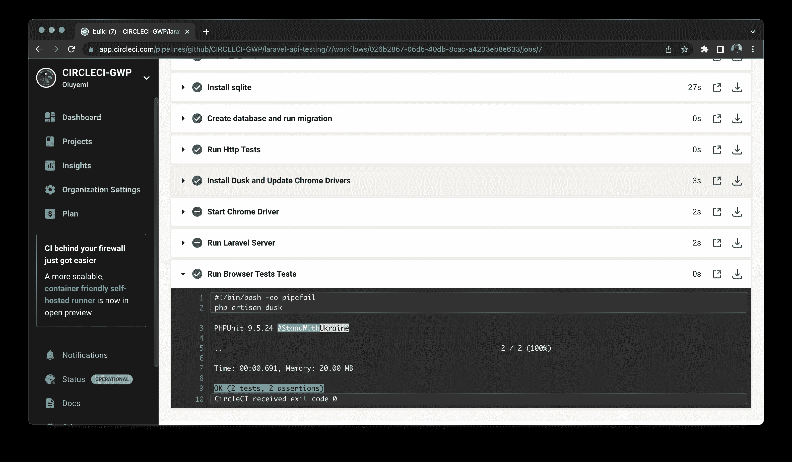

# 自动测试| circleci

> 原文：<https://circleci.com/blog/automatic-testing-for-laravel-projects/>

> 本教程涵盖:
> 
> 1.  克隆样本 Laravel 应用程序
> 2.  将 Laravel 测试添加到配置文件中
> 3.  自动化测试

Laravel 附带了一个强大的测试套件，允许开发人员在浏览器中执行单元测试、测试 API 端点和运行自动化功能测试。

在这篇文章中，我们将把 Laravel 框架中可用的测试过程添加到我们的 CircleCI 配置文件中，以便在每次推出新代码时自动执行这些测试。

## 先决条件

要跟进这篇文章，你需要做几件事:

*   [PHP](https://www.php.net/) > = 7.1 安装在你的系统上。您可以通过在终端上运行命令`php -v`来确认这一点。
*   [作曲](https://getcomposer.org/)全球安装。通过在终端上运行`composer`命令来确认这一点。
*   一个 [GitHub](https://github.com/) 账户。
*   一个 [CircleCI 账户](https://circleci.com/signup/)。

> 我们的教程是平台无关的，但是使用 CircleCI 作为例子。如果你没有 CircleCI 账号，请在 注册一个免费的 [**。**](https://circleci.com/signup/)

一旦你有了这些并开始运行，你就可以开始跟进了。

## 克隆示例项目

首先，克隆这个 Laravel 项目。它已经包含了一些我们将用 CircleCI 自动化的测试。

```
git clone https://github.com/yemiwebby/laravel-api-test 
```

一旦您克隆了项目，创建一个新的 GitHub 存储库，并将示例项目推送到其中。要熟悉您刚刚克隆的项目，请通过运行以下命令来安装项目的依赖项:

```
cd laravel-api-test

composer install 
```

接下来，在项目的根目录下创建一个名为`.env`的文件，并将`.env.example`的内容复制到其中(如果您使用的是 Linux，只需运行`cp .env.example .env`)。这个文件应该在你的`.gitignore`文件中被忽略(这已经在克隆项目的`.gitignore`中被忽略了)。

运行以下命令为 Laravel 项目生成应用程序密钥:

```
php artisan key:generate 
```

现在，通过运行以下命令在浏览器中运行项目:

```
php artisan serve 
```

通过访问 URL `http://127.0.0.1:8000`，在浏览器中进入项目主页。



这是一个简单的主页，类似于每个新的 Laravel 项目的默认页面。在这种情况下，页面包含一个链接，上面写着**点击我**。点击后，链接会将您重定向到`http://127.0.0.1:8000/myresponse`。

`/myresponse`路线显示**以下是我的回应**。



我们稍后将测试这种行为。

该项目还包含一个`.env.testing`环境文件，仅用于我们的测试用例。应用程序测试可以在`tests`文件夹中找到。

在`tests`文件夹中设置了三种类型的测试。一个单元测试文件在`Unit`文件夹(`ExampleUnitTest.php`)，另一个包含 HTTP 测试的文件在`Feature`文件夹(`ExampleHttpTest.php`)，最后一个浏览器测试文件在`Browser`文件夹(`ExampleBrowserTest.php`)。

在本文中，我们将通过将这些测试添加到我们的 CircleCI 配置中来实现自动化。

## 向 CircleCI 配置中添加单元测试

添加到 CircleCI 配置中的第一组测试是包含在`tests/Unit/ExampleUnitTest.php`文件中的单元测试。

这个文件包含两个测试用例:

```
public function testBasicTest()
{
    $this->assertTrue(true);
}

public function testUserCreation()
{
    $user = new User([
        'name' => "Test User",
        'email' => "test@mail.com",
        'password' => bcrypt("testpassword")
    ]);   

    $this->assertEquals('Test User', $user->name);
} 
```

默认情况下，任何 Laravel 项目都会进行第一次测试。它断言布尔值`true`。

第二个测试用`User`模型创建了一个新的用户实例。然后，它根据预期值检查新创建的用户实例的名称，以断言匹配。

您可以在每次推送到您的存储库时自动运行这个测试。

进入项目的根目录，创建一个名为`.circleci`的文件夹。在这个文件夹中，创建一个名为`config.yml`的文件。

下面是自动化单元测试需要做的事情:

1.  启动所需的环境
2.  使用 composer 安装依赖项
3.  缓存依赖关系
4.  为项目建立一个`.env`环境文件
5.  运行单元测试

将这段代码粘贴到 config.yml 文件中:

```
version: 2.1
orbs:
  browser-tools: circleci/browser-tools@1.1
jobs:
  build:
    docker:
      # Specify the version you desire here
      - image: cimg/php:7.4.14-browsers

    steps:
      - browser-tools/install-browser-tools    
      - checkout

      - run:
          name: "Prepare Environment"
          command: |
            sudo apt update
            sudo docker-php-ext-install zip

      - run:
          name: "Create Environment file"
          command: |
            mv .env.testing .env

      # Download and cache dependencies
      - restore_cache:
          keys:
            # "composer.lock" can be used if it is committed to the repo
            - v1-dependencies-{{ checksum "composer.json" }}
            # fallback to using the latest cache if no exact match is found
            - v1-dependencies-

      - run:
          name: "Install Dependencies"
          command: composer install -n --prefer-dist

      - save_cache:
          key: v1-dependencies-{{ checksum "composer.json" }}
          paths:
            - ./vendor

      - run:
          name: "Generate App key"
          command: php artisan key:generate

      # run tests with phpunit
      - run:
          name: "Run Unit Tests"
          command: ./vendor/bin/phpunit tests/Unit 
```

这个配置获取一个 PHP 映像，并将您的代码签出到环境中。环境文件从`.env.testing`开始创建。

```
jobs:
  build:
    docker:
      # Specify the version you desire here
      - image: circleci/php:7.4-node-browsers

    steps:
      - checkout

      - run:
          name: "Prepare Environment"
          command: |
            sudo apt update
            sudo docker-php-ext-install zip

      - run:
          name: "Create Environment file"
          command: |
            mv .env.testing .env 
```

`artisan`命令安装依赖项。现在您可以生成 Laravel 所需的应用程序密钥。

```
 # Download and cache dependencies
      - restore_cache:
          keys:
            # "composer.lock" can be used if it is committed to the repo
            - v1-dependencies-{{ checksum "composer.json" }}
            # fallback to using the latest cache if no exact match is found
            - v1-dependencies-

      - run:
          name: "Install Dependencies"
          command: composer install -n --prefer-dist

      - save_cache:
          key: v1-dependencies-{{ checksum "composer.json" }}
          paths:
            - ./vendor

      - run:
          name: "Generate App key"
          command: php artisan key:generate 
```

准备好所有需要的资产后，运行`tests/Unit`文件夹中的单元测试。

```
 # run tests with phpunit
      - run:
          name: "Run Unit Tests"
          command: ./vendor/bin/phpunit tests/Unit 
```

很好。

现在[将你的更新推送到你的 GitHub 库](https://circleci.com/blog/pushing-a-project-to-github/)。

## 将 API 项目连接到 CircleCI

你的下一个任务是在 CircleCI 建立项目。去你的 CircleCI 控制台。如果您已经注册了 GitHub 帐户，那么您的所有存储库都可以在项目的仪表板上看到。

接下来，找到你的`laravel-api-test`项目，点击**设置项目**。



系统将提示您编写新的配置文件，或者在项目中使用现有的配置文件。选择现有选项。在 GitHub 上输入您的代码所在的分支的名称，然后点击**设置项目**。



点击**开始建造**。



## 向 CircleCI 配置添加 http 测试

下一个要自动化的任务是 http 测试。该项目包含一个 API 路径，该路径包含在`routes/api.php`文件中。

```
Route::post('createuser', 'UserController@createUser'); 
```

**注意:** *别忘了加上导入`use App\Http\Controllers\UserController`*

这条路线映射到`UserController`控制器中的一个`createUser`方法。该方法在数据库中创建一个新用户，并返回一条成功消息:“成功创建用户”。它还返回状态代码:`201(Created)`。

已经为此端点编写了一个测试，以断言成功创建用户的状态代码和成功消息。该测试包含在文件`tests/Feature/ExampleHttpTest.php`中。

```
public function testUserCreationEndpointTest()
{
    $name = $this->faker->name();
    $email = $this->faker->email();
    $password = "mypassword";

    $response = $this->postJson('/api/createuser', [
        'name' => $name, 
        'email' => $email,
        'password' => $password,
        'password_confirmation' => $password
    ]); 

    $response
        ->assertStatus(201)
        ->assertExactJson([
            'message' => "Successfully created user!",
        ]);
} 
```

这个测试通过调用`createuser`端点来创建一个新的虚拟用户。然后，它检查响应代码和响应体，看它是否与预期的相匹配。

现在，您可以在 CircleCI 配置中自动化这个测试。以下是步骤:

1.  在数据库文件夹中创建一个名为`database.sqlite`的 sqlite 数据库。`.env.testing`使用 sqlite 数据库进行测试。`config/database.php`中的 sqlite 配置也默认使用这个数据库。
2.  运行迁移
3.  用 PHPUnit 运行 Http 测试

将这些步骤添加到 CircleCI 配置文件中:

```
 - run:
        name: "Install Sqlite"
        command: sudo apt-get install php7.4-sqlite3      

    - run:
        name: "Create database and run migration"
        command: |
          touch database/database.sqlite
          php artisan migrate --env=testing

    - run:
        name: "Run Http Tests"
        command: ./vendor/bin/phpunit tests/Feature 
```

这些命令安装 Sqlite，引用本教程的特定版本(7.4)，然后在`database`文件夹中创建数据库文件。然后，他们运行迁移，指定测试环境。

在第二步中，运行包含在`tests/Feature`文件夹中的 http 测试。

保存文件并将您的更改推送到您的存储库中。这应该会触发 CI/CD 管道，并且测试应该会成功运行。



## 向 CircleCI 配置添加浏览器测试

您将添加到配置中的最后一组测试是浏览器测试。

Laravel 使用 [laravel/dusk](https://laravel.com/docs/9.x/dusk) 包直接在浏览器中运行测试。默认情况下，laravel/dusk 使用谷歌 Chrome 和一个独立的 [ChromeDriver](https://sites.google.com/a/chromium.org/chromedriver/home) 安装来运行你的浏览器测试。如果您设置了自己的 Selenium 服务器，则可以使用其他浏览器。

Chrome 驱动已经和 laravel/dusk 包一起安装了，所以你不需要担心单独安装它。

默认情况下，当运行`dusk`命令启动浏览器测试时，laravel/dusk 会尝试启动 Chrome 驱动程序。对于本教程，我们需要手动启动驱动程序来完全控制这个过程。注释掉`tests/DuskTestCase.php`中自动启动 Chrome 浏览器的那一行:

```
public static function prepare()
{
    // static::startChromeDriver();
} 
```

这已经在克隆的项目中完成了，所以您不需要自己去做。

默认情况下，新的 Laravel 项目不会附带`DuskTestCase.php`文件和`tests/Browser`目录。您可以在安装 laravel/dusk 时通过运行以下命令来创建它们:

```
composer require --dev laravel/dusk
php artisan dusk:install 
```

关于 laravel/dusk 及其操作的更多细节可以在该包的 [Laravel 文档页面](https://laravel.com/docs/9.x/dusk)中找到。

我们已经知道我们的应用程序有一个主页，主页上有一个标记为 **Click Me** 的链接。当单击它时，它会重定向到一个显示字符串“这是我的响应”的路由。

在`tests/Browser`文件夹中的`ExampleBrowserTest.php`浏览器测试文件中，有一个测试断言了这个行为。它还会检查大 Laravel 标签是否能在你的主页上找到。

```
public function testBasicExample()
{
    $this->browse(function (Browser $browser) {
        $browser->visit('/')
                ->assertSee('Laravel');
    });
}

public function testLink()
{
    $this->browse(function (Browser $browser) {
        $browser->visit('/')
                ->clickLink('Click Me')->assertSee("Here is my response");
    });
} 
```

要运行您的浏览器测试，请将其添加到您的 CircleCI 配置中:

1.  安装 laravel/dusk 包。
2.  安装 staudenmeir/dusk-updater 软件包。这个包将你的 Chrome 驱动更新到 Docker 镜像上的 Chrome 浏览器版本。
3.  为您的映像启动 Chrome 驱动程序(在本例中是 Linux)。
4.  为应用服务。
5.  运行浏览器测试。

将这些步骤添加到 CircleCI 配置中:

```
 - run:
        name: "Install Dusk and Update Chrome Drivers"
        command: |
          composer require --dev laravel/dusk
          composer require --dev staudenmeir/dusk-updater
          php artisan dusk:update --detect

    - run:
        name: Start Chrome Driver
        command: ./vendor/laravel/dusk/bin/chromedriver-linux
        background: true

    - run:
        name: Run Laravel Server
        command: php artisan serve
        background: true

    - run:
        name: Run Browser Tests Tests
        command: php artisan dusk 
```

这个片段从安装 laravel/dusk 开始。然后安装 staudenmeir/dusk-updater 包，让你可以更新我们的 chrome 驱动程序。

接下来，它在后台启动 Chrome 驱动程序和 Laravel 应用服务器，确保它们在后台运行。`background: true`被添加到两个步骤中。

最后一步是使用`dusk`命令运行浏览器测试。

以下是完整的`config.yml`文件:

```
version: 2.1
orbs:
  browser-tools: circleci/browser-tools@1.1
jobs:
  build:
    docker:
      # Specify the version you desire here
      - image: cimg/php:7.4.14-browsers

    steps:
      - browser-tools/install-browser-tools    
      - checkout

      - run:
          name: "Create Environment file"
          command: |
            mv .env.testing .env

      # Download and cache dependencies
      - restore_cache:
          keys:
            # "composer.lock" can be used if it is committed to the repo
            - v1-dependencies-{{ checksum "composer.json" }}
            # fallback to using the latest cache if no exact match is found
            - v1-dependencies-

      - run:
          name: "Install Dependencies"
          command: composer install -n --prefer-dist

      - save_cache:
          key: v1-dependencies-{{ checksum "composer.json" }}
          paths:
            - ./vendor

      - run:
          name: "Generate App key"
          command: php artisan key:generate

      # run tests with phpunit
      - run:
          name: "Run Unit Tests"
          command: ./vendor/bin/phpunit tests/Unit

      - run:
          name: "Install sqlite"
          command: sudo apt-get install php7.4-sqlite3

      - run:
          name: "Create database and run migration"
          command: |
            touch database/database.sqlite
            php artisan migrate --env=testing

      - run:
          name: "Run Http Tests"
          command: ./vendor/bin/phpunit tests/Feature          

      - run:
          name: "Install Dusk and Update Chrome Drivers"
          command: |
            composer require --dev laravel/dusk
            composer require --dev staudenmeir/dusk-updater
            php artisan dusk:update --detect

      - run:
          name: Start Chrome Driver
          command: ./vendor/laravel/dusk/bin/chromedriver-linux
          background: true

      - run:
          name: Run Laravel Server
          command: php artisan serve
          background: true

      - run:
          name: Run Browser Tests Tests
          command: php artisan dusk 
```

准备好之后，将您的更改推送到存储库。测试将成功运行。



注意到**启动 Chrome 驱动**和**运行 Laravel 服务器**旁边的圆形图标是“灰色的”。这表明这些进程正在配置中指定的后台运行。

## 结论

在本文中，您了解了如何将不同类型的 Laravel 测试添加到您的 CircleCI 配置中，以及 CircleCI 如何使运行这些测试变得轻而易举。如果您的一些测试没有成功运行，请尝试再次浏览 post，看看您是否错过了任何步骤。我相信你能找到丢失的部分。完整的源代码可以在 GitHub 的[这里找到。](https://github.com/CIRCLECI-GWP/laravel-api-testing)

祝你度过一个没有 bug 的编码周。

* * *

* * *

Fikayo Adepoju 是 LinkedIn Learning(Lynda.com)的作者、全栈开发人员、技术作者和技术内容创建者，精通 Web 和移动技术以及 DevOps，拥有 10 多年开发可扩展分布式应用程序的经验。他为 CircleCI、Twilio、Auth0 和 New Stack 博客撰写了 40 多篇文章，并且在他的个人媒体页面上，他喜欢与尽可能多的从中受益的开发人员分享他的知识。你也可以在 Udemy 上查看他的视频课程。

[阅读 Fikayo Adepoju 的更多帖子](/blog/author/fikayo-adepoju/)