# Symfony 应用的自动测试| CircleCI

> 原文：<https://circleci.com/blog/automatic-testing-for-symfony-applications/>

必须实现新的 web 或移动应用程序功能是不可避免的，而且通常非常重要。这些新代码对构建无错误应用程序的可能性构成了威胁，如果不小心的话，可能会破坏已经实现的功能。构建更好、更可靠的应用程序的方法之一是使用单元测试和功能测试来测试您的代码。

测试是推荐的最佳实践，因为它可以确保新版本满足质量和性能目标。不管应用程序是用什么编程语言或框架构建的，测试驱动的开发方法都是相似的。

在本教程中，我们将创建一个新的 Symfony 应用程序项目来管理客户详细信息。虽然这不是一个具有完整 CRUD 功能的应用程序，但我们将创建两个方法和一个控制器，然后引入单元测试和功能测试，以确保每个函数都按照预期返回适当的响应。最重要的是，我们将通过利用 CircleCI 来自动化我们的测试。

## 先决条件

为了最大限度地利用这篇文章，请确保您:

## 入门指南

首先使用 Composer 创建一个新的 Symfony 应用程序，使用以下命令:

```
composer create-project symfony/website-skeleton new-symfony-app 
```

前面的命令将在运行该命令的根文件夹中创建一个名为`new-symfony-app`的新文件夹。它还将安装所有必需的依赖项。

接下来，进入新创建的项目，安装一个 web 服务器来运行应用程序:

```
// move into project
cd new-symfony-app

// installl web server
composer require symfony/web-server-bundle --dev ^4.4.2 
```

现在您已经建立了一个新项目，接下来在本地用 [Git](https://git-scm.com/) 初始化该项目，并将其与 GitHub 连接起来。但在此之前，请前往 [GitHub](https://github.com/) 并为您的项目创建一个资源库。

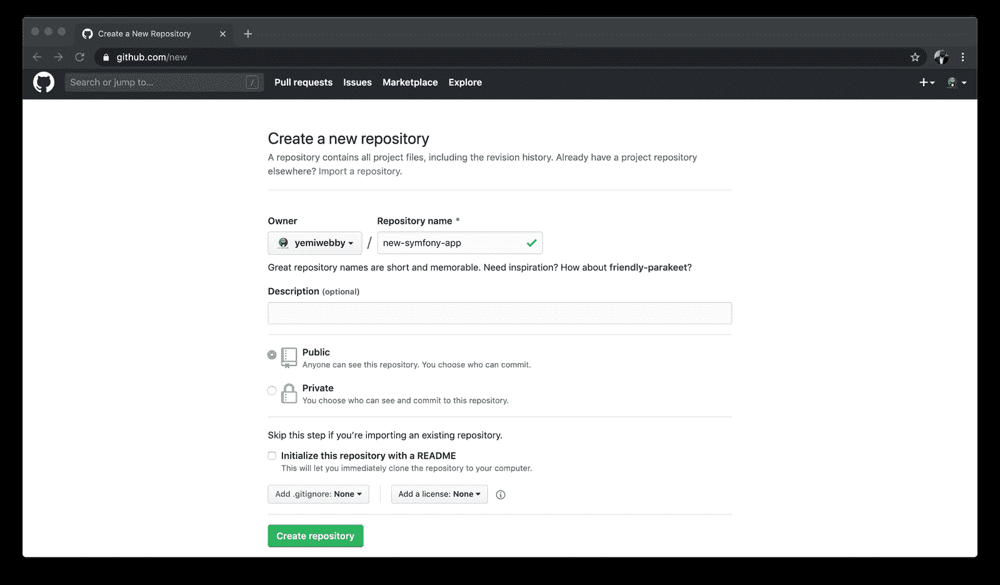

在 GitHub 上可以随意使用相同的项目名称。现在，在您的项目文件夹中本地初始化 Git，使用:

```
git init 
```

这将把项目设置为 Git 存储库。接下来，使用以下命令在本地提交您的更改:

```
git add .

git commit -m "Initial commit" 
```

在项目文件夹内的终端上使用`git remote add`命令注册远程存储库。该命令有两个参数:

*   远程名称，例如`origin`
*   远程 URL，例如`https://github.com/<your_username>/<your_repo>.git`

就我而言:

```
// add remote origin
git remote add origin https://github.com/yemiwebby/new-symfony-app.git 
```

接下来，使用以下命令将本地项目推送到在 GitHub 帐户上创建的主分支:

```
// push to the repo
git push -u origin master 
```

现在我们已经建立了一个新的 Symfony 项目，并将其推送到远程存储库，在下一节中，我们将为客户创建一个控制器和一个实体类。

## 创建控制器

控制器负责处理 HTTP 请求并返回适当的响应。要为该应用程序自动生成控制器，请通过运行以下命令使用 Symfony 附带的 [maker bundle](https://symfony.com/doc/current/bundles/SymfonyMakerBundle/index.html) :

```
php bin/console make:controller CustomerController 
```

这将为您创建两个新文件:

*   位于`src/Controller/CustomerController.php`的控制器
*   在`templates/customer/index.html.twig`中查看页面

打开`CustomerController.php`文件，将内容替换为:

```
<?php

namespace App\Controller;

use Symfony\Bundle\FrameworkBundle\Controller\AbstractController;
use Symfony\Component\Routing\Annotation\Route;

class CustomerController extends AbstractController
{
    /**
     * @Route("/", name="customer", methods={"GET"})
     */
    public function index()
    {
        $customerName  = "John Doe";
        return $this->render('customer/index.html.twig', [
            'name' => $customerName,
        ]);
    }
} 
```

Symfony 在为应用程序定义路由时，将路由注释作为最首选的选项。这里，我们定义了一条名为`customer`的路由`/`。这将指示 Symfony 将任何对主页的请求指向此处定义的方法。因此，当用户的请求到达这个路径时，`index()`将呈现一个视图，该视图将在上面的文件中包含一个硬编码的`$customerName`。

接下来，打开位于`templates/customer/index.html.twig`的视图文件，将内容替换为以下内容:

```

 Customer Page 

<div class="example-wrapper">
  <h1>Hello, Welcome to the customer page</h1>

  <h2>Customer name is : {{ name }}</h2>
</div>
 
```

我们更新了视图，以动态呈现代表客户默认姓名的`name`变量。您可以使用以下命令在本地运行该应用程序:

```
php bin/console server:run 
```

现在，导航到 [http://localhost:8000](http://localhost:8000) 查看主页。

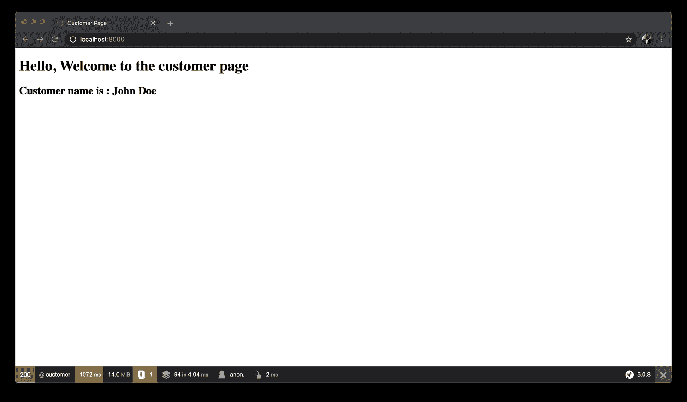

该页面在控制器中呈现硬编码的客户姓名，并将其传递给视图。这是一个类似于在 MVC 结构的应用程序视图中动态呈现内容的过程。我们稍后将为这种行为编写一个功能测试。

## 创建实体

这里，我们将创建一个模型来表示一个`Customer`对象。为此，运行以下命令:

```
php bin/console make:entity Customer 
```

系统会提示您向`src/Entity/Customer.php`文件添加一些字段。如果您愿意，可以手动执行此操作。否则，输入`firstName`和`lastName`作为`Customer`类的字段，Symfony MakerBundle 将处理其余部分。查看下图。

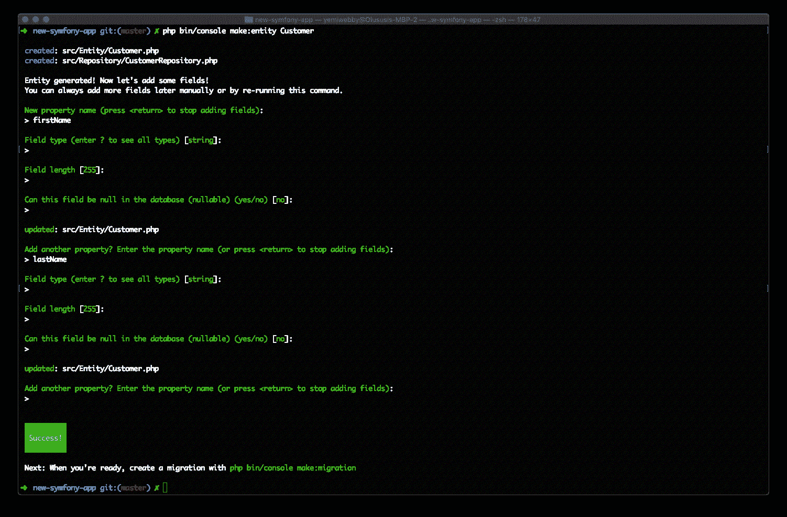

为了确认，下面是`Customer.php`文件的样子。更新您的以匹配此处显示的内容:

```
<?php

namespace App\Entity;

use App\Repository\CustomerRepository;
use Doctrine\ORM\Mapping as ORM;

/**
 * @ORM\Entity(repositoryClass=CustomerRepository::class)
 */
class Customer
{
    /**
     * @ORM\Id()
     * @ORM\GeneratedValue()
     * @ORM\Column(type="integer")
     */
    private $id;

    /**
     * @ORM\Column(type="string", length=255)
     */
    private $firstName;

    /**
     * @ORM\Column(type="string", length=255)
     */
    private $lastName;

    public function getId(): ?int
    {
        return $this->id;
    }

    public function getFirstName(): ?string
    {
        return $this->firstName;
    }

    public function setFirstName(string $firstName): self
    {
        $this->firstName = $firstName;

        return $this;
    }

    public function getLastName(): ?string
    {
        return $this->lastName;
    }

    public function setLastName(string $lastName): self
    {
        $this->lastName = $lastName;

        return $this;
    }

    public function getCustomerFullName(): string
    {
        return $this->getFirstName() . '' . $this->getLastName();
    }
} 
```

创建的`getters`和`setters`是 Symfony 自动生成的。我们包含了一个新方法来返回名为`getCustomerFullName()`的客户的全名。在本教程的后面部分，我们将为这里定义的单个函数编写单元测试。

## 使用 PHPUnit 创建测试

Symfony 与 PHP 测试框架 [PHPUnit](https://phpunit.de/) 集成。在编写任何测试之前，通过运行以下命令来执行 PHPUnit:

```
./bin/phpunit 
```

因为我们是第一次运行上面的命令，它将为我们的应用程序安装 PHPUnit 及其所有必需的依赖项。

### 编写单元测试

根据定义，单元测试通常被称为对代码的单个组件(单元)的测试。为 Symfony 应用程序编写单元测试类似于标准的 PHPUnit 单元测试。这里，我们将为在客户实体文件中创建的方法编写测试。

首先，在`tests`文件夹中创建一个名为`Entity`的新文件夹。在新创建的文件夹中，创建一个新文件并命名为`CustomerTest.php`。打开文件，并使用以下内容:

```
<?php
namespace App\Tests\Entity;

use App\Entity\Customer;
use PHPUnit\Framework\TestCase;

class CustomerTest extends TestCase
{
    public function testSettingCustomerFirstName()
    {
        $customer = new Customer();
        $firstName = "John";

        $customer->setFirstName($firstName);

        $this->assertEquals($firstName, $customer->getFirstName());
    }

    public function testSettingCustomerLastName()
    {
        $customer = new Customer();
        $lastName = "Doe";

        $customer->setLastName($lastName);

        $this->assertEquals($lastName, $customer->getLastName());
    }

    public function testReturnsCustomerFullName()
    {
        $customer = new Customer();
        $customer->setFirstName("John");
        $customer->setLastName("Deo");

        $fullName = $customer->getFirstName() . '' . $customer->getLastName();

        $this->assertSame($fullName, $customer->getCustomerFullName());
    }
} 
```

在上面的文件中，我们编写了三个不同的测试:

*   `testSettingCustomerFirstName()`:这里我们创建了一个`Customer`类的实例，并设置了一个表示客户名字的虚拟值。然后，我们继续使用 PHPUnit 的断言方法来确认名称。
*   `testSettingCustomerLastName()`:与这里定义的第一个方法类似，我们测试了为客户姓氏创建的 getter 和 setter 方法。
*   `testReturnsCustomerFullName()`:最后，这个测试断言客户的`firstName`和`lastName`都可以被成功检索。

### 在本地运行测试

之前我们从终端使用`./bin/phpunit`命令运行了我们的测试。虽然这仍然是相关的和适当的，我们将稍微重组一下，并通过将它添加到`composer.json`文件的`scripts`部分来自动化这个命令。打开`composer.json`，将测试命令添加到`scripts`部分:

```
{
    ...
    "scripts": {
        ...,
        "test": [
            "./bin/phpunit"
        ]
    }
} 
```

此后，测试命令将作为`composer test`可用。

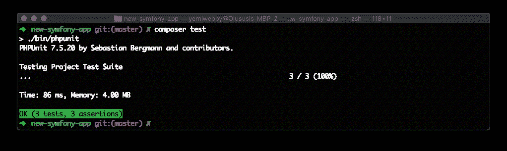

在我们将项目添加到 CircleCI 之前，让我们也编写一个非常简单的功能测试。

### 编写功能测试

通过功能测试，你可以命令浏览器浏览你的网站，点击一些链接，填写表格，并断言它在页面上看到的东西。首先，在`tests`文件夹中创建另一个文件夹并命名为`Controller`，它将存放`CustomerController`的测试脚本。继续在新创建的文件夹中创建一个新文件，并将其命名为`CustomerControllerTest.php`。打开文件，并使用以下内容:

```
 <?php

namespace App\Tests\Controller;

use Symfony\Bundle\FrameworkBundle\Test\WebTestCase;

class CustomerControllerTest extends WebTestCase
{
    public function testShowCustomer()
    {
        $client = static::createClient();

        $client->request('GET', '/');

        $this->assertResponseStatusCodeSame(200, $client->getResponse()->getStatusCode());

        $this->assertStringContainsString('Customer name is : John Doe', $client->getResponse()->getContent());
    }
} 
```

在上面的代码片段中，我们验证了 HTTP 响应是成功的，因为它返回了状态代码`200`。接下来，我们验证了页面包含了本教程前面显示的预期内容。

您可以使用以下命令再次运行测试:

```
composer test 
```

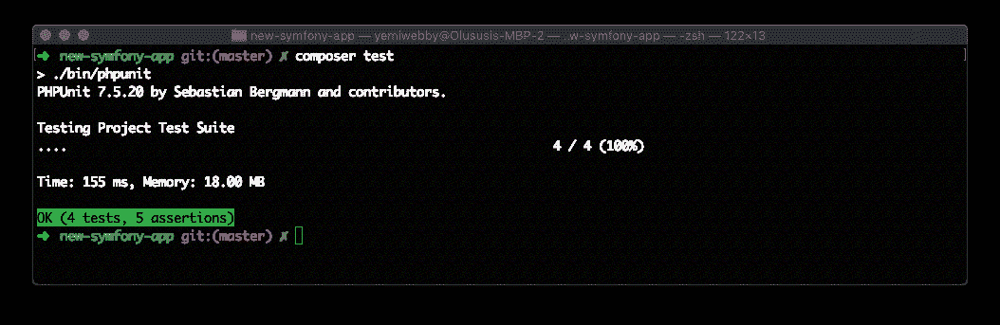

## 用 CircleCI 自动化测试

既然我们所有的测试都在本地被证明是成功的，我们需要确保一旦我们将代码的更新推送到 GitHub 库，测试就会自动运行。

要创建 CircleCI 将使用的配置文件，导航到项目的根目录，并创建一个名为`.circleci`的文件夹。在这个文件夹中，创建一个名为`config.yml`的文件，并使用以下内容:

```
version: 2
jobs:
  build:
    docker:
      # Specify the version you desire here
      - image: circleci/php:7.4-node-browsers

    steps:
      - checkout

      - run: sudo apt update # PHP CircleCI 2.0 Configuration File# PHP CircleCI 2.0 Configuration File sudo apt install zlib1g-dev libsqlite3-dev
      - run: sudo docker-php-ext-install zip

      # Download and cache dependencies
      - restore_cache:
          keys:
            # "composer.lock" can be used if it is committed to the repo
            - v1-dependencies-{{ checksum "composer.json" }}
            # fallback to using the latest cache if no exact match is found
            - v1-dependencies-

      - run:
          name: "Install Dependencies"
          command: composer install -n --prefer-dist

      - save_cache:
          key: v1-dependencies-{{ checksum "composer.json" }}
          paths:
            - ./vendor

      # run tests with phpunit
      - run:
          name: "Run tests"
          command: composer test 
```

我们在这里所做的是指定 PHP 的版本，该版本需要作为 Docker 映像的一部分进行安装，该映像将从 CircleCI image registry 中获取。接下来，我们指定为我们的项目安装所有的依赖项，然后最后包含一个运行测试的命令。

现在，您可以提交到目前为止所做的所有更改，并将项目推送到 GitHub 。

## 在 CircleCI 上建立项目

这里我们将把我们的 Symfony 应用程序连接到 CircleCI。导航到 [CircleCI 网站](https://circleci.com/)并使用您的帐户登录。在 CircleCI 控制台上，进入**添加项目**页面，点击**设置项目**。

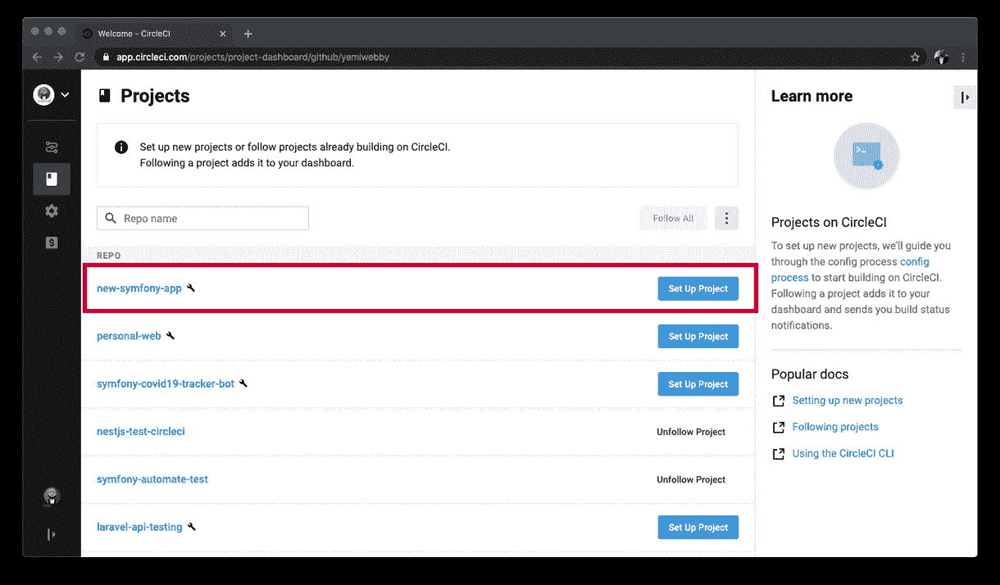

这将显示下面的页面。

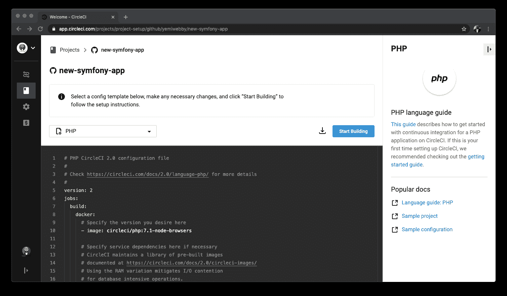

现在，点击**开始构建**，您将看到一个提示，要求您将提供的 CircleCI 配置添加到新分支上的项目中，或者手动设置配置。继续选择**手动添加**。

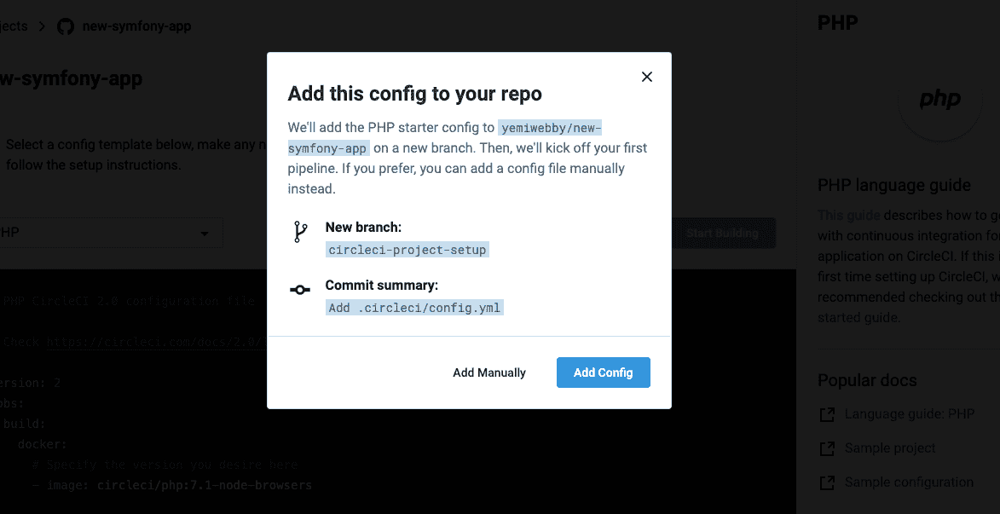

最后，点击**开始构建**,因为在推送到 GitHub 之前，我们已经在项目中包含了配置文件。这将基于配置文件运行一个[持续集成](https://circleci.com/continuous-integration/) (CI)管道，并向您显示管道状态。

它在跑。

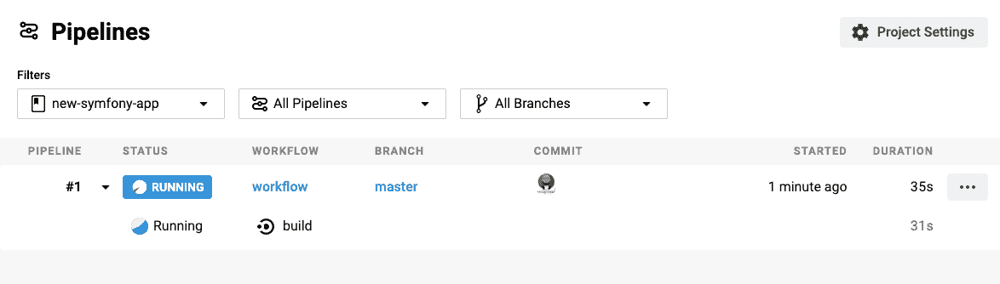

这是成功运行后的情况。

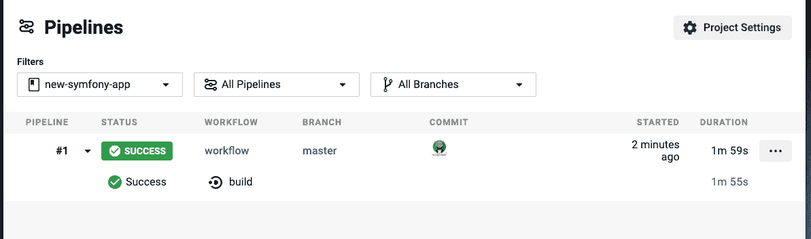

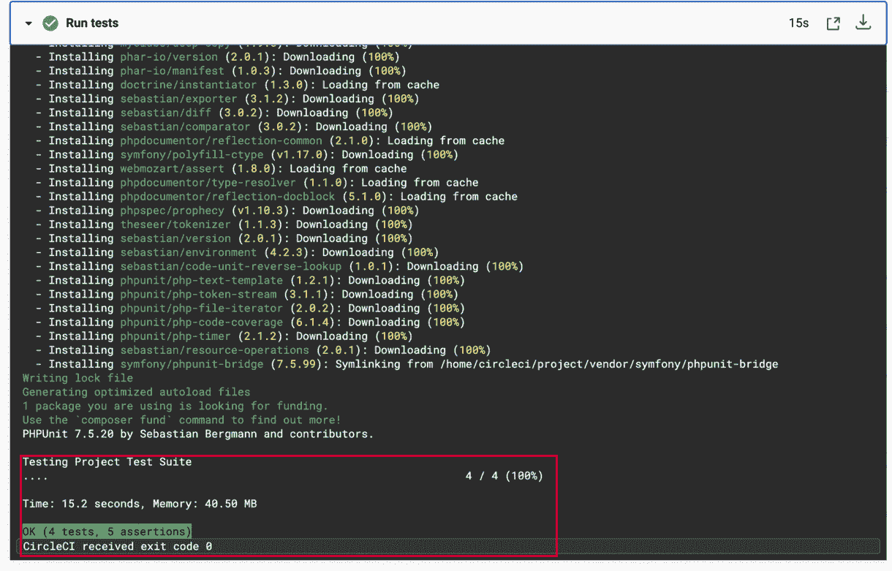

这就是了。所有创建的测试都正常运行。

## 结论

Symfony 被认为是最古老、最健壮的 PHP 框架之一，以其优雅的结构和可重用的组件而闻名。在本教程中，我们创建了一个新的 Symfony 应用程序，并学习了如何利用 PHPUnit 为我们定义的一些方法和控制器编写单元和功能测试。然后，我们继续使用 CircleCI 设置自动化 CI 管道。

从这篇文章中获得的知识不会让你成为测试专家，除非你个人努力去获得更多的知识，因为我们在这里仅仅触及了表面。然而，你在这篇文章中学到的东西将会给你在典型的 Symfony 应用程序中如何构造测试以及如何自动化测试的基本知识。在 GitHub 上随意探索源代码[并查看 CircleCI 的官方文档以了解更多信息。](https://github.com/CIRCLECI-GWP/new-symfony-app)

* * *

Oluyemi 是一个技术爱好者、编程狂和热爱新技术的网络开发迷。

* * *

Oluyemi 是一名拥有电信工程背景的技术爱好者。出于对解决用户日常遇到的问题的浓厚兴趣，他冒险进入编程领域，并从那时起将他的问题解决技能用于构建 web 和移动软件。Oluyemi 是一名热衷于分享知识的全栈软件工程师，他在世界各地的几个博客上发表了大量技术文章和博客文章。作为技术专家，他的爱好包括尝试新的编程语言和框架。

[阅读更多 Olususi Oluyemi 的帖子](/blog/author/olususi-oluyemi/)