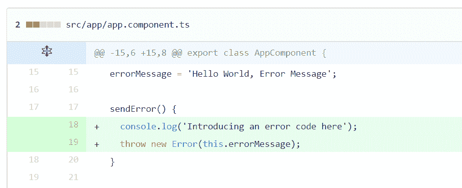
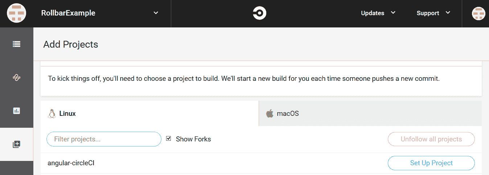
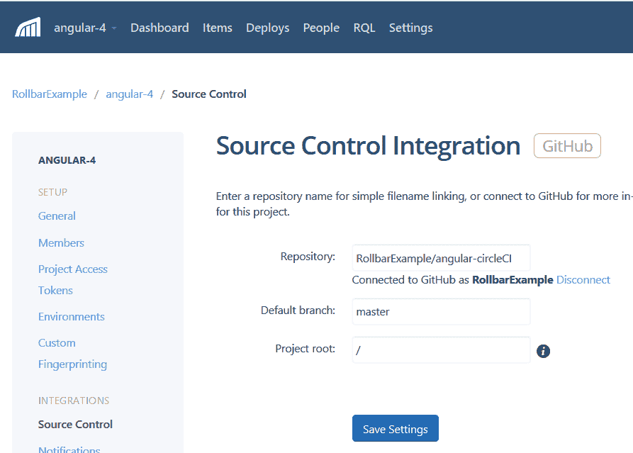
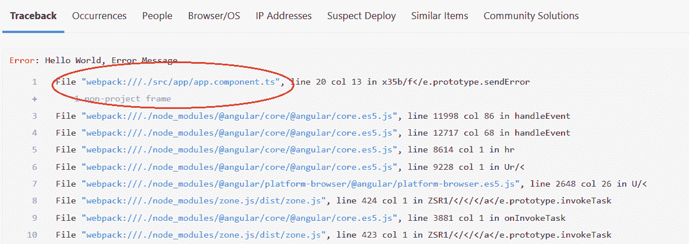
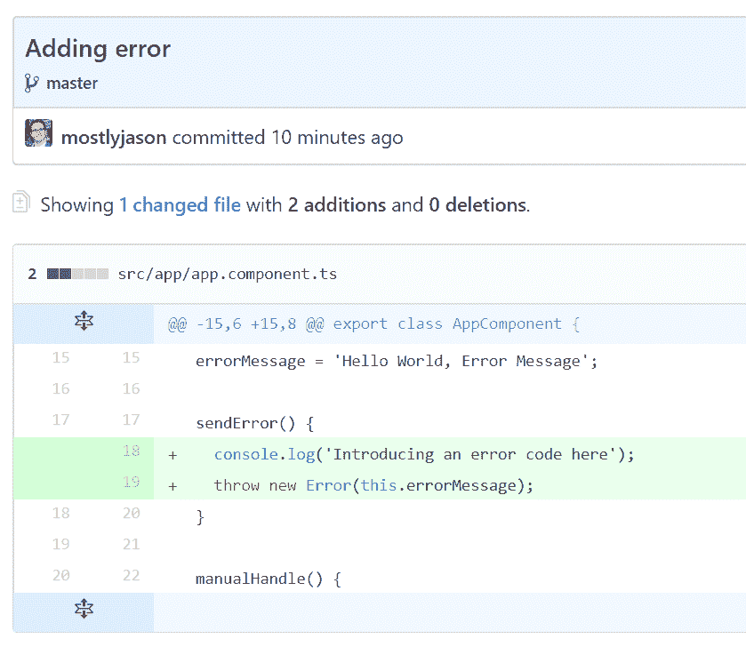
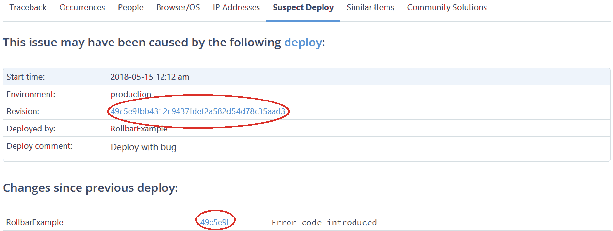

# 自动识别哪些代码更改导致了错误

> 原文：<https://circleci.com/blog/automatically-identify-which-code-changes-caused-errors/>

这是关于检测和纠正 Rollbar 和 CircleCI 错误的两部分博客文章的第二部分，由特约撰稿人 [Jason Skowronski](https://twitter.com/mostlyjason) 撰写。在这里阅读第一部分。

当您在实践连续交付时，监控您的应用程序是非常重要的，这样您就知道它在部署后运行良好。如果出现问题或用户体验不佳，您需要立即得到通知，以便您可以快速解决问题。当您的监控解决方案还可以告诉您哪些代码更改导致了错误时，您可以节省宝贵的故障排除时间。在我们的博客系列的第一部分[中，我们展示了如何使用 Rollbar 来跟踪 CircleCI 中每次部署后出现的错误。滚动条显示哪些新的错误发生，哪些重新激活。对于任何给定的错误，它还可以显示错误首次发生后的可疑部署。](https://circleci.com/blog/tracking-errors-after-deployments-with-rollbar-and-circleci/)

在第二部分中，我们将向您展示 Rollbar 如何自动识别可能导致错误的代码更改。这对于由外部因素(如第三方 API 或基础设施问题)引起的错误没有帮助，但它将帮助您更快地缩小由代码错误引起的错误。这将提高您的开发速度，并帮助您向客户交付更好的体验。



我们将继续我们的例子，展示 Rollbar 如何与 CircleCI 和 GitHub 集成来实现这一点。

## 跟踪 CircleCI 的部署

要将错误链接到源代码，首先需要在应用程序中设置 CircleCI。我们将假设您已经拥有 CircleCI 的帐户。如果没有，[注册](https://circleci.com/signup/)，然后配置 Git、Bitbucket 等源代码库。然后，按照我们博客系列第一部分中的说明，在进行部署时[通知滚动条](https://circleci.com/blog/tracking-errors-after-deployments-with-rollbar-and-circleci/)。



## 将您的源地图发送到滚动条

如果使用 JavaScript，Rollbar 可以使用源代码映射将错误消息映射回原始源代码。如果没有，您可以跳过这一部分。

源代码映射对于调试生产代码是必不可少的。它们将浏览器的调试输出链接回被缩小或传输前的原始源代码。为了显示原始代码的堆栈跟踪，Rollbar 需要访问您的小型 JavaScript 的源映射。

为了上传[源地图](https://docs.rollbar.com/docs/source-maps/)，您需要在 CircleCI 配置文件中的部署脚本之前添加 Rollbar 源地图 API 调用。

```
- run:
     name: Upload sourcemap to Rollbar 
     command: |
     curl https://api.rollbar.com/api/1/sourcemap/ \
     -F access_token=2a208f30fa1b4f0183adb694c4432038 \
     -F version=$CIRCLE_SHA1 \
     -F minified_url=https://s3.us-east-2.amazonaws.com/rollbar-example/
      main.[hash].bundle.js \
     -F source_map=main.[hash].bundle.js.map \
     -F main.js=main.[hash].js
    # Deployment script 
```

**access_token:** 滚动条上的目标项目令牌。这个令牌是在滚动条上创建项目时生成的。
**环境:**部署服务的部署环境。我们可以配置不同的环境，例如开发、试运行和生产。
**版本:**部署的应用版本。这应该是存储库提交 ID。如果提供的版本是提交 ID，滚动条将创建一个到存储库提交源代码的链接。
**minified_url:** 缩小文件的完整 url。应该以 http:或 https:开头，我们将去掉它们。
**source_map:** 源地图的内容，作为多部分文件上传。

## 识别代码版本

为了让 Rollbar 识别错误的可疑部署，它必须知道当前部署的是哪个版本。跟踪转移的一个简便方法是使用 git SHA 号，因为它在某个时间点唯一地标识了您的代码。因为这个版本是在提交代码时设置的，所以不能在应用程序中硬编码。相反，我们可以在构建时插入版本。

我们希望我们的包构建器 npm 自动插入代码版本，因此我们将插入一个简短的脚本来完成这项工作。让我们创建一个名为 git.version.ts 的定制 ts 文件来获取源代码的最新 SHA 修订号。

```
var fs = require('fs');
import { Observable } from 'rxjs';

let exec = require('child_process').exec;

const revision = new Observable<string>(s => {
   exec('git rev-parse HEAD',
       function (error: Error, stdout: Buffer, stderr: Buffer) {
           if (error !== null) {
               console.log('git error: ' + error + stderr);
           }
           s.next(stdout.toString().trim());
           s.complete();
       });
});
const branch = new Observable<string>(s => {
   exec('git rev-parse --abbrev-ref HEAD',
       function (error: Error, stdout: Buffer, stderr: Buffer) {
           if (error !== null) {
               console.log('git error: ' + error + stderr);
           }
           s.next(stdout.toString().trim());
           s.complete();
       });
});

Observable
   .combineLatest(revision, branch)
   .subscribe(([revision, branch]) => {
       console.log(`version: '${process.env.npm_package_version}', revision: '${revision}', branch: '${branch}'`);

       const content = '// this file is automatically generated by git.version.ts script\n' +
           `export const versions = {version: '${process.env.npm_package_version}', revision: '${revision}', branch: '${branch}'};\n`;

       fs.writeFileSync(
           'src/environments/versions.ts',
           content,
           {encoding: 'utf8'}
       );
   }); 
```

接下来，在 package.json 中添加预构建脚本，预构建脚本将在构建应用程序时自动执行，它将创建一个 version.ts 文件，其中包含分支、修订号等 git 修订信息。您可以在整个项目中直接访问 version.ts 文件。

```
"scripts": {
   "prebuild.prod": "ts-node git.version.ts",
   "build.prod": "ng build --prod --aot false --sourcemaps "
 } 
```

## 告诉滚动条代码版本

现在我们可以配置 Rollbar 的`code_version`变量，这样它就可以跟踪版本号。我们将使用 git.version.ts 文件读取修订号。我们将在 app.module.ts 文件中初始化 Rollbar，如下所示。

```
const versions = require('../environments/versions');
const rollbarConfig = {
  accessToken: 'f627d5e044a24b9987a23e54c5df352e',
  captureUncaught: true,
  captureUnhandledRejections: true,
  enabled: true,
  source_map_enabled: true,
  environment: 'production',
  payload: {
	server: {
  	   branch: 'master',
  	   root: 'webpack:///./'
	},
	client: {
  	   javascript: {
    	       code_version: versions.versions.revision
  	   }
	}
  }
};

export function rollbarFactory() {
 return new Rollbar(rollbarConfig);
}

@NgModule({
 declarations: [
   AppComponent
 ],
 imports: [
   BrowserModule,
   FormsModule
 ],
 providers: [
   { provide: ErrorHandler, useClass: RollbarErrorHandler },
   { provide: Rollbar,  useFactory: rollbarFactory }
 ],
 bootstrap: [AppComponent]
})
export class AppModule { } 
```

## 添加源代码管理集成

我们还希望 Rollbar 与我们的源代码控制库集成，这样当错误发生时，它可以自动将我们链接到正确的代码行。它还能告诉我们何时有代码变更破坏了部署。

下面，你可以看到我们已经配置了与 GitHub 的集成。确保在滚动条中配置项目根目录，如下所示；它是放置根的源代码位置。如果没有正确配置，Rollbar 将无法将源代码链接到错误。在这个例子中，项目根是`/`。



## 运行测试用例以生成错误

现在，我们将测试刚刚组装好的所有部件。我们将在 CircleCI 上执行构建，运行应用程序，然后生成一个测试错误。这将向 Rollbar 发送一个测试错误，这样我们就可以看到它接下来如何识别部署和源代码。

## 找到错误的根本原因

在**项**菜单选项卡上检查滚动条仪表板的错误记录，它将显示错误细节以及导致错误的源代码文件的链接。该错误将显示可疑的部署版本以及导致错误的代码。

单击列表中的错误项目，我们会看到项目详细信息页面。在回溯的旁边，我们可以看到导致错误的源代码的链接。



当您点击链接时，它将直接打开 GitHub 存储库中的类，并突出显示更改的代码片段，如下图所示:



调查错误原因的第二种方法是使用 **Suspect Deploy** 选项卡。它显示了首次发现错误的修订，以及自上次部署以来对代码所做的更改。我们可以看到提交消息，表明引入了一个错误代码。



现在，只需点击几下鼠标，您就可以从滚动条中报告的错误直接找到可能导致问题的确切部署和源代码。不再需要在嘈杂的日志文件中搜寻，也不再需要在源代码中寻找负责的代码行。这将为您排除故障节省时间，并帮助您让生产系统更快地工作。