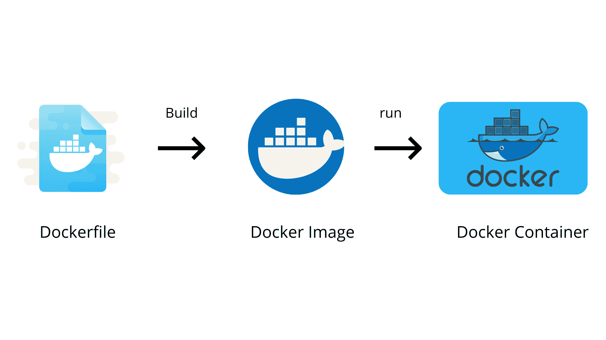
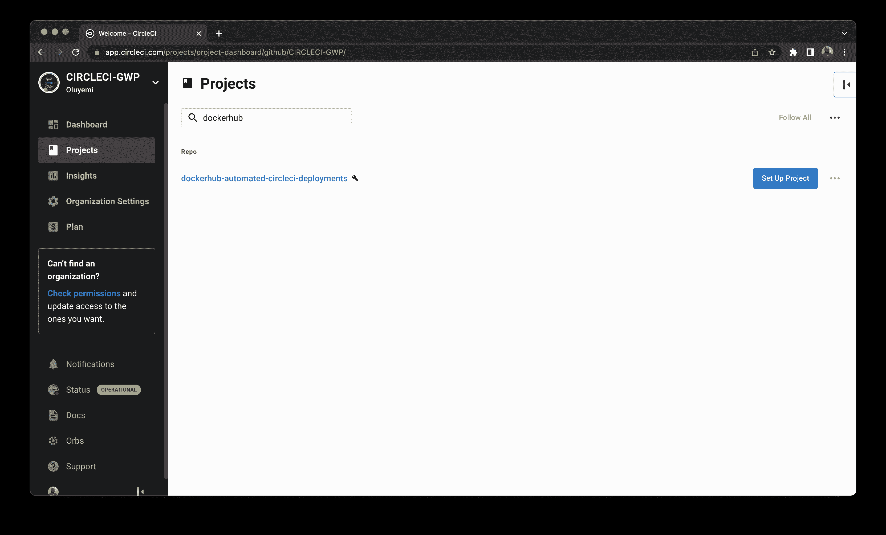
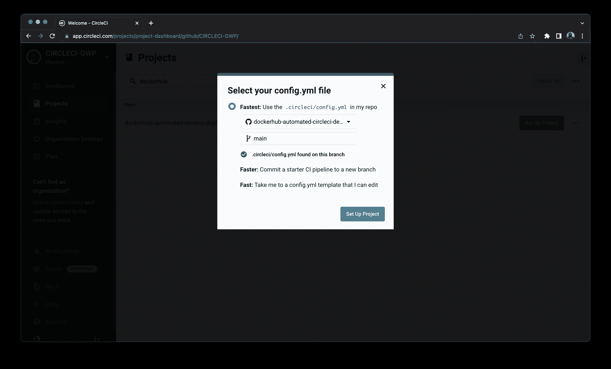
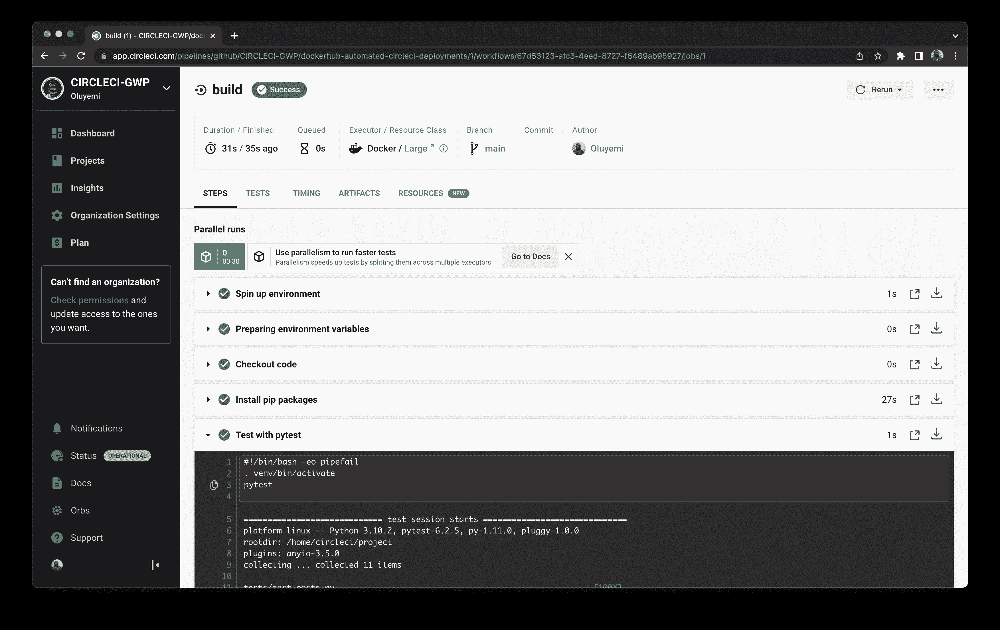
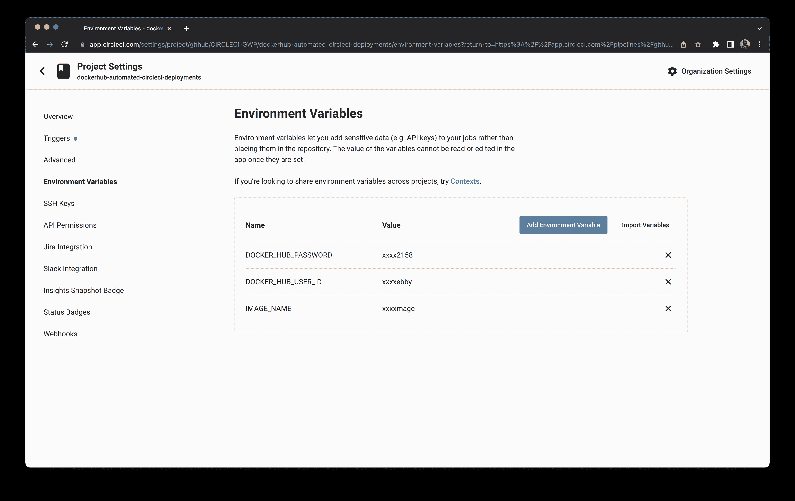
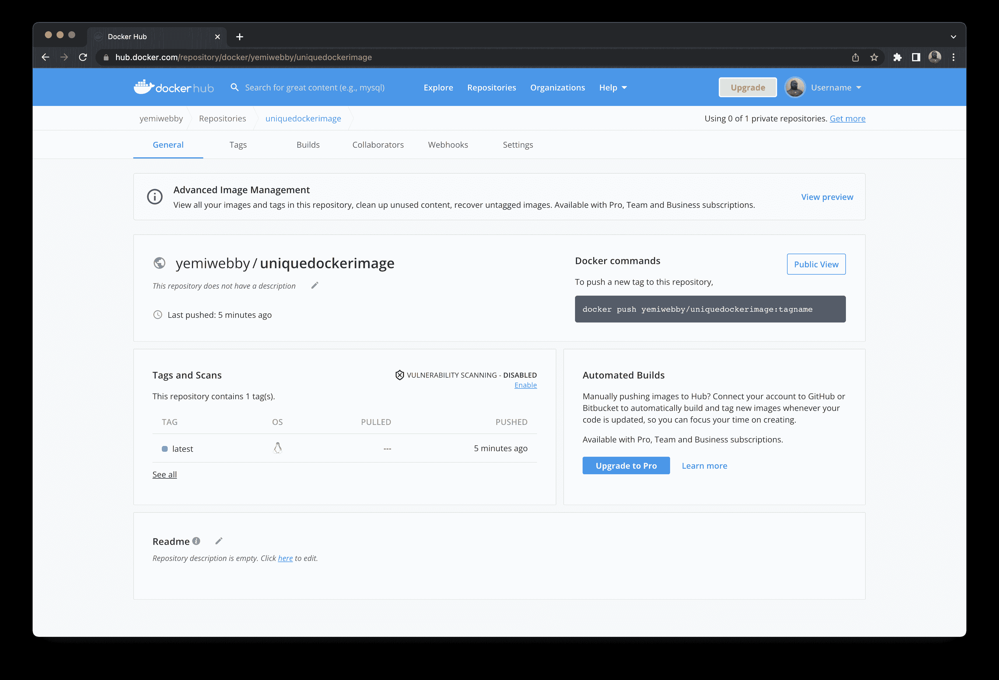

# 将 Docker 化的 Python 应用程序自动部署到 Docker Hub | CircleCI

> 原文：<https://circleci.com/blog/automating-deployment-dockerized-python-app/>

> 本教程涵盖:
> 
> 1.  将 Python 应用程序“Dockerizing 化”
> 2.  设置管道以构建和测试映像
> 3.  将 Docker 映像部署到 Docker Hub

CI/CD 系统遵循多层环境模式:开发、测试、登台和产品发布都是这个过程的一部分。这个循环中的每个设置可以有多种设置和配置。因此，不得不为不同的环境设置单独的配置可能会带来不便和负担。

在本教程中，我们将看看 Docker 是什么，以及它如何将开发人员从设置问题和端口冲突中解放出来。我将介绍如何“Dockerize”一个 Python 应用程序。然后，我将指导您建立一个管道来构建一个映像，并在测试通过后将其推送到 Docker Hub。

## 先决条件

完成本教程需要以下内容:

*   [Python](https://www.python.org/doc/) 安装在你的系统上。
*   一个 [CircleCI](https://circleci.com/signup/) 账户。
*   一个 [GitHub](https://github.com/) 的账号，了解一些 GitHub 的动作比如`commit`和`push`。
*   A [坞站枢纽](https://hub.docker.com/)账号。
*   对管道工作原理的基本理解。有了这些，你就可以开始了。

> 我们的教程是平台无关的，但是使用 CircleCI 作为例子。如果你没有 CircleCI 账号，请在 注册一个免费的 [**。**](https://circleci.com/signup/)

## 为什么要用 Docker？

假设你是一个测试项目的开发人员。当您在项目中工作时，您正在使用`Python 2.7`,但是由于某种原因，您将在生产中使用`Python 3.9`。此外，Devops 团队目前正在使用`Python 3.6`为组织托管应用程序。

这些版本不一致可能会使开发过程有些痛苦。他们还可能让 Devops 团队头疼，因为他们要努力跟上需要托管的每个应用程序的不同版本。幸运的是， [Docker](https://www.docker.com/) 提供了一个解决方案。首先，让我澄清一些与 Docker 的使用相关的概念。

**`Docker`** 是一个使用容器化技术的平台，允许开发者快速创建、共享和运行处于创建状态的应用程序。

一个 **`Docker container`** 是一个应用程序的运行时环境，由打包的代码及其所有依赖项组成。要旋转 Docker 容器，可以使用 Docker 图像。

一个 **`Docker image`** 是一个可执行文件(模板),它包含了应用程序正常运行所需的一切，包括代码、依赖关系和虚拟环境。

Docker 图像是使用一个名为`Dockerfile`的特殊文件创建的。Docker 文件是包含 Docker 在创建图像时要遵循的一组说明的文档。



Docker 消除了担心机器配置的需要，因为它在容器本身中引导所有的配置。这确保了应用程序在所有安装了 Docker 的机器上一致地运行。

与虚拟机不同，使用 Docker 可以轻松管理微服务架构的开发和部署。这不仅导致了精益组织，也导致了系统的分离。解耦系统最小化了故障发生的机会，使它们比单一的应用程序风险更小。

Docker 促进了跨平台的兼容性和可维护性，以及简单性、快速部署和安全性。

## 将您的 Python 应用程序归档

“归档”应用程序包括以下步骤:

*   设置一个 API 来构建一个映像
*   创建 Dockerfile 文件

### 设置 API 以构建映像

要在本节教程中演示 Docker 过程，请在本地使用 FastAPI RestAPI。已经为您创建了 API。使用以下命令克隆存储库:

```
git clone https://github.com/CIRCLECI-GWP/dockerhub-automated-circleci-deployments.git;

cd dockerhub-automated-circleci-deployments; 
```

这将 GitHub 存储库克隆到一个名为`dockerhub-automated-circleci-deployments`的目录中，然后访问它。

在`dockerhub-automated-circleci-deployments`目录中，创建一个虚拟环境，并使用为您的操作系统提供的命令激活它。

```
##  Windows OS ##

# create a venv
python -m venv venv
# activate venv
venv\Scripts\activate 
```

```
##  Linux/Mac OS ##

#create a venv
python3 -m venv venv
# activate venv
source venv/bin/activate 
```

创建虚拟环境后，您可以使用以下命令安装依赖项:

```
pip install -r requirements.txt 
```

运行应用程序:

```
uvicorn app.main:app --reload 
```

现在您已经验证了您的 API 运行成功，接下来为您的应用程序创建一个`Dockerfile`。

### 创建 Dockerfile 文件

如前所述，`Dockerfile`是一本创建图像的食谱。当您运行命令`docker build`时，Docker 将从 docker 文件中读取指令并构造一个映像。

在这种情况下，您需要 Docker 文件来:

*   下载`Python 3.10.2`版本
*   在应用程序中查找您的包
*   安装成功后，您需要这个映像来启动容器中的应用程序。

将此添加到您的 docker 文件中:

```
FROM python:3.10.2

WORKDIR /usr/src/app

COPY requirements.txt ./

RUN pip install --no-cache-dir -r requirements.txt

COPY . .

CMD ["uvicorn", "app.main:app", "--host", "0.0.0.0", "--port", "8000"] 
```

在这个 Docker 配置中，`WORKDIR`命令指定了工作目录，这是到您的目录的绝对路径。`COPY`命令将`requirements.txt`文件复制到应用程序所在的目录中。`RUN`命令安装运行应用程序所需的包。最后，`CMD`指定了运行映像时将执行的命令。

您可能想知道主机和端口在应用程序`RUN`命令中的用途。Docker 将使用`uvicorn`作为服务器和您的应用程序入口。主机和端口将确保您可以访问容器外部的应用程序。

如果您想在本地构建映像来验证 docker 文件是否正常工作，您可以运行以下命令:

```
docker build -t fastapi-app . 
```

接下来，您将需要在 GitHub 上创建一个新的存储库，提交并首先将所有更改推送到存储库。然后，您可以开始使用 CircleCI 将 Docker 容器部署到 Docker Hub 的过程。

## 使用 CircleCI 将 Docker 映像部署到 Docker Hub

[Docker Hub](https://hub.docker.com/) 是 Docker 图片的储存库，类似于 GitHub。它使得搜索和与其他开发者共享 Docker 图像变得更加容易。

### 设置 CircleCI

为了确保您的应用程序与 CircleCI 的集成，创建一个配置文件，告诉 CircleCI 如何初始化您的存储库和运行测试。从根目录中，创建一个名为`.circleci/`的新目录。在这个新目录中，创建一个名为`config.yml`的新文件。将此添加到您的`config.yml`文件中:

```
version: 2
jobs:
  build:
    docker:
      - image: cimg/python:3.10.2
    steps:
      - checkout
      - run:
          name: Install pip packages
          command: |
            python3 -m venv venv
            . venv/bin/activate
            pip install -r requirements.txt

      - run:
          name: Test with pytest
          command: |
            . venv/bin/activate
            pytest

workflows:
  version: 2
  build-master:
    jobs:
      - build 
```

这个配置定义了 Python `3.10.2`图像。然后，一旦下载了映像，配置将设置虚拟环境，安装所有的应用程序依赖项，然后运行您的测试。

添加 CircleCI 配置文件后，提交并[将您的更改](https://docs.github.com/en/get-started/using-git/pushing-commits-to-a-remote-repository)推送到您的远程 GitHub 存储库。

现在您可以从[仪表板](https://app.circleci.com/dashboard)中创建一个 CircleCI 项目。



点击**设置项目**开始建造。系统将提示您使用项目存储库中的配置文件。输入配置文件所在分支的名称。在本例中，它是`main`分支。



点击**设置项目**完成该过程。



现在您已经在 CircleCI 上运行了测试，您的工作已经完成了一半！接下来，您需要将应用程序部署到 Docker Hub。您需要添加一个选项，首先登录 Docker Hub，然后在每次测试通过时构建一个映像。

将任何图像推送到 Docker Hub 总是需要认证。您首先需要在 CirclecI 仪表板上配置 Docker Hub `USER_ID`、`PASSWORD`和图像名称。转到 CircleCI 仪表板。从**设置**部分，选择**环境变量**。

使用以下格式添加环境变量:

*   `DOCKER_HUB_USER_ID`是您的 Docker Hub ID。
*   `DOCKER_HUB_PASSWORD`是您的 Docker Hub 密码。

用环境名`IMAGE_NAME`添加 Docker 图像名作为环境变量。为其指定一个唯一的名称作为值。



目前，您的 CircleCI 配置只运行您的测试。您需要修改它，以便它首先运行测试，然后构建一个 Docker 映像，如果所有测试都通过了，就把它推送到 Docker Hub。

向您的`config.yml`文件添加一个`deploy`任务，如下所示:

```
version: 2
jobs:
  build:
    docker:
      - image: cimg/python:3.10.2
    steps:
      - checkout
      - run:
          name: Install pip packages
          command: |
            python3 -m venv venv
            . venv/bin/activate
            pip install -r requirements.txt

      - run:
          name: Test with pytest
          command: |
            . venv/bin/activate
            pytest

  deploy:
    docker:
      - image: cimg/base:2022.06
    steps:
      - checkout
      - setup_remote_docker:
          version: 19.03.13
      - run:
          name: Build and push to Docker Hub
          command: |
            docker build -t $DOCKER_HUB_USER_ID/$IMAGE_NAME:latest .
            echo "$DOCKER_HUB_PASSWORD" | docker login -u "$DOCKER_HUB_USER_ID" --password-stdin
            docker push $DOCKER_HUB_USER_ID/$IMAGE_NAME:latest

workflows:
  version: 2
  build-master:
    jobs:
      - build
      - deploy:
          requires:
            - build 
```

该配置文件包含一个带有两个任务的`workflow`:

*   `build`任务构建并测试代码。
*   `deploy`作业构建并把你的 Docker 映像推送到 Docker Hub。

在添加的配置部署步骤中，`deploy`作业在启动远程 Docker 引擎之前检索代码。当创建 Docker 映像进行部署时，您必须使用`setup_remote_docker`选项。出于安全目的，该选项为每个构建创建一个单独的远程环境。这个环境是专门为运行 Docker 命令而设置的。

完成后，您可以开始运行 Docker 命令来构建和标记您的图像:

```
docker build -t $DOCKER_HUB_USER_ID/$IMAGE_NAME:latest . 
```

该命令构建了一个 Docker 图像，并用`:latest`标签对其进行标记。图像名称的前缀是您在 CircleCI 仪表板中设置为环境变量的 Docker Hub 用户名，后面是图像的实际名称(也是您设置的环境变量)。

一旦您有了构建的映像，使用 CircleCI 和存储的环境变量登录到您的 Docker Hub 帐户。

```
echo "$DOCKER_HUB_PASSWORD" | docker login -u "$DOCKER_HUB_USER_ID" --password-stdin 
```

这就是配置文件中的命令的作用。现在您有了一个映像并登录到 Docker Hub，您的映像将使用配置文件中定义的以下命令被推送到 Docker Hub:

```
docker push $DOCKER_HUB_USER_ID/$IMAGE_NAME:latest 
```

为了确保管道的完整性，有一个条件要求您的构建和测试作业在部署到 Docker Hub 之前通过。这发生在`workflow`下的最终配置块中:

```
workflows:
  version: 2
  build-master:
    jobs:
      - build
      - deploy:
          requires:
            - build 
```

最后，我们需要将所有的更改提交到 GitHub。一旦我们这样做了，我们就可以继续检查 CircleCI 仪表板，以查看我们的测试和部署的进度。

瞧啊。我们的`deploy`和`build`步骤都是绿色的，并且检查`deploy`作业，我们的映像被成功构建并被推送到 Docker hub。


为了验证我们的图像被推送到 Docker Hub，我们可以访问 Docker Hub 网站并检查图像的状态。在我们的例子中，我们的图像被命名为`circleci-automated-dockerhub-image`，我们可以在 Docker hub 仪表板上看到它，如下所示:



这样，我们不仅验证了我们的 CircleCI 配置工作正常，还验证了我们的映像被成功地推送到 Docker Hub。虽然感觉很多，但我们已经能够使用 CircleCI 和 Docker Hub 创建 CI/CD 流程，从而节省了大量时间，否则这些时间将花费在手工部署 Docker Hub 上。

## 结论

在本教程中，我们学习了如何使用 CirclecI 构建 Docker 映像并将其部署到 Docker Hub。我们还学习了如何在项目中使用定义的 Docker 文件构建 Docker 映像。

在本教程的最后一节，我们还介绍了如何创建一个管道来构建一个映像，并仅在测试通过时将它推送到 Docker Hub。我希望你喜欢阅读本教程，因为我们创造了它。直到下一个，保持敏锐，不断学习！

* * *

Waweru Mwaura 是一名软件工程师，也是一名专门研究质量工程的终身学习者。他是 Packt 的作者，喜欢阅读工程、金融和技术方面的书籍。你可以在[他的网页简介](https://waweruh.github.io/)上了解更多关于他的信息。

[阅读更多 Waweru Mwaura 的帖子](/blog/author/waweru-mwaura/)